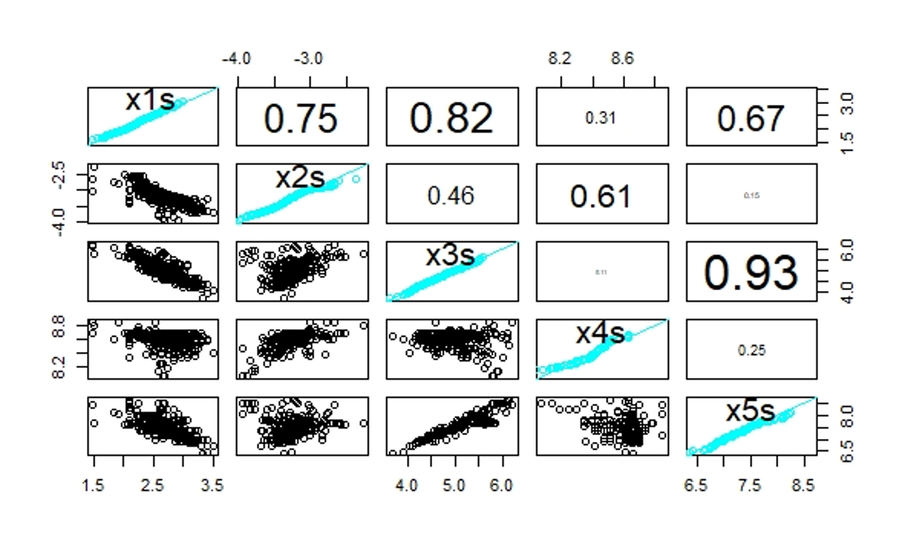
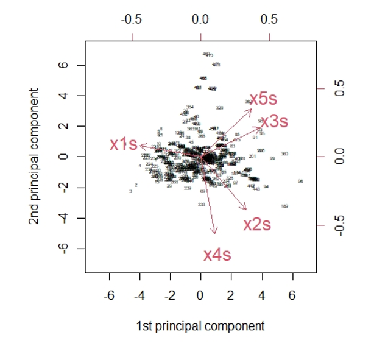
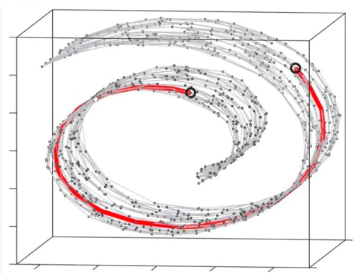

# 无监督学习方法 {#unsupervised-learning}

<!-- *梁译中、方明慧、王晗、高光远* -->

```{r setup, include=FALSE}
# knitr::opts_chunk$set(eval = F)
```

大学及以后生活中最常用的学习方法。

在无监督学习中， 我们可以降低数据（协变量，特征）维度、根据特征的相似度对样本进行聚类、设计可视化工具揭示高维数据的特性。无监督学习不考虑响应变量，仅考虑特征的相似性。

本章将考虑以下几种方法：

- **降维**：

  - 主成分分析（PCA）

  - 自编码，瓶颈神经网络（BNN）

- **聚类**：

  - 分层聚类：不需事先指定聚类个数
    
    - 自下而上：初始$n$类，再将相距最近的两类合并，建立一个新的类，直到最后合并成$1$类；
    
    - 自上而下：初始$1$类，再将相距最远的样本分裂成两类，直到最后分裂成$n$个类。

  - 基于质心的聚类: K-means, K-medoids

  - 基于分布的聚类: Gaussian mixture models (GMMs)

- **可视化高维数据**：

  - 变分自动编码器（VAE）
  
  - $t$分布随机邻近嵌入（$t$-SNE），
  
  - 统一流形逼近和投影（UMAP），
  
  - 自组织映射（SOM）
  
  - Kohonen图。

## 数据预处理

```{r packages, include=FALSE, eval=F}
require(MASS)
library(plyr)
library(stringr)
library(plotrix)
library(matrixStats)
library(cluster)
library(keras)
library(ClusterR)
# library(mclust)
```

```{r plot functions, include=F, eval=F}
panel.hist <- function(x, ...)
{
  usr <- par("usr"); on.exit(par(usr))
   par(usr = c(usr[1:2], 0, 1.5) )
    h <- hist(x, plot = FALSE)
    breaks <- h$breaks; nB <- length(breaks)
    y <- h$counts; y <- y/max(y)
  rect(breaks[-nB], 0, breaks[-1], y, col = "cyan", ...)
}
panel.hist.norm <- function(x, ...)
{
  usr <- par("usr"); on.exit(par(usr))
  par(usr = c(usr[1:2], 0, 1.5) )
    h <- hist(x, plot = FALSE)
    breaks <- h$breaks; nB <- length(breaks)
    y <- h$counts; y <- y/max(y)
  rect(breaks[-nB], 0, breaks[-1], y, col = "cyan", ...)
    t.delta.breaks<-breaks[-1]-breaks[-nB]
    t.area<-t(t.delta.breaks)%*%y
    t.mean<-mean(x);t.sd<-sd(x)
    t.x.abs.sort<-sort(abs(x))
    t.boolean.0<-(t.x.abs.sort==0)
    t.x.NachKommaStellen<-floor((1-t.boolean.0)*t.x.abs.sort[1]+t.boolean.0*t.x.abs.sort[2])
    t.x.new<-round(x,abs(t.x.NachKommaStellen-1))
    t.range<-range(t.x.new)
    t.x.seq<-seq(t.range[1],t.range[2],length.out=101)
    t.norm<-dnorm(t.x.seq,mean=t.mean,sd=t.sd)
    t.norm<-c(t.norm)*c(t.area)
  lines(t.x.seq,t.norm, col=2,lty=1)
}
panel.qq <- function(x, ...)
{
  usr <- par("usr"); on.exit(par(usr))
  par(usr = c(-3.3,5,-3.3,5) )
    t.col<-"cyan"
    t.mean<-mean(x);t.sd<-sd(x)
    t.x.sort<-sort((x-t.mean)/t.sd)
    t.l<-length(x)
    t.qq<-(1:t.l)/(1+t.l)
    t.qnorm<-qnorm(t.qq,0,1)
  points(t.x.sort,t.qnorm,col=t.col)
  abline(c(0,1),col=t.col,lty=1)
}
panel.cor <- function(x, y, digits = 2, prefix = "", cex.cor, ...)
{
  usr <- par("usr"); on.exit(par(usr))
  par(usr = c(0, 1, 0, 1))
  r <- abs(cor(x, y))
  txt <- format(c(r, 0.123456789), digits = digits)[1]
  txt <- paste0(prefix, txt)
  #txt <- paste0("Cor=", txt)
  if(missing(cex.cor)) cex.cor <- 0.8/strwidth(txt)
  text(0.5, 0.5, txt, cex = cex.cor * r)
}
Frobenius.loss <- function(X1,X2){sqrt(sum(as.matrix((X1-X2)^2))/nrow(X1))}
mean.squared.loss <- function(X1,X2){mean(as.matrix((X1-X2)^2))}
d.data.org<-read.table("./5 - Unsupervised Learning What is a Sports Car/SportsCars.csv",sep=";",header=TRUE)
d.data<-d.data.org
str(d.data)
```

```{r data preprocess, include=F, eval=F}
d.data$W_l    <- log(d.data$weight)
d.data$MP_l   <- log(d.data$max_power)
d.data$CC_l   <- log(d.data$cubic_capacity)
d.data$MT_l   <- log(d.data$max_torque)
d.data$MES_l  <- log(d.data$max_engine_speed)
d.data$S100_l <- log(d.data$seconds_to_100)
d.data$TS_l   <- log(d.data$top_speed)
# data transform according to Ingenbleek-Lemaire (ASTIN Bulletin 1988)
d.data$x1s  <- d.data$W_l-d.data$MP_l
d.data$x2s  <- d.data$MP_l-d.data$CC_l
d.data$x3s  <- d.data$MT_l
d.data$x4s  <- d.data$MES_l
d.data$x5s  <- d.data$CC_l
# scatter plots with  QQ plots
t.data.streu<-d.data[!is.na(d.data$S100_l),c("W_l","MP_l","CC_l","MT_l","MES_l","S100_l","TS_l")]
# png("./plots/5/log.png")
pairs(t.data.streu,diag.panel=panel.qq,upper.panel=panel.cor)
#dev.off()
t.data.streu<-d.data[,c("x1s","x2s","x3s","x4s","x5s")]
pairs(t.data.streu,diag.panel=panel.qq,upper.panel=panel.cor)
# scatter plots with histogram
t.data.streu<-d.data[,c("x1s","x2s","x3s","x4s","x5s")]
pairs(t.data.streu,diag.panel=panel.hist.norm,upper.panel=panel.cor)
# col means and standard deviations
t.data.streu <-d.data[,c("x1s","x2s","x3s","x4s","x5s")]
(m0 <- colMeans(t.data.streu))
X01 <- t.data.streu-colMeans(t.data.streu)[col(t.data.streu)]
(sds <- sqrt(colMeans(X01^2))*sqrt(nrow(t.data.streu)/(nrow(t.data.streu)-1)))
i1 <- 1  # should be in 1:5 for xs1 to xs5
position <- c("topleft","topright","topleft","topleft","topleft")
plot(density(t.data.streu[,i1]), col="orange", lwd=2, ylab="empirical density", xlab=paste("x",i1, "s", sep=""), main=list(paste("empirical density variable x", i1, "s", sep=""), cex=1.5), cex.lab=1.5)
lines(density(t.data.streu[,i1])$x, dnorm(density(t.data.streu[,i1])$x, mean=m0[i1], sd=sds[i1]), col="blue", lwd=2, lty=2) 
legend(position[i1], c("empirical density", "Gaussian approximation"), col=c("orange", "blue"), lty=c(1,2), lwd=c(2,2), pch=c(-1,-1))
```        

数据中各个变量的说明如下：

|变量|类型|说明|
|:---:|:---:|---|
|brand|factor|43个汽车品牌|
|type|factor|96个水平|
|model|factor|113个水平|
|seats|int|座位数|
|max_power|int|发动机最大功率(kW),取对数|
|max_torque|num|最大转矩(Nm),取对数|
|cubic_capacity|int|容量(cm$^3$),取对数|
|weight|int|车重(kg)，取对数|
|max_engine_speed|int|发动机最大转速(rpm)|
|seconds_to_100|int|达到100km/h所需要秒数|
|top_speed|int|最大行驶速度(km/h)|
|sports_car|int|跑车|
|tau|num|专家评分|

Figure \@ref(fig:pairs) 显示了各个变量（取对数后）的散点图，Q-Q图，及相关系数。

```{r pairs1, echo=F, fig.align='center', fig.cap="散点图", out.width="40%"}
knitr::opts_chunk$set(fig.pos = "!H", out.extra = "")
knitr::include_graphics("./plots/5/log.png")
```

$\tau$为专家提出的评分方程，据此评分可以大概判断该车是否为跑车：

$$\tau=\frac{\text{weight}}{\frac{\text{max_power}}{0.735499}}\text{seats}^{\frac{1}{3}}\left(\frac{\text{cubic_capacity}}{1000}\right)^{\frac{1}{4}}$$
如果把常数项提出，可得到如下等价的评分$\tau^+$:

$$\tau^+=\frac{\text{weight}}{\text{max_power}}\text{seats}^{\frac{1}{3}}\text{cubic_capacity}^{\frac{1}{4}}$$

专家把$\tau<17$或$\tau^+<129.9773$的汽车定义为跑车。

## 主成分分析

Ingenbleek-Lemaire (1988) 的目标是利用主成分分析来对数据进行降维，根据选取的主成分来区分跑车和普通车，并尝试达到和专家选择一样的效果。

PCA适用于高斯分布，若变量显著不符合高斯分布，需要对数据进行预处理（比如取对数或其他方法）。
Ingenbleek-Lemaire (1988) 构造了以下5个近似服从高斯分布的变量以便进行后续分析。

$$x_1^*=\ln\left(\frac{\text{weight}}{\text{max_power}}\right)$$
$$x_2^*=\ln\left(\frac{\text{max_power}}{\text{cubic_capacity}}\right)$$
$$x_3^*=\ln\left(\text{max_torque}\right)$$ 
$$x_4^*=\ln\left(\text{max_engine_speed}\right)$$ $$x_5^*=log\left(\text{cubic_capacity}\right)$$

Figure \ref@(fig:pairs2) 展示了以上5个变量的相关性。

```{r pairs2, echo=F,out.width="40%",fig.align = 'center',fig.cap="散点图"}
knitr::opts_chunk$set(fig.pos = "!H", out.extra = "")

```

主成分分析可以降低高维数据的维数，使相对于原始数据的重构误差最小。如果应用成功，它减少了特征空间的维数，并且它对于(精算)回归建模特别有用，因为它提供了少量的不相关的解释变量。

假设样本量为$n$的样本有$q$个特征$\mathbf{x}_1^*,\ldots,\mathbf{x}^*_n\in\mathbb{R}^q$。其设计矩阵为
$$\mathbf{X}^*=(\mathbf{x}_1^*,\ldots,\mathbf{x}^*_n)^\intercal\in\mathbb{R}^{n\times q}.$$
把设计矩阵的每列进行标准化，得到
$$\mathbf{X}=(x_{i,j})_{1\le i \le n,1\le j\le q}\in\mathbb{R}^{n\times q}.$$
其中，第$i$行是样本$i$的特征$\mathbf{x}_i\in\mathbb{R}^q, 1\le i\le n$, 第$j$列是第$j$个特征$x_j\in\mathbb{R}^n$.

矩阵$\mathbf{X}$的秩为$q\le n$，可以找到$q$个正交的$q$维基向量$\mathbf{v}_1,\ldots,\mathbf{v}_q\in\mathbb{R}^q$, 使得$\mathbf{v}_1$为$\mathbf{X}$波动最大的方向，$\mathbf{v}_2$为与$\mathbf{v}_1$正交方向上的$\mathbf{X}$波动最大的方向，依次类推。

用数学公式表示如下：
$$\mathbf{v}_1=\underset{||\omega||_2=1}{\arg \max}||\mathbf{X}\omega||_2^2=\underset{\omega^\intercal\omega=1}{\arg \max} (\omega^\intercal\mathbf{X}^\intercal\mathbf{X}\omega)$$

$$\mathbf{v}_2=\underset{||\omega||_2=1}{\arg \max}||\mathbf{X}\omega||_2^2 ~~~\text{ subject to } \mathbf{v}_1^\intercal\omega=0.$$

$$\ldots$$

主成分分析可通过以下两种方式实现

- 求$\mathbf{X}^\intercal \mathbf{X}$或者$\mathbf{X}$的协方差矩阵$\mathbf{\Sigma}$的特征向量和特征值。易知$\mathbf{X}^\intercal \mathbf{X}=n\times\mathbf{\Sigma}$，所以它们的特征向量相同。第一个特征向量即为$\mathbf{v}_1$，第二个特征向量为$\mathbf{v}_2$。前两个主成分为$\mathbf{X}\mathbf{v}_1,\mathbf{X}\mathbf{v}_2$

- 对$\mathbf{X}$进行奇异值（singular value decomposition）分解:$$\mathbf{X}=U\Lambda V^\intercal.$$其中，对角矩阵$\Lambda=\text{diag}(\lambda_1,\ldots,\lambda_q)$的元素为$\mathbf{X}^\intercal \mathbf{X}$的特征值，$V$为$\mathbf{X}^\intercal \mathbf{X}$的特征向量。主成分可以通过$\mathbf{X}V$求得。

利用前$p$个主成分可以重构设计矩阵的近似值$$\mathbf{X}_p=U\text{diag}(\lambda_1,\ldots,\lambda_p,0,\ldots,0)V^{\intercal}.$$

该近似值为以下极值问题的根$$\underset{B\in\mathbb{R}^{n\times q}}{\arg \min}||\mathbf{X}-B||^2 ~~\text{subject to rank}(B)\le q,$$

即矩阵$\mathbf{X}_p$是所有秩为$p$的矩阵中，与原始设计矩阵$\mathbf{X}$重组平方误差(F范数)最小的矩阵。

```{r pca, eval=F}
# standardize matrix
X <- X01/sqrt(colMeans(X01^2))[col(X01)]

# eigenvectors and eigenvalues
X1 <- as.matrix(X)
nrow(X1)
A <-  t(X1) %*% X1
A
sum(eigen(A)$value)/5
sqrt(eigen(A)$value)      # singular values
sqrt(eigen(A)$value/nrow(X1))   # scaled eigenvalues
eigen(A)$vector
A1<-cor(X1)
A1*nrow(X1)
sqrt(eigen(A1)$value)  
eigen(A1)$vector
eigen(A1)$value

# singular value decomposition
SVD <- svd(X1)
SVD$d                       # singular values
rbind(SVD$v[,1],SVD$v[,2])  # first two right singular vectors

# PCA with package PCA
t.pca <- princomp(X1,cor=TRUE)
t.pca$loadings          
summary(t.pca)
eigen(A1)$value/sum(eigen(A1)$value)
```

通过`summary(t.pca)`我们可以得到前两个主成分的累计贡献度已经到$92%$，前两个主成分提取了原始数据的绝大部分信息，所以我们选择2个主成分应该可以较好地重构原始数据。

以第一主成分为例说明第一主成分和$x_1^*,\ldots,x_5^*$的关系

```{r，eval=F}
# PCA Sports Cars weights
alpha <- SVD$v[,1]/sds
(alpha_star <- c(alpha[1],alpha[2]-alpha[1], alpha[3], alpha[4], alpha[5]-alpha[2])/alpha[1])
```

$y_1=\left<\mathbf{v_1},\mathbf{x}\right>=-0.558x_1+0.412x_2+0.539x_3+0.126x_4+0.461x_5$因为此处的$x_1,\ldots,x_5$来自标准设计矩阵，所以我们做逆变换$\alpha_lx_l^*=\alpha_l\left(\hat{\sigma_l}\frac{x_l^*-\hat{\mu_l}}{\hat{\sigma_l}}+\hat{\mu_l}\right)=\alpha_l\hat{\sigma_l}x_l+\alpha_l\hat{\mu_l}$,其中$\alpha_l\hat{\sigma_l}=\mathbf{v_{1,l}}$,由此可得原始方程为$\frac{y^*}{\alpha_1}=log(\text{weight})-1.93log(\text{max_power})-0.65log(\text{max_torque})-0.64log(\text{max_engine_speed})+0.25log(\text{cubic_capacity})$将样本带入计算我们即可得到第一主成分的得分。第二主成分计算同上。

```{r，eval=F}
# scatter plot
switch_sign <- -1           # switch sign of the first component to make svd and princomp compatible
tt.pca <- t.pca$scores
tt.pca[,1] <- switch_sign *tt.pca[,1]
pairs(tt.pca,diag.panel=panel.qq,upper.panel=panel.cor)
```

```{r pairs, echo=F,out.width="40%",fig.align = 'center',fig.cap="主成分散点图"}
knitr::opts_chunk$set(fig.pos = "!H", out.extra = "")
knitr::include_graphics("./plots/5/pcascatter.png")
```

Figure 5.3:对角线为Q-Q图，左下部分散点图，右上部分相关系数图（各个主成分之间相互独立，所以相关系数为0）

```{r,eval=F}
# plot first two principal components
dat3 <- d.data 
dat3$v1 <- X1 %*% SVD$v[,1]
dat3$v2 <- X1 %*% SVD$v[,2]

# png("./plots/5/pca.png")
plot(x=dat3$v1, y=dat3$v2, col="blue",pch=20, ylim=c(-7,7), xlim=c(-7,7), ylab="2nd principal component", xlab="1st principal component", main=list("principal components analysis", cex=1.5), cex.lab=1.5)
dat0 <- dat3[which(dat3$tau<21),]
points(x=dat0$v1, y=dat0$v2, col="green",pch=20)
dat0 <- dat3[which(dat3$tau<17),]
points(x=dat0$v1, y=dat0$v2, col="red",pch=20)
legend("bottomleft", c("tau>=21", "17<=tau<21", "tau<17 (sports car)"), col=c("blue", "green", "red"), lty=c(-1,-1,-1), lwd=c(-1,-1,-1), pch=c(20,20,20))
#dev.off()
```

```{r 2pcas, echo=F,out.width="40%",fig.align = 'center',fig.cap="主成分得分图"}
knitr::opts_chunk$set(fig.pos = "!H", out.extra = "")
knitr::include_graphics("./plots/5/pca.png")
```

Figure 5.4:样本(n=475)的主成分得分图，其中蓝色点和红色点之间有一个超平面将跑车和普通车很好的区分开了。

```{r,eval=F}
# reconstruction error
reconstruction.PCA <- array(NA, c(5))

for (p in 1:5){
  Xp <- SVD$v[,1:p] %*% t(SVD$v[,1:p]) %*% t(X)
  Xp <- t(Xp)
  reconstruction.PCA[p] <- sqrt(sum(as.matrix((X-Xp)^2))/nrow(X))
               }
round(reconstruction.PCA,2)               

# biplot
tt.pca <- t.pca
tt.pca$scores[,1] <-  switch_sign * tt.pca$scores[,1]
tt.pca$loadings[1:5,1] <- switch_sign * tt.pca$loadings[1:5,1] 
biplot(tt.pca,choices=c(1,2),scale=0, expand=2, xlab="1st principal component", ylab="2nd principal component", cex=c(0.4,1.5), ylim=c(-7,7), xlim=c(-7,7))
```

```{r 2pcas-2, echo=F,out.width="40%",fig.align = 'center',fig.cap="矢量分解图"}
knitr::opts_chunk$set(fig.pos = "!H", out.extra = "")

```

Figure 5.5:黑点之间的距离表示相似性。红色矢量是前两个标准正交权值向量$\mathbf{v_1}$和$\mathbf{v_2}$的分量。长度反映了变量的标准差，夹角的余弦值给出了相应的相关性。

## 自编码

PCA对异常值很敏感，也有稳健的PCA版本。例如，Croux等人给出了一个基于中值绝对偏差(MADs)的算法，R包：pcaPP。
主成分分析可以看作是一个自动编码器。接下来，我们将更一般地介绍自动编码器，例如BNN。

自编码包含编码和解码两个镜面对称的映射：

- 编码: $\varphi:\mathbb{R}^q\rightarrow\mathbb{R}^p$

- 解码: $\psi:\mathbb{R}^p\rightarrow\mathbb{R}^q$ 
其中$p \le q$，我们选择一个度量差异的函数$d(·,·)$，当且仅当$\mathbf{x}=\mathbf{y}$时$d(x,y)=0$，自编码就是找到一对$(\varphi,\psi)$使得有$\pi=\psi\circ\varphi$满足$d(\pi(\mathbf{x}),\mathbf{x})$最小。

在PCA的例子中：

$$\varphi:\mathbb{R}^q\rightarrow\mathbb{R}^p,\mathbf{x}\mapsto\mathbf{y}=\varphi(\mathbf{x})=(\left<\mathbf{v_1},\mathbf{x}\right>,\ldots,\left<\mathbf{v_p},\mathbf{x}\right>)^T=(\mathbf{v_1},\ldots,\mathbf{v_p})^T\mathbf{x}.$$

$$\psi:\mathbb{R}^p\rightarrow\mathbb{R}^q,\mathbf{y}\mapsto\psi(\mathbf{y})=(\mathbf{v_1},\ldots,\mathbf{v_p})\mathbf{y}.$$

$$\pi(\mathbf{X}^T)=\psi\circ\varphi(\mathbf{x}^T)=(\mathbf{v_1},\ldots,\mathbf{v_p})(\mathbf{v_1},\ldots,\mathbf{v_p})^T\mathbf{X}^T=\mathbf{X_p}^T.$$

$$\sum_{i=1}^nd(\pi(\mathbf{x}_i),\mathbf{x}_i)=\sum_{i=1}^n\|\pi(\mathbf{x}_i-\mathbf{x}_i)\|_2^2=\|\mathbf{X}_p-\mathbf{X}\|_F^2.$$

此处衡量重构误差的为针对矩阵的欧氏距离，即F范数。

作为非线性自编码器的一个例子，我们考虑瓶颈神经网络(BNN)。为了成功校准一个BNN，它的隐藏层数应该是奇数$d$ ($d$称为神经网络的深度)，并且中心隐藏层应该是低维的，有$p$个隐藏神经元，所有剩余的隐藏层应该是围绕这个中心隐藏层对称的。因此对于深度$d = 3$的BNN，我们可以选择图\@ref(fig:bnn-structure)展示的神经网络结构

```{r bnn-structure, echo=F,out.width="40%",fig.align = 'center',fig.cap="自编码 q=5,p=2"}
knitr::opts_chunk$set(fig.pos = "!H", out.extra = "")
knitr::include_graphics("./plots/5/bnn.png")
```

一般的神经网络有如下结构：

$$\pi:\mathbb{R}^{q_0}\rightarrow\mathbb{R}^{q_{d+1}=q_0},\mathbf{x}\mapsto\pi(\mathbf{x})=(\mathbf{z}^\left(d+1\right)\circ\mathbf{z}^\left(d\right)\circ\ldots\circ\mathbf{z}^\left(1\right))(\mathbf{x})$$

$$\mathbf{z}^\left(m\right):\mathbb{R}^{q_{m-1}}\rightarrow\mathbb{R}^{q_m},\mathbf{z}\mapsto\mathbf{z}^\left(m\right)(\mathbf{z})=\left(\phi\left(\left<\mathbf{w}_1^{\left(m\right)},\mathbf{z}\right>\right),\ldots,\phi\left(\left<\mathbf{w}_{q_m}^{\left(m\right)},\mathbf{z}\right>\right)\right)^T$$

其中$\mathbf{w}_l^{\left(m\right)}\in\mathbb{R}^{q_{m-1}},1 \le l\le q_m$为权重，$\phi:\mathbb{R}\rightarrow\mathbb{R}$为激活函数。

$$\mathbf{z}^\left(d+1\right):\mathbb{R}^{q_{d}}\rightarrow\mathbb{R}^{q_{d+1}},\mathbf{z}\mapsto\mathbf{z}^\left(d+1\right)(\mathbf{z})=\left(\left<\mathbf{w}_1^{\left(d+1\right)},\mathbf{z}\right>,\ldots,\left<\mathbf{w}_{q_{d+1}}^{\left(d+1\right)},\mathbf{z}\right>\right)^T$$

总参数个数为$r=\sum_{m=1}^{d+1}q_mq_{m-1}$。

- 与经典的前馈神经网络相比，我们这里没有截距项，因为特征$\mathbf{x}_i\in\mathbf{X}已经被标准化。这略微降低了网络参数的维数。

- 选择输出激活为线性激活，是因为x的所有成份都在实数领域中。下面我们还将应用其他输出激活函数。

- 作为隐层的激活函数，我们通常选用双曲正切函数。如果一个BNN只有线性激活函数，那么他是等价于PCA的。

### 模型训练

具体过程如下：

在正式进入神经网之前，我们要先进行权重预训练。

```{r bnn-train,echo=F,out.width="60%",fig.align = 'center',fig.cap="自编码训练过程"}
knitr::opts_chunk$set(fig.pos = "!H", out.extra = "")
knitr::include_graphics("./plots/5/bnn_train.png")
```

- 首先我们先将中间的隐藏层折叠得到如图\@ref(fig:bnn-train)中间结构的神经网络，据此我们得到权重：$\mathbf{w}_1^{(1)}\ldots,\mathbf{w}_{q_1=7}^{(1)}\in\mathbb{R}^{q_0=5}$
和$\mathbf{w}_1^{(d+1)}\ldots,\mathbf{w}_{q_{d+1}=5}^{(d+1)}\in\mathbb{R}^{q_d=7}$

- 再训练隐藏层即图\@ref(fig:bnn-train)中右图的权重，得到：$\mathbf{w}_1^{(2)}\ldots,\mathbf{w}_{q_2=2}^{(2)}\in\mathbb{R}^{q_1=7}$
和$\mathbf{w}_1^{(3)}\ldots,\mathbf{w}_{q_{3}=7}^{(3)}\in\mathbb{R}^{q_2=2}$

```{r bnn-function, eval=F}
bottleneck.1 <- function(q00, q22){
   Input <- layer_input(shape = c(q00), dtype = 'float32', name = 'Input')
   
   Output = Input %>% 
          layer_dense(units=q22, activation='tanh', use_bias=FALSE, name='Bottleneck') %>% 
          layer_dense(units=q00, activation='linear', use_bias=FALSE, name='Output')

   model <- keras_model(inputs = Input, outputs = Output)
   
   model %>% compile(optimizer = optimizer_nadam(), loss = 'mean_squared_error')
   model
   }

bottleneck.3 <- function(q00, q11, q22){   
   Input <- layer_input(shape = c(q00), dtype = 'float32', name = 'Input')
   
   Encoder = Input %>% 
          layer_dense(units=q11, activation='tanh', use_bias=FALSE, name='Layer1') %>%
          layer_dense(units=q22, activation='tanh', use_bias=FALSE, name='Bottleneck') 

   Decoder = Encoder %>% 
          layer_dense(units=q11, activation='tanh', use_bias=FALSE, name='Layer3') %>% 
          layer_dense(units=q00, activation='linear', use_bias=FALSE, name='Output')

   model <- keras_model(inputs = Input, outputs = Decoder)
   model %>% compile(optimizer = optimizer_nadam(), loss = 'mean_squared_error')
   model
   }
```

```{r autoencoder-train,eval=F}
# bottleneck architecture
q1 <- 7
q2 <- 2
q0 <- ncol(X)

# pre-training 1: merging layers 1 and 3 (skipping bottleneck)
model.1 <- bottleneck.1(q0, q1)
model.1
epochs <- 2000
batch_size <- nrow(X)

# fit the merged model
{t1 <- proc.time()
  fit <- model.1 %>% fit(as.matrix(X), as.matrix(X), epochs=epochs, batch_size=batch_size, verbose=0)
proc.time()-t1}

plot(x=c(1:length(fit[[2]]$loss)), y=sqrt(fit[[2]]$loss*q0),  ylim=c(0,max(sqrt(fit[[2]]$loss*q0))),pch=19, cex=.5, xlab='epochs', ylab='Frobenius norm loss', main="gradient descent algorithm") 
abline(h=c(0.6124), col="orange")
 
# neuron activations in the central layer 
zz <- keras_model(inputs=model.1$input, outputs=get_layer(model.1, 'Bottleneck')$output)
yy <- zz %>% predict(as.matrix(X))

# pre-training 2: middlepart
model.2 <- bottleneck.1(q1, q2)
model.2
epochs <- 2000

# fit the merged model
{t1 <- proc.time()
  fit <- model.2 %>% fit(as.matrix(yy), as.matrix(yy), epochs=epochs, batch_size=batch_size, verbose=0)
proc.time()-t1}

plot(x=c(1:length(fit[[2]]$loss)), y=sqrt(fit[[2]]$loss*q0),  ylim=c(0,max(sqrt(fit[[2]]$loss*q0))),pch=19, cex=.5, xlab='epochs', ylab='Frobenius norm loss', main="gradient descent algorithm") 
```

预训练结束后，用这些预先训练好的权值对整个BNN进行重构，我们会得到一个重构误差（如下）在此案例中，此处的重构误差大于使用PCA时取两个主成分的重构误差。

```{r,eval=F}
# fitting the full model
model.3 <- bottleneck.3(q0, q1, q2)
model.3

# set weights
weight.3 <- get_weights(model.3)
weight.1 <- get_weights(model.1)
weight.2 <- get_weights(model.2)
weight.3[[1]] <- weight.1[[1]]
weight.3[[4]] <- weight.1[[2]]
weight.3[[2]] <- weight.2[[1]]
weight.3[[3]] <- weight.2[[2]]
set_weights(model.3, weight.3)
fit0 <- model.3 %>% predict(as.matrix(X))

# reconstruction error of the pre-calibrated network
# note that this error may differ from the tutorial because we did not set a seed
round(Frobenius.loss(X,fit0),4)
```

使用这些预先训练好的权值作为初始化，将梯度下降算法应用于整个BNN，以获得BNN降维。

```{r,eval=F}
# calibrate full bottleneck network
epochs <- 10000
batch_size <- nrow(X)
{t1 <- proc.time()
  fit <- model.3 %>% fit(as.matrix(X), as.matrix(X), epochs=epochs, batch_size=batch_size, verbose=0)
proc.time()-t1}

plot(x=c(1:length(fit[[2]]$loss)), y=sqrt(fit[[2]]$loss*q0), col="blue", ylim=c(0,max(sqrt(fit[[2]]$loss*q0))),pch=19, cex=.5, xlab='epochs', ylab='Frobenius norm loss', main=list("gradient descent algorithm", cex=1.5), cex.lab=1.5) 
abline(h=c(0.6124), col="orange", lwd=2) 
legend("bottomleft", c("decrease GDM", "PCA(p=2)"), col=c("blue", "orange"), lty=c(-1,1), lwd=c(-1,2), pch=c(19,-1))

# reconstruction error (slightly differs from 0.5611 because of missing seed)
fit0 <- model.3 %>% predict(as.matrix(X))
round(Frobenius.loss(X,fit0),4)

# read off the bottleneck activations
encoder <- keras_model(inputs=model.3$input, outputs=get_layer(model.3, 'Bottleneck')$output)
y<- predict(encoder,as.matrix(X))
```

```{r gda,echo=F,out.width="60%",fig.align = 'center',fig.cap="重构误差图"}
knitr::opts_chunk$set(fig.pos = "!H", out.extra = "")
knitr::include_graphics("./plots/5/gda.png")
```

我们说明了$\mathbf{F}$范数损失函数在超过10,000次迭代时的下降过程。在大约2000次迭代后，损失低于$p=2$个主成分的PCA(图\@ref(fig:gda)中橙色线在水平0.6124处)。10,000次迭代后的最终重构误差为0.5428。

```{r,eval=F}
# note that we may need sign switches to make it comparable to PCA
y0 <- max(abs(y))*1.1
plot(x=y[,1], y=y[,2], col="blue",pch=20, ylim=c(-y0,y0), xlim=c(-y0,y0), ylab="2nd bottleneck neuron", xlab="1st bottleneck neuron", main=list("bottleneck neural network autoencoder", cex=1.5), cex.lab=1.5)
dat0 <- y[which(d.data$tau<21),]
points(x=dat0[,1], y=dat0[,2], col="green",pch=20)
dat0 <- y[which(d.data$tau<17),]
points(x=dat0[,1], y=dat0[,2], col="red",pch=20)
legend("bottomright", c("tau>=21", "17<=tau<21", "tau<17 (sports car)"), col=c("blue", "green", "red"), lty=c(-1,-1,-1), lwd=c(-1,-1,-1), pch=c(20,20,20))
```

```{r bnns,echo=F,out.width="60%",fig.align = 'center',fig.cap="BNN"}
knitr::opts_chunk$set(fig.pos = "!H", out.extra = "")
knitr::include_graphics("./plots/5/bnns.png")
```

图\@ref(fig:bnns)为对样本$(n=475)$的分类效果，与PCA（旋转）很像。

```{r BPcamparison,echo=F,out.width="60%",fig.align = 'center',fig.cap="BNN与PCA重构误差对比图"}
knitr::opts_chunk$set(fig.pos = "!H", out.extra = "")
knitr::include_graphics("./plots/5/BPcamparison.png")
```

由图\@ref(fig:BPcamparison)得出结论：两种方法都得到了相似的结果。但在一般情况下，BNN的重构误差较小。在少数情况下，BNN可以得到更好的重建结果(右下角的橙色点)。
针对这个例子而言，属于低维数的问题，主成分分析通常就可以了，因为非线性的部分并没有发挥关键作用。

## K-means clustering

K-means聚类是一种基于质心（centroid-based）的聚类方法，它将$n$个样本点$\mathbf{x}_i\in\mathcal{X}\subset\mathbb{R}^q$划分为$K$个不相交的类:$$\mathcal{C}_K:\mathbb{R}^q\rightarrow\mathcal{K}=\{1,\ldots,K\},~~\mathbf{x}\mapsto\mathcal{C}_K(\mathbf{x})$$，以上给出了对特征空间$\mathcal{X}$的一个分割$(C_1,\ldots,C_K)$，其中$$C_k=\{\mathbf{x}\in\mathcal{X};\mathcal{C}_K(\mathbf{x})=k\}$$

确定$\mathcal{C}_K$的原则是使总类内差异最小，这可以转化为计算使类内离差平方和总和最小的一个分割，所构造的目标函数为 ：
$$\underset{(C_1,\ldots,C_K)}{\arg \min}\sum_{k=1}^K\sum_{\mathbf{x}_i\in C_k\cap\mathcal{X}}d(\mathbf{\mu}_k,\mathbf{x}_i)=\underset{(C_1,\ldots,C_K)}{\arg \min}\sum_{k=1}^K\sum_{\mathbf{x}_i\in C_k\cap\mathcal{X}}||\mathbf{\mu}_k-\mathbf{x}_i||_2^2$$

其中$\mathbf{\mu}_k$为类均值向量，因此目标函数衡量了类内样本点围绕类均值向量的紧密程度，其值越小意味着类内样本相似度越高，聚类效果越好。但是上述目标函数并不容易找到最优解，这需要考虑$n$个样本点所有可能的类划分，因此K-means算法采用了贪心策略，通过迭代优化来近似求解上述目标函数。

K-means算法:

1. 选择初始聚类中心$\mathbf{\mu}_k^{(0)}$和聚类个数$K$；

2. 迭代(终止条件：除非类均值向量$\mathbf{\mu}_k^{(t-1)}$不再更新或达到最大迭代次数)

   (1)计算$n$个样本点$x_i$与前一轮均值向量$\mathbf{\mu}_k^{(t)}$的距离，根据距离最近原则重新分配所有样本点，即$$C_k^{(t)}(x_i)=\underset{\mathbf{k}\in\mathcal{K}}{\arg\min}||\mathbf{\mu}_k^{(t-1)}-\mathbf{x}_i||_2^2$$
   (2)基于$C_k^{(t)}$更新类均值向量$\mathbf{\mu}_k^{(t)}$

K-means中存在的问题

1. 对初始聚类中心敏感。选择不同的聚类中心会产生不同的聚类结果和不同的准确率；若随机指定初始聚类中心，当初始指定的两个聚类中心在同一类中或很接近，聚类结果很难区分。此处可以使用一种优化算法：先指定k=2执行k-means(初始聚类中心随机指定)，结果得到两个聚类中心，把它们作为k=3时的其中两个初始聚类中心，剩下一个初始聚类中心随机指定(可以使用列均值)，以此类推。

2. K-means聚类由于使用类均值向量作为聚类中心，因此对离群点非常敏感

3. 因为K-means算法主要采用欧式距离函数度量类间相似度，并且采用误差平方和作为目标函数，因此通常只能发现数据分布比较均匀的球状类。


```{r kmeans, eval=F}
# initialize
Kaverage <- colMeans(X)
K0 <- 10
TWCD <- array(NA, c(K0))  # total within-cluster dissimilarity
Classifier <- array(1, c(K0, nrow(X)))
(TWCD[1] <- sum(colSums(as.matrix(X^2))))

# run K-means algorithm
set.seed(100)
for (K in 2:K0){ 
   if (K==2){(K_res <- kmeans(X,K) )}
   if (K>2){(K_res  <- kmeans(X,K_centers) )}
   TWCD[K] <- sum(K_res$withins)
   Classifier[K,] <- K_res$cluster
   K_centers <- array(NA, c(K+1, ncol(X)))
   K_centers[K+1,] <- Kaverage
   K_centers[1:K,] <- K_res$centers 
                }

# plot losses                
xtitle <- "decrease in total within-cluster dissimilarity "
plot(x=c(1:K0), y=TWCD, ylim=c(0, max(TWCD)), main=list(xtitle, cex=1.5), col="blue", cex=1.5, pch=20, ylab="total within-cluster dissimilarity", xlab="hyperparameter K", cex.lab=1.5)
lines(x=c(1:K0), y=TWCD, col="blue", lty=3)

# singular value decomposition
SVD <- svd(as.matrix(X))
pca <- c(1,2)
dat3 <- d.data
dat3$v1 <- as.matrix(X) %*% SVD$v[,pca[1]]
dat3$v2 <- as.matrix(X) %*% SVD$v[,pca[2]]

lim0 <- 7

plot(x=dat3$v1, y=dat3$v2, col="orange",pch=20, ylim=c(-lim0,lim0), xlim=c(-lim0,lim0), ylab=paste("principal component ", pca[2], sep=""),xlab=paste("principal component ", pca[1], sep=""),, main=list("K-means vs. PCA", cex=1.5), cex.lab=1.5)
dat0 <- dat3[which(Classifier[4,]==4),]
points(x=dat0$v1, y=dat0$v2, col="blue",pch=20)
dat0 <- dat3[which(Classifier[4,]==1),]
points(x=dat0$v1, y=dat0$v2, col="red",pch=20)
dat0 <- dat3[which(Classifier[4,]==3),]
points(x=dat0$v1, y=dat0$v2, col="magenta",pch=20)
legend("bottomleft", c("cluster 1", "cluster 2", "cluster 3", "cluster 4"), col=c("red", "orange", "magenta", "blue"), lty=c(-1,-1,-1,-1), lwd=c(-1,-1,-1,-1), pch=c(20,20,20,20))
```


## K-medoids clustering (PAM)

K-means算法使用类均值向量作为聚类中心，因此对离群点非常敏感，如果具有极大值，可能大幅度地扭曲数据的分布。K-mediods算法使用样本点作为聚类中心，修正聚类中心是计算当前类非聚类中心点到其他所有点的最小值来更新聚类中心，同时可以使用Manhattan距离，可以有效削弱离群点的影响。本例中K-medoids聚类使用Manhattan距离,($L1$范式对离群点的惩罚权重比欧式距离小)，结果显示其聚类中心要比K-means聚类更加聚集一些。

PAM算法：

1. 选择初始聚类中心$c_1,c_2,\ldots,c_k\in\mathcal{X}$和聚类个数$K$，计算$TWCD$；
$$TWCD=\sum_{k=1}^K\sum_{x_i\in{C_k}\cap\mathcal{X}}d(c_k),x_i$$

2. 迭代(终止条件：$TWCD$不再减少)

   (1)遍历每个非聚类中心$x_i$替换聚类中心点$c_k^{t-1}$，根据距离最近原则重新分配各样本点，计算$TWCD$;
   
   (2)根据$TWCD$最小原则更新聚类中心$c_k^{t}$。

```{r pam, eval=F}
set.seed(100)
(K_res <- pam(X, k=4, metric="manhattan", diss=FALSE))

# plot K-medoids versus PCA
plot(x=dat3$v1, y=dat3$v2, col="orange",pch=20, ylim=c(-lim0,lim0), xlim=c(-lim0,lim0), ylab=paste("principal component ", pca[2], sep=""),xlab=paste("principal component ", pca[1], sep=""),, main=list("K-medoids vs. PCA", cex=1.5), cex.lab=1.5)
dat0 <- dat3[which(K_res$cluster==4),]
points(x=dat0$v1, y=dat0$v2, col="red",pch=20)
dat0 <- dat3[which(K_res$cluster==3),]
points(x=dat0$v1, y=dat0$v2, col="blue",pch=20)
dat0 <- dat3[which(K_res$cluster==2),]
points(x=dat0$v1, y=dat0$v2, col="magenta",pch=20)
points(x=dat3[K_res$id.med,"v1"],y=dat3[K_res$id.med,"v2"], col="black",pch=20, cex=2)
legend("bottomleft", c("cluster 1", "cluster 2", "cluster 3", "cluster 4"), col=c("red", "orange", "magenta", "blue"), lty=c(-1,-1,-1,-1), lwd=c(-1,-1,-1,-1), pch=c(20,20,20,20))
```

## Gaussian mixture models(GMMs)

K-means假设数据点是球状的，GMMs假设数据点是呈高斯分布，提供了更多的可能性。对$n$维样本空间$\mathcal{X}$中的随机向量$x$，若$x$服从高斯分布，$\mu$是$n$维均值向量，$\Sigma$是$n\times n$ 的协方差矩阵，其概率密度函数为：
$$p(x|\mu,\Sigma)=\frac{1}{(2\pi)^{\frac{n}{2}}|\Sigma|^{\frac{1}{2}}}e^{-\frac{1}{2}(x-\mu)\Sigma^{-1}(x-\mu)}$$

由此可定义高斯混合分布，该分布由$k$个混合成分组成，每个混合成分对应一个高斯分布，其中$\mu_i$与$\Sigma_i$是第$i$个高斯混合成分的参数，$\alpha_i$为相应的混合系数($\alpha_i>0,\sum_{i=1}^k\alpha_i=1$)
$$p_{\mathcal{M}}=\sum_{i=1}^k\alpha_i\times p(x|\mu_i,\Sigma_i)$$

若训练集$D={x_1,x_2,\dots,x_m}$由上述过程生成，令随机变量$z_j\in{1,2,\dots,k}$表示生成样本$x_j$的高斯混合成分，换句话说，样本$x_j$属于第$z_j$个高斯分布，$z_j$的先验概率$p(x_j=i)=\alpha_i(i=1,2,\dots,k)$。根据贝叶斯定理，则$z_j$的后验分布(表示样本$x_j$由第$i$个高斯混合成分生成的后验概率$\gamma_ji$)为：
$$\gamma_{ji}=p_{\mathcal{M}}(z_j=i|x_j)=\frac{p(z_j=i)\times p_{\mathcal{M}}(x_j|z_j=i)}{p_{\mathcal{M}}(x_j)}=\frac{a_i\times p(x_j|\mu_i,\Sigma_i)}{\sum_{i=1}^k\alpha_l\times p(x_j|\mu_l,\Sigma_l)}$$

当高斯混合成不已知时，高斯混合聚类将把样本集$D$划分为$k$个类$C=\{C_1,C_2,\dots,C_k\}$，则每个样本$x_j$的类标记$\gamma_j$作如下确定：
$$\gamma_j=\underset{i\in\{1,2,\dots,k\}}{\arg \min}\gamma_{ji}$$

对给定样本集$D$，可采用极大似然估计求解模型参数$\{(\alpha_i,\mu_i,\Sigma_i)|1 \le i \le k\}$，似然函数
$$LL(D)=ln\left(\prod_{j=1}^m p_{\mathcal{M}(x_j)}\right)=\sum_{j=1}^m ln\left(\sum_{i=1}^k \alpha_i \times p(x_j|\mu_i,\Sigma_i) \right)$$

令$\frac{\partial{LL(D)}}{\partial(\mu_i)}=0$，得到$\mu_i=\frac{\sum_{j=1}^{m}\gamma_{ji}x_j}{\sum_{j=1}^m\gamma_{ji}}$
令$\frac{\partial{LL(D)}}{\partial(\Sigma_i)}=0$，得到$\Sigma_i=\frac{\sum_{j=1}^{m}\gamma_{ji}(x_j-\mu_i)(x_j-\mu_i)^T}{\sum_{j=1}^m\gamma_{ji}}$
可以看到各混合成分的均值$\mu_i$和协方差阵$\Sigma_i$可通过样本加权平均来估计，样本权重是每个样本属于该成分的后验概率。

对于混合系数$\alpha_i$，除了要最大化$LL(D)$，还需要满足$\alpha_i>0,\sum_{i=1}^k\alpha_i=1$，可以使用拉格朗日条件极值求解，其中$\lambda$为拉格朗日乘子。
$$LLF(D)=LL(D)=\lambda\left(\sum_{i=1}^k\alpha_i-1\right)$$

令$\frac{\partial{LLF(D)}}{\partial(\alpha_i)}=0$，得到$\alpha_i=\frac{\sum_{j=1}^{m}\gamma_{ji}}{m}$
可以看到各高斯成分$\alpha_i$的混合系数由样本属于该成分的平均后验概率确定。

因为$z_j\in\{1,2\dots,k\}$是隐变量(LatentVariable)，无法观测，一般采用EM算法进行迭代优化。EM算法：

1. 确定初始高斯混合分布的模型参数$\{(\alpha_i,\mu_i,\Sigma_i)|1 \le i \le k\}$和聚类个数$K$.

2. 迭代(终止条件：似然函数$LL(D)$增长很少甚至不再增长或达到最大迭代次数)

   (1)根据参数$\Theta^{t-1}=\{(\alpha_i^{t-1},\mu_i^{t-1},\Sigma_i^{t-1})|1 \le i \le k\}$确定$\gamma_{ji}$;

   (2)根据$\gamma_{ji}$更新参数$\Theta^{t}=\{(\alpha_i^t,\mu_i^t,\Sigma_i^t)|1 \le i \le k\}$

3. 最后根据$\gamma_j=\underset{i\in\{1,2,\dots,k\}}{\arg \min}\gamma_{ji}$确定各样本$x_j$所属类

```{r gmm, eval=F}
seed <- 100
set.seed(seed)
K_res <- GMM(X, gaussian_comps=4, dist_mode="eucl_dist", seed_mode="random_subset", em_iter=5, seed=seed)
summary(K_res)
clust <- predict_GMM(X, K_res$centroids, K_res$covariance_matrices, K_res$weights)$cluster_labels

pred <- predict_GMM(X, K_res$centroids, K_res$covariance_matrices, K_res$weights)
names(pred)

pred$cluster_labels[1:5]
pred$cluster_proba[1:5,]

K_res$centroids

# singular value decomposition
SVD <- svd(as.matrix(X))

pca <- c(1,2)
dat3 <- d.data
dat3$v1 <- as.matrix(X) %*% SVD$v[,pca[1]]
dat3$v2 <- as.matrix(X) %*% SVD$v[,pca[2]]

(kk1 <- K_res$centroids %*% SVD$v[,pca[1]])
(kk2 <- K_res$centroids %*% SVD$v[,pca[2]])

lim0 <- 7

plot(x=dat3$v1, y=dat3$v2, col="orange",pch=20, ylim=c(-lim0,lim0), xlim=c(-lim0,lim0), ylab=paste("principal component ", pca[2], sep=""),xlab=paste("principal component ", pca[1], sep=""),, main=list("GMM(diagonal) vs. PCA", cex=1.5), cex.lab=1.5)
dat0 <- dat3[which(clust==0),]
points(x=dat0$v1, y=dat0$v2, col="red",pch=20)
dat0 <- dat3[which(clust==3),]
points(x=dat0$v1, y=dat0$v2, col="blue",pch=20)
dat0 <- dat3[which(clust==1),]
points(x=dat0$v1, y=dat0$v2, col="magenta",pch=20)
points(x=kk1,y=kk2, col="black",pch=20, cex=2)
legend("bottomleft", c("cluster 1", "cluster 2", "cluster 3", "cluster 4"), col=c("red", "orange", "magenta", "blue"), lty=c(-1,-1,-1,-1), lwd=c(-1,-1,-1,-1), pch=c(20,20,20,20))
```

## 三种聚类方法评价

图\@ref(fig:cluster-results)展示了聚类的结果，GMMs最好。
```{r vs, eval=F}
set.seed(100)
#K-means聚类(欧式距离)
K_means <- kmeans(X, 4)
#的K-medoids聚类(曼哈顿距离)
K_medoids <- pam(X, k = 4, metric = "manhattan")
#GMM聚类(欧式距离)
K_gmm <- GMM(X, gaussian_comps = 4, dist_mode = "eucl_dist", 
             seed_mode = "random_subset", 
             em_iter= 5,seed = 100)
clust <- predict_GMM(X, K_gmm$centroids, 
                     K_gmm$covariance_matrices, K_gmm$weights)$cluster_labels
#k-means
cluster <- c('cluster1','cluster2','cluster3','cluster4')
cars <- function(x,y) nrow(dat3[which(y == x),])
sports <- function(x,y) nrow(dat3[which(y == x & dat3$sports_car == 1),])
K_means <- cbind.data.frame(cluster,
                            "cars" = c(cars(K_means$cluster,2),
                                     cars(K_means$cluster,4),
                                     cars(K_means$cluster,3),
                                     cars(K_means$cluster,1)),
                            "sports cars" = c(sports(K_means$cluster,2),
                                            sports(K_means$cluster,4),
                                            sports(K_means$cluster,3),
                                            sports(K_means$cluster,1)))
K_medoids <- cbind.data.frame(cluster,
                              "cars" = c(cars(K_medoids$clustering,4),
                                       cars(K_medoids$clustering,4),
                                       cars(K_medoids$clustering,2),
                                       cars(K_medoids$clustering,1)),
                              "sports cars" = c(sports(K_medoids$clustering,4),
                                              sports(K_medoids$clustering,3),
                                              sports(K_medoids$clustering,2),
                                              sports(K_medoids$clustering,1)))
GMMs <- cbind.data.frame(cluster,
                         "cars" = c(cars(clust,0),cars(clust,3),
                                  cars(clust,1),cars(clust,2)),
                         "sports cars" = c(sports(clust,0),sports(clust,3),
                                         sports(clust,1),sports(clust,2)))
k_means <- reshape2::melt(K_means, id.vars = "cluster",
                          variable.name = "k_means")
k_medoids <- reshape2::melt(K_medoids, id = "cluster", 
                            variable.name = "k_medoids")
GMMs <- reshape2::melt(GMMs, id = "cluster", variable.name = "GMMs")
#绘制三种聚类方法聚类结果中跑车样本与真实跑车样本对比图
myggplot <- function(mydf,myxcol,myycol,myfill) {
   ggplot2::ggplot(data=mydf,aes(x = {{myxcol}},
                                 y = {{myycol}},
                                 fill = {{myfill}}))+
      geom_bar(stat="identity",position = "dodge")+
      geom_text(aes(label = value),
                position = position_dodge((1)),
                size = 3,
                vjust = -0.5)+
      theme(plot.title = element_text(hjust = 0.5),
            panel.grid.major = element_blank(),
            panel.grid.minor = element_blank(),
            panel.background = element_blank(),
            axis.title.x = element_blank())+
      labs(y = "number")+
      ylim(0,250)
   
}
#组合图形
multiplot(myggplot(k_means,cluster,value,k_means),
          myggplot(k_medoids,cluster,value,k_medoids),
          myggplot(GMMs,cluster,value,GMMs))
```

```{r cluster-results,echo=F,out.width="60%",fig.align = 'center',fig.cap="聚类比较"}
knitr::opts_chunk$set(fig.pos = "!H", out.extra = "")
knitr::include_graphics("./plots/5/cluster.png")
```


## t-SNE

**简介**

**t分布-随机邻近嵌入**(t-SNE, t-distributed stochastic neighbor embedding)由 Laurens van der Maaten和Geoffrey Hinton在2008年提出。t-SNE本质是一种嵌入模型，能够将高维空间中的数据映射到低维空间中，并保留数据集的局部特性。

**基本原理**

t-SNE将数据点之间的**相似度转化为条件概率**，**原始空间**中数据点的相似度由**高斯联合分布**表示，**嵌入空间**中数据点的相似度由**t分布**表示。

将原始空间和嵌入空间的联合概率分布的**KL散度**作为损失函数(loss function)，评估嵌入效果的好坏。通过**梯度下降算法**最小化损失函数，最终获得收敛结果。

**具体过程**

1. **原始空间**\
构建一个高维对象间的概率分布，使得相似的对象有更高的概率被选择，而不相似的对象有较低的概率被选择。$q$维空间中给定一组数据$x_1,…,x_n$。\
定义条件概率：
$$
q_{j|i}=\frac{exp\left\{-\frac{1}{2\sigma_i^2}||x_i-x_j||_2^2\right\}}{\sum_{k\ne i}exp\left\{-\frac{1}{2\sigma_i^2}||x_i-x_j||_2^2\right\}},\ for\ i\ne j
$$
定义联合概率分布：
$$
q_{i,j}=\frac{1}{2n}(q_{j|i}+q_{i|j}),\ for\ i\ne j
$$
此式既保证了对称性，又使得$\sum_jq_{i,j}>\frac{1}{2n}$for all $i$\
**困惑度(Perplexity)**\
$\sigma_i$的选择必须满足：在数据密集的地方要小，数据稀疏的地方要大。\
对于$\sigma_i$，一个好的分配应使得困惑度为常数。
$$
Perp(q_{.|i})=exp\left\{H(q_{.|i})\right\}=exp\left\{-\sum_{j\ne i}q_{j|i}log_2(q_{j|i})\right\} 
$$
困惑度可理解为对每个点邻居数量的猜测，对最终成图有着复杂的影响。低困惑度对应的是局部视角；高困惑度对应的是全局视角。

2. **嵌入空间**\
在$p$维空间中($p<q$)找到一组数据点$y_1,…,y_n$，使得这组数据点构建的联合概率分布$p$尽可能地与高维空间中的联合概率分布$q$相似。
$$
p_{i,j}=\frac{(1+||y_i-y_j||_2^2)^{-1}}{\sum_{k\ne l}(1+||y_k-y_l||_2^2)^{-1}},\ for\ i\ne j
$$
**t(1)分布的选择**：解决拥挤问题（高维空间中分离的簇，在低维中被分的不明显）
```{r tdist,echo=F, fig.align='center', fig.cap="t-distribution", out.width="60%"}
knitr::opts_chunk$set(fig.pos = "!H", out.extra = "")
knitr::include_graphics("./plots/5/t-distribution.png")
```
    图\@ref(fig:tdist)展示了不同自由度下的t分布的密度函数图像，可以看出，自由度越小，t分布的尾部越厚。
$$
p_{i,j}\approx||y_i-y_j||^{-2}_2\ for\ ||y_i-y_j||_2\rightarrow\infty 
$$
降维的效果用两分布间的KL散度(Kullback-Leibler divergences)度量
$$
D_{KL}(q||p)=\sum_{j=1}^Jq_jlog\frac{q_j}{p_j}
$$

```{r t-sne,eval=F,warning=FALSE, message=FALSE}
library(tsne)
perp = c(10,20,30,40,50,60) #困惑度
par(mfrow=c(2,3))
for (i in 1:6){
    set.seed(100)
    tsne = tsne(X, k=2, initial_dim=ncol(X), perplexity=perp[i])
    tsne1 = tsne[,c(2,1)]
    plot(tsne1,col="blue",pch=20,
         ylab="component 1",xlab="component 2",
         main=list(paste("t-SNE with perplexity ", perp[i], sep="")))
    points(tsne1[which(d.data$tau<21),], col="green",pch=20)
    points(tsne1[which(d.data$tau<17),], col="red",pch=20)
}
```

```{r t-SNE,echo=F, fig.align='center', fig.cap="t-SNE", out.width="80%"}
knitr::opts_chunk$set(fig.pos = "!H", out.extra = "")
knitr::include_graphics("./plots/5/t-SNE.png")
```
图\@ref(fig:t-SNE)展示了困惑度（10-60）对降维结果的影响，可以看出，困惑度为30时，降维的效果最佳。

## UMAP

**简介**

**统一流形逼近与投影**(UMAP, Uniform Manifold Approximation and Projection)是建立在黎曼几何和代数拓扑理论框架上的新的降维**流形学习技术**。在可视化质量方面，UMAP算法与t-SNE具有竞争优势，但是它保留了更多全局结构、具有优越的运行性能、更好的可扩展性。
```{r manifold,echo=F, fig.align='center', fig.cap="manifold", out.width="60%"}
knitr::opts_chunk$set(fig.pos = "!H", out.extra = "")

```
图\@ref(fig:manifold)中两个黑点，若考虑直线距离，那么这两个黑点之间距离很相近；如果放到流形学上，那么这两个点距离就得沿着图中曲线绕两圈。

**基本原理**

1. 计算**高维**的**流形结构特征**，确定高维空间中各个点之间的距离，从而构造高维的数据分布结构。

2. 将它们**投影到低维空间**，根据高维空间点与点之间的相对关系，提取特征值，在低维空间中**重构**这种距离关系，并计算低维空间中各个点之间的距离。

3. 使用**随机梯度下降**来最小化这些距离之间的差异。

**具体过程**

1. 构建**高维空间**的模糊拓扑表示\
$q$维空间中给定一组数据$x_1,…,x_n$。定义：
$$
d:dissimilarity\ measure\\
X_i=\left\{x_{i_1},…,x_{i_k}\right\}:k\ nearest\ neighbors\ of\ x_i
$$
对于每个$x_i$，确定$\rho_i$和$\sigma_i$
$$
\rho_i=min\ d(x_i,x_{i_j}),1\le j\le k\\
\sum_{j=1}^kexp\left\{−\frac{d(x_i,x_{i_j})-\rho_i}{\sigma_i}\right\} =log_2k
$$
$\rho_i$控制嵌入的紧密程度，值越小点越聚集；$\sigma_i$控制有效的嵌入降维范围。\
分布计算：
$$
q_{i|j}=exp\left\{−\frac{d(x_i,x_{i_j})-\rho_i}{\sigma_i}\right\}\\
q_{i,j}=q_{i|j}+q_{j|i}-q_{i|j}q_{j|i}
$$

2. 简单地优化低维表示，使其具有尽可能接近的模糊拓扑表示，并用交叉熵来度量。\
低维空间的分布\
$$
p_{ij}=(1+a(y_i-y_j)^{2b})^{−1}
$$
where $a\approx1.93$ and $b\approx0.79$ for default UMAP hyperparameters\
交叉熵作为代价函数\
$$
CE(X,Y)=\sum_i\sum_j\left\{q_{ij}(X)ln\frac{q_{ij}(X)}{p_{ij}(Y)}+(1-q_{ij}(X))ln\frac{1-q_{ij}(X)}{1-p_{ij}(Y)}\right\}
$$

**参数说明**

umap configuration parameters|value|note
---|---|---
**n_neighbors**|**15**|**确定相邻点的数量，通常取2-100**
**n_components**| **2**|**降维的维数，默认是2**
**metric**| **euclidean**|**距离的计算方法，可选：euclidean,manhattan,chebyshev,minkowski,correlation,hamming等**
**n_epochs**| **200**|**模型训练迭代次数。数据量大时200，小时500**
input| data|数据类型，如果是data就会按照数据计算；如果是dist就会按距离矩阵计算
init| spectral|初始化，有三种方式：spectral,random,自定义
**min_dist**| **0.1**|**控制嵌入的紧密程度，值越小点越聚集，默认0.1**
set_op_mix_ratio| 1|降维过程中特征的结合方式，取0-1。0代表取交集，1代表取合集；中间就是比例
local_connectivity|1|局部连接的点之间值，默认1，其值越大局部连接越多，导致的结果就是超越固有的流形维数出现改变
bandwidth| 1|用于构造子集参数
alpha| 1|学习率
gamma| 1|布局最优的学习率
negative_sample_rate| 5|每一个阳性样本导致的阴性率。其值越大导致高的优化也就是过拟合，预测准确度下降。默认是5
a| NA
b| NA
**spread**| **1**|**控制有效的嵌入降维范围，与min_dist联合使用**
**random_state**| **NA**|**随机种子，确保模型的可重复性**
transform_state| NA|用于数值转换操作。默认值42
knn| NA
knn_repeats| 1
verbose| FALSE|控制工作日志，防止存储过多
umap_learn_args| NA|调用python基于umap-learn训练好的参数

```{r umap, eval=F}
library(umap)
min_dist = c(0.1,0.5,0.9)
k = c(15,50,75,100)
sign = matrix(c(1,-1,-1,1,1,1,-1,-1),4,2,byrow = F)
par(mfrow=c(3,4))
for (i in 1:3){
    for (j in 1:4){
        umap.param = umap.defaults
        umap.param$n_components = 2
        umap.param$random_state = 100
        umap.param$min_dist = min_dist[i]
        umap.param$n_neighbors = k[j]
        umap = umap(X, config=umap.param, method="naive")
        umap1 = matrix()
        umap$layout[,1] = sign[j,1]*umap$layout[,1]
        umap$layout[,2] = sign[j,2]*umap$layout[,2]
        umap1 = umap$layout[,c(2,1)]
        plot(umap1,col="blue",pch=20,
             ylab="component 1", xlab="component 2",
             main=list(paste("UMAP (k=",k[j],", min_dist= ",min_dist[i], ")",sep="")))
        points(umap1[which(d.data$tau<21),], col="green",pch=20)
        points(umap1[which(d.data$tau<17),], col="red",pch=20)
    }
}
```

```{r UMAP,echo=F, fig.align='center', fig.cap="UMAP", out.width="80%"}
knitr::opts_chunk$set(fig.pos = "!H", out.extra = "")
knitr::include_graphics("./plots/5/UMAP.png")
```
图\@ref(fig:UMAP)展示了降维结果以及两参数`k`和`min_dist`对降维结果的影响\
- 竖看：`min_dist`越大，图形中的点分散地越均匀\
- 横看：`k`越小，数据的流行结构显示地越明显

## SOM

**自组织映射**(Self-organizing map, SOM)是一种竞争型神经网络，由输入层和竞争层（常见2维）构成。

图\@ref(fig:som-ill)展示了SOM的结构。
```{r som-ill,echo=F,out.width="60%",fig.align = 'center',fig.cap="SOM"}
knitr::opts_chunk$set(fig.pos = "!H", out.extra = "")
knitr::include_graphics("./plots/5/som.png")
```

- **输入层**神经元的数量由输入向量的维度决定，一个神经元对应一个特征

- **竞争层**的常见结构：矩形(Rectangular)、六边形(Hexagonal)，参见图\@ref(fig:SOM-com)。
```{r SOM-com,echo=F,out.width="80%",fig.align = 'center',fig.cap="SOM-com"}
knitr::opts_chunk$set(fig.pos = "!H", out.extra = "")
knitr::include_graphics("./plots/5/som-com.png")
```
    竞争层神经元的数量决定了最终模型的粒度与规模，对最终模型的准确性与泛化能力影响很大。\
经验公式：$N\ge5\sqrt{m}$，$m$为训练样本数

**基本原理**

运用竞争学习(competitive learning)策略，竞争层各神经元竞争对输入层响应的机会，最后仅有一个神经元获胜，代表对输入层的分类。如此迭代，逐步优化网络。

**具体过程**

1. **初始化**：初始化连接权重$\omega_{j}^{(0)}=\left(\omega_{j 1}, \ldots, \omega_{j n}\right), j=1, \ldots, N$

2. **竞争**：对于输入样本$x_i$，遍历竞争层中每一个神经元，计算$x_i$与每个神经元的连接权重$\omega_j$之间的相似度（通常使用欧式距离或平方欧式距离）。距离最小的神经元节点胜出，称为BMN(best matching neuron)

$$
j^{*}=j^{*}(i)=\underset{j \in \mathcal{J}}{\arg \min } d\left(\boldsymbol{w}_{j}, \boldsymbol{x}_{i}\right)
$$

3. **合作**：获胜神经元决定了兴奋神经元拓扑邻域的空间位置，从而为相邻神经元之间的合作提供了基础。
神经生物学的研究表明，一组兴奋神经元内存在横向的相互作用。因此当一个神经元被激活时，近邻节点往往比远离的节点更兴奋。定义邻域函数$\theta$，表示获胜神经元对近邻神经元的影响强弱，也即优胜邻域中每个神经元的更新幅度。常见的选择是高斯函数：
$$
\theta\left(j^{*}(i), j ; t\right)=\exp \left\{-\frac{1}{2 \sigma(t)^{2}}\left\|j-j^{*}(i)\right\|_{2}^{2} / J^{2}\right\}
$$
邻域半径$\sigma(t)$随着时间的推移而减少。\
越靠近优胜神经元，更新幅度越大；越远离优胜神经元，更新幅度越小

4. **适应/学习**：更新优胜邻域内神经元的连接权重
$$
\boldsymbol{w}_{j}^{(t)}=\boldsymbol{w}_{j}^{(t-1)}+\theta\left(j^{*}(i), j ; t\right) \alpha(t)\left(\boldsymbol{x}_{i}-\boldsymbol{w}_{j}^{(t-1)}\right)
$$
学习率$\alpha(t)$随着时间的推移而减少。

5. **迭代**：返回第二步，迭代至收敛或达到设定次数

```{r som, eval=F}
library(kohonen)
p = ceiling(sqrt(5*sqrt(nrow(X)))) #根据经验公式确定正方形的边长
set.seed(100)
som1 = som(as.matrix(X),grid=somgrid(xdim=p,ydim=p,topo="rectangular"),rlen=500,dist.fcts="euclidean")
summary(som1)
head(som1$unit.classif,100) #各数据点的获胜神经元
tail(som1$codes[[1]]) #连接权重向量
set.seed(100)
som2 = som(as.matrix(X),grid=somgrid(xdim=p,ydim=p,topo="hexagonal"),rlen=500,dist.fcts="euclidean")
par(mfrow=c(2,3))
plot(som1,c("changes"))
plot(som1,c("counts"), main="allocation counts to neurons")
d.data$tau2 = d.data$sports_car+as.integer(d.data$tau<21)+1
plot(som1,c("mapping"),classif=predict(som1),col=c("blue","green","red")[d.data$tau2], pch=19, main="allocation of cases to neurons")
plot(som2,c("changes"))
plot(som2,c("counts"), main="allocation counts to neurons")
d.data$tau2 = d.data$sports_car+as.integer(d.data$tau<21)+1
plot(som2,c("mapping"),classif=predict(som2),col=c("blue","green","red")[d.data$tau2], pch=19, main="allocation of cases to neurons")
```

```{r SOM,echo=F,out.width="80%",fig.align = 'center',fig.cap="SOM"}
knitr::opts_chunk$set(fig.pos = "!H", out.extra = "")
knitr::include_graphics("./plots/5/som2.png")
```

图\@ref(fig:SOM)的第一行展示的是矩形竞争层输出的降维结果，第二行展示的是六边形竞争层输出的降维结果，sports cars（红色）可以被较为明显地区分开来。
