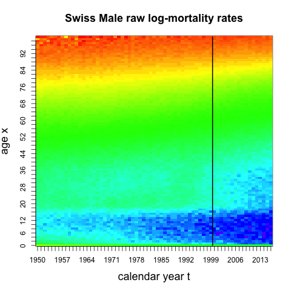

# 循环神经网络与死亡率预测 {#rnn}

*方玉昕、鲁瑶、高光远*

```{r setup, include=FALSE}
knitr::opts_chunk$set(eval = F)
```

😷 新冠肺炎死亡率数据：<https://mpidr.shinyapps.io/stmortality/>

## Lee-Carter Model

Lee Carter模型中，死亡力（force of mortality）的定义如下：  
$$\log \left(m_{t, x}\right)=a_{x}+b_{x} k_{t}$$
其中，  

- $m_{t, x}>0$ 是 $x$ 岁的人在日历年 $t$ 的死亡率（mortality rate）,   

- $a_{x}$ 是 $x$ 岁的人的平均对数死亡率,    

- $b_{x}$ 是死亡率变化的年龄因素, 

- $\left(k_{t}\right)_{t}$ 是死亡率变化的日历年因素.  
  
用 $M_{t, x}$ 表示某一性别死亡率的观察值（raw mortality rates）.  
我们对对数死亡率 $\log \left(M_{t, x}\right)$  中心化处理：  
$$\log \left(M_{t, x}^{\circ}\right)=\log \left(M_{t, x}\right)-\widehat{a}_{x}=\log \left(M_{t, x}\right)-\frac{1}{|\mathcal{T}|} \sum_{s \in \mathcal{T}} \log \left(M_{s, x}\right)$$

其中，  

- $\mathcal{T}$ 为训练集中日历年的集合,  

- $\widehat{a}_{x}=\frac{1}{|\mathcal{T}|} \sum_{s \in \mathcal{T}} \log \left(M_{s, x}\right)$ 是平均对数死亡率 $a_{x}$ 的估计.  
  
对于$b_x,k_t$ 我们的目标是求如下最优化问题：  
$$\underset{\left(b_{x}\right)_{x},\left(k_{t}\right)_{t}}{\arg \min } \sum_{t, x}\left(\log \left(M_{t, x}^{\circ}\right)-b_{x} k_{t}\right)^{2}。$$

定义矩阵 $A=\left(\log \left(M_{t, x}^{\circ}\right)\right)_{x, t}$。上述最优化问题可以通过对$A$进行奇异值分解（SVD）解决$$A=U\Lambda V^\intercal,$$
其中$U$称为左奇异矩阵，对角矩阵$\Lambda=\text{diag}(\lambda_1,\ldots,\lambda_T)$中的对角元素$\lambda_1\geq\lambda_2\geq\ldots\geq\lambda_T\geq0$称为奇异值，$V$称为右奇异矩阵。

- $A$ 的第一个左奇异向量$U_{\cdot,1}$与第一个奇异值$\lambda_1$相乘，可以得到 $\left(b_{x}\right)_{x}$ 的一个估计 $\left(\widehat{b}_{x}\right)_{x}$。

- $A$ 的第一个右奇异向量$V_{\cdot,1}$给出了 $\left(k_{t}\right)_{t}$ 的一个估计 $\left(\widehat{k}_{t}\right)_{t}$。

为了求解结果的唯一性，增加约束：  
$$\sum_{x} \hat{b}_{x}=1 \quad \text { and } \quad \sum_{t \in \mathcal{T}} \hat{k}_{t}=0$$
至此即可解出唯一的 $\left(\hat{a}_{x}, \hat{b}_{x}\right)_{x}, \left(\hat{k}_{t}\right)_{t}$ . 这就是经典的LC模型构建方法.

## 普通循环神经网络（recurrent neural network）

**输入变量（Input）** :  $\left(\boldsymbol{x}_{1}, \ldots, \boldsymbol{x}_{T}\right)$ with components $\boldsymbol{x}_{t} \in \mathbb{R}^{\tau_{0}}$ at times $t=1, \ldots, T$ (in time series structure).

**输出变量（Output）**: $y \in \mathcal{Y} \subset \mathbb{R}$ .  
  
首先看一个具有 $\tau_{1} \in \mathbb{N}$ 个隐层神经元（hidden neurons）和单一隐层（hidden layer）的RNN. 隐层由如下映射（mapping）定义：
$$\boldsymbol{z}^{(1)}: \mathbb{R}^{\tau_{0} \times \tau_{1}} \rightarrow \mathbb{R}^{\tau_{1}}, \quad\left(\boldsymbol{x}_{t}, \boldsymbol{z}_{t-1}\right) \mapsto \boldsymbol{z}_{t}^{(1)}=\boldsymbol{z}^{(1)}\left(\boldsymbol{x}_{t}, \boldsymbol{z}_{t-1}\right)$$
其中下标 $t$ 表示时间,上标 (1) 表示第一隐层（本例中也是唯一隐层）.

隐层结构构造如下：  
$$
\begin{aligned}
\boldsymbol{z}^{(1)}\left(\boldsymbol{x}_{t}, \boldsymbol{z}_{t-1}\right) =&\left(\phi\left(\left\langle\boldsymbol{w}_{1}^{(1)}, \boldsymbol{x}_{t}\right\rangle+\left\langle\boldsymbol{u}_{1}^{(1)}, \boldsymbol{z}_{t-1}\right\rangle\right),  \ldots, \phi\left(\left\langle\boldsymbol{w}_{\tau_{1}}^{(1)}, \boldsymbol{x}_{t}\right\rangle+\left\langle\boldsymbol{u}_{\tau_{1}}^{(1)}, \boldsymbol{z}_{t-1}\right\rangle\right)\right)^{\top} \\
\stackrel{\text { def. }}{=} &\phi\left(\left\langle W^{(1)}, \boldsymbol{x}_{t}\right\rangle+\left\langle U^{(1)}, \boldsymbol{z}_{t-1}\right\rangle\right)
\end{aligned}
$$
其中第  $1 \leq j \leq \tau_{1}$ 个神经元的结构为：    
$$\phi\left(\left\langle\boldsymbol{w}_{j}^{(1)}, \boldsymbol{x}_{t}\right\rangle+\left\langle\boldsymbol{u}_{j}^{(1)}, \boldsymbol{z}_{t-1}\right\rangle\right)=\phi\left(w_{j, 0}^{(1)}+\sum_{l=1}^{\tau_{0}} w_{j, l}^{(1)} x_{t, l}+\sum_{l=1}^{\tau_{1}} u_{j, l}^{(1)} z_{t-1, l}\right)$$

- $\phi: \mathbb{R} \rightarrow \mathbb{R}$ 是非线性激活函数（activation function）
- 网络参数（network parameters）为 $$W^{(1)}=\left(\boldsymbol{w}_{j}^{(1)}\right)_{1 \leq j \leq \tau_{1}}^{\top} \in \mathbb{R}^{\tau \times\left(\tau_{0}+1\right)} \text{(including an intercept)}$$  $$U^{(1)}=\left(\boldsymbol{u}_{j}^{(1)}\right)_{1 \leq j \leq \tau_{1}}^{\top} \in \mathbb{R}^{\tau_{1} \times \tau_{1}} \text{(excluding an intercept)}$$


除了上述单隐层的结构，我们还可以轻松地设计多隐层的RNN.  
  
例如，双隐层的RNN结构可以为:  

- **1st variant** : 仅允许同级隐层之间的循环
$$
\begin{aligned}
\boldsymbol{z}_{t}^{(1)} &=\boldsymbol{z}^{(1)}\left(\boldsymbol{x}_{t}, \boldsymbol{z}_{t-1}^{(1)}\right) \\
\boldsymbol{z}_{t}^{(2)} &=\boldsymbol{z}^{(2)}\left(\boldsymbol{z}_{t}^{(1)}, \boldsymbol{z}_{t-1}^{(2)}\right)
\end{aligned}
$$

- **2nd variant** : 允许跨级隐层循环
$$
\begin{aligned}
\boldsymbol{z}_{t}^{(1)} &=\boldsymbol{z}^{(1)}\left(\boldsymbol{x}_{t}, \boldsymbol{z}_{t-1}^{(1)}, \boldsymbol{z}_{t-1}^{(2)}\right) \\
\boldsymbol{z}_{t}^{(2)} &=\boldsymbol{z}^{(2)}\left(\boldsymbol{z}_{t}^{(1)}, \boldsymbol{z}_{t-1}^{(2)}\right)
\end{aligned}
$$

- **3rd variant** : 允许二级隐层与输入层 $\boldsymbol{x}_{t}$ 进行循环
$$
\begin{aligned}
\boldsymbol{z}_{t}^{(1)} &=\boldsymbol{z}^{(1)}\left(\boldsymbol{x}_{t}, \boldsymbol{z}_{t-1}^{(1)}, \boldsymbol{z}_{t-1}^{(2)}\right) \\
\boldsymbol{z}_{t}^{(2)} &=\boldsymbol{z}^{(2)}\left(\boldsymbol{x}_{t}, \boldsymbol{z}_{t}^{(1)}, \boldsymbol{z}_{t-1}^{(2)}\right)
\end{aligned}
$$


## 长短期记忆神经网络（Long short-term memory）

以上plain vanilla RNN 无法处理长距离依赖和且有梯度消散的问题。为此，Hochreiter-Schmidhuber (1997)提出了长短期记忆神经网络(Long Short Term Memory Network, LSTM)。  

### 激活函数（Activation functions）

LSTM 用到3种不同的 **激活函数（activation functions）**:

1. Sigmoid函数（Sigmoid function）  
$$\phi_{\sigma}(x)=\frac{1}{1+e^{-x}} \in(0,1)$$

2. 双曲正切函数（Hyberbolic tangent function）
$$\phi_{\tanh }(x)=\frac{e^{x}-e^{-x}}{e^{x}+e^{-x}}=2 \phi_{\sigma}(2 x)-1 \in(-1,1)$$
3. 一般的激活函数（General activation function）
$$\phi: \mathbb{R} \rightarrow \mathbb{R}$$ 


### Gates and cell state 

令 $\boldsymbol{z}_{t-1}^{(1)} \in \mathbb{R}^{\tau_{1}}$ 表示时间 $(t-1)$ 时的**活化状态（neuron activations）**.  我们定义3中不同的 **门（gates）**, 用来决定传播到下一个时间的信息量：

- **遗忘门（Forget gate）** (loss of memory rate):
$$\boldsymbol{f}_{t}^{(1)}=\boldsymbol{f}^{(1)}\left(\boldsymbol{x}_{t}, \boldsymbol{z}_{t-1}^{(1)}\right)=\phi_{\sigma}\left(\left\langle W_{f}, \boldsymbol{x}_{t}\right\rangle+\left\langle U_{f}, \boldsymbol{z}_{t-1}^{(1)}\right\rangle\right) \in(0,1)^{\tau_{1}}$$
for network parameters $W_{f}^{\top} \in \mathbb{R}^{\tau_{1} \times\left(\tau_{0}+1\right)}$ (including an intercept) $, U_{f}^{\top} \in \mathbb{R}^{\tau_{1} \times \tau_{1}}$ (excluding an intercept $),$ and where the activation function is evaluated element wise.

- **输入门（Input gate）** (memory update rate):
$$\boldsymbol{i}_{t}^{(1)}=\boldsymbol{i}^{(1)}\left(\boldsymbol{x}_{t}, \boldsymbol{z}_{t-1}^{(1)}\right)=\phi_{\sigma}\left(\left\langle W_{i}, \boldsymbol{x}_{t}\right\rangle+\left\langle U_{i}, \boldsymbol{z}_{t-1}^{(1)}\right\rangle\right) \in(0,1)^{\tau_{1}}$$
for network parameters $W_{i}^{\top} \in \mathbb{R}^{\tau_{1} \times\left(\tau_{0}+1\right)}$ (including an intercept), $U_{i}^{\top} \in \mathbb{R}^{\tau_{1} \times \tau_{1}}$.

- **输出门（Output gate）** (release of memory information rate):
$$\boldsymbol{o}_{t}^{(1)}=\boldsymbol{o}^{(1)}\left(\boldsymbol{x}_{t}, \boldsymbol{z}_{t-1}^{(1)}\right)=\phi_{\sigma}\left(\left\langle W_{o}, \boldsymbol{x}_{t}\right\rangle+\left\langle U_{o}, \boldsymbol{z}_{t-1}^{(1)}\right\rangle\right) \in(0,1)^{\tau_{1}}$$
for network parameters $W_{o}^{\top} \in \mathbb{R}^{\tau_{1} \times\left(\tau_{0}+1\right)}$ (including an intercept) $, U_{o}^{\top} \in \mathbb{R}^{\tau_{1} \times \tau_{1}}$.

注意：以上三种门的名字并不代表着它们在实际中的作用，它们的作用由网络参数决定，而网络参数是从数据中学到的。

令 $\left(\boldsymbol{c}_{t}^{(1)}\right)_{t}$ 表示 **细胞状态（cell state）** , 用以储存已获得的相关信息.  

细胞状态的更新规则如下：    
$$\begin{aligned}
\boldsymbol{c}_{t}^{(1)}&=\boldsymbol{c}^{(1)}\left(\boldsymbol{x}_{t}, \boldsymbol{z}_{t-1}^{(1)}, \boldsymbol{c}_{t-1}^{(1)}\right)\\&=\boldsymbol{f}_{t}^{(1)} \circ \boldsymbol{c}_{t-1}^{(1)}+\boldsymbol{i}_{t}^{(1)} \circ \phi_{\tanh }\left(\left\langle W_{c}, \boldsymbol{x}_{t}\right\rangle+\left\langle U_{c}, \boldsymbol{z}_{t-1}^{(1)}\right\rangle\right) \in \mathbb{R}^{\tau_{1}}
\end{aligned}$$
for network parameters $W_{c}^{\top} \in \mathbb{R}^{\tau_{1} \times\left(\tau_{0}+1\right)}$ (including an intercept), $U_{c}^{\top} \in \mathbb{R}^{\tau_{1} \times \tau_{1}},$ and $\circ$
denotes the Hadamard product (element wise product). 
  
最后，我们更新时刻 $t$ 时的活化状态 $\boldsymbol{z}_{t}^{(1)} \in \mathbb{R}^{\tau_{1}}$.  
$$\boldsymbol{z}_{t}^{(1)}=\boldsymbol{z}^{(1)}\left(\boldsymbol{x}_{t}, \boldsymbol{z}_{t-1}^{(1)}, \boldsymbol{c}_{t-1}^{(1)}\right)=\boldsymbol{o}_{t}^{(1)} \circ \phi\left(\boldsymbol{c}_{t}^{(1)}\right) \in \mathbb{R}^{\tau_{1}}$$

至此，

- 涉及的全部网络参数有:  $$W_{f}^{\top}, W_{i}^{\top}, W_{o}^{\top}, W_{c}^{\top} \in \mathbb{R}^{\tau_{1} \times\left(\tau_{0}+1\right)}，~~ U_{f}^{\top}, U_{i}^{\top}, U_{o}^{\top}, U_{c}^{\top} \in \mathbb{R}^{\tau_{1} \times \tau_{1}} .$$   

- 一个LSTM层需要 $4\left(\left(\tau_{0}+1\right) \tau_{1}+\tau_{1}^{2}\right)$ 个网络参数。

- 以上定义的复杂映射在keras通过函数`layer_lstm()`即可实现。

- 这些参数均由梯度下降的变式算法（a variant of the gradient descent algorithm）学习得.

### Output Function

基于 $\left(\boldsymbol{x}_{1}, \ldots, \boldsymbol{x}_{T}\right)$ , 我们来预测定义在 $\mathcal{Y} \subset \mathbb{R}$ 的随机变量 $Y_{T}$ .

$$\widehat{Y}_{T}=\widehat{Y}_{T}\left(\boldsymbol{x}_{1}, \ldots, \boldsymbol{x}_{T}\right)=\varphi\left\langle\boldsymbol{w}, \boldsymbol{z}_{T}^{(1)}\right\rangle \in \mathcal{Y}$$
其中，   

- $z_{T}^{(1)}$ 是最新的隐层神经元活化状态（hidden neuron activation）

- $\boldsymbol{w} \in \mathbb{R}^{\tau_{1}+1}$ 是输出权重(again including an intercept component)

- $\varphi: \mathbb{R} \rightarrow \mathcal{Y}$ 是一个恰当的输出激活函数，选择时需要考虑$y$的取值范围。

### Time-distributed Layer

以上只考虑了根据最新的状态 $\boldsymbol{z}_{T}^{(1)}\left(\boldsymbol{x}_{1}, \ldots, \boldsymbol{x}_{T}\right)$ 所确定的单一的输出 $Y_{T}$.    
  
但是我们可以考虑 **所有** 隐层神经元状态:  
$$\boldsymbol{z}_{1}^{(1)}\left(\boldsymbol{x}_{1}\right), \boldsymbol{z}_{2}^{(1)}\left(\boldsymbol{x}_{1}, \boldsymbol{x}_{2}\right), \boldsymbol{z}_{3}^{(1)}\left(\boldsymbol{x}_{1}, \ldots, \boldsymbol{x}_{3}\right), \ldots, \boldsymbol{z}_{T}^{(1)}\left(\boldsymbol{x}_{1}, \ldots, \boldsymbol{x}_{T}\right)$$
每一个状态 $\boldsymbol{z}_{t}^{(1)}\left(\boldsymbol{x}_{1}, \ldots, \boldsymbol{x}_{t}\right)$ 都可以作为解释变量，用以估计 $t$ 时所对应的 $Y_{t}$ :

$$\widehat{Y}_{t}=\widehat{Y}_{t}\left(\boldsymbol{x}_{1}, \ldots, \boldsymbol{x}_{t}\right)=\varphi\left\langle\boldsymbol{w}, \boldsymbol{z}_{t}^{(1)}\right\rangle=\varphi\left\langle\boldsymbol{w}, \boldsymbol{z}_{t}^{(1)}\left(\boldsymbol{x}_{1}, \ldots, \boldsymbol{x}_{t}\right)\right\rangle$$
其中过滤器（filter） $\varphi\langle\boldsymbol{w}, \cdot\rangle$ 对所有时间 $t$ 取相同函数.
  
**小结：LSTM的优势**

- 时间序列结构和因果关系都可以得到正确的反应 

- 由于参数不依赖时间，LSTM可以很容易地拓展到未来时间段

## 门控循环神经网络（Gated Recurrent Unit）

另一个比较热门的RNN结构是：门控循环单元（gated recurrent unit, GRU), 由Cho et al. (2014) 提出，它比LSTM更加简洁，但同样可以缓解plain vanilla RNN中梯度消散的问题。

### Gates

GRU只使用2个不同的**门（gates）**. 令 $\boldsymbol{z}_{t-1}^{(1)} \in \mathbb{R}^{\tau_{1}}$ 表示 $(t-1)$ 时神经元活化状态.

- **Reset gate**: 类似于LSTM中的遗忘门
$$\boldsymbol{r}_{t}^{(1)}=\boldsymbol{r}^{(1)}\left(\boldsymbol{x}_{t}, \boldsymbol{z}_{t-1}^{(1)}\right)=\phi_{\sigma}\left(\left\langle W_{r}, \boldsymbol{x}_{t}\right\rangle+\left\langle U_{r}, \boldsymbol{z}_{t-1}^{(1)}\right\rangle\right) \in(0,1)^{\tau_{1}}$$
for network parameters $W_{r}^{\top} \in \mathbb{R}^{\tau_{1} \times\left(\tau_{0}+1\right)}$ (including an intercept), $U_{r}^{\top} \in \mathbb{R}^{\tau_{1} \times \tau_{1}}$.

- **Update gate**: 类似于LSTM中的输入门
$$\boldsymbol{u}_{t}^{(1)}=\boldsymbol{u}^{(1)}\left(\boldsymbol{x}_{t}, \boldsymbol{z}_{t-1}^{(1)}\right)=\phi_{\sigma}\left(\left\langle W_{u}, \boldsymbol{x}_{t}\right\rangle+\left\langle U_{u}, \boldsymbol{z}_{t-1}^{(1)}\right\rangle\right) \in(0,1)^{\tau_{1}}$$
for network parameters $W_{u}^{\top} \in \mathbb{R}^{\tau_{1} \times\left(\tau_{0}+1\right)}$ (including an intercept), $U_{u}^{\top} \in \mathbb{R}^{\tau_{1} \times \tau_{1}}$

### Neuron Activations

以上门变量的作用是，已知 $t-1$ 时神经元活化状态 $\boldsymbol{z}_{t-1}^{(1)}$, 计算 $t$ 时神经元活化状态 $\boldsymbol{z}_{t}^{(1)} \in \mathbb{R}^{\tau_{1}}$ . 我们选用如下结构： 
$$\boldsymbol{z}_{t}^{(1)}=\boldsymbol{z}^{(1)}\left(\boldsymbol{x}_{t}, \boldsymbol{z}_{t-1}^{(1)}\right)=\boldsymbol{r}_{t}^{(1)} \circ \boldsymbol{z}_{t-1}^{(1)}+\left(\mathbf{1}-\boldsymbol{r}_{t}^{(1)}\right) \circ \phi\left(\left\langle W, \boldsymbol{x}_{t}\right\rangle+\boldsymbol{u}_{t} \circ\left\langle U, \boldsymbol{z}_{t-1}^{(1)}\right\rangle\right) \in \mathbb{R}^{\tau_{1}}$$
for network parameters $W^{\top} \in \mathbb{R}^{\tau_{1} \times\left(\tau_{0}+1\right)}$ (including an intercept) $, U^{\top} \in \mathbb{R}^{\tau_{1} \times \tau_{1}},$ and where $\circ$ denotes the Hadamard product.
  
GRU网络比LSTM网络的结构更简洁，而且会产生相近的结果。
但是，GRU在稳健性上有较大缺陷，因此现阶段LSTM的使用更为广泛. 

## 案例分析（Case study）

```{r data}
path.data <- "6 - Lee and Carter go Machine Learning Recurrent Neural Networks/CHE_mort.csv"           # path and name of data file
region <- "CHE"                    # country to be loaded (code is for one selected country)
source(file="6 - Lee and Carter go Machine Learning Recurrent Neural Networks/00_a package - load data.R")
str(all_mort)
length(unique(all_mort$Age))
length(unique(all_mort$Year))
67*2*100
```

### 死亡率热力图

```{r heatmap}
gender <- "Male"
#gender <- "Female"
m0 <- c(min(all_mort$logmx), max(all_mort$logmx))
# rows are calendar year t, columns are ages x
logmx <- t(matrix(as.matrix(all_mort[which(all_mort$Gender==gender),"logmx"]), nrow=100, ncol=67))
# png("./plots/6/heat.png")
image(z=logmx, useRaster=TRUE,  zlim=m0, col=rev(rainbow(n=60, start=0, end=.72)), xaxt='n', yaxt='n', main=list(paste("Swiss ",gender, " raw log-mortality rates", sep=""), cex=1.5), cex.lab=1.5, ylab="age x", xlab="calendar year t")
axis(1, at=c(0:(2016-1950))/(2016-1950), c(1950:2016))                   
axis(2, at=c(0:49)/50, labels=c(0:49)*2)                   
lines(x=rep((1999-1950+0.5)/(2016-1950), 2), y=c(0:1), lwd=2)
dev.off()
```

图\@ref(fig:heatplot)显示了男性死亡率随时间的改善。

```{r heatplot,echo=F, eval=T, out.width="60%",fig.align = 'center',fig.cap="瑞士男性死亡率热力图"}
knitr::opts_chunk$set(fig.pos = "!H", out.extra = "")

```

### Lee-Carter 模型

```{r LC}
ObsYear <- 1999
gender <- "Female"
train <- all_mort[Year<=ObsYear][Gender == gender]
min(train$Year)
    
### fit via SVD
train[,ax:= mean(logmx), by = (Age)]
train[,mx_adj:= logmx-ax]  
rates_mat <- as.matrix(train %>% dcast.data.table(Age~Year, value.var = "mx_adj", sum))[,-1]
dim(rates_mat)
svd_fit <- svd(rates_mat)
    
ax <- train[,unique(ax)]
bx <- svd_fit$u[,1]*svd_fit$d[1]
kt <- svd_fit$v[,1]
      
c1 <- mean(kt)
c2 <- sum(bx)
ax <- ax+c1*bx
bx <- bx/c2
kt <- (kt-c1)*c2
    
### extrapolation and forecast
vali  <- all_mort[Year>ObsYear][Gender == gender]    
t_forecast <- vali[,unique(Year)] %>% length()
forecast_kt  =kt %>% forecast::rwf(t_forecast, drift = T)
kt_forecast = forecast_kt$mean
 
# illustration selected drift
plot_data <- c(kt, kt_forecast)
plot(plot_data, pch=20, col="red", cex=2, cex.lab=1.5, xaxt='n', ylab="values k_t", xlab="calendar year t", main=list(paste("estimated process k_t for ",gender, sep=""), cex=1.5)) 
points(kt, col="blue", pch=20, cex=2)
axis(1, at=c(1:length(plot_data)), labels=c(1:length(plot_data))+1949)                   
abline(v=(length(kt)+0.5), lwd=2)

# in-sample and out-of-sample analysis    
fitted = (ax+(bx)%*%t(kt)) %>% melt
train$pred_LC_svd = fitted$value %>% exp
fitted_vali = (ax+(bx)%*%t(kt_forecast)) %>% melt
vali$pred_LC_svd =   fitted_vali$value %>% exp
round(c((mean((train$mx-train$pred_LC_svd)^2)*10^4) , (mean((vali$mx-vali$pred_LC_svd)^2)*10^4)),4)
```

### 初试RNN

```{r toy example}
# load corresponding data
path.data <- "6 - Lee and Carter go Machine Learning Recurrent Neural Networks/CHE_mort.csv"           # path and name of data file
region <- "CHE"                    # country to be loaded (code is for one selected country)
source(file="6 - Lee and Carter go Machine Learning Recurrent Neural Networks/00_a package - load data.R")
str(all_mort)

# LSTMs and GRUs
source(file="6 - Lee and Carter go Machine Learning Recurrent Neural Networks/00_b package - network definitions.R")
T0 <- 10
tau0 <- 3
tau1 <- 5
tau2 <- 4
summary(LSTM1(T0, tau0, tau1, 0, "nadam"))
summary(LSTM2(T0, tau0, tau1, tau2, 0, "nadam"))
summary(LSTM_TD(T0, tau0, tau1, 0, "nadam"))
summary(GRU1(T0, tau0, tau1, 0, "nadam"))
summary(GRU2(T0, tau0, tau1, tau2, 0, "nadam"))
summary(FNN(T0, tau0, tau1, tau2, 0, "nadam"))

# Bringing the data in the right structure for a toy example
gender <- "Female"
ObsYear <- 2000
mort_rates <- all_mort[which(all_mort$Gender==gender), c("Year", "Age", "logmx")] 
mort_rates <- dcast(mort_rates, Year ~ Age, value.var="logmx")
dim(mort_rates)

T0 <- 10     # lookback period
tau0 <- 3    # dimension of x_t (should be odd for our application)
delta0 <- (tau0-1)/2

toy_rates <- as.matrix(mort_rates[which(mort_rates$Year %in% c((ObsYear-T0):(ObsYear+1))),])
dim(toy_rates)

xt <- array(NA, c(2,ncol(toy_rates)-tau0, T0, tau0))
YT <- array(NA, c(2,ncol(toy_rates)-tau0))

for (i in 1:2){for (a0 in 1:(ncol(toy_rates)-tau0)){ 
    xt[i,a0,,] <- toy_rates[c(i:(T0+i-1)),c((a0+1):(a0+tau0))]
    YT[i,a0] <- toy_rates[T0+i,a0+1+delta0]
}}
dim(xt)
dim(YT)

plot(x=toy_rates[1:T0,1], y=toy_rates[1:T0,2], col="white", xlab="calendar years", ylab="raw log-mortality rates", cex.lab=1.5, cex=1.5, main=list("data toy example", cex=1.5), xlim=range(toy_rates[,1]), ylim=range(toy_rates[,-1]), type='l')
for (a0 in 2:ncol(toy_rates)){
  if (a0 %in% (c(1:100)*3)){
    lines(x=toy_rates[1:T0,1], y=toy_rates[1:T0,a0])    
    points(x=toy_rates[(T0+1):(T0+2),1], y=toy_rates[(T0+1):(T0+2),a0], col=c("blue", "red"), pch=20)
    lines(x=toy_rates[(T0):(T0+1),1], y=toy_rates[(T0):(T0+1),a0], col="blue", lty=2)
    lines(x=toy_rates[(T0+1):(T0+2),1], y=toy_rates[(T0+1):(T0+2),a0], col="red", lty=2)
    }}

# LSTMs and GRUs
x.train <- array(2*(xt[1,,,]-min(xt))/(max(xt)-min(xt))-1, c(ncol(toy_rates)-tau0, T0, tau0))
x.vali  <- array(2*(xt[2,,,]-min(xt))/(max(xt)-min(xt))-1, c(ncol(toy_rates)-tau0, T0, tau0))
y.train <- - YT[1,]
(y0 <- mean(y.train))
y.vali  <- - YT[2,]
dim(x.train)
length(y.train);length(y.vali)
# x.age.train<-as.matrix(0:0)
# x.training<-list(x.train,x.age.train)
# x.age.valid<-as.matrix(0:0)
# x.validation<-list(x.vali,x.age.valid)
### examples

tau1 <- 5    # dimension of the outputs z_t^(1) first RNN layer
tau2 <- 4    # dimension of the outputs z_t^(2) second RNN layer

CBs <- callback_model_checkpoint("./6 - Lee and Carter go Machine Learning Recurrent Neural Networks/CallBack/best_model", monitor = "val_loss", verbose = 0,  save_best_only = TRUE, save_weights_only = TRUE,save_freq = NULL)
model <- LSTM2(T0, tau0, tau1, tau2, y0, "nadam")     
summary(model)

# takes 40 seconds on my laptop
{t1 <- proc.time()
  fit <- model %>% fit(x=x.train, y=y.train, validation_data=list(x.vali, y.vali), batch_size=10, epochs=500, verbose=1, callbacks=CBs)
 proc.time()-t1}

plot(fit[[2]]$val_loss,col="red", ylim=c(0,0.5), main=list("early stopping rule", cex=1.5),xlab="epochs", ylab="MSE loss", cex=1.5, cex.lab=1.5)
lines(fit[[2]]$loss,col="blue")
abline(h=0.1, lty=1, col="black")
legend(x="bottomleft", col=c("blue","red"), lty=c(1,-1), lwd=c(1,-1), pch=c(-1,1), legend=c("in-sample loss", "out-of-sample loss"))

load_model_weights_hdf5(model, "./6 - Lee and Carter go Machine Learning Recurrent Neural Networks/CallBack/best_model")
Yhat.train1 <- as.vector(model %>% predict(x.train))
Yhat.vali1 <- as.vector(model %>% predict(x.vali))
c(round(mean((Yhat.train1-y.train)^2),4), round(mean((Yhat.vali1-y.vali)^2),4))
```


### RNN

```{r rnn}
# load corresponding data
path.data <- "6 - Lee and Carter go Machine Learning Recurrent Neural Networks/CHE_mort.csv"           # path and name of data file
region <- "CHE"                    # country to be loaded (code is for one selected country)
source(file="6 - Lee and Carter go Machine Learning Recurrent Neural Networks/00_a package - load data.R")
str(all_mort)
source(file="6 - Lee and Carter go Machine Learning Recurrent Neural Networks/00_b package - network definitions.R")
source(file="6 - Lee and Carter go Machine Learning Recurrent Neural Networks/00_c package - data preparation RNNs.R")

# choice of parameters
T0 <- 10
tau0 <- 5
gender <- "Female"
ObsYear <- 1999

# training data pre-processing 
data1 <- data.preprocessing.RNNs(all_mort, gender, T0, tau0, ObsYear)
dim(data1[[1]])
dim(data1[[2]])


# validation data pre-processing
all_mort2 <- all_mort[which((all_mort$Year > (ObsYear-10))&(Gender==gender)),]
all_mortV <- all_mort2
vali.Y <- all_mortV[which(all_mortV$Year > ObsYear),]
 
# MinMaxScaler data pre-processing
x.min <- min(data1[[1]])
x.max <- max(data1[[1]])
x.train <- array(2*(data1[[1]]-x.min)/(x.min-x.max)-1, dim(data1[[1]]))
y.train <- - data1[[2]]
y0 <- mean(y.train)

# LSTM architectures
# network architecture deep 3 network
tau1 <- 20
tau2 <- 15
tau3 <- 10
optimizer <- 'adam'

# choose either LSTM or GRU network
RNN.type <- "LSTM"
#RNN.type <- "GRU"

{if (RNN.type=="LSTM"){model <- LSTM3(T0, tau0, tau1, tau2, tau3, y0, optimizer)}else{model <- GRU3(T0, tau0, tau1, tau2, tau3, y0, optimizer)}
 name.model <- paste(RNN.type,"3_", tau0, "_", tau1, "_", tau2, "_", tau3, sep="")
 file.name <- paste("./6 - Lee and Carter go Machine Learning Recurrent Neural Networks/CallBack/best_model_", name.model,"_", gender, sep="")
 summary(model)}

# define callback
CBs <- callback_model_checkpoint(file.name, monitor = "val_loss", verbose = 0,  save_best_only = TRUE, save_weights_only = TRUE, save_freq = NULL)

# gradient descent fitting: takes roughly 200 seconds on my laptop
{t1 <- proc.time()
  fit <- model %>% fit(x=x.train, y=y.train, validation_split=0.2,
                                        batch_size=100, epochs=500, verbose=1, callbacks=CBs)                                        
proc.time()-t1}

# plot loss figures
plot.losses(name.model, gender, fit[[2]]$val_loss, fit[[2]]$loss)

# calculating in-sample loss: LC is c(Female=3.7573, Male=8.8110)
load_model_weights_hdf5(model, file.name)
round(10^4*mean((exp(-as.vector(model %>% predict(x.train)))-exp(-y.train))^2),4)

# calculating out-of-sample loss: LC is c(Female=0.6045, Male=1.8152)
pred.result <- recursive.prediction(ObsYear, all_mort2, gender, T0, tau0, x.min, x.max, model)
vali <- pred.result[[1]][which(all_mort2$Year > ObsYear),]
round(10^4*mean((vali$mx-vali.Y$mx)^2),4)
```

### 引入性别协变量

```{r both gender}
# load corresponding data
path.data <- "6 - Lee and Carter go Machine Learning Recurrent Neural Networks/CHE_mort.csv"           # path and name of data file
region <- "CHE"                    # country to be loaded (code is for one selected country)
source(file="6 - Lee and Carter go Machine Learning Recurrent Neural Networks/00_a package - load data.R")
str(all_mort)
source(file="6 - Lee and Carter go Machine Learning Recurrent Neural Networks/00_b package - network definitions.R")
source(file="6 - Lee and Carter go Machine Learning Recurrent Neural Networks/00_c package - data preparation RNNs.R")


# choice of parameters
T0 <- 10
tau0 <- 5
ObsYear <- 1999

# training data pre-processing 
data1 <- data.preprocessing.RNNs(all_mort, "Female", T0, tau0, ObsYear)
data2 <- data.preprocessing.RNNs(all_mort, "Male", T0, tau0, ObsYear)

xx <- dim(data1[[1]])[1]
x.train <- array(NA, dim=c(2*xx, dim(data1[[1]])[c(2,3)]))
y.train <- array(NA, dim=c(2*xx))
gender.indicator <- rep(c(0,1), xx)
for (l in 1:xx){
   x.train[(l-1)*2+1,,] <- data1[[1]][l,,]
   x.train[(l-1)*2+2,,] <- data2[[1]][l,,]
   y.train[(l-1)*2+1] <- -data1[[2]][l]
   y.train[(l-1)*2+2] <- -data2[[2]][l]
          }
# MinMaxScaler data pre-processing
x.min <- min(x.train)
x.max <- max(x.train)
x.train <- list(array(2*(x.train-x.min)/(x.min-x.max)-1, dim(x.train)), gender.indicator)
y0 <- mean(y.train)

# validation data pre-processing
all_mort2.Female <- all_mort[which((all_mort$Year > (ObsYear-10))&(Gender=="Female")),]
all_mortV.Female <- all_mort2.Female
vali.Y.Female <- all_mortV.Female[which(all_mortV.Female$Year > ObsYear),]
all_mort2.Male <- all_mort[which((all_mort$Year > (ObsYear-10))&(Gender=="Male")),]
all_mortV.Male <- all_mort2.Male
vali.Y.Male <- all_mortV.Male[which(all_mortV.Male$Year > ObsYear),]

# LSTM architectures
# network architecture deep 3 network
tau1 <- 20
tau2 <- 15
tau3 <- 10
optimizer <- 'adam'

# choose either LSTM or GRU network
RNN.type <- "LSTM"
#RNN.type <- "GRU"

{if (RNN.type=="LSTM"){model <- LSTM3.Gender(T0, tau0, tau1, tau2, tau3, y0, optimizer)}else{model <- GRU3.Gender(T0, tau0, tau1, tau2, tau3, y0, optimizer)}
 name.model <- paste(RNN.type,"3_", tau0, "_", tau1, "_", tau2, "_", tau3, sep="")
 #file.name <- paste("./Model_Full_Param/best_model_", name.model, sep="")
 file.name <- paste("./6 - Lee and Carter go Machine Learning Recurrent Neural Networks/CallBack/best_model_", name.model, sep="")
 summary(model)}

# define callback
CBs <- callback_model_checkpoint(file.name, monitor = "val_loss", verbose = 0,  save_best_only = TRUE, save_weights_only = TRUE,save_freq = NULL)

# gradient descent fitting: takes roughly 400 seconds on my laptop
{t1 <- proc.time()
  fit <- model %>% fit(x=x.train, y=y.train, validation_split=0.2,
                                        batch_size=100, epochs=500, verbose=1, callbacks=CBs)                                        
proc.time()-t1}

# plot loss figures
plot.losses(name.model, "Both", fit[[2]]$val_loss, fit[[2]]$loss)

# calculating in-sample loss: LC is c(Female=3.7573, Male=8.8110)
load_model_weights_hdf5(model, file.name)

round(10^4*mean((exp(-as.vector(model %>% predict(x.train)))-exp(-y.train))^2),4)

# calculating out-of-sample loss: LC is c(Female=0.6045, Male=1.8152)
# Female
pred.result <- recursive.prediction.Gender(ObsYear, all_mort2.Female, "Female", T0, tau0, x.min, x.max, model)
vali <- pred.result[[1]][which(all_mort2.Female$Year > ObsYear),]
round(10^4*mean((vali$mx-vali.Y.Female$mx)^2),4)
# Male
pred.result <- recursive.prediction.Gender(ObsYear, all_mort2.Male, "Male", T0, tau0, x.min, x.max, model)
vali <- pred.result[[1]][which(all_mort2.Male$Year > ObsYear),]
round(10^4*mean((vali$mx-vali.Y.Male$mx)^2),4)
```


