# 自然语言处理 {#nlp}

*陈美昆、蒋慧华、高光远*

```{r setup, include=FALSE}
knitr::opts_chunk$set(eval = F)
```

```{r history,echo=F, eval=T, out.width="70%",fig.align = 'center',fig.cap="NLP历史（2000年以后）"}
knitr::opts_chunk$set(fig.pos = "!H", out.extra = "")
knitr::include_graphics("./plots/7/history.png")
```

在保险业，大量的书面证据，如保单合同或索赔通知，以及客户与企业对话助理互动的记录，为数据科学家和精算师提供了越来越多的可供分析的文本信息。

NLP在保险行业中的应用：

- 根据文字描述的索赔类型和严重程度对索赔进行分类

- 对电子邮件、保单、合同的分类

- 从文本数据中识别欺诈案例等

**传统方法的基本过程**

1. 文本预处理

2. **映射到实数集**: bag-of-words, bag-of-POS, pre-trained word embedding

3. 有监督机器学习算法: AdaBoost, random forest, XGBoost

**循环神经网络的基本过程**

1. 文本预处理

2. 循环神经网络: RNN, GRU, LSTM

**区别**

1. 传统方法非常依赖第二步特征工程的效果,神经网络不需要特征工程,它通过监督学习.进行自动特征工程.

2. 传统方法没有考虑文本的时间序列特征, 循环神经网络考虑了文本的时间序列特征.

## 预处理

1. 输入原始文本和格式

2. 将文本转化为小写

3. 分词（ tokenization ）

4. 删除停用词（ stopwords ）

5. 词性标注（POS tagging, 这步在 bag-of-POS需要, 如果只是 bag-of-words，此步不需要)

6. 词干提取或词形还原（Stemming or Lemmatization）

## Bag of words

Bag-of-words模型是信息检索领域常用的文档表示方法。在信息检索中，BOW模型假定对于一个文档，忽略它的单词顺序和语法、句法等要素，将其仅仅看作是若干个词汇的集合，文档中每个单词的出现都是独立的，不依赖于其它单词是否出现。也就是说，文档中任意一个位置出现的任何单词，都不受该文档语意影响而独立选择的。例如有如下两个文档：

1. Bob likes to play basketball, Jim likes too.

2. Bob also likes to play football games.

基于这两个文本文档，构造一个词典：

Dictionary = {1:"Bob", 2. "like", 3. "to", 4. "play", 5. "basketball", 6. "also", 7. "football", 8. "games", 9. "Jim", 10. "too"}

这个词典一共包含$10$个不同的单词，利用词典的索引号，上面两个文档每一个都可以用一个$10$维向量表示（用整数数字$0:n$（$n$为正整数）表示某个单词在文档中出现的次数）：

 1：$[1, 2, 1, 1, 1, 0, 0, 0, 1, 1]$

 2：$[1, 1, 1, 1 ,0, 1, 1, 1, 0, 0]$
     
向量中每个元素表示词典中相关元素在本文本样本中出现的次数。不过，在构造文档向量的过程中可以看到，我们并没有表达单词在原来句子中出现的次序（这是本Bag-of-words模型的缺点之一，不过瑕不掩瑜甚至在此处无关紧要）。    

我们使用`TfidfVectorizer`进行BOW,它不使用词出现的次数,而计算term frequency - inverse document frequency (tf-idf)。研究表明tf-idf更能反映文本的特征。

## Bag of part-of-speech

相较于BOW，bag of POS仅仅多了一步，即对每个词语进行词性标注，然后使用`TfidfVectorizer`。可知bag of POS可以达到降维的目的，但它散失了原文本的词语的信息，只考虑了词性。

## Word embeddings

词嵌入考虑把每个词语映射到用多维实数空间中，有很多预训练的映射可供选择，这些映射通常考虑了词语的先后顺序和同义词反义词等。常用的词嵌入模型包括：

- Neural probabilistic language model

- word2vec

- Global vectors for word representation

### Neural probabilistic language model

传统的N-grams 模型认为，在第1个词到第t-1个词出现的情况下第t个词出现的条件概率，约等于在第t-n+1个词到第t-1个词出现的情况下第t个词出现的条件概率（N=n-1）。但传统模型没有对“词汇相似性”的概念进行编码，也存在测试时输入的词序列很可能不同于所有用来训练模型的单词序列的问题。为了解决这个问题，引入前馈式神经网络。

该前馈式神经网络用输入的第t个词前的n-1个词预测第t个词出现的概率，的结构如下：
```{r nplm, echo=F, eval=T, out.width="70%",fig.align = 'center',fig.cap="文档结构"}
knitr::opts_chunk$set(fig.pos = "!H", out.extra = "")
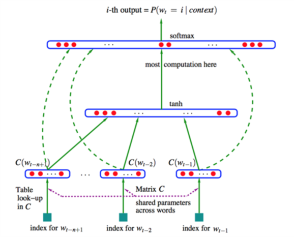
```

使用神经网络的目的是寻找词表V到d维向量空间R的映射，即图中的矩阵C。

### word2vec

word2vec使用了上下文（context）概念。
词 w 的上下文 C(w) 指 w前面和后面的有限个词。C(w)的长度被定义为非负整数c，2c=|C(w)|。例如：
'Koalas and platypuses are mammals living in Australia',c=2,w='are'
C(w)={'and','platypuses','mammals','living'}

Word2vec有两个变体，skip-gram model和the continuous bag of words (CBOW) model。
前者的思路是给定中心单词w，预测其上下文 C(w)。后者的思路是给定上下文C(w)，预测中心词w。
两者的结构图如下：
```{r w2v, echo=F, eval=T, out.width="70%",fig.align = 'center',fig.cap="文档结构"}
knitr::opts_chunk$set(fig.pos = "!H", out.extra = "")
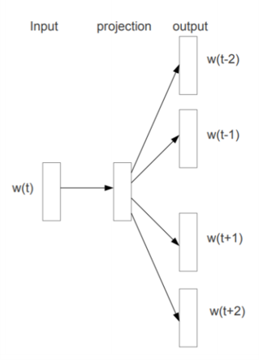
```

```{r w2v-2, echo=F, eval=T, out.width="70%",fig.align = 'center',fig.cap="文档结构"}
knitr::opts_chunk$set(fig.pos = "!H", out.extra = "")
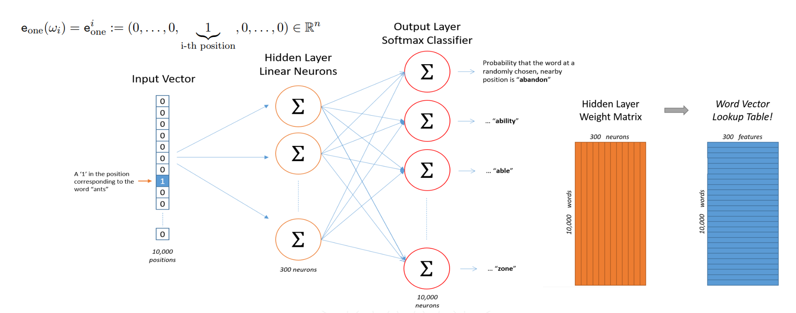
```

```{r w2v-3, echo=F, eval=T, out.width="70%",fig.align = 'center',fig.cap="文档结构"}
knitr::opts_chunk$set(fig.pos = "!H", out.extra = "")
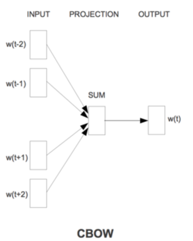
```

使用word2vec寻找词表V到d维向量空间R的映射，即寻找隐藏层的权重矩阵（skip-gram model第二张结构图中的橙色矩阵）。使用one-hot编码的词向量，乘以隐藏层的权重矩阵后，即得目标word vector。

### Global vectors for word representation(Glove)

word2vec仅在上下文考虑词与词共现的概率，Glove通过整个语料库计算词-词共现次数矩阵。
例如，C={'Cats and koalas are mammals.','Tortoises are not mammals.','I like cats,koalas and tortoises'.}
其词-词共现次数矩阵为：
```{r glove, echo=F, eval=T, out.width="70%",fig.align = 'center',fig.cap="文档结构"}
knitr::opts_chunk$set(fig.pos = "!H", out.extra = "")
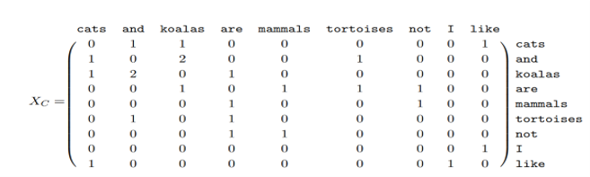
```

与词-词共现次数或概率相比，词-词共现概率比更能区分相关词和不相关词。
记Pij为词j出现在词i上下文的概率。Glove的思路是找到一个定义在中心词i的嵌入向量、中心词j的嵌入向量，以及上下文词k的嵌入向量上的一个函数F，使之尽可能等于Pik/Pjk。
这转化为一个加权最小二乘问题：
```{r glove-1, echo=F, eval=T, out.width="70%",fig.align = 'center',fig.cap="文档结构"}
knitr::opts_chunk$set(fig.pos = "!H", out.extra = "")
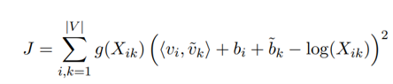
```
其中，g()是权重函数，b是标量偏差，Xik是词i与词k的全局共现数。
Glove的目标是最小化J，以期求得词的嵌入向量。

### Pre-trained word embeddings

我们使用`en_core_web_sm`进行词嵌入，它可以把任意的词映射到$\mathbb{R}^{96}$。另外，`en_core_web_mb`为更复杂的映射，可以把任意的词映射到$\mathbb{R}^{300}$。对于一个包含多个词语的文本，我们用所有词语的词嵌入平均值来表示这个文本

## 机器学习算法

通过bag-of-words, bag-of-POS，word embedding 我们把每个文本转变为一个向量。这样可以利用如下几种机器学习算法进行文本分类等监督学习。（详见第四章提升方法（Boosting））

- AdaBoost

- Random Forest

- XGBoost


## 神经网络

- RNN
```{r rnn, echo=F, eval=T, out.width="70%",fig.align = 'center',fig.cap="文档结构"}
knitr::opts_chunk$set(fig.pos = "!H", out.extra = "")
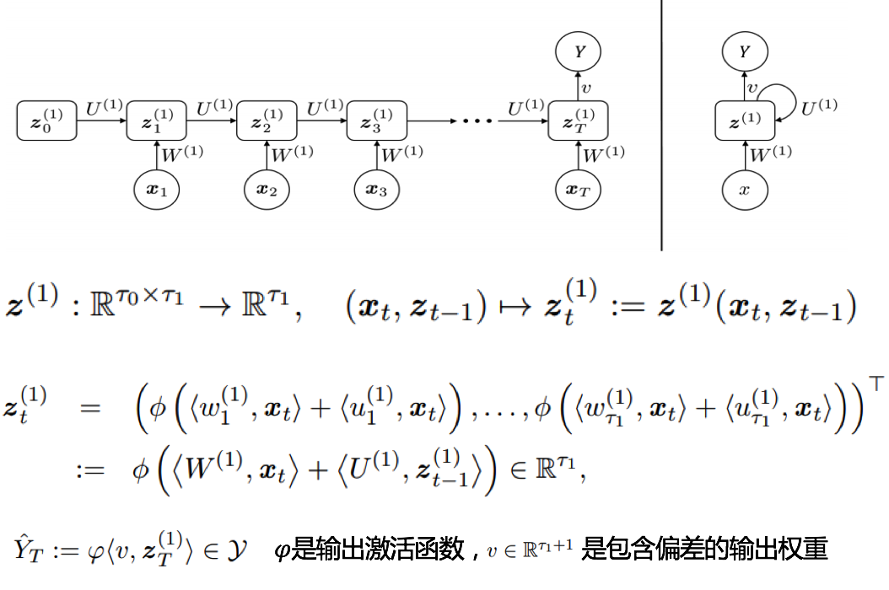
```

- LSTM
```{r lstm, echo=F, eval=T, out.width="70%",fig.align = 'center',fig.cap="文档结构"}
knitr::opts_chunk$set(fig.pos = "!H", out.extra = "")
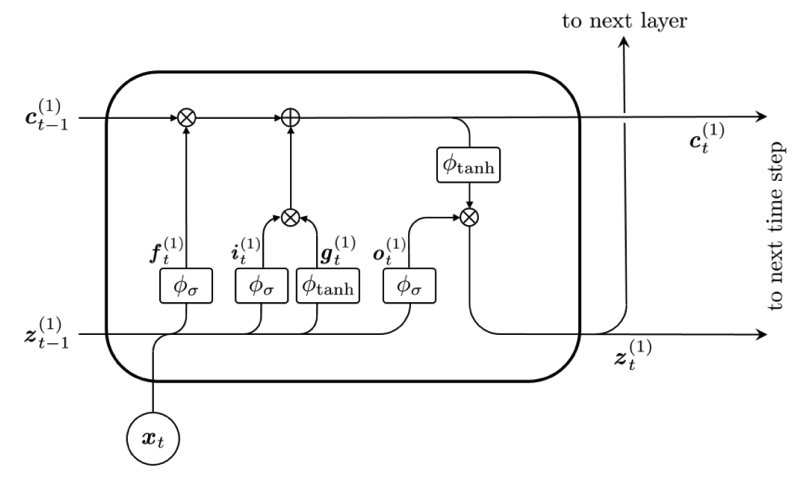
```

```{r lstm-1, echo=F, eval=T, out.width="70%",fig.align = 'center',fig.cap="文档结构"}
knitr::opts_chunk$set(fig.pos = "!H", out.extra = "")
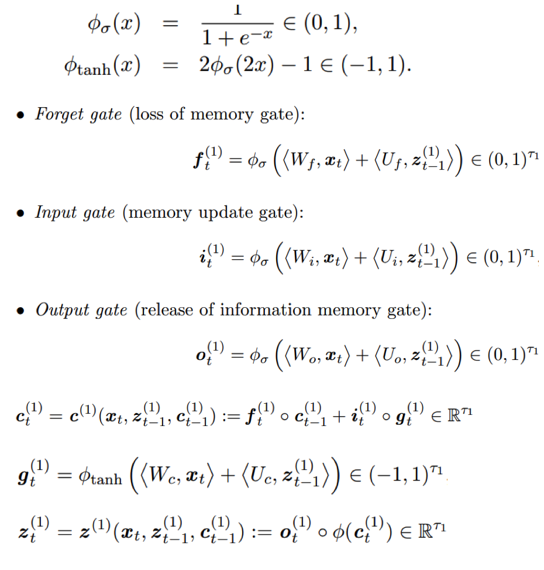
```

- GRU
```{r gru, echo=F, eval=T, out.width="70%",fig.align = 'center',fig.cap="文档结构"}
knitr::opts_chunk$set(fig.pos = "!H", out.extra = "")
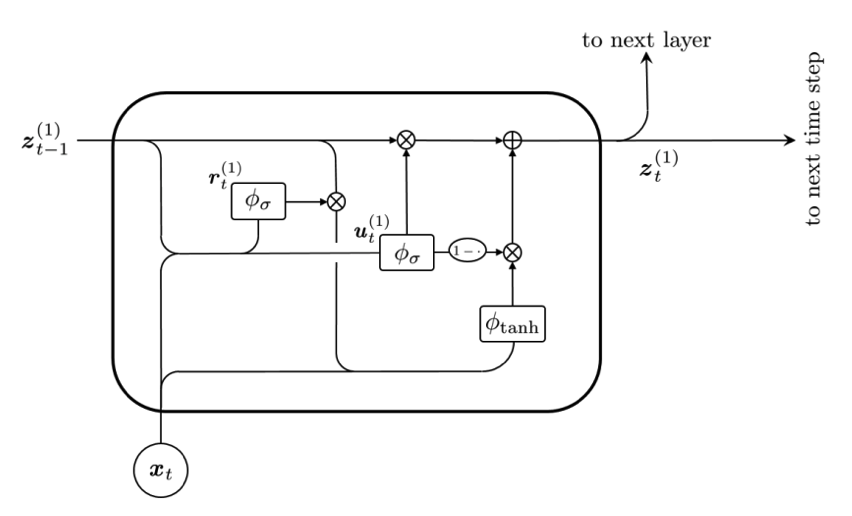
```

```{r gru-1, echo=F, eval=T, out.width="70%",fig.align = 'center',fig.cap="文档结构"}
knitr::opts_chunk$set(fig.pos = "!H", out.extra = "")
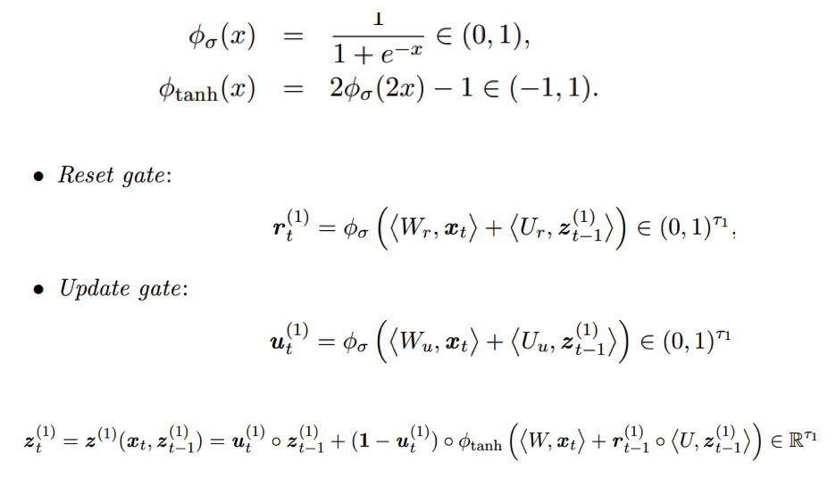
```

### 数据预处理

在神经网络中，我们不需要进行以上bag-of-words, bag-of-POS, word embedding等人工特征工程，我们只需要用实数把文本中**词语的顺序**表征出来即可，神经网络可以同步进行特征工程和有监督训练。

在python中可以使用Keras 中的`Tokenizer`模块把词语映射到非负整数上，此方法保持了保持了词语的顺序，是前面几种方法没有达到的。

可以看到，使用神经网络时，我们仅仅需要进行很少的特征工程，词语的意义将由神经网络在监督学习中学到。文本是时间序列数据，常用于时间序列分析的模型包括

- LSTM

  - Shallow LSTM architecture
```{r lstm-s, echo=F, eval=T, out.width="70%",fig.align = 'center',fig.cap="文档结构"}
knitr::opts_chunk$set(fig.pos = "!H", out.extra = "")
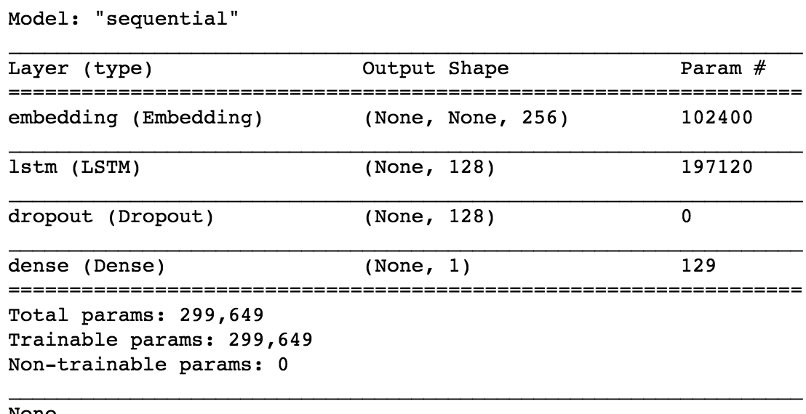
```

  - Deep LSTM architecture
```{r lstm-d, echo=F, eval=T, out.width="70%",fig.align = 'center',fig.cap="文档结构"}
knitr::opts_chunk$set(fig.pos = "!H", out.extra = "")
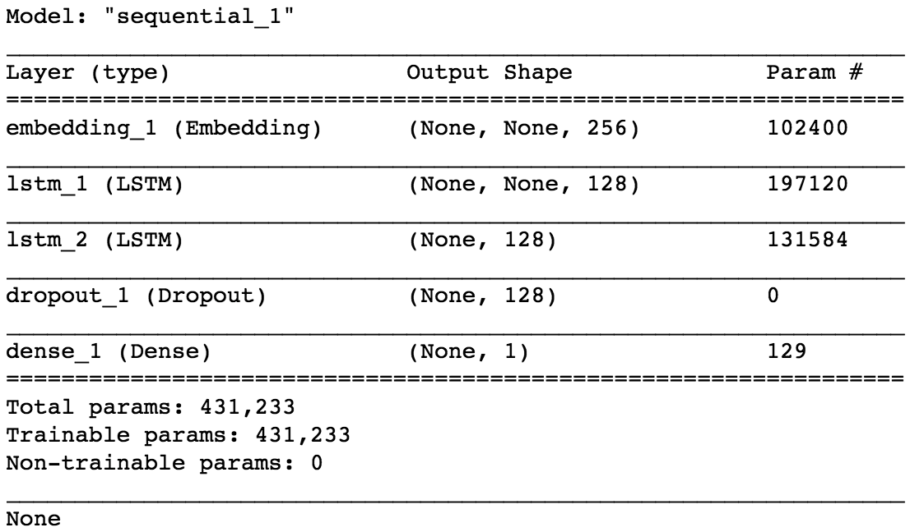
```

- GRU

  - Shallow GRU architecture
```{r gru-s, echo=F, eval=T, out.width="70%",fig.align = 'center',fig.cap="文档结构"}
knitr::opts_chunk$set(fig.pos = "!H", out.extra = "")
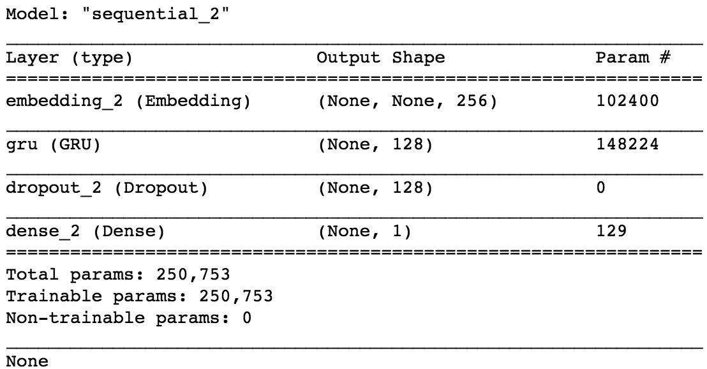
```

## Case study

```{r case, echo=F, eval=T, out.width="70%",fig.align = 'center',fig.cap="文档结构"}
knitr::opts_chunk$set(fig.pos = "!H", out.extra = "")
knitr::include_graphics("./plots/7/files.png")
```

```{r procedure,echo=F, eval=T, out.width="70%",fig.align = 'center',fig.cap="nlp4class_exercise步骤"}
knitr::opts_chunk$set(fig.pos = "!H", out.extra = "")
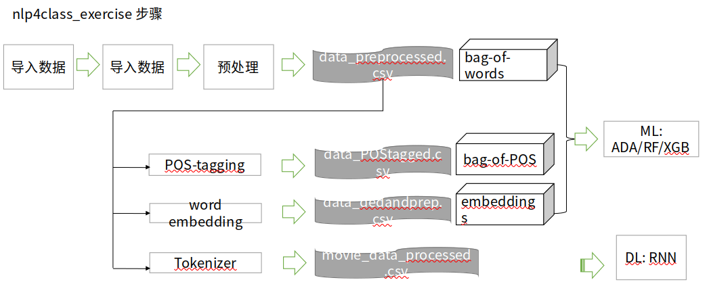
```

- 任务描述：根据电影评论文本判断该评论是“好评”还是“差评”

- 数据来源： Internet Movie Database (IMDb)

- 数据量：案例中共有5000条含分类信息（pos/neg）的原始数据，从计算资源是运行时间考虑，我们从原始数据中随机抽取了1%，即500条数据进行测试，测试数据在toymdb文件夹下，文件结构和原始数据一致（需要注意的是， toymdb文件夹包含train和test两个文件，但并不是实际处理时的“训练集”和“测试集”，实际训练时读取所有数据并重新划分“训练集”和“测试集” ，所以实际上train和test中的文件没有区别，只是沿袭了原始数据的存储结构）。

- 数据结构：评论位置代表类别，一个txt存储一个评论数据。 

### 函数说明

- 分词

```
import re
def preprocessor(text):
    text = re.sub('<[^>]*>', '', text)
    emoticons = re.findall('(?::|;|=)(?:-)?(?:\)|\(|D|P)', text)
    text = (re.sub('[\W]+', ' ', text.lower()) +
            ' '.join(emoticons).replace('-', ''))
    return text
```

引入Python中的re模块，定义preprocessor函数对文本进行第一步的清理，作用去掉文本中的非字母数字符号，并将所有字母都转化成小写。

```
from nltk.tokenize import word_tokenize
tokens = word_tokenize(text)
```

从nltk.tokenize导入word_tokenize函数对清理后的文本进行分词，返回值由单词组成的列表。

- 删除停止词

```
import nltk
from nltk.corpus import stopwords

stopwords = list(set(stopwords.words('english')))
filtered_tokens = [word for word in tokens if word not in stopwords]
```

导入nltk.corpus中的停用词表，删除列表中出现在停用词表中的所有单词，不改变词序。

- 词性标注

```
from nltk import pos_tag
nltk.download('averaged_perceptron_tagger')

def pos_tags(text_processed):
    return "-".join( tag for (word, tag) in nltk.pos_tag(text_processed))

pos_tag = pos_tags(filtered_tokens)
```

导入nltk中的pos_tag函数，该函数的作用是根据训练好的模型给出单词对应的词性，返回值是一个元组，元组中的两个元素分别是原单词和对应的词性标注。
重新定义词性标注函数pos_tags，最终返回一个由“-”连接的字符串，它按顺序连接了经过预处理的文本中每个单词的词性数据。

- TfidfVectorizer()

```
from sklearn.feature_extraction.text import TfidfVectorizer
import pandas as pd

tfidf = c(strip_accents=None,
                        lowercase=False,
                        preprocessor=None)
                        
tfidf_wm = tfidf.fit_transform([pos_tag])

```

TfidfVectorizer将文本转化为向量； 向量的属性对应词典中的单词(n个)，属性值是每个单词的tfidf值； 每个向量代表一个文本； n个文本构成n*p矩阵； 
TfidfVectorizer.fit_transform的输入值是经过预处理的文本列表时，得到bag of words模型的输入矩阵；当输入值是相应的词性序列列表时，得到bag of POS模型的输入矩阵。

- word embeddings

```
import spacy
nlp = spacy.load('en_core_web_sm') 

import numpy as np
emb = nlp(text_filtered).vector

```

根据'en_core_web_sm'模型将文本转化为向量，向量的维数是由模型本身决定的。可以根据实际研究需要选择合适的模型。由这样的文本向量构成的矩阵就是word embeddings模型的最终输入。

- RNN的预处理

```
from tensorflow.keras.preprocessing.text import Tokenizer
from tensorflow.keras.preprocessing.sequence import pad_sequences

vocab_size = 400
#取前400个最高频词汇作为文本的词序标记，即只对文本中出现在前400个最高频词汇中的单词进行词序映射
#如某评论为'w1 w2 w3'，其中单词w1、w2和w3对应的频数排名分别为30，405，108，
#则与该评论对应的词序向量为[30, 108]
tokenizer = Tokenizer(num_words=vocab_size, 
                      filters='!"#$%&()*+,-./:;<=>?@[\\]^_`{|}~\t\n', # filters out all punctuation other than '
                      lower=True, # convert to lowercase
                      split=' ') # split on whitespaces
tokenizer.fit_on_texts(df['review'])
list_tokenized = tokenizer.texts_to_sequences(df['review'])

sequence_length = 200
#统一文本的词序向量长度为200
#若前面生成的词序向量长度大于200（即文本中有超过200个单词出现在我们用于映射的高频词汇表中，此例中为前400），则取后200个元素
#若前面生成的词序向量长度小于200，则前面用0补足
sequences = pad_sequences(list_tokenized, maxlen=sequence_length)

```

在神经网络中，文本向量化不需要用到nlp中事先训练好的模型，文本中的词语替换为该词在词汇表中的索引（即频数排名次序）。

### 可能遇到的问题

- 词性标注

```
  import nltk
  from nltk import pos_tag, word_tokenize
  出现LookupError
```

```
  解决方法：把'nltk_data.zip'里的文件全部拷贝至'/Users/huihuajiang/nltk_data/'         
  用以下命令可以查看你的 nltk_data 文件夹路径：             import nltk             
  print(nltk.data.path)
```

- 词嵌入

```
  import spacy
nlp = spacy.load(‘en_core_web_sm’) 
错误1：OSError: [E050] Can't find model 'en_core_web_sm'.
错误2：numpy.core.multiarray failed to import
```

```
  错误1解决方法1（可能不行）：
  命令行运行命令”python -m spacy download en_core_web_sm”
  错误1解决方法2：把模型下载到本地进行安装
  具体操作请参考 https://www.freesion.com/article/73801416523/
  错误2解决方法：重启一下终端
```

### 结果比较


## 结论

我们用bag of words, bag of POS, word embeddings三种NLP模型对评论文本进行了向量化，并用ADA, RF, XGB三种机器学习方法对文档进行了分类，为此，我们引入了NLP管道来预处理文本数据 。最后，还采用RNN模型对文档进行了分类。

实验结果表明， 

- bag of words总体上变现更好， bag of POS的表现不佳。

- 与bag of words相比， word embedding模型的效率更高。

- Deep LSTM模型表现要比Single LSTM和更好。

- 与NLP模型相比，RNN模型性能更好，达到相同标准的时间更短。

- 如果用RNN的输入数据来拟合Ml模型，精度远不及RNN模型，可见RNN模型在该任务上能利用更少的信息实现更准确的分类。

