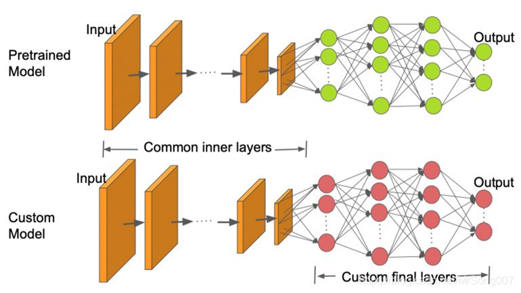
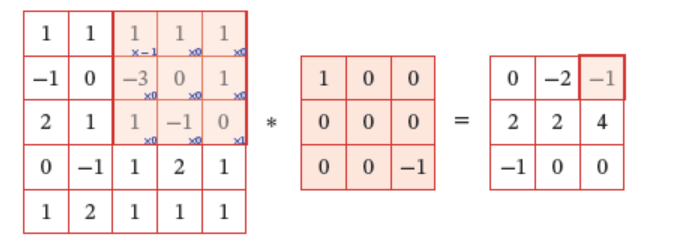
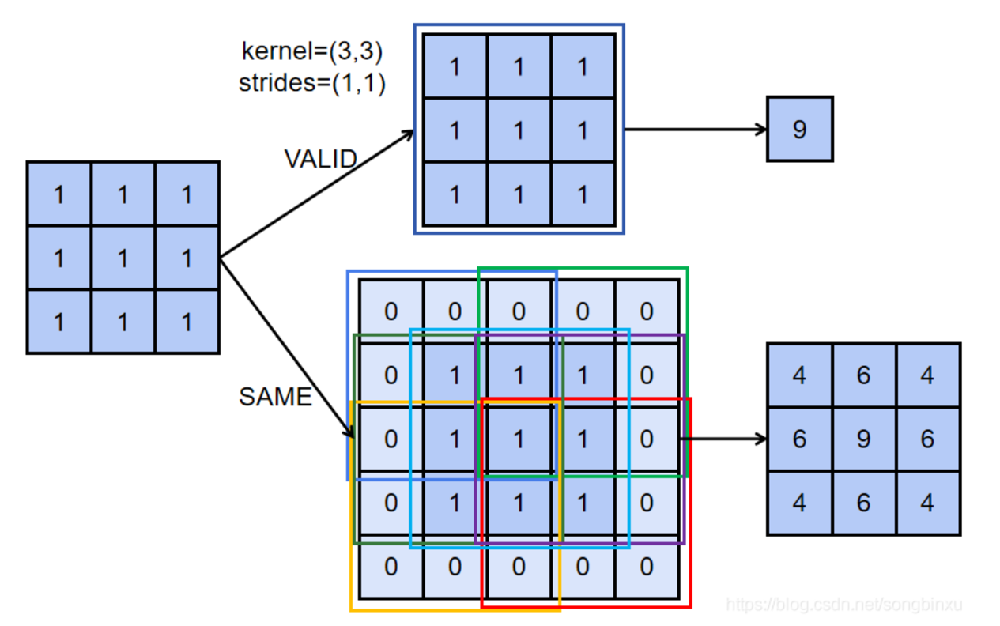
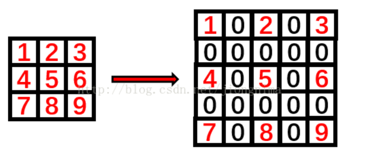
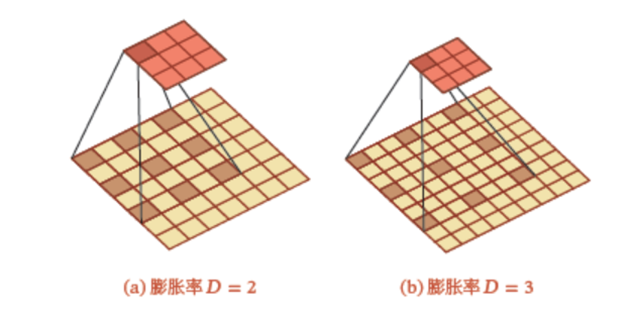
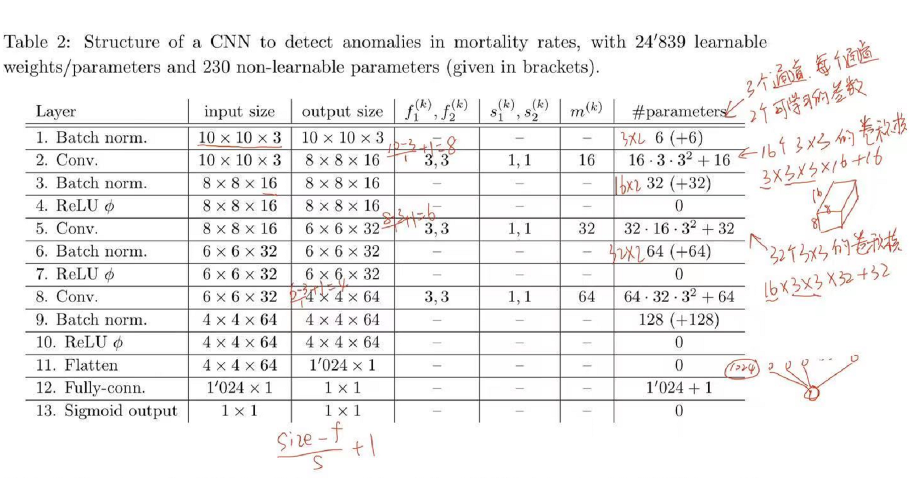
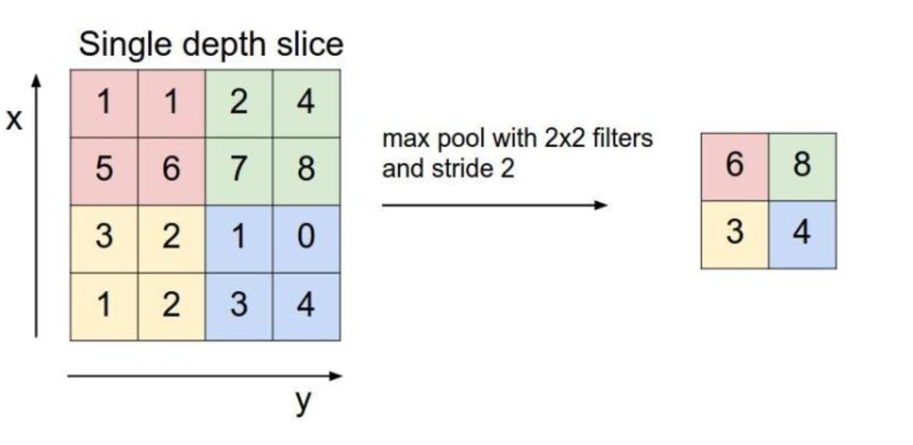
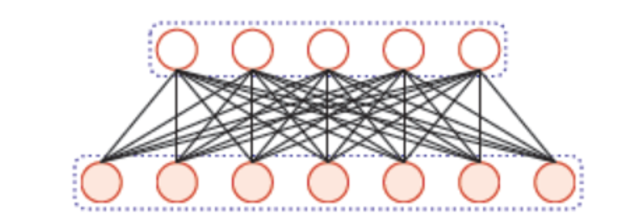
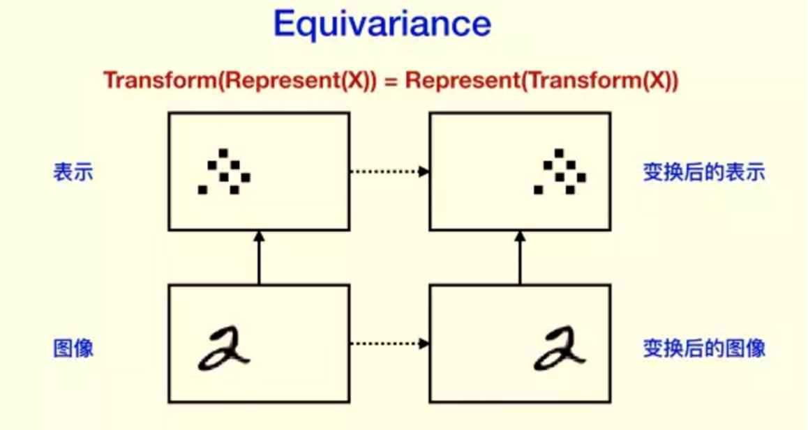
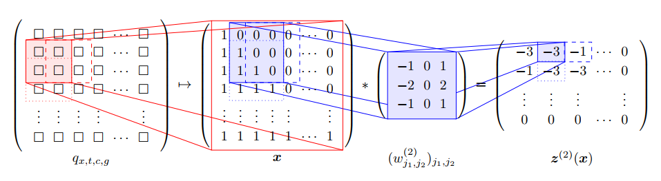

# 卷积神经网络 {#cnn}

<!-- *万淇、蔡清扬、高光远* -->

```{r setup, include=FALSE}
knitr::opts_chunk$set(eval = F)
```

深度学习之所以这么热，大部分归功于卷积神经网络在[计算机视觉](https://github.com/search?q=computer+vision&type=)上取得的巨大成功。卷积神经网络还可以用在自然语言处理、时间序列分析、异常检测、可穿戴设备与健康检测、GO。

校门口的人脸识别可以快速识别出学生老师校外人员，通常是否戴口罩、靠左靠右、离的远近等不会影响结果，但歪头经常难以被识别，这些和下面卷积神经网络的特性密切相关。

```{r,echo=F, eval=T, out.width="20%",fig.align = 'center',fig.cap="人大入口"}
knitr::opts_chunk$set(fig.pos = "!H", out.extra = "")

```

大型预先训练的CNNs库可用于图像识别：AlexNet，GoogLeNet，ResNet, Inception, MobileNet,，VGG， DenseNet,，NASNet 等。它们可以直接使用，将某一图像分类至已知的类别之中
也可以应用于迁移学习。

```{r,echo=F, eval=T, out.width="60%",fig.align = 'center',fig.cap="迁移学习"}
knitr::opts_chunk$set(fig.pos = "!H", out.extra = "")

```

## 卷积层 (Convolution)

作用：特征提取，一般想要多少特征，就设置多少个卷积核(filter)。不同的卷积核相当于不同的特征提取器.

计算过程如下图所示：
```{r,echo=F, eval=T, out.width="60%",fig.align = 'center',fig.cap="卷积运算"}
knitr::opts_chunk$set(fig.pos = "!H", out.extra = "")

```

### 超参数

一个卷积层主要有以下超参数

- Channels: 黑白图像一般只有一个通道，彩色图像一般有三个通道，即RGB.

- Filters: 一般想要多少特征，就设置多少个卷积核。不同的卷积核相当于不同的特征提取器.

- Padding: 补零。作用：保持图像大小，使之减小不会太快；还能照顾到边缘特征。
```{r,echo=F, eval=T, out.width="60%",fig.align = 'center',fig.cap="Padding"}
knitr::opts_chunk$set(fig.pos = "!H", out.extra = "")

```

- Dilation: 膨胀卷积（Dilated Convolution）也称为空洞卷积（Atrous Convolution）是一种不增加参数数量同时增加输出单元感受野的一种方法。空洞卷积通过给卷积核插入“空洞”来变相地增加其大小
```{r,echo=F, eval=T, out.width="40%",fig.align = 'center',fig.cap="Dilation kernal"}
knitr::opts_chunk$set(fig.pos = "!H", out.extra = "")


```
- Strides: 步长。卷积核每次滑动的步幅。


假设第$k-1$层输出图像的维度为$n_1^{(k-1)}\times n_2^{(k-1)}\times m^{(k-1)}$, 经过第$k$层的卷积运算，得到的图片维度为$n_1^{(k)}\times n_2^{(k)}\times m^{(k)}$。相关超参数总结如下：

| 特征      | 超参数    |
| :---:   | :----:    |
| 输入大小| $n_1^{(k-1)}\times n_2^{(k-1)}$ |
| 输入特征| $m^{(k-1)}$ |
| 输出特征(卷积核)| $m^{(k)}$ |
| **补零** | $p_1^{(k)},p_2^{(k)}$ |
| **膨胀**| $d_1^{(k)},d_2^{(k)}$ |
| **步长**| $s_1^{(k)},s_2^{(k)}$ |
| 输出大小| $n_1^{(k)}\times n_2^{(k)}$ |

其中，输出大小$n_1^{(k)}\times n_2^{(k)}$由输入大小$n_1^{(k-1)}\times n_2^{(k-1)}$和补零、膨胀、步长决定。

### 参数个数计算

下图为案例1中神经网络参数个数的计算。

```{r,echo=F, eval=T, out.width="70%",fig.align = 'center',fig.cap="Number of Parameters"}
knitr::opts_chunk$set(fig.pos = "!H", out.extra = "")

```

卷积层的输出大小计算公式为：$\frac{{n - f + 2p}}{s} + 1$，其中n为输入矩阵的大小，$f$为卷积核的大小，$p$为padding的大小，$s$为步长

池化层的输出大小计算公式为：$\frac{{n - f}}{s} + 1$，计算公式和卷积层实际上是一样的，只是池化层一般不进行填充，$p$一般为$0$。

参数个数的计算基于对层作用的理解，池化层是映射关系，故该层是没有可学习参数的；批标准化层有两个可学习的参数scale和shift；全连接层需要学习的参数一般为下接神经元的个数加上一个偏置；卷积层的可学习参数比较复杂，图像数据为例，一般为通道数×二维卷积的size×卷积核的个数+偏置个数

## 池化层 (Pooling)

也称下采样层，其作用是进行特征选择，降低特征数量，从而减少参数数量。在图像中，最主要作用就是压缩图像。池化层一般分为平均池化和最大池化。

```{r,echo=F, eval=T, out.width="60%",fig.align = 'center',fig.cap="Pooling"}
knitr::opts_chunk$set(fig.pos = "!H", out.extra = "")

```

## 批标准化层 (Batch Normalization)

在batch上进行标准化后再送入下一层，它可以防止梯度消失和梯度爆炸问题，加快收敛速度。主要分为两步：

1. 通过训练期间各批次的参数平均值和方差对输入进行移位和缩放。

2. 通过训练期间学习的后两个（可学习）参数进行移位和缩放。

Detailed Algorithm：

第一步仅根据批数据计算出的均值和方差，将数据进行标准化，完全基于批数据计算，故无需要学习的参数。

第一步的基本思想其实相当直观：因为深层神经网络在做非线性变换前的激活输入值会随着网络深度加深或者在训练过程中，其分布逐渐发生偏移或者变动，之所以训练收敛慢，一般是整体分布逐渐往非线性函数的取值区间的上下限两端靠近，所以这导致反向传播时低层神经网络的梯度消失，这是训练深层神经网络收敛越来越慢的本质原因，而BN就是通过一定的规范化手段，把每层神经网络任意神经元这个输入值的分布强行拉回到均值为0方差为1的标准正态分布，使之享受较大的梯度。

第二步是对第一步的改进，对第一步标准化后的x，增加了两个通过网络学习的参数scale和shift，对数据进行平移和缩放，即$y = scale*x + shift$。

设想如果每层都标准化到同一分布，那么数据每次进入网络都会是同一分布，这意味着网络的表达能力下降了，多层的网络的意义就下降了。所以BN为了保证非线性的习得，对变换后的满足均值为$0$方差为$1$的$x$又进行了scale加上shift操作。


## 其他组件

### 全连接层 (Dense)

全连接层中的每个神经元与其前一层的所有神经元进行全连接。
CNN中因为图像是二维的，所以在进入全连接层的时候需要经过一个Flatten（扁平化）的操作。
Flatten层作用就是通过重新排列维度并保留所有值的简单变换.

```{r,echo=F, eval=T, out.width="50%",fig.align = 'center',fig.cap="Dense layer"}
knitr::opts_chunk$set(fig.pos = "!H", out.extra = "")

```

### 输出神经元

即我们最后输出的结果，一般接在全连接层后。
案例一是生存率问题，结果取值在$[0,1]$中，所以使用sigmoid的函数对最后的值进行缩放。案例二是多分类的输出结果，所以使用softmax函数进行输出。


### 激活函数 (Activation)

在上面讨论的网络层（卷积层、池化层和全连接层）中，所有的操作其实都是线性的，但只有使用非线性激活，网络建模的全部威力才会发挥出来。常用的非线性激活函数有：ReLU、sigmoid、tanh等

```{r,echo=F, eval=T, out.width="60%",fig.align = 'center',fig.cap="Activation Functions"}
x<-seq(-3,3,0.1)
y1<-function(x) 1/(1+exp(-x))
y2<-function(x) tanh(x)
y3<-function(x) pmax(0,x)
par(mfrow=c(1,1),pty="s")
matplot(x,cbind(y1(x),y2(x)),type="l",lwd=2,lty=1:2,col=1,xlab="x",ylab="activation")
lines(x,y3(x),lwd=2,lty=3)
abline(h=c(-1,1,0),lty=2,lwd=.5)
abline(v=0,lty=2,lwd=.5)
legend("bottomright",c("sigmoid","tanh","relu"),lty=1:3,lwd=c(2,2,2))
```

## 特性

### 平移不变性

由于卷积核对于特定的特征才会有较大激活值，且应用到不同的位置，所以不论上一层特征图谱（feature map）中的某一特征平移到何处，卷积核都会找到该特征并在此处呈现较大的激活值。这就是“等变性”

```{r,echo=F, eval=T, out.width="50%",fig.align = 'center',fig.cap="Shift invariance"}
knitr::opts_chunk$set(fig.pos = "!H", out.extra = "")

```

### 旋转不变性

旋转不变性常见于卫星图像识别中，如桥梁定位、洪水面积估计等。但在手写识别中，旋转不变性不满足。

### 尺度不变性

在手写识别中，尺度不变性满足。

## 隐藏层可视化

神经网络每层提取一个细节特征，一般层数越深，细节特征越不明显，可视化后明显看出前几层特征比较明显，后面的层数就已经看不清数字了。


## 逆卷积

逆卷积相对于卷积在神经网络结构的正向和反向传播中做相反的运算。卷积是提取特征，使图像变小。反卷积可以使得图像可以变大。反卷积的大小是由卷积核大小与滑动步长决定， $in$是输入大小， k是卷积核大小， $s$是滑动步长， $out$是输出大小。计算公式为 $out = (in - 1) * s + k$

## [Human Mortality Database (HMD)](https://www.mortality.org)

**目标**: 根据死亡率表的局部特征($10\times10$)，检测该局部异常死亡率强度。

### 输入和标签

死亡率$q_{x,t,c,g}$、人口数量$E_{x,t,c,g}$

- 年龄$x$, 日历年$t$, 国家$c$, 性别$g$.

- 由于领土的变化，某些年的数据会出现变更前与变更后的的两个数据，处理方式是取平均值作为最后的研究数据。

- 某些死亡率数据存在缺失：如果相邻(以年龄$x$和日历年$t$)值可用，我们线性插补，否则使用最近邻的值进行插补。

- 假定没有人口的迁移以及其他的误差：$$E_{x,t,c,g}=E_{x-1,t-1,c,g}(1-q_{{x-1},{t-1},c,g})$$

- 定义标准化残差: $$r_{x,t,c,g}=\frac{E_{x,t,c,g}-E_{x-1,t-1,c,g}(1-q_{x-1,t-1,c,g})}{E_{x,t,c,g}}$$

- $r_{x,t,c,g}<0$表明可能有人口迁出或者数据错误， $r_{x,t,c,g}>0$表明可能有人口迁入或者数据错误。

经过预处理HMD，对每个国家每个性别我们得到一个关于死亡率$q_{x,t,c,g}$的二维数组，其中行代表不同日历年，列代表不同年龄。为了检测死亡率的异常值，我们考虑死亡率的局部变化特征，使用大小为$10\times10$的窗口在死亡率二维数组上进行移动，并设置步长为$5$。可以得到死亡率的局部矩阵$(q_{x,t,c,g})_{x_i<x\le x_i+10, t_i<t\le t_i+10}$, 其中$x_i:=20+5i,t_i=1950+5i$。我们定义如下(原始)输入特征$W_{i,c}\in\mathbb{R}^{10\times 10\times 3}$:
$$
\begin{aligned}
W_{i,c,\cdot,\cdot,1}:=&(\text{logit}(q_{x,t,c,males}))_{x_i<x\le x_i+10, t_i<t\le t_i+10}\\
W_{i,c,\cdot,\cdot,2}:=&(\text{logit}(q_{x,t,c,females}))_{x_i<x\le x_i+10, t_i<t\le t_i+10}\\
W_{i,c,\cdot,\cdot,3}:=&W_{i,c,\cdot,\cdot,1}-W_{i,c,\cdot,\cdot,2}
\end{aligned}
$$ 
其中, $\text{logit }q =\log \frac{q}{1-q}$

```{r,echo=F, eval=T, out.width="60%",fig.align = 'center',fig.cap="Mortality Window"}
knitr::opts_chunk$set(fig.pos = "!H", out.extra = "")

```

然后分别对三个通道进行正则化, 得到$\boldsymbol{X}_{i,c}\in[0,1]^{10\times10\times3}$. 通过对所有国家进行如上处理, 可以得到大约$4000$张图像.

接下来, 我们定义每张图的"标签". 首先, 对$r_{x,t,c,g}$进行MinMax正则化处理, 得到$\bar{r}_{x,t,c,g}\in[0,1].$ 然后, 定义标签为**异常强度**
$$Y_{i,c}:=\underset{x_i<x\le x_i+10, t_i<t\le t_i+10}{\max} \left|\frac{\bar{r}_{x,t,c,males}+\bar{r}_{x,t,c,females}}{2} \right|\in[0,1].$$

我们的目标是基于死亡率在大小为$10\times10$上的局部特征, 预测该范围内死亡率的异常强度.
在训练神经网络时, 选取均方误差损失函数$$\mathcal{L}(Y,\hat{\mu}(\boldsymbol{X});\mathcal{I}):=\frac{1}{|\mathcal{I}|}\sum_{(i,c)\in\mathcal{I}}(Y_{i,c}-\hat{\mu}(\boldsymbol{X}_{i,c}))^2.$$

### 评估指标

在评估模型时, 我们通过如下步骤定义二分类AOC指标:

1. 定义伯努利随机变量
$$
b_{i,c}:=
\begin{cases}
1, Y_{i,c}\geq q_{0.95}(Y), \\
0, \text{otherwise},
\end{cases}
$$
其中, $q_{0.95}(Y)$为所有因变量$Y_{i,c}$的0.95分位数, 即$b_{i,c}$为"非常异常"指示标量.

2. 把神经网络的输出结果$\hat{\mu}(\boldsymbol{X}_{i,c})$当作概率$\Pr (b_{i,c}=1)$的预测.

3. 画出该二分类问题的receiver operating characteristic curve (ROC), 并计算 area under the curve (AUC).

利用以上模型评估方法, 我们可以对国家按照"异常强度"的相似性进行分类, 具体步骤如下:

1. 对每个国家$c$分别建立CNN模型, 并使用该模型对其他国家$c^*$的数据进行预测, 计算AUC $A_{c,c^*}$. 并建立矩阵$A=(A_{c,c^*})_{c,c*\in\mathcal{C}}$, 其中$\mathcal{C}$为所有国家的集合.

2. 对$A$进行列标准化, 并进行奇异值分解, 得到前两个主成分$P_{j,c}, j=1,2$.

3. 对主成分$P_{j,c}, j=1,2$进行聚类, 得到4个簇.

## MNIST dataset

**目标**: 对手写$0-9$进行分类。

MNIST 全称为 Modified National Institute of Standards and Technology. 修改过后的MNIST数据集，它是一个由不同的人的手写体数字组成的图片数据集，包含了$7$万张关于手写数字$0,1,\ldots,9$的图像，格式为$28×28$的灰度像素。

神经网络的输入为由灰度像素构成的$28\times28$数组$\boldsymbol{X}\in[0,1]^{28\times28}$, 输出为在$\{0,1,\ldots,9\}$上的离散分布$(p_0,\ldots,p_9)^T$, 其中$\sum_{j=0}^9p_j=1$. 图像的标签为实际数字的one-hot编码$Y\in\{0,1\}^{10}$.
损失函数为交叉熵(cross-entropy)
$$\mathcal{L}(Y,\hat{p}(\boldsymbol{X});\mathcal{I}):=-\sum_{i\in\mathcal{I}}\sum_{j=0}^9Y_{i,j}\log\hat{p}_j(\boldsymbol{X}_i).$$
