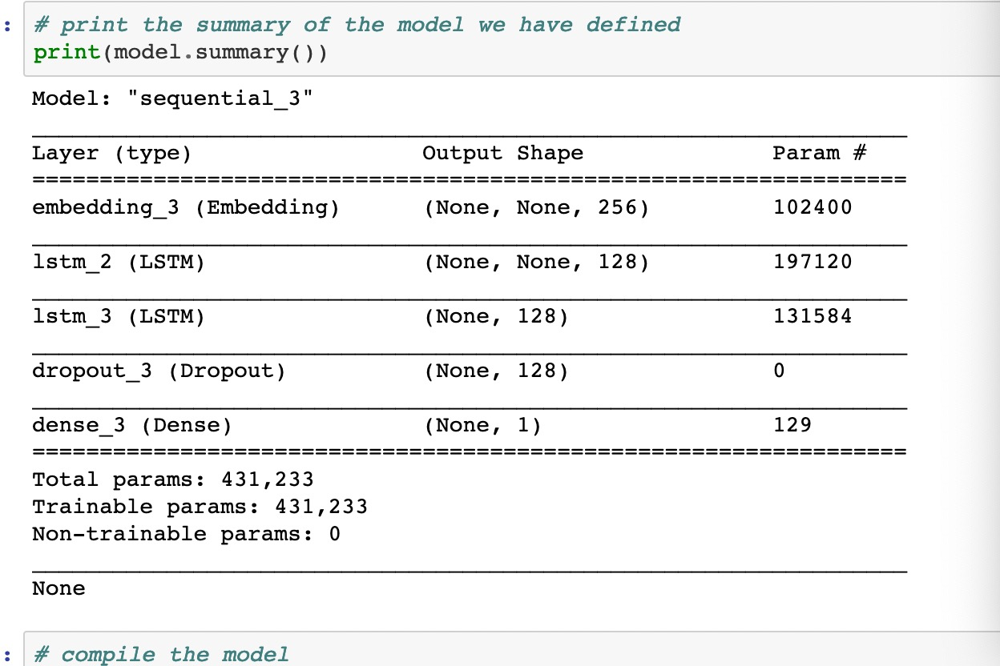
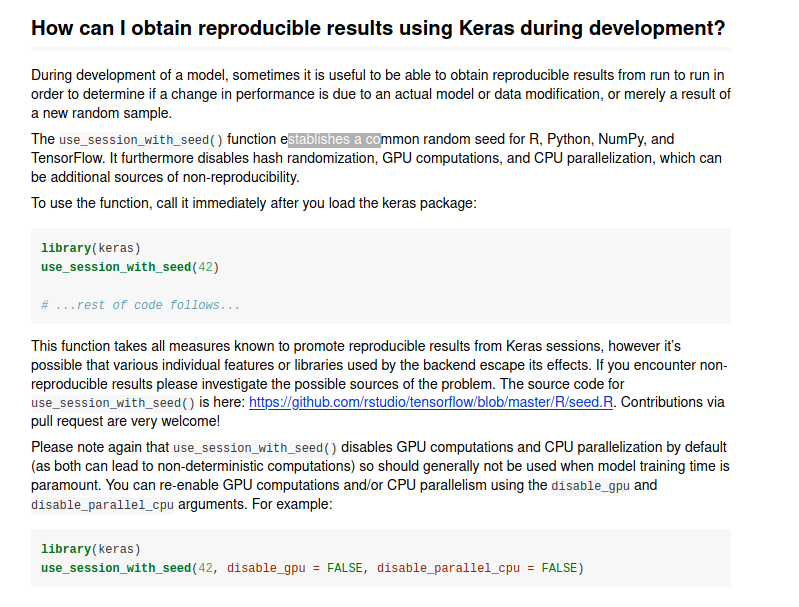
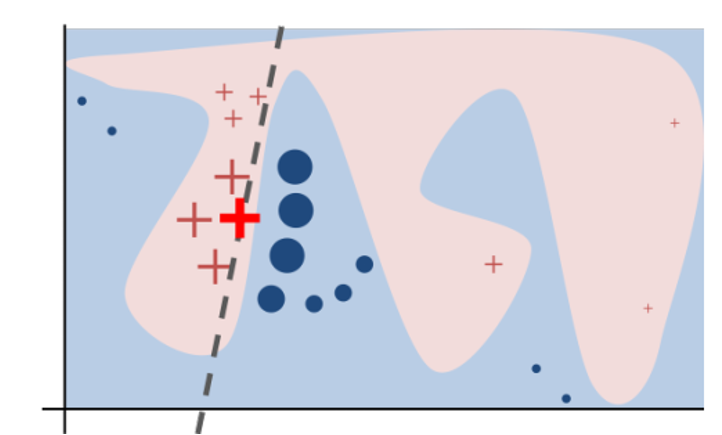
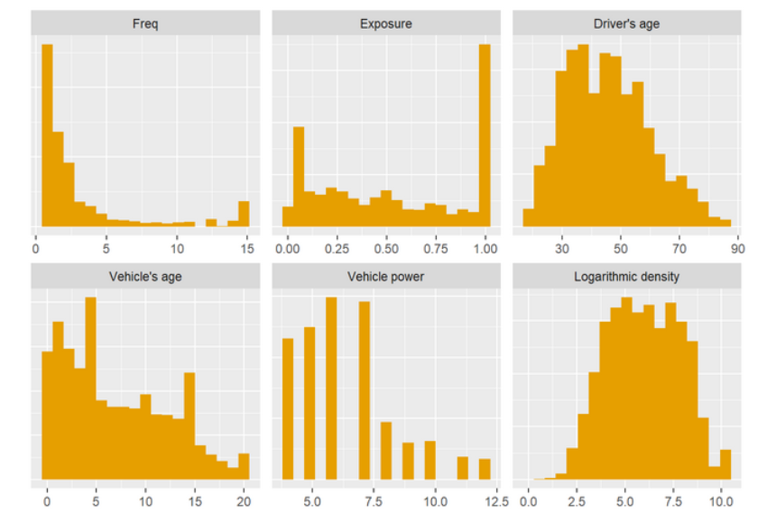
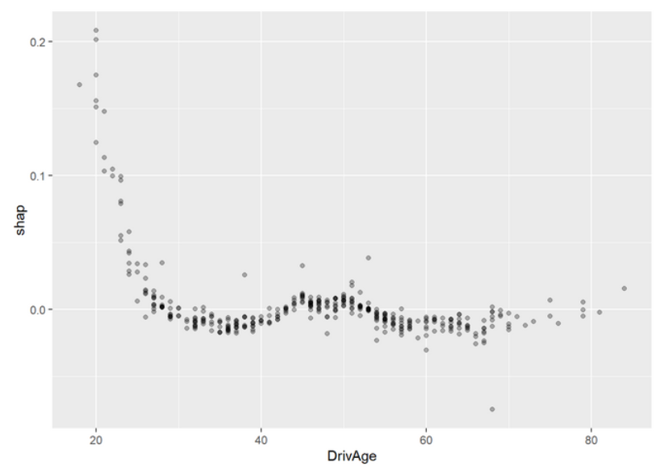

--- 
title: "现代精算统计模型"
author: "Modern Actuarial Models"
date: "2021-01-10 15:04:13"
site: bookdown::bookdown_site
output: bookdown::gitbook
documentclass: book
bibliography: [_reference.bib]
biblio-style: apalike
link-citations: yes
github-repo: sxpyggy/Modern-Actuarial-Models
description: "The output format is bookdown::gitbook."
editor_options: 
  chunk_output_type: console
---

# 👨‍🏫 欢迎  {-}

《现代精算统计模型》主要讲述如何使用统计学习和机器学习算法，提升传统的精算统计模型或者解决新的精算问题。这门课主要参考瑞士精算师协会发布的[“精算数据科学”](https://actuarialdatascience.org)，该教程的主要目的是“为精算师提供一个对数据科学全面且易懂的介绍”，该教程提供了多篇方法性文章并开源代码，这样“读者可以相对容易地把这些数据科学方法用在自己的数据上”。

我们建议大家仔细阅读以下文献，尝试并理解[所有代码](https://github.com/JSchelldorfer/ActuarialDataScience)。此网站将作为该课程的辅助，为大家答疑，总结文献，并对文献中的方法做扩展。该网站由授课老师高光远和助教张玮钰管理，欢迎大家反馈意见到助教、微信群、或邮箱 <guangyuan.gao@ruc.edu.cn>。

## 🤔 答疑{-}

我定期把同学们的普遍疑问在这里解答，欢迎提问！

**👉 Tensorflow for Apple M1**  (2020/12/23)

购买Apple M1的同学需要用这个[pre-release tensorflow](https://github.com/apple/tensorflow_macos)，从pypi下载的tensorflow暂不支持Apple M1

**👉 NLP**  (2020/12/18)

数据


这个数据第$i$行$j$列表示，在第$i$个评论中第$j$个词的排名(依照总出现频率)，所以每一行还保持了句子中词语的先后顺序。每一行都是一个时间序列数据（样本）。

LSTM



- `input`维度是`batch size * length * 1`，即以上所示的.csv矩阵文档。

- `embedding_3` 作用就是把`input`的最后一个维度爆炸到256，参数个数为`vocab_size* embedding dimension`，可以看作把400个高频词映射到256维空间。

- `embedding_3`和`lstm_2`输出维度中，有两个`none`,其中第一个表示`batch size`, 第二个表示`sequence length`。因为LSTM在时间维度上循环使用参数，所以`sequence length`不影响参数的个数。

- `sequence length`不影响参数个数，对于不同的句子长度如100或者150，该模型都不需要调整，(应该)可以直接载入数据训练。

- `lstm_3` 只有一个`none`, 表示`batch size`, 我们要求`lstm_3`不返回整个sequence只看最近的状态。

**👉 Reproducible results using Keras** (2020/12/11)

使用Keras复现结果的方法。

<https://cran.r-project.org/web/packages/keras/vignettes/faq.html>



**👉 为什么不直接用relu解决vanishing gradient 而设计复杂的lstm gru** (2020/12/11)

- relu值域在0到无穷，不如tanh和sigmoid稳健，后两种可以认为把极大极小值都截断了。

- relu是线性变换，可能描述不了非线性效应。我最常用tanh。

- 当然，使用relu会明显提升计算速度，因为relu的导数容易计算。

另参见[stackexchange](https://datascience.stackexchange.com/questions/61358/relu-for-combating-the-problem-of-vanishing-gradient-in-rnn#:~:text=For%20solving%20the%20problem%20of%20vanishing%20gradients%20in,In%20both%20of%20these%2C%20activation%20function%20is%20tanh.)

**👉 xaringan** (2020/12/06)

html格式的slides：
<https://slides.yihui.org/xaringan/zh-CN.html#1>

**👉 samme.r** (2020/11/27)

关于samme.r算法, 请参考下面文章中的exponential loss function.
<https://web.stanford.edu/~hastie/Papers/samme.pdf>

算法samme.r仅在以上draft中出现，正式发表时samme.r被删掉了，推测审稿人有异议。正式文章参考
<http://ww.web.stanford.edu/~hastie/Papers/SII-2-3-A8-Zhu.pdf>

**👉 随机种子数** (2020/11/20)

输入`RNGversion("3.5.0"); set.seed(100)`，使得你的随机种子数和paper的相同，模型结果相近。

**👉 MAC OS, Linux, WIN** (2020/11/16)

据观察，在MAC OS和Linux系统下安装`keras`成功的比例较高。WIN系统下，Python各个包的依赖以及和R包的匹配有一定的问题，今天是通过更换镜像源解决了R中无法加载`tensorflow.keras`模块的问题，推测是TUNA源中WIN包依赖关系没有及时更新。

为了解决镜像源更新延迟、或者tensorflow版本过低的问题，这里共享WIN下经测试的[conda环境](https://www.jianguoyun.com/p/DcwPgUgQ3cTHBhi1-s0D)配置。下载该文档，从该文档所在文件夹启动命令行，使用命令`conda env create --name <env> --file filename.yaml`，安装该conda环境。在R中使用`reticulate::use_condaenv("<env>",required=T)`关联该环境。

另外，可下载MAC OS系统下经测试的[conda环境](https://www.jianguoyun.com/p/DYethK4Q3cTHBhjr4s0D)配置。可通过`conda env create --name <env> --file filename.yaml`安装。

**👉  CASdatasets** (2020/11/13)

源文件在<http://cas.uqam.ca/>，但下载速度很慢，我把它放在[坚果云共享](https://www.jianguoyun.com/p/DdFyh74Q3cTHBhio2M0D)。下载后选择install from local archive file。

**👉  微信群** (2020/11/08)


## 🗓️ 课程安排 {-}


以下安排为初步计划，根据大家的需求和背景，我们可能要花更多的时间在某些重要的方法及其在精算上的应用。

- 第10周：

  准备工作。

- 第11周: 
  
  1 - French Motor Third-Party Liability Claims 
    
  <https://papers.ssrn.com/sol3/papers.cfm?abstract_id=3164764>

- 机动

  2 - Inisghts from Inside Neural Networks
    
  <https://papers.ssrn.com/sol3/papers.cfm?abstract_id=3226852>

  3 - Nesting Classical Actuarial Models into Neural Networks
  
  <https://papers.ssrn.com/sol3/papers.cfm?abstract_id=3320525>

- 第12周：

  4 - On Boosting: Theory and Applications
    
    <https://papers.ssrn.com/sol3/papers.cfm?abstract_id=3402687>
  
- 第13周：

  5 - Unsupervised Learning: What is a Sports Car
  
  <https://papers.ssrn.com/sol3/papers.cfm?abstract_id=3439358>
  
- 第14周：

  6 - Lee and Carter go Machine Learning: Recurrent Neural Networks
  
  <https://papers.ssrn.com/sol3/papers.cfm?abstract_id=3441030>

- 第15周：

  7 - The Art of Natural Language Processing: Classical, Modern and Contemporary Approaches to Text Document Classification
  
  <https://papers.ssrn.com/sol3/papers.cfm?abstract_id=3547887>

- 第16周：

  8 - Peeking into the Black Box: An Actuarial Case Study for Interpretable Machine Learning 
  
  <https://papers.ssrn.com/sol3/papers.cfm?abstract_id=3595944>

- 第17周：

  9 - Convolutional neural network case studies: (1) Anomalies in Mortality Rates (2) Image Recognition 
  
  <https://papers.ssrn.com/sol3/papers.cfm?abstract_id=3656210>


<!--chapter:end:index.Rmd-->

# 简介 {- #intro}


保险公司为社会中某些不可预知的经济损失带来了保障。保险公司承担了被保险人的不确定经济损失的风险，被保险人获得了保障，保险公司获得了保费。

通常，保险公司需要在保单的保险期限开始时确定保费，即在保险损失还未发生时确定保费。由于这种定价方式，保险产品和一般消费产品的生产周期相反，服从逆生产周期。

因此，**预测模型**在保险产品的定价中有广泛的应用。

计算机技术的发展带来了计算速度的极大提升和存储能力的极大提高，可以看到当前很多领域的发展都和计算机技术的革新密切相关。

**机器学习算法**作为一种预测模型，给传统的**精算回归模型**带来了挑战和机遇。

1. 机器学习算法的预测能力相较于传统回归模型更高;

2. 机器学习算法的解释性比较差。

基于机器学习算法的定价模型有助于保险公司**细分风险**，精确定价，减少*逆选择*风险。

- 假设保险公司A在定价中没有考虑到某个重要的风险因子，即对于是否有该类风险的被保险人都收取相同保费；而保险公司B在定价中考虑到该风险因子。

- 保险公司B会凭借低保费吸引低风险客户，凭借高保费使得高风险客户留在保险公司A。

- 由于被保险人的选择效应，最终保险公司A收取的保费不足以支付被保险人的损失，或者难以获取预期的保险收益。

另一方面，保险公司承担着风险转移和风险共担的社会角色，过度的细分风险会造成风险个体化，使得保险公司的风险转移和共担的作用消失。
比如，基于被保险人的高风险特征，保险公司会收取极高的保费，使得被保险人的风险转移价值荡然无存，也没有购买保险的动力。
所以，保险公司需要平衡**风险细分和风险共担**，使得保险公司既可以避免逆选择，也能提供有效的风险转移的保险产品。

一般地，保险定价模型受到保险监管机构的严格约束，这些模型在应用到实际中时，必须满足一定的条件。这给机器学习算法在保险定价中的应用带来了很多阻碍。

- 在中国，保监会限定了商业车险保费的区间，随着商业车险费率改革，这个区间在不断扩大，保险公司的定价模型发挥的作用越来越大。

- European Union's General Data Protection Regulation (2018) 建立了algorithmic accountability of decision-making machine algorithms制度，该制度赋予了参与者对于机器学习算法背后逻辑的知情权。

总之，定价模型必须在一定程度上可以解释给被保险人、保险监管机构等。从被保险人和保险监管的角度出发，他们也希望产品定价和风险管理是建立在一个较透明的模型而不是一个黑盒子，这样有利于维护市场公平、保障被保险人的利益、检测重要风险因子、建立防范风险措施。


<!--chapter:end:00-introduction.Rmd-->

# 准备工作 {#pre}

“工欲善其事，必先利其器。”

在以下步骤中，当你发现安装非常慢时，可以尝试4G网络，尝试VPN，尝试改变CRAN的镜像源，或尝试改变conda的镜像源。conda镜像源通过修改用户目录下的`.condarc`文件使用[TUNA镜像源](https://mirrors.tuna.tsinghua.edu.cn/help/anaconda/)，但该镜像源可能有更新延迟。

## 常用链接

准备工作中常用的链接有

- [GitHub](https://github.com/JSchelldorfer/ActuarialDataScience)

- [Git](https://git-scm.com/)

- [SSH key](https://docs.github.com/cn/free-pro-team@latest/github/authenticating-to-github/connecting-to-github-with-ssh)

- [GitHub and RStudio](https://resources.github.com/whitepapers/github-and-rstudio/)

- [Jupyter Notebook](https://jupyter.org/)

- [Anaconda](https://mirrors.tuna.tsinghua.edu.cn/anaconda/archive/)

- [Miniconda](https://mirrors.tuna.tsinghua.edu.cn/anaconda/miniconda/?C=N&O=D)

- [常用Conda命令](https://docs.conda.io/projects/conda/en/latest/commands.html#)

- [TUNA镜像源](https://mirrors.tuna.tsinghua.edu.cn/help/anaconda/)

- [R interface to Tensorflow and Keras](https://keras.rstudio.com/)

- [reticulate](https://cran.r-project.org/web/packages/reticulate/)

- [Tensorflow](https://tensorflow.google.cn/)

- [Pytorch](https://pytorch.apachecn.org/)

- [校级计算云](https://cc.ruc.edu.cn/home)

- [CUDA](https://developer.nvidia.com/cuda-toolkit-archivE)

- [cuDNN](https://developer.nvidia.com/rdp/form/cudnn-download-survey)

## 克隆代码

[GitHub](https://github.com/)提供了大量开源代码，这门课的代码主要来自[此链接](https://github.com/JSchelldorfer/ActuarialDataScience)。通常，使用GitHub开源代码最方便的是`fork`到自己GitHub账户下，然后`clone`到本地。具体而言，需要进行以下操作：

1. 注册GitHub账户。

2. `Fork`[此链接](https://github.com/JSchelldorfer/ActuarialDataScience)到自己账户下的新仓库,可重新命名为如`Modern-Actuarial-Models`或其他名称。

3. 安装[git](https://git-scm.com/)。在命令窗口使用`$ git config --global user.name "Your Name"` 和 `$ git config --global user.email "youremail@yourdomain.com"` 配置git的用户名和邮箱分别为GitHub账户的用户名和邮箱。最后可使用`$ git config --list`查看配置信息。

4. (选做)在本地电脑创建ssh public key，并拷贝到GitHub中`Setting`下`SSH and GPG keys`。ssh public key一般保存在本人目录下的隐藏文件夹.ssh中，扩展名为.pub。详见[链接](https://docs.github.com/cn/free-pro-team@latest/github/authenticating-to-github/connecting-to-github-with-ssh)。设立SSH可以避免后续`push`代码到云端时，每次都需要输入密码的麻烦

5. 电脑连接手机4G热点。一般地，在手机4G网络下克隆的速度比较快。

6. 在RStudio中创建新的项目，选择Version Control，然后Git，在Repository URL中输入你的GitHub中刚才`fork`的新仓库地址（在`Code`下能找到克隆地址，如果第4步完成可以选择SSH地址，如果第4步没完成必须选择HTTPS地址），输入文件夹名称，选择存放位置，点击`create project`，RStudio开始克隆GitHub上该仓库的所有内容。 

7. 此时，你在GitHub上仓库的内容全部克隆到了本地，且放在了一个R Project中。在该Project中，会多两个文件，.Rproj和.gitignore，第一个文件保存了Project的设置，第二文件告诉git在`push`本地文件到GitHub时哪些文件被忽略。

8. 如果你修改了本地文件，可以通过R中内嵌的Git上传到GitHub（先`commit`再`push`），这样方便在不同电脑上同步文件。git是代码版本控制工具，在`push`之前，你可以比较和上个代码版本的差异。GitHub记录了你每次`push`的详细信息，且存放在本地文件夹.git中。同时，如果GitHub上代码有变化，你可以`pull`到本地。如果经常在不同电脑上使用本仓库，一般需要先`pull`成最新版本，然后再编辑修改，最后`commit-push`到GitHub。

9. (选做) 你可以建立新的`branch`，使自己的修改和源代码分开。具体操作可参考[链接](https://resources.github.com/whitepapers/github-and-rstudio/)，或者参考账户建立时自动产生的`getting-started`仓库。

10. (选做) 你可以尝试[Github Desktop](https://desktop.github.com/)或者[Jupyter Lab](https://jupyter.org/)（加载git extension）管理，但对于这门课，这两种方式不是最优。

理论上，GitHub上所有仓库都可以采用以上方法在RStudio中管理，当然，RStudio对于R代码仓库管理最有效，因为我们可以直接在RStudio中运行仓库中的代码。

## R interface to Keras

这里主要说明`keras`包的安装和使用。[Keras](https://keras.rstudio.com/)是tensorflow的API，在keras中建立的神经网络模型都由tensorflow训练。安装`keras`包主要是安装Python库tensorflow，并让R与之相关联。

### R自动安装

最简单的安装方式如下：

1. 使用`install.packages("tensorflow")`安装所有相关的包，然后`library("tensorflow")`。

2. `install_tensorflow()`

    这时大概率会出现

    ```
    No non-system installation of Python could be found.
    Would you like to download and install Miniconda?
    Miniconda is an open source environment management system for Python.
    See https://docs.conda.io/en/latest/miniconda.html for more details.
    Would you like to install Miniconda? [Y/n]:
    ```
  
    虽然你可能已经有Anaconda和Python，但R没有“智能”地识别出来，这时仍建议你选`Y`，让R自己装一下自己能更好识别的`Miniconda`, 这个命令还会自动建立一个独立conda环境`r-reticulate`，并在其中装好`tensorflow, keras`等。
  
3. 上步如果正常运行，结束后会自动重启R。这时你运行`library(tensorflow)`然后`tf$constant("Hellow Tensorflow")`，如果没报错，那继续`install_packages("keras")`,`library("keras")`。

    用以下代码验证安装成功

    
    ```r
    model <- keras_model_sequential() %>% 
    layer_flatten(input_shape = c(28, 28)) %>% 
    layer_dense(units = 128, activation = "relu") %>% 
    layer_dropout(0.2) %>% 
    layer_dense(10, activation = "softmax")
    summary(model)
    ```

    如果出现以下错误

    ```  
    错误: Installation of TensorFlow not found.
    Python environments searched for 'tensorflow' package:
    C:\Users\...\AppData\Local\r-miniconda\envs\r-reticulate\python.exe
    You can install TensorFlow using the install_tensorflow() function.
    ```
  
    这个错误通常是由于`r-reticulate`中`tensorflow`和其他包的依赖关系发生错误，或者`tensorflow`版本太低，你可以更换镜像源、使用conda/pip install调整该环境中的`tensorflow`版本和依赖关系。
  
    更好的方式是在conda下安装好指定版本的`tensorflow`然后关联到R，或者用其他方式让R找到其他方式安装的`tensorflow`。这时，你先把之前失败的安装`C:\Users\...\AppData\Local\r-miniconda`，这个文件夹完全删掉。然后参考以下安装步骤。
  
### 使用reticulate关联conda环境

1. 下载并安装[Anaconda](https://mirrors.tuna.tsinghua.edu.cn/help/anaconda/)或者[Miniconda](https://docs.conda.io/en/latest/miniconda.html)。

2. 运行`Anaconda Prompt`或者`Anaconda Powershell Prompt`，在命令行输入`conda create -n r-tensorflow tensorflow=2.1.0`，conda会创建一个独立的`r-tensorflow`环境，并在其中安装`tensorflow`包。

3. 继续在命令行运行`conda activate r-tensorflow`加载刚刚安装的环境，并`pip install h5py pyyaml requests Pillow scipy`在该环境下安装`keras`依赖的包。至此，R需要的tensorflow环境已经准备好，接下来让R关联此环境。

4. 重启R，`library("reticulate")`然后`use_condaenv("r-tensorflow",required=T)`,这时R就和上面建立的环境关联好。

5. `library("keras“)`。这里假设你已经装好`tensorflow`和`keras`包。

    用以下代码验证安装成功
    
    
    ```r
    model <- keras_model_sequential() %>% 
    layer_flatten(input_shape = c(28, 28)) %>% 
    layer_dense(units = 128, activation = "relu") %>% 
    layer_dropout(0.2) %>% 
    layer_dense(10, activation = "softmax")
    summary(model)
    ```
 
### 指定conda安装

1. 下载并安装[Anaconda](https://mirrors.tuna.tsinghua.edu.cn/help/anaconda/)或者[Miniconda](https://docs.conda.io/en/latest/miniconda.html)。

2. 命令行输入`which -a python`，找到Anaconda中Python的路径记为`anapy`。

3. R中`install_packages("tensorflow")`，然后

    
    ```r
    install_tensorflow(method = "conda", conda = "anapy", envname = "r-tensorflow", version = "2.1.0")
    ```
    
    此命令会在conda下创建`r-tensorflow`的环境并装好tensorflow包。
  
4. `install_packages("keras"); library("keras")`

    用以下代码验证安装成功
    
    
    ```r
    model <- keras_model_sequential() %>% 
    layer_flatten(input_shape = c(28, 28)) %>% 
    layer_dense(units = 128, activation = "relu") %>% 
    layer_dropout(0.2) %>% 
    layer_dense(10, activation = "softmax")
    summary(model)
    ```

### 使用reticulate安装

1. 重启R，`library("reticulate")`。

2. `options(timeout=300)`，防止下载时间过长中断。

3. `install_miniconda()`，将会安装`miniconda`并创建一个`r-reticulate`conda环境。此环境为R默认调用的Python环境。

4. （重启R）`library("tensorflow"); install_tensorflow(version="2.1.0")`，将会在`r-reticulate`安装`tensorflow`。

5. `install_packages("keras"); library("keras")`

    用以下代码验证安装成功
    
    
    ```r
    model <- keras_model_sequential() %>% 
    layer_flatten(input_shape = c(28, 28)) %>% 
    layer_dense(units = 128, activation = "relu") %>% 
    layer_dropout(0.2) %>% 
    layer_dense(10, activation = "softmax")
    summary(model)
    ```

## R interface to Python

R包`reticulate`为`tensorflow`的依赖包，当你装`tensorflow`它也被自动安装。它可以建立R与Python的交互。

### reticulate 常见命令

- `conda_list()`列出已安装的conda环境

- `virtualenv_list()`列出已存在的虚拟环境

- `use_python, use_condaenv, use_virtualenv`可以指定与R关联的python。

- `py_config()`可以查看当前Python关联信息。

很多时候，R会创建一个独立conda环境`r-miniconda/envs/r-reticulate`。

### 切换R关联的conda环境

根据需要，你可以切换R关联的conda环境。具体步骤为

1. 重启R

2. `library("reticulate")`

3. `conda_list()`列出可以关联的环境和路径。

4. `use_condaenv("env-name")`。`env-name`为关联的conda环境。

5. `py_config`查看是否关联成功。

## Python

一般在每个Python（Conda）环境都需要安装一个Jupyter Notebook (conda install notebook)。

### Conda环境

Python（conda）环境建立比较简单，在`使用reticulate关联conda环境`我们已经建立过一个环境`r-tensorflow`。具体操作如下:

1. 建立独立环境`conda create -n env-name python=3.8 tensorflow=2.1.0 notebook`。该命令会建立`env-name`的环境，并在其中安装`python=3.8`,`tensorflow`，`notebook`包及其依赖包。

2. 激活环境`conda activate env-name`.

3. cd 到你的工作目录。

4. 启动jupyter notebook `jupyter notebook`。

5. 如遇到缺少的包，在该环境`env-name`下使用`conda install ***`安装缺少的包。

### 常用的Conda命令

- `conda create -n env-name2 --clone env-name1`:复制环境

- `conda env list`：列出所有环境

- `conda deactivate`：退出当前环境

- `conda remove -n env-name --all`：删除环境`env-name`中的所有包

- `conda list -n env-name`: 列出环境`env-name`所安装的包

- `conda clean -p`：删除不使用的包

- `conda clean -t`：删除下载的包

- `conda clean -a`：删除所有不必要的包

- `pip freeze > pip_pkg.txt`, `pip install -r pip_pkg.txt` 保存当前环境PyPI包版本，从文件安装PyPI包（需同系统）

- `conda env export > conda_pkg.yaml`, `conda env export --name env_name > conda_pkg.yaml`, `conda env create --name env-name2 --file conda_pkg.yaml` 保存当前/env-name环境所有包，从文件安装所有包（需同系统）

- `conda list --explicit > spec-list.txt`, `conda create --name env-name2 --file spec-list.txt` 保存当前环境Conda包下载地址，从文件安装Conda包（需同系统）

- `conda list --export > spec-list.txt`, `conda create --name env-name2 --file spec-list.txt` 保存当前环境所有包（类似`conda env export`），从文件安装所有包（需同系统）


### Tensorflow/Pytorch GPU version

`Tensorflow`可以综合使用CPU和GPU进行计算，GPU的硬件结构适进行卷积运算，所以适于CNN，RNN等模型的求解。

你可以申请使用[校级计算云](https://cc.ruc.edu.cn/home)或者使用学院计算云，它们的服务器都配置了GPU，并装好了可以使用GPU的Tensorflow或者Pytorch。使用[校级计算云](https://cc.ruc.edu.cn/home)时，你通常只需要运行Jupyter Notebook就可以使用云端GPU进行计算。使用学院计算云时，你通常需要知道一些常用的[Linux命令](https://www.linuxcool.com/)，你也可以安装[Ubuntu](https://ubuntu.com/)来熟悉Linux系统。

[校级计算云](https://cc.ruc.edu.cn/home)和学院计算云有专门的IT人员帮你解决如本页所示的大部分IT问题。

你的机器如果有GPU，可以按如下步骤让GPU发挥它的并行计算能力，关键点是让GPU型号、GPU驱动、CUDA版本、Tensorflow或Pytorch版本彼此匹配，且彼此“相连”。百度或者必应上有很多相关资料可以作为参考。

1.  查看电脑GPU和驱动，以及支持的[CUDA版本](https://developer.nvidia.com/cuda-gpus)。 或者在终端执行以下命令：nvidia-smi，查看你的NVIDIA显卡驱动支持的CUDA版本。

2. 查看各个[Tensorflow版本](https://tensorflow.google.cn/install/source?hl=zh-cn#linux)，[Pytorch版本](https://pytorch.org/get-started/locally/)对应的CUDA和cuDNN.

3. 下载并安装正确版本的[CUDA](https://developer.nvidia.com/cuda-toolkit-archivE)。注册、下载并安装正确版本的[cuDNN](https://developer.nvidia.com/rdp/form/cudnn-download-survey)

4. 配置CUDA和cuDNN.

5. 安装[Tensorflow](https://tensorflow.google.cn/install)或者[Pytorch](https://pytorch.org/get-started/locally/).


<!--chapter:end:01-env-set-up.Rmd-->

# 车险索赔频率预测 {#french}

“见多识广、随机应变”

## 背景介绍

车险数据量大，风险特征多，对车险数据分析时可以体现出机器学习算法的优势，即使用算法从大数据中挖掘有用信息、提取特征。

在精算中，常常使用车险保单数据和历史索赔数据进行风险分析、车险定价等。保单数据库是在承保的时候建立的，索赔数据库是在索赔发生时建立的，大部分保单没有发生索赔，所以它们不会在索赔数据库中体现。

保单数据库记录了车险的风险信息，包括：

1. 驾驶员特征：年龄、性别、工作、婚姻、地址等

2. 车辆特征：品牌、车座数、车龄、价格、马力等

3. 保单信息：保单编号、承保日期、到期日期

4. 奖惩系数

索赔数据库记录了保单的索赔信息，可以得到索赔次数$N$和每次的索赔金额$Y_l,l=1,\ldots,N$。理论上，车险的纯保费为以下随机和的期望

$$S=\sum_{l=1}^N Y_l$$
假设索赔次数$N$和索赔金额$Y_l$独立且$Y_l$服从独立同分布，则
$$\mathbf{E}(S)=\mathbf{E}(N)\times\mathbf{E}(Y)$$

所以，车险定价问题很多时候都转化为两个独立模型：索赔次数（频率）模型和索赔金额（强度）模型。对于索赔次数模型，通常假设因变量服从泊松分布，建立泊松回归模型，使用的数据量等于保单数；对于索赔金额模型，通常假设因变量服从伽马分布，建立伽马回归模型，使用的数据量等于发生索赔的保单数。通常，在数据量不大时，索赔金额模型的建立难于索赔次数模型，因为只有发生索赔的保单才能用于索赔金额模型的建立。

记第$i$个保单的风险信息为$x_i\in\mathcal{X}$，保险公司定价的目标就是找到两个（最优）回归方程（映射），使之尽可能准确地预测索赔频率和索赔强度:

$$\lambda: \mathcal{X}\rightarrow \mathbf{R}_+, ~~~ x \mapsto \lambda(x_i)$$
$$\mu: \mathcal{X}\rightarrow \mathbf{R}_+, ~~~ x \mapsto \mu(x_i)$$

这里，$\lambda(x_i)$是对$N$的期望的估计，$\mu(x_i)$是对$Y$的期望的估计。基于这两个模型，纯保费估计为$\lambda(x_i)\mu(x_i)$。

## 预测模型概述

如何得到一个好的预测模型呢？可以从两个方面考虑：

1. 让风险信息空间$\mathcal{X}$丰富，也称为特征工程，比如包含$x,x^2,\ln x$、或者加入车联网信息。

2. 让映射空间$\lambda\in{\Lambda},\mu\in M$丰富，如GLM只包含线性效应、相加效应，映射空间较小，神经网络包含非线性效应、交互作用，映射空间较大。

当你选取了映射空间较小的GLM，通常需要进行仔细的特征工程，使得风险信息空间适于GLM；当你选取了映射空间较大的神经网络，通常不需要进行特别仔细的特征工程，神经网络可以自动进行特征工程，发掘风险信息中的有用特征。

- 对于传统的统计回归模型，GLM，GAM，MARS，我们使用极大似然方法在映射空间中找到最优的回归方程，在极大似然中使用的数据集称为学习集（learning data set）。为了防止过拟合，我们需要进行协变量选择，可以删掉不显著的协变量，也可以使用逐步回归、最优子集、LASSO等，判断标准为AIC等。

- 对于树模型，我们使用 recursive partitioning by binary splits 算法对风险空间进行划分，使得各子空间内的应变量差异最小，差异通常使用偏差损失（deviance loss）度量。为了防止过拟合，通常使用交叉验证对树的深度进行控制。树模型训练使用的数据为学习集。

- 树模型的扩展为bootstrap aggregation（bagging）和random forest。第一种算法是对每个bootstrap样本建立树模型，然后平均每个树模型的预测；第二种算法类似第一种，但在建立树模型时，要求只在某些随机选定的协变量上分支。这两种扩展都属于集成学习（ensemble learning）。

- 提升算法有多种不同形式，它的核心思想类似逐步回归，区别是每步回归中需要依据上步的预测结果调整各个样本的权重，让上步预测结果差的样本在下步回归中占的权重较大。通常，每步回归使用的模型比较简单，如深度为3的树模型。提升算法也属于集成学习，和前面不同是它的弱学习器不是独立的，而bagging和random forest的弱学习器是彼此独立的。

- 对于集成算法，通常需要调整弱学习器的结构参数，如树的深度，也要判断弱学习器的个数，这些称为tuning parameters，通常通过比较在验证集（validation）的损失进行调参，防止过拟合。弱学习器中的参数通过在训练集（training）上训练模型得到。训练集和验证集的并集为学习集。

- 前馈神经网络的输入神经元为风险信息，下一层神经元为上一层神经元的线性组合并通过激活函数的非线性变换，最后输出神经元为神经网络对因变量期望的预测，通过减小输出神经元与因变量观察值的差异，训练神经网络中的参数。神经网络含有非常多的参数，很难找到全局最优解，而且最优解必然造成过拟合，所以一般采用梯度下降法对参数进行迭代，使得训练集损失在每次迭代中都有下降趋势。通过比较验证集损失确定迭代次数和神经网络的结构参数，防止过拟合。


如何评价一个预测模型的好坏呢？通常用样本外损失（test error）评价。对于索赔频率，使用泊松偏差损失，对于索赔强度，使用伽马偏差损失，可以证明这两个损失函数和似然函数成负相关。其中，平均泊松偏差损失为：

$$\mathcal{L}(\mathbf{N},\mathbf{\hat{N}})=\frac{2}{|\mathbf{N}|}\sum_{i}N_i\left[\frac{\hat{N}_i}{N_i}-1-\ln\left(\frac{\hat{N}_i}{N_i}\right)\right]$$

Keras中定义的损失函数为

$$\tilde{\mathcal{L}}(\mathbf{N},\mathbf{\hat{N}})=\frac{1}{|\mathbf{N}|}\sum_{i}\left[\hat{N}_i-N_i\ln\left(\hat{N}_i\right)\right]$$

## 特征工程

加载包。


```r
rm(list=ls())
library(CASdatasets) # data
# library(keras)  # neural network
library(data.table) # fread,fwrite
library(glmnet) # lasso 
library(plyr) # ddply
library(mgcv) # gam
library(rpart) # tree
# library(rpart.plot)
library(Hmisc) # error bar
# devtools::install_github('henckr/distRforest')
# library(distRforest) 
library(gbm) # boosting
data(freMTPL2freq)
#data(freMTPL2sev)
# textwidth<-7.3 #inch
# fwrite(freMTPL2freq,"data/freMTPL2freq.txt")
# freMTPL2freq<-fread("data/freMTPL2freq_mac.txt")
```
    
    'data.frame':	678013 obs. of  12 variables:
     $ IDpol     : num  1 3 5 10 11 13 15 17 18 21 ...
     $ ClaimNb   : 'table' num [1:678013(1d)] 1 1 1 1 1 1 1 1 1 1 ...
     $ Exposure  : num  0.1 0.77 0.75 0.09 0.84 0.52 0.45 0.27 0.71 0.15 ...
     $ VehPower  : int  5 5 6 7 7 6 6 7 7 7 ...
     $ VehAge    : int  0 0 2 0 0 2 2 0 0 0 ...
     $ DrivAge   : int  55 55 52 46 46 38 38 33 33 41 ...
     $ BonusMalus: int  50 50 50 50 50 50 50 68 68 50 ...
     $ VehBrand  : Factor w/ 11 levels "B1","B10","B11",..: 4 4 4 4 4 4 4 4 4 4 ...
     $ VehGas    : chr  "Regular" "Regular" "Diesel" "Diesel" ...
     $ Area      : Factor w/ 6 levels "A","B","C","D",..: 4 4 2 2 2 5 5 3 3 2 ...
     $ Density   : int  1217 1217 54 76 76 3003 3003 137 137 60 ...
     $ Region    : Factor w/ 21 levels "Alsace","Aquitaine",..: 21 21 18 2 2 16 16 13 13 17 ...

### 截断

- 减少outliers/influential points 的影响

- 需根据每个变量的分布确定在哪里截断

  - 索赔次数在4截断

  - 风险暴露在1截断

  - 马力在9截断

  - 车龄在20截断

  - 年龄在90截断

  - 奖惩系数在150截断

### 离散化

- 目的是为了刻画非线性效应

- 需画出协变量的边缘经验索赔频率判断

- 离散化马力、车龄、年龄 `VehPowerFac, VehAgeFac，DrivAgeFac`   

### 设定基础水平

- 方便假设检验

- 设定含有最多风险暴露的水平为基准水平

### 协变量变形

- 目的是为了刻画非线性效应

- 考虑协变量分布，使之变形后近似服从对称分布

- `DriveAgeLn/2/3/4, DensityLn`


```r
dat1 <- freMTPL2freq

# claim number

dat1$ClaimNb <- pmin(dat1$ClaimNb, 4)   

# exposure

dat1$Exposure <- pmin(dat1$Exposure, 1) 

# vehicle power

dat1$VehPowerFac <- as.factor(pmin(dat1$VehPower,9))
aggregate(dat1$Exposure,by=list(dat1$VehPowerFac),sum)
dat1[,"VehPowerFac"] <-relevel(dat1[,"VehPowerFac"], ref="6")

# vehicle age

dat1$VehAge <- pmin(dat1$VehAge,20)
VehAgeFac <- cbind(c(0:110), c(1, rep(2,5), rep(3,5),rep(4,5), 
                               rep(5,5), rep(6,111-21)))
dat1$VehAgeFac <- as.factor(VehAgeFac[dat1$VehAge+1,2])
aggregate(dat1$Exposure,by=list(dat1$VehAgeFac),sum)
dat1[,"VehAgeFac"] <-relevel(dat1[,"VehAgeFac"], ref="2")

# driver age

dat1$DrivAge <- pmin(dat1$DrivAge,90)
DrivAgeFac <- cbind(c(18:100), c(rep(1,21-18), rep(2,26-21), rep(3,31-26), 
                  rep(4,41-31), rep(5,51-41), rep(6,71-51), rep(7,101-71)))
dat1$DrivAgeFac <- as.factor(DrivAgeFac[dat1$DrivAge-17,2])
aggregate(dat1$Exposure,by=list(dat1$DrivAgeFac),sum)
dat1[,"DrivAgeFac"] <-relevel(dat1[,"DrivAgeFac"], ref="6")
dat1$DrivAgeLn<-log(dat1$DrivAge)
dat1$DrivAge2<-dat1$DrivAge^2
dat1$DrivAge3<-dat1$DrivAge^3
dat1$DrivAge4<-dat1$DrivAge^4

# bm

dat1$BonusMalus <- as.integer(pmin(dat1$BonusMalus, 150))

# vehicle brand

dat1$VehBrand <- factor(dat1$VehBrand)      # consider VehGas as categorical
aggregate(dat1$Exposure,by=list(dat1$VehBrand),sum)
dat1[,"VehBrand"] <-relevel(dat1[,"VehBrand"], ref="B1")

# vehicle gas

dat1$VehGas <- factor(dat1$VehGas)      # consider VehGas as categorical
aggregate(dat1$Exposure,by=list(dat1$VehGas),sum)
dat1[,"VehGas"] <-relevel(dat1[,"VehGas"], ref="Regular")

# area (related to density)

dat1$Area <- as.integer(dat1$Area)

# density

dat1$DensityLn <- as.numeric(log(dat1$Density))

# region

aggregate(dat1$Exposure,by=list(dat1$Region),sum)[order(
  aggregate(dat1$Exposure,by=list(dat1$Region),sum)$x),]
dat1[,"Region"] <-relevel(dat1[,"Region"], ref="Centre")
str(dat1)

# model matrix for GLM

design_matrix<-
  model.matrix( ~ ClaimNb + Exposure + VehPowerFac + VehAgeFac + 
                  DrivAge + DrivAgeLn + DrivAge2 + DrivAge3 + DrivAge4 + 
                  BonusMalus + VehBrand + VehGas + Area + DensityLn + Region, data=dat1)[,-1] 
# VehPower, VehAge as factor variables
# design_matrix2<-
# model.matrix( ~ ClaimNb + Exposure + VehPower + VehAge + DrivAge + 
#                BonusMalus + VehBrand + VehGas + Area + DensityLn + Region, data=dat1)[,-1] 
# VehPower, VehAge, and DrivAge as continuous variables
# dim(design_matrix2)
```

## 训练集-验证集-测试集

- 比例为$0.6:0.2:0.2$

- 根据索赔次数分层抽样

- 经验索赔频率约为$10\%$


```r
seed_split<-11

# claim 0/1 proportions

index_zero<-which(dat1$ClaimNb==0)
index_one<-which(dat1$ClaimNb>0)
prop_zero<-round(length(index_zero)/(length(index_one)+length(index_zero)),2)
prop_zero
prop_one<-round(length(index_one)/(length(index_one)+length(index_zero)),2)
prop_one

# 0.6:0.2:0.2

size_valid<-round(nrow(dat1)*0.2,0)
size_test<-size_valid
size_train<-nrow(dat1)-2*size_valid

# stratified sampling

set.seed(seed_split)
index_train_0<-sample(index_zero,size_train*prop_zero)
index_train_1<-sample(index_one, size_train-length(index_train_0))
index_train<-union(index_train_0,index_train_1)
length(index_train);size_train
index_valid<-c(sample(setdiff(index_zero,index_train_0),round(size_valid*prop_zero,0)),
               sample(setdiff(index_one,index_train_1),size_valid-round(size_valid*prop_zero,0)))
length(index_valid);size_valid
index_test<-setdiff(union(index_zero,index_one),union(index_train,index_valid))
index_learn<-union(index_train,index_valid)
length(index_train);length(index_valid);length(index_test)

# train-validation-test; learn-test

dat1_train<-dat1[index_train,]
dat1_valid<-dat1[index_valid,]
dat1_test<-dat1[index_test,]
dat1_learn<-dat1[index_learn,]
sum(dat1_train$ClaimNb)/sum(dat1_train$Exposure)
sum(dat1_valid$ClaimNb)/sum(dat1_valid$Exposure)
sum(dat1_test$ClaimNb)/sum(dat1_test$Exposure)
sum(dat1_learn$ClaimNb)/sum(dat1_learn$Exposure)

# glm matrix

matrix_train<-design_matrix[index_train,]
matrix_valid<-design_matrix[index_valid,]
matrix_test<-design_matrix[index_test,]
matrix_learn<-design_matrix[index_learn,]

# gbm matrix (learn)

dat1_learn_gbm<-dat1_learn[,c("ClaimNb", "Exposure",
                              "VehPower", "VehAge", "DrivAge", "BonusMalus",
                              "VehBrand", "VehGas", "Area", "DensityLn", "Region")]
class(dat1_learn_gbm)
train_pro<-size_train/(size_train+size_valid)
```

##  泊松偏差损失函数

- 平均泊松偏差损失

$$\mathcal{L}(\mathbf{N},\mathbf{\hat{N}})=\frac{2}{|\mathbf{N}|}\sum_{i}N_i\left[\frac{\hat{N}_i}{N_i}-1-\ln\left(\frac{\hat{N}_i}{N_i}\right)\right]$$

- Keras定义平均泊松偏差损失为

$$\tilde{\mathcal{L}}(\mathbf{N},\mathbf{\hat{N}})=\frac{1}{|\mathbf{N}|}\sum_{i}\left[\hat{N}_i-N_i\ln\left(\hat{N}_i\right)\right]$$
  
- 因为对于大部分保单，$N_i-N_i\ln N_i\approx0$，所以泊松偏差损失函数约为Keras定义的2倍（至少在一个量级）。

$$\mathcal{L}(\mathbf{N},\mathbf{\hat{N}})\approx2\tilde{\mathcal{L}}(\mathbf{N},\mathbf{\hat{N}})$$


```r
Poisson.Deviance <- function(pred,obs)
  {200*(sum(pred)-sum(obs)+sum(log((obs/pred)^(obs))))/length(pred)}
keras_poisson_dev<-function(y_hat,y_true)
  {100*sum(y_hat-y_true*log(y_hat))/length(y_true)}
f_keras<-function(x) 100*(x-x*log(x))
f_keras(0.1);f_keras(0.2)
# png("./plots/1/poi_dev.png")
plot(seq(0.05,0.15,0.01),f_keras(seq(0.05,0.15,0.01)),type="l",
      xlab="frequency",ylab="approximated Poisson deviance",main="100(freq - freq * ln freq)")
 abline(v=0.1,lty=2);abline(h=f_keras((0.1)),lty=2)
# dev.off()
```


##  泊松回归模型

- 使用极大似然方法在映射空间中找到最优的回归方程

- 在极大似然中使用的数据集称为学习集（learning data set）。

- 为了防止过拟合，我们需要进行协变量选择，可以删掉不显著的协变量，也可以使用逐步回归、最优子集、LASSO等，判断标准为AIC等。

- 同质模型 $$\mathbf{E}(N)=\beta_0$$

- 全模型 


    $$\ln \mathbf{E}(N)=\ln e + \beta_0 + \beta_{\text{VehPowerFac}} + \beta_{\text{VehAgeFac}} \\ + \beta_1\text{DrivAge} + \beta_2\ln\text{DrivAge} + \beta_3\text{DrivAge}^2 + \beta_4\text{DrivAge}^3 + \beta_5\text{DrivAge}^4 \\ \beta_6\text{BM} + \beta_{\text{VehBrand}} + \beta_{\text{VehGas}} + \beta_7\text{Area} + \beta_8\text{DensityLn} + \beta_{\text{Region}}$$
    

```r
# homogeneous model

d.glm0 <- glm(ClaimNb ~ 1 + offset(log (Exposure)), 
              data=data.frame(matrix_learn), family=poisson())
#summary(d.glm0)
dat1_test$fitGLM0 <- 
  predict(d.glm0, newdata=data.frame(matrix_test), type="response")
keras_poisson_dev(dat1_test$fitGLM0,matrix_test[,1])
Poisson.Deviance(dat1_test$fitGLM0,matrix_test[,1])

# full GLM

names(data.frame(matrix_learn))
{t1 <- proc.time()
d.glm1 <- glm(ClaimNb ~ .-Exposure + offset(log(Exposure)), 
              data=data.frame(matrix_learn), family=poisson())
(proc.time()-t1)}
# summary(d.glm1)
dat1_train$fitGLM1 <- 
  predict(d.glm1, newdata=data.frame(matrix_train), type="response")
dat1_valid$fitGLM1 <- 
  predict(d.glm1, newdata=data.frame(matrix_valid), type="response")
dat1_test$fitGLM1 <- 
  predict(d.glm1, newdata=data.frame(matrix_test), type="response")
dat1_learn$fitGLM1 <- 
  predict(d.glm1, newdata=data.frame(matrix_learn), type="response")
keras_poisson_dev(dat1_test$fitGLM1,matrix_test[,1])
Poisson.Deviance(dat1_test$fitGLM1,matrix_test[,1])
```

**Step wise、LASSO协变量选择**

- 逐步回归非常慢，在Linux 8核i7 3.4GHz 16G内存都需要50多分钟。且样本外损失和全模型没有明显减小。

- 5折CV Lasso在Linux 8核i7 3.4GHz 16G内存需要5分钟。

- 根据5折CV-error选取Lasso正则参数`beta=4*10^-5`。

- 两种方法的样本外损失和全模型没有明显减小，说明没有发生明显过拟合。也说明需要从非线性效应和交互项出发提升模型。


```r
# step wise selection； this takes a long time (more than 50 minutes!)

# d.glm00 <- glm(ClaimNb ~ VehAgeFac1 + VehAgeFac3 + VehAgeFac4 + VehAgeFac5 + 
#                  DrivAge + DrivAge2 + DrivAge3 + DrivAge4 + DrivAgeLn + 
#                  BonusMalus + VehBrandB12 + VehGasDiesel + DensityLn + 
#                  offset(log (Exposure)), 
#                data=data.frame(matrix_learn), family=poisson())
# {t1 <- proc.time()
# d.glm2<-step(d.glm00,direction="forward",trace = 1,
#              scope =list(lower=formula(d.glm00), upper=formula(d.glm1)))
# (proc.time()-t1)}
d.glm2<-glm(ClaimNb ~ VehAgeFac1 + VehAgeFac3 + VehAgeFac4 + VehAgeFac5 + 
    DrivAge + DrivAge2 + DrivAge3 + DrivAge4 + DrivAgeLn + BonusMalus + 
    VehBrandB12 + VehGasDiesel + DensityLn + VehPowerFac4 + VehPowerFac8 + 
    RegionNord.Pas.de.Calais + VehPowerFac7 + RegionRhone.Alpes + 
    RegionBretagne + RegionAuvergne + RegionLimousin + RegionLanguedoc.Roussillon + 
    RegionIle.de.France + RegionAquitaine + RegionMidi.Pyrenees + 
    RegionPays.de.la.Loire + RegionProvence.Alpes.Cotes.D.Azur + 
    RegionPoitou.Charentes + RegionHaute.Normandie + VehBrandB5 + 
    VehBrandB11 + RegionBasse.Normandie + VehBrandB14 + RegionCorse + 
    offset(log(Exposure)), data=data.frame(matrix_learn), family=poisson())
summary(d.glm2)
dat1_test$fitGLM2 <- predict(d.glm2, newdata=data.frame(matrix_test), type="response")
keras_poisson_dev(dat1_test$fitGLM2,data.frame(matrix_test)$ClaimNb)
Poisson.Deviance(dat1_test$fitGLM2,matrix_test[,1])

# lasso regression； this takes a few minutes

alpha0=1 # 1 for lasso, 0 for ridge.
set.seed(7)
# {t1 <- proc.time()
# cvfit = cv.glmnet(matrix_learn[,-c(1,2)], matrix_learn[,1], 
#                   family = "poisson",offset=log(matrix_learn[,2]),
#                   alpha = alpha0,nfolds = 5,trace.it = 1)
# (proc.time()-t1)}
# cvfit$lambda.min #4*10^-5
# cvfit$lambda.1se # 0.0016
# plot(cvfit)
d.glm3 = glmnet(matrix_learn[,-c(1,2)], matrix_learn[,1], 
                family = "poisson", offset=log(matrix_learn[,2]), 
                alpha=alpha0, lambda=4.024746e-05, trace.it = 1)

dat1_test$fitLasso<-predict(d.glm3, newx = matrix_test[,-c(1,2)],
                            newoffset=log(matrix_test[,2]),type = "response")
keras_poisson_dev(dat1_test$fitLasso, matrix_test[,1])
Poisson.Deviance(dat1_test$fitLasso, matrix_test[,1])
```


## 泊松可加模型

- GAM边缘提升模型

- 样本外损失减少，说明非线性效应存在。

$$\ln \mathbf{E}(N)=\ln\hat{\lambda}^{\text{GLM}}+s_1(\text{VehAge})+s_2(\text{BM})$$

- $s_1,s_2$为样条平滑函数。

- 使用`ddply`聚合数据，找到充分统计量，加快模型拟合速度。


```r
#  GAM marginals improvement (VehAge and BonusMalus)

{t1 <- proc.time()
dat.GAM <- ddply(dat1_learn, .(VehAge, BonusMalus), summarise, 
                 fitGLM1=sum(fitGLM1), ClaimNb=sum(ClaimNb))
set.seed(1)
d.gam <- gam(ClaimNb ~ s(VehAge, bs="cr")+s(BonusMalus, bs="cr") + 
               offset(log(fitGLM1)), data=dat.GAM, method="GCV.Cp", family=poisson)
(proc.time()-t1)}
summary(d.gam)
dat1_train$fitGAM1 <- predict(d.gam, newdata=dat1_train,type="response")
dat1_valid$fitGAM1 <- predict(d.gam, newdata=dat1_valid,type="response")
dat1_test$fitGAM1 <- predict(d.gam, newdata=dat1_test,type="response")
keras_poisson_dev(dat1_test$fitGAM1, dat1_test$ClaimNb)
Poisson.Deviance(dat1_test$fitGAM1,matrix_test[,1])
```

## 泊松回归树

- 使用 recursive partitioning by binary splits 算法对风险空间进行划分，使得各子空间内的应变量差异最小。

- 为了防止过拟合，使用交叉验证确定cost-complexity parameter。

- `cp=10^-3.421`(1-SD rule)剪枝成`split=22`的树，或者`cp=10^-3.949`(min CV rule)剪枝成`split=55`的树。

- `split=55`(min CV rule)树的样本外损失较小。

- Variable importance (min CV rule)

  ```
BonusMalus     VehAge   VehBrand    DrivAge     VehGas   VehPower     Region  DensityLn 
 4675.0231  4396.8667  1389.2909   877.9473   795.6308   715.3584   480.3459   140.5463
  ```


```r
# cross validation using xval in rpart.control

names(dat1_learn)
set.seed(1)
{t1 <- proc.time()
tree0<-rpart(cbind(Exposure, ClaimNb) ~ VehPower + VehAge + DrivAge + 
               BonusMalus + VehBrand + VehGas + Area + DensityLn + Region, 
             data = dat1_learn, method = "poisson", 
             control = rpart.control (xval=5, minbucket=1000, cp=10^-5,
                                      maxcompete = 0, maxsurrogate = 0))
(proc.time()-t1)}
x0 <- log10(tree0$cptable[,1])
err0<-tree0$cptable[,4]
std0<-tree0$cptable[,5]
xmain <- "cross-validation error plot"
xlabel <- "cost-complexity parameter (log-scale)"
ylabel <- "relative CV error"

(cp_min<-x0[which.min(err0)])
(cp_1sd<-x0[min(which(err0<min(err0)+std0[which.min(err0)]))])
(nsplit_min<-tree0$cptable[which.min(err0),2])
(nsplit_1sd<-tree0$cptable[min(which(err0<min(err0)+std0[which.min(err0)])),2])

# png("./plots/1/tree_cv.png")
errbar(x=x0, y=err0*100, yplus=(err0+std0)*100, yminus=(err0-std0)*100,
      xlim=rev(range(x0)), col="blue", main=xmain, ylab=ylabel, xlab=xlabel)
lines(x=x0, y=err0*100, col="blue")
abline(h=c(min(err0+std0)*100), lty=1, col="orange")
abline(h=c(min(err0)*100), lty=1, col="magenta")
abline(v=c(cp_1sd,cp_min),lty=2,col=c("orange","magenta"))
legend(x="topright", col=c("blue", "orange", "magenta","orange","magenta"),
      lty=c(1,1,1,2,2), lwd=c(1,1,1,1,1), pch=c(19,-1,-1,-1,-1),
      c("tree0", "1-SD rule", "min.CV rule",
        paste("log cp = ",round(cp_1sd,3)),paste("log cp = ", round(cp_min,3))))
# dev.off()
tree1 <- prune(tree0, cp=10^mean(cp_min,min(x0[x0>cp_min]))) 
tree11<- prune(tree0, cp=10^mean(cp_1sd,min(x0[x0>cp_1sd]))) 
tree1$cptable[nrow(tree1$cptable),2];nsplit_min
tree11$cptable[nrow(tree11$cptable),2];nsplit_1sd

dat1_test$fitRT_min <- predict(tree1, newdata=dat1_test)*dat1_test$Exposure
dat1_test$fitRT_sd <- predict(tree11, newdata=dat1_test)*dat1_test$Exposure
keras_poisson_dev(dat1_test$fitRT_min, dat1_test$ClaimNb)
keras_poisson_dev(dat1_test$fitRT_sd, dat1_test$ClaimNb)
Poisson.Deviance(dat1_test$fitRT_min, dat1_test$ClaimNb)
Poisson.Deviance(dat1_test$fitRT_sd, dat1_test$ClaimNb)

tree1$variable.importance
tree11$variable.importance
```


- 交叉验证可使用`rpart(..., control=rpart.control(xval= ,...))`或者`xpred.rpart(tree, group)`。

- 以上两种方式得到很相近的`min CV rule`剪枝树55 vs 51，但`1-SD rule`相差较多22 vs 12。


```r
# K-fold cross-validation using xpred.rpart

set.seed(1)
{t1 <- proc.time()
tree00<-rpart(cbind(Exposure, ClaimNb) ~ VehPower + VehAge + DrivAge + 
                BonusMalus + VehBrand + VehGas + Area + DensityLn + Region, 
              data = dat1_learn, method = "poisson", 
              control = rpart.control (xval=1, minbucket=1000 ,cp=10^-5,
                                       maxcompete = 0, maxsurrogate = 0))
(proc.time()-t1)}

(n_subtrees <- dim(tree00$cptable)[1])
std1<- numeric(n_subtrees)
err1 <- numeric(n_subtrees)

K <- 5                  
xgroup <- rep(1:K, length = nrow(dat1_learn))
xfit <- xpred.rpart(tree00, xgroup)
dim(xfit);dim(dat1_learn)
for (i in 1:n_subtrees){
 err_group<-rep(NA,K)
 for (k in 1:K){
  ind_group <- which(xgroup ==k)  
  err_group[k] <- keras_poisson_dev(dat1_learn[ind_group,"Exposure"]*xfit[ind_group,i],
                                    dat1_learn[ind_group,"ClaimNb"])
  }
  err1[i] <- mean(err_group)             
  std1[i] <- sd(err_group)
}

x1 <- log10(tree00$cptable[,1])
(cp_min1<-x1[which.min(err1)])
(cp_1sd1<-x1[min(which(err1<min(err1)+std1[which.min(err1)]))])
(nsplit_min1<-tree00$cptable[which.min(err1),2])
(nsplit_1sd1<-tree00$cptable[min(which(err1<min(err1)+std1[which.min(err1)])),2])

xmain <- "cross-validation error plot"
xlabel <- "cost-complexity parameter (log-scale)"
ylabel <- "CV error (in 10^(-2))"
errbar(x=x1, y=err1*100, yplus=(err1+std1)*100, yminus=(err1-std1)*100,
       xlim=rev(range(x1)), col="blue", main=xmain, ylab=ylabel, xlab=xlabel)
lines(x=x1, y=err1*100, col="blue")
abline(h=c(min(err1+std1)*100), lty=1, col="orange")
abline(h=c(min(err1)*100), lty=1, col="magenta")
abline(v=c(cp_1sd1,cp_min1),lty=2,col=c("orange","magenta"))
legend(x="topright", col=c("blue", "orange", "magenta","orange","magenta"),
      lty=c(1,1,1,2,2), lwd=c(1,1,1,1,1), pch=c(19,-1,-1,-1,-1),
      c("tree0", "1-SD rule", "min.CV rule",
        paste("log cp = ",round(cp_1sd1,3)),paste("log cp = ", round(cp_min1,3))))

tree2 <- prune(tree00, cp=10^mean(cp_min1,min(x1[x1>cp_min1]))) 
tree22 <- prune(tree00, cp=10^mean(cp_1sd1,min(x1[x1>cp_1sd1]))) 
printcp(tree2)
printcp(tree22)
dat1_test$fitRT2 <- predict(tree2, newdata=dat1_test)*dat1_test$Exposure
dat1_test$fitRT22 <- predict(tree22, newdata=dat1_test)*dat1_test$Exposure
keras_poisson_dev(dat1_test$fitRT2, dat1_test$ClaimNb)
keras_poisson_dev(dat1_test$fitRT22, dat1_test$ClaimNb)
Poisson.Deviance(dat1_test$fitRT2, dat1_test$ClaimNb)
Poisson.Deviance(dat1_test$fitRT22, dat1_test$ClaimNb)
sum((dat1_test$fitRT2-dat1_test$fitRT_min)^2)
sum((dat1_test$fitRT22-dat1_test$fitRT_sd)^2)
tree2$variable.importance
tree1$variable.importance
tree22$variable.importance
tree11$variable.importance
```

## 随机森林

- 使用<https://github.com/henckr/distRforest>建立泊松随机森林。

- `ncand`每次分裂考虑的协变量个数；`subsample`训练每棵树的样本。

- 使用验证损失确定树的数量。


```r
# fit the random forest

library(distRforest)
ntrees0<-200
set.seed(1)
{t1 <- proc.time()
forest1<-rforest(cbind(Exposure, ClaimNb) ~  VehPower + VehAge + DrivAge +
                   BonusMalus + VehBrand + VehGas + Area + DensityLn + Region,
                 data = dat1_train, method = "poisson", 
                 control = rpart.control (xval=0, minbucket=1000 ,cp=10^-4,
                                maxcompete = 0,maxsurrogate = 0, seed=1), 
                 parms=list(shrink=1), ncand=5,ntrees = ntrees0, 
                 subsample = 0.5, red_mem = T)
(proc.time()-t1)}

# determine number of trees using validation error

fit_valid<-rep(0,nrow(dat1_valid))
error_valid<-rep(0,ntrees0)
for (i in 1:ntrees0){
  fit_valid<-fit_valid + predict(forest1$trees[[i]], newdata=dat1_valid) *
    dat1_valid$Exposure
  fit_valid_norm <- fit_valid/i
  error_valid[i]<-Poisson.Deviance(fit_valid_norm, dat1_valid$ClaimNb)
}
# png("./plots/1/random_forest_error.png")
plot(error_valid,type="l",xlab="number of trees",ylab="validation error in 10^-2")
abline(v=which.min(error_valid),lty=2)
# dev.off()
(best.trees=which.min(error_valid))

# test error

fitRF<-rep(0,nrow(dat1_test))
for (i in 1:best.trees){
  fitRF<-fitRF+predict(forest1$trees[[i]], newdata=dat1_test)*dat1_test$Exposure
}
dat1_test$fitRF <- fitRF/best.trees
keras_poisson_dev(dat1_test$fitRF, dat1_test$ClaimNb)
Poisson.Deviance(dat1_test$fitRF, dat1_test$ClaimNb)
names(forest1$trees[[2]]$variable.importance)
sum(forest1$trees[[3]]$variable.importance)
```


## 泊松提升树

- `n.trees` 树的数量；`shrinkage` 学习步长，和树的数量成反比；`interaction.depth` 交互项深度；`bag.fraction` 每棵树使用的数据比例；`train.fraction` 训练集比例；`n.minobsinnode`叶子上最少样本量。


```r
set.seed(1)
{t1 <- proc.time()
  gbm1 <-
    gbm(
      ClaimNb ~  VehPower + VehAge + DrivAge + BonusMalus + VehBrand + VehGas +
        Area + DensityLn + Region + offset(log(Exposure)),
      data = dat1_learn_gbm,
      distribution = "poisson",
      n.trees = 500,
      shrinkage = 0.1,
      interaction.depth = 5,
      bag.fraction = 0.5,
      train.fraction = train_pro,
      cv.folds = 0,
      n.minobsinnode = 1000,
      verbose = T
    )
(proc.time()-t1)}

# plot the performance

# png("./plots/1/gbm_error.png")
gbm.perf(gbm1,method="test")
legend("topright",lty=c(1,1,2),col=c("black","red","blue"),
       c("training error", "validation error", "best iterations"))
# dev.off()

best.iter<-gbm.perf(gbm1,method="test")
dat1_test$fitGBM1<-
  predict(gbm1, dat1_test,n.trees=best.iter,type="response")*dat1_test$Exposure
keras_poisson_dev(dat1_test$fitGBM1,dat1_test$ClaimNb)
Poisson.Deviance(dat1_test$fitGBM1,dat1_test$ClaimNb)
```


- 根据验证集损失确定迭代次数。


- Variable importance

```
             rel.inf
BonusMalus 27.687137
VehAge     19.976441
VehBrand   13.515198
Region     13.495375
DrivAge     9.284520
VehGas      7.082648
VehPower    4.583522
DensityLn   4.375159
Area        0.000000
```

- 重要变量的边缘效应 


- 重要变量的交互效应 


## 模型比较 


```
##                       model test_error test_error_keras
## 1                 Intercept    33.5695          21.7647
## 2                       GLM    31.7731          20.8665
## 3                 GLM Lasso    31.8132          20.8866
## 4                       GAM    31.6651          20.8125
## 5             Decision tree    30.9780          20.4690
## 6             Random forest    30.9652          20.4626
## 7 Generalized boosted model    30.8972          20.4286
## 8            Neural network    31.0607          20.5080
```

- Boosting > RF > Tree > GAM > GLM > Homo

<!--chapter:end:02-french.Rmd-->

# 神经网络 {#nn} 

正如计算机速度的提升和MCMC方法给贝叶斯统计带来了生机，计算机运算能力的提升和反向传播算法（back propagation）也给神经网络带来了飞速发展。

`Tensorflow`和`Pytorch`的更新速度反映了这个领域的热度。

## 建立神经网络的一般步骤

### 明确目标和数据类型

- 神经网络是一种非参非线性回归模型，它可以刻画非线性效应和交互效应。
   
- 在使用神经网络前，需要理解研究目标和数据结构，有一些特殊的layer，如卷积层，专门为某种任务、或某种数据结构而设立，不是可以用在任何的数据上。
   
- 神经网络有大量的参数，全局最优解必然会造成过拟合，通常利用验证集损失来判断梯度下降的次数。

### 数据预处理

- 描述性统计分析

- 缺失值、异常值处理

- 连续型变量标准化，主要是为了让梯度下降法更有效地工作。常用的标准化方法有*MinMaxScaler*
   
   $$x^*=2\frac{x-\min x}{\max x - \min x}-1$$
   
- 分类变量，可以使用dummy coding、one-hot encoding，或者使用神经网络中的embedding layer。第三种办法可以有效地减少参数个数。
   
- 训练-验证-测试数据分割：训练集用于梯度下降法求解参数，验证集用于判断epoch次数、调整模型结构的超参数，测试集用于比较不同模型的样本外预测能力。

### 选取合适的神经网络类型

- 全连接神经网络：适用于一般的回归问题，如索赔频率预测。信息一直向前传递。参数个数较多。可解释性差。
   
- 卷积神经网络：适用于数据有空间结构，且相同的模式可能出现在不同的位置，如图像识别。信息一直向前传递。参数个数较少。有可解释性。
   
- 递归神经网络：适用于数据有时间序列特征，且相同的模式可能出现在不同时间点，如天气预报、语音识别。信息可以返回到前面的神经元。参数个数较多。可解释性差。

### 建立神经网络（全连接神经网络）

在建立神经网络时，需要考虑以下几点：

- 输入层数据类型
   
- 隐藏层层数，隐藏层性质，神经元个数，激活函数，正则化，dropout
   
- 输出神经元数据类型，输出神经元激活函数
   
- 损失函数选择
   
### 训练神经网络

在训练神经网络时，需要考虑以下几点

- 梯度下降法（optimizer）

- 迭代次数（patience）
   
- 遍历次数（epoch），批量大小（batch size）
   
### 调参

返回第4步，调整模型结构的超参数（hyper-parameter tuning），观察验证损失的变化，选取最终模型。

## 数据预处理
      
      'data.frame':	678013 obs. of  12 variables:
       $ IDpol     : num  1 3 5 10 11 13 15 17 18 21 ...
       $ ClaimNb   : 'table' num [1:678013(1d)] 1 1 1 1 1 1 1 1 1 1 ...
       $ Exposure  : num  0.1 0.77 0.75 0.09 0.84 0.52 0.45 0.27 0.71 0.15 ...
       $ VehPower  : int  5 5 6 7 7 6 6 7 7 7 ...
       $ VehAge    : int  0 0 2 0 0 2 2 0 0 0 ...
       $ DrivAge   : int  55 55 52 46 46 38 38 33 33 41 ...
       $ BonusMalus: int  50 50 50 50 50 50 50 68 68 50 ...
       $ VehBrand  : Factor w/ 11 levels "B1","B10","B11",..: 4 4 4 4 4 4 4 4 4 4 ...
       $ VehGas    : chr  "Regular" "Regular" "Diesel" "Diesel" ...
       $ Area      : Factor w/ 6 levels "A","B","C","D",..: 4 4 2 2 2 5 5 3 3 2 ...
       $ Density   : int  1217 1217 54 76 76 3003 3003 137 137 60 ...
       $ Region    : Factor w/ 21 levels "Alsace","Aquitaine",..: 21 21 18 2 2 16 16 13 13 17 ...

在进行下面code之前，需要运行上一章的代码直到Tree之前。

- 连续型变量：标准化处理。


```r
PreProcess.Continuous <- function(var1, dat1){
   names(dat1)[names(dat1) == var1]  <- "V1"
   dat1$X <- as.numeric(dat1$V1)
   dat1$X <- 2*(dat1$X-min(dat1$X))/(max(dat1$X)-min(dat1$X))-1
   names(dat1)[names(dat1) == "V1"]  <- var1
   names(dat1)[names(dat1) == "X"]  <- paste(var1,"X", sep="")
   dat1
   }

Features.PreProcess <- function(dat1){
   dat1$VehPower <- pmin(dat1$VehPower,9)
   dat1 <- PreProcess.Continuous("VehPower", dat1)   
   dat1$VehAge <- pmin(dat1$VehAge,20)
   dat1 <- PreProcess.Continuous("VehAge", dat1)   
   dat1$DrivAge <- pmin(dat1$DrivAge,90)
   dat1 <- PreProcess.Continuous("DrivAge", dat1)   
   dat1$BonusMalus <- pmin(dat1$BonusMalus,150)
   dat1 <- PreProcess.Continuous("BonusMalus", dat1)   
   dat1$VehBrandX <- as.integer(dat1$VehBrand)-1  # categorical variable
   dat1$VehGas <- as.factor(dat1$VehGas)
   dat1$VehGasX <- as.integer(dat1$VehGas) - 1.5 # binary: continuous or categorical
   dat1 <- PreProcess.Continuous("Area", dat1)   
   dat1 <- PreProcess.Continuous("Density", dat1)   
   dat1$RegionX <- as.integer(dat1$Region) - 1 # categorical
   dat1
}

dat2 <- Features.PreProcess(freMTPL2freq)   
names(dat2)
dat2_train<-dat2[index_train,]
dat2_valid<-dat2[index_valid,]
dat2_test<-dat2[index_test,]
dat2_learn<-dat2[index_learn,]
```

- 分类变量： 采用embedding layer。

- 训练集-验证集-测试集：分层抽样。

- 调整数据结构，使其匹配神经网络的输入层及其维度。输入数据集包括`Xtrain, Brtain, Retrain, Vtrain`，因变量数据集为`Ytrain`。


```r
lambda.hom <- sum(dat2_train$ClaimNb)/sum(dat2_train$Exposure);lambda.hom
names(dat2)

# index of continous variables (non-categorical)

features <- c(13:16, 18:20)
names(dat2_learn)[features]
(q0 <- length(features))

# training data

Xtrain<- as.matrix(dat2_train[, features])  # design matrix learning sample
Brtrain <- as.matrix(dat2_train$VehBrandX)
Retrain <- as.matrix(dat2_train$RegionX)
Ytrain<- as.matrix(dat2_train$ClaimNb)
Vtrain<-as.matrix(log(dat2_train$Exposure*lambda.hom))

# validation data 

Xvalid<- as.matrix(dat2_valid[, features])  # design matrix learning sample
Brvalid <- as.matrix(dat2_valid$VehBrandX)
Revalid <- as.matrix(dat2_valid$RegionX)
Yvalid<- as.matrix(dat2_valid$ClaimNb)
Vvalid<-as.matrix(log(dat2_valid$Exposure*lambda.hom))
xxvalid<-list(Xvalid,Brvalid,Revalid,Vvalid)

# testing data

Xtest <- as.matrix(dat2_test[, features])    # design matrix test sample
Brtest <- as.matrix(dat2_test$VehBrandX)
Retest <- as.matrix(dat2_test$RegionX)
Ytest <- as.matrix(dat2_test$ClaimNb)
Vtest <- as.matrix(log(dat2_test$Exposure*lambda.hom))
```

## 神经网络提升模型 （combined actuarial neural network）

基本结构

$$\ln \lambda(\mathbf{x})= e\hat{\lambda}^{\text{GAM}}(\mathbf{x})\hat{\lambda}^{\text{NN}}(\mathbf{x})$$

其中，$\hat{\lambda}^{\text{GAM}}$为广义可加边缘提升模型的索赔频率估计值（参见上一章），$\hat{\lambda}^{\text{NN}}$为神经网络索赔频率的估计值，第一项在模型训练中保持不变。

使用上述模型的优点：

- $\hat{\lambda}^{\text{GAM}}$的部分可解释性。

- 神经网络从一个相对“较好”的初始状态$e\hat{\lambda}^{\text{GAM}}(\mathbf{x})$开始训练，很快收敛。

在代码实现中，可以把$e\hat{\lambda}^{\text{GAM}}$当作伪风险暴露数。


```r
CANN <- 1  # 0 = normal NN, 1=CANN
if (CANN==1){
     Vtrain <- as.matrix(log(dat1_train$fitGAM1))
     Vvalid<- as.matrix(log(dat1_valid$fitGAM1))
     Vtest <- as.matrix(log(dat1_test$fitGAM1))
}
```

## 神经网络结构


在构建神经网络时，需要注意以下几点：

### 结构参数

1. 神经网络结构的超参数选择，`BrLabel`为车型个数，`ReLabel`为地区个数，`q1-q4`为四个隐藏层中神经元个数，`d`为embedding layer中神经元个数。


```r
# hyperparameters of the neural network architecture

(BrLabel <- length(unique(dat2_train$VehBrandX)))
(ReLabel <- length(unique(dat2_train$RegionX)))
q1 <- 20   
q2 <- 15
q3 <- 10
q4 <- 5
d <- 1        # dimensions embedding layers for categorical features
```

### 输入层

2. 输入层包括`Design, VehBrand, Region, LogVol`，其中`Design`为连续型协变量的输入层，`VehBrand, Region`为分类变量的输入层，`LogVol`直接连接到模型输出神经元。

3. `shape`表示输入（输出）维度（神经元个数）,`dtype`表示数据类型，`name`表示层名。

4.  `shape=(None, 7)` 中`None`表示样本大小，因为还没有数据进入神经网络，故此时不确定。

      Tensor("Design_1:0", shape=(None, 7), dtype=float32)


```r
# input layer

(Design   <- layer_input(shape = c(q0),  dtype = 'float32', name = 'Design'))
(VehBrand <- layer_input(shape = c(1),   dtype = 'int32', name = 'VehBrand'))
(Region   <- layer_input(shape = c(1),   dtype = 'int32', name = 'Region'))
(LogVol   <- layer_input(shape = c(1),   dtype = 'float32', name = 'LogVol'))
```

### Embedding layer

5. 建立一个layer，需要明确输入神经元个数`input_dim`和输出神经元个数`output_dim`，通常需要指定输出神经元个数，而输入神经元个数由它的上层输出神经元个数决定。

6. 把分类变量用`layer_embedding`处理，这两个`layer_embedding`的输出神经元个数为$d$，即每个水平通过`layer_embedding`输出$d$个连续型变量，当$d=1$，`layer_embedding`类似于GLM对分类变量的处理。`input_length`主要用于时间序列数据，如每个样本为多个词组成的一句话，这里一个样本只有一个水平，故`input_length = 1`。

7. `layer_flatten`用于调整维度，`layer_flatten`的输入维度是$n\times 1\times d$，输出维度是$n\times d$，该层没有参数。该输出维度是`layer_dense`要求的输入维度。建立神经网络需要注意层间维度匹配。

8. `BrandEmb`建立的映射为$\{1,\ldots,11\}\rightarrow 1\times\mathbf{R}^d\rightarrow\mathbf{R}^d$. `RegionEmb`建立的映射为$\{1,\ldots,21\}\rightarrow 1\times\mathbf{R}^d\rightarrow\mathbf{R}^d$


```r
# embedding layer

(BrandEmb = VehBrand %>% 
    layer_embedding(input_dim = BrLabel, output_dim = d, 
                    input_length = 1, name = 'BrandEmb') %>%
   layer_flatten(name='Brand_flat'))
# input_dim is the size of vocabulary; input_length is the length of input sequences
    
(RegionEmb = Region %>% 
      layer_embedding(input_dim = ReLabel, output_dim = d, 
                      input_length = 1, name = 'RegionEmb') %>%
      layer_flatten(name='Region_flat'))
```

### 隐藏层

9 `Network`建立的映射为$$[-1,1]^{q0}\times\mathbf{R}^d\times\mathbf{R}^d\rightarrow (-1,1)^{q1}\rightarrow (-1,1)^{q2}\\ \rightarrow (-1,1)^{q3}\rightarrow (-1,1)^{q4}\rightarrow\mathbf{R}$$

10. `layer_concatenate`把三个输入层连起来，`layer_dropout`为防止过拟合，`layer_batch_normalization`为防止vanishing gradient problem，这三种层内无参数，且不会改变上层的维度。`layer_dropout`令一定比例的上层神经元为0，正则化方法还包括在`layer_dense`中使用$L^2$范数正则化`kernel_regularizer = regularizer_l2`。`layer_batch_normalization`把输出神经元映射到$(-1,1)$，通常在激活函数为`relu`更有用。

11. 常用的激活函数为`tanh, relu, linear, exponential, softmax, sigmoid`。其中，`sigmoid, softmax`适用于二分类和多分类的输出神经元，`exponential`适用于因变量为正，如此时的索赔频率预测。此外`sigmoid`和`tanh`有线性关系，可以只考虑其中一个。

12. `layer_dense`的映射为`output = activation (dot (input, kernal) + bias)`，所以每个输出神经元都含有输入神经元的信息。如果考虑多个全连接层，可以刻画协变量的交互效应现。激活函数如果取非线性函数，则可以刻画协变量的非线性效应。

13. `Network`中最后一层的参数设定为0，使得`Network`初始值为0，这样神经网络初始状态为GAM，梯度下降将从GAM开始。


```r
Network = list(Design, BrandEmb, RegionEmb) %>% layer_concatenate(name='concate') %>%
          layer_dense(units=q1, activation='tanh', name='hidden1') %>%
          layer_batch_normalization()%>%
          layer_dropout(rate =0.05) %>%
          layer_dense(units=q2, activation='tanh', name='hidden2') %>%
          layer_batch_normalization()%>%
          layer_dropout(rate =0.05) %>%
          layer_dense(units=q3, activation='tanh', name='hidden3') %>%
          layer_batch_normalization()%>%
          layer_dropout(rate =0.05) %>%
          layer_dense(units=q4, activation='tanh', name='hidden4') %>%
          layer_batch_normalization()%>%
          layer_dropout(rate =0.05) %>%
          layer_dense(units=1, activation='linear', name='Network',
                      weights = list(array(0, dim=c(q4,1)), array(0, dim=c(1))))
```

### 输出层

14. `Response`建立的映射为$\mathbf{R}\times \mathbf{R}\rightarrow \mathbf{R}^+$，且要求该映射中的参数不参加梯度下降法。可以看到`Network`的输出神经元为$\ln \hat{\lambda}^{\text{NN}}(\mathbf{x})$，输入层`LogVol`为$\ln e\hat{\lambda}^{\text{GAM}}(\mathbf{x})$，`Response`的输出神经元为$$\exp\left(\ln \hat{\lambda}^{\text{NN}}(\mathbf{x}) + \ln e\hat{\lambda}^{\text{GAM}}(\mathbf{x})\right)=e\hat{\lambda}^{\text{GAM}}(\mathbf{x})\hat{\lambda}^{\text{NN}}(\mathbf{x}).$$

15. 通过梯度下降法使得输出神经元$e\hat{\lambda}^{\text{GAM}}(\mathbf{x})\hat{\lambda}^{\text{NN}}(\mathbf{x})$与观察值$N$最接近（用泊松偏差损失度量），进而训练神经网络$\hat{\lambda}^{\text{NN}}(\mathbf{x})$中的参数。

16. Keras定义平均泊松偏差损失为

$$\tilde{\mathcal{L}}(\mathbf{N},\mathbf{\hat{N}})=\frac{1}{|\mathbf{N}|}\sum_{i}\left[\hat{N}_i-N_i\ln\left(\hat{N}_i\right)\right]$$


```r
Response = list(Network, LogVol) %>% layer_add(name='Add') %>% 
           layer_dense(units=1, activation=k_exp, name = 'Response', trainable=FALSE,
                        weights=list(array(1, dim=c(1,1)), array(0, dim=c(1))))

model <- keras_model(inputs = c(Design, VehBrand, Region, LogVol), outputs = c(Response))
model %>% compile(optimizer = optimizer_nadam(), loss = 'poisson')
summary(model)
```

17. 下表列出了神经网络的结构，包括层的名称、(层的特性)、输出神经元个数、参数个数、上层的名称。

```
Model: "model"
________________________________________________________________________________________________________________________________
Layer (type)                              Output Shape                Param #        Connected to                               
================================================================================================================================
VehBrand (InputLayer)                     [(None, 1)]                 0                                                         
________________________________________________________________________________________________________________________________
Region (InputLayer)                       [(None, 1)]                 0                                                         
________________________________________________________________________________________________________________________________
BrandEmb (Embedding)                      (None, 1, 1)                11             VehBrand[0][0]                             
________________________________________________________________________________________________________________________________
RegionEmb (Embedding)                     (None, 1, 1)                21             Region[0][0]                               
________________________________________________________________________________________________________________________________
Design (InputLayer)                       [(None, 7)]                 0                                                         
________________________________________________________________________________________________________________________________
Brand_flat (Flatten)                      (None, 1)                   0              BrandEmb[0][0]                             
________________________________________________________________________________________________________________________________
Region_flat (Flatten)                     (None, 1)                   0              RegionEmb[0][0]                            
________________________________________________________________________________________________________________________________
concate (Concatenate)                     (None, 9)                   0              Design[0][0]                               
                                                                                     Brand_flat[0][0]                           
                                                                                     Region_flat[0][0]                          
________________________________________________________________________________________________________________________________
hidden1 (Dense)                           (None, 20)                  200            concate[0][0]                              
________________________________________________________________________________________________________________________________
batch_normalization_1 (BatchNormalization (None, 20)                  80             hidden1[0][0]                              
________________________________________________________________________________________________________________________________
dropout (Dropout)                         (None, 20)                  0              batch_normalization_1[0][0]                
________________________________________________________________________________________________________________________________
hidden2 (Dense)                           (None, 15)                  315            dropout[0][0]                              
________________________________________________________________________________________________________________________________
batch_normalization_2 (BatchNormalization (None, 15)                  60             hidden2[0][0]                              
________________________________________________________________________________________________________________________________
dropout_1 (Dropout)                       (None, 15)                  0              batch_normalization_2[0][0]                
________________________________________________________________________________________________________________________________
hidden3 (Dense)                           (None, 10)                  160            dropout_1[0][0]                            
________________________________________________________________________________________________________________________________
batch_normalization_3 (BatchNormalization (None, 10)                  40             hidden3[0][0]                              
________________________________________________________________________________________________________________________________
dropout_2 (Dropout)                       (None, 10)                  0              batch_normalization_3[0][0]                
________________________________________________________________________________________________________________________________
hidden4 (Dense)                           (None, 5)                   55             dropout_2[0][0]                            
________________________________________________________________________________________________________________________________
batch_normalization_4 (BatchNormalization (None, 5)                   20             hidden4[0][0]                              
________________________________________________________________________________________________________________________________
dropout_3 (Dropout)                       (None, 5)                   0              batch_normalization_4[0][0]                
________________________________________________________________________________________________________________________________
Network (Dense)                           (None, 1)                   6              dropout_3[0][0]                            
________________________________________________________________________________________________________________________________
LogVol (InputLayer)                       [(None, 1)]                 0                                                         
________________________________________________________________________________________________________________________________
Add (Add)                                 (None, 1)                   0              Network[0][0]                              
                                                                                     LogVol[0][0]                               
________________________________________________________________________________________________________________________________
Response (Dense)                          (None, 1)                   2              Add[0][0]                                  
================================================================================================================================
Total params: 970
Trainable params: 868
Non-trainable params: 102
________________________________________________________________________________________________________________________________
```

## 训练神经网络

训练神经网络需要注意以下几点：

1. 初始化神经网络，将从GAM开始训练神经网络，且GAM预测部分保持不变。

2. 当`batch_size`为全体训练集时，为*steepest gradient decent method*，参数在一个`epoch`只迭代一次。

3. 当`batch_size`比全体训练集小时，为*stochastic gradient decent method*，参数在一个`epoch`迭代次数约为`training size / batch size`。

4. 梯度下降法常引入*momentum*，进而提升优化效率，如`adam, nadam,rmsprop`等，这些算法自动选择`learning rate, momentum parameters`等。

5. `callback_early_stopping (monitor = "val_loss", patience =10)`表示如果验证集损失在10次内没有提升，那么停止训练，由此可以控制迭代次数。

6. 使用`predict`在测试集上预测。


```r
# fitting the neural network
early_stop <- callback_early_stopping(monitor = "val_loss", patience =10)
# print_dot_callback <- callback_lambda(
#   on_epoch_end = function(epoch, logs) {
#     if (epoch %% 50 == 0) cat("\n")
#     cat(".")
#   }
# )  
{t1 <- proc.time();
fit <- model %>% fit(list(Xtrain, Brtrain, Retrain, Vtrain), Ytrain,
                     epochs=500, batch_size=5000, verbose=1,
                     validation_data=list(xxvalid,Yvalid),
                     callbacks=list(early_stop));
(proc.time()-t1)}

# png("./plots/1/nn.png")
matplot(cbind(fit$metrics$loss,fit$metrics$val_loss), type="l",xlab="epoch",ylab="Keras Poisson Loss")
legend("topright",c("training loss","validation loss"),lty=c(1,2),col=1:2)
# dev.off()

# calculating the predictions
dat2_test$fitNN <- as.vector(model %>% predict(list(Xtest, Brtest, Retest, Vtest)))
keras_poisson_dev(dat2_test$fitNN, dat2_test$ClaimNb)
Poisson.Deviance(dat2_test$fitNN, dat2_test$ClaimNb)
```


## 总结


```r
dev_sum<-fread("./plots/1/dev_sum.csv")[,-1]
AD<-data.frame(model="Neural network",test_error=0,test_error_keras=0)
dev_sum<-rbind(dev_sum,AD)
dev_sum$test_error[8]<-round(Poisson.Deviance(dat2_test$fitNN, dat2_test$ClaimNb),4)
dev_sum$test_error_keras[8]<-round(keras_poisson_dev(dat2_test$fitNN, dat2_test$ClaimNb),4)
# write.csv(dev_sum,"./plots/1/dev_sum.csv")
```


- Boosting > RF > Tree > NN > GAM > GLM > Homo

- Boosting, RF, Tree, NN相较于GAM的提升主要在于交互作用；GAM相较于GLM的提升不大，原因是在GLM中进行了合适的特征工程，可以刻画非线性效应。

##  其它模型

通过尝试发现，主要存在两个交互作用：`VehPower, VehAge, VehGas, VehBrand`和`DriAge, BonusMalus`，可设立如下简化的神经网络提升模型。


```r
train.x <- list(as.matrix(dat2_train[,c("VehPowerX", "VehAgeX", "VehGasX")]),
                as.matrix(dat2_train[,"VehBrandX"]),
                as.matrix(dat2_train[,c("DrivAgeX", "BonusMalus")]),
                as.matrix(log(dat1_train$fitGAM1)) )
valid.x <- list(as.matrix(dat2_valid[,c("VehPowerX", "VehAgeX", "VehGasX")]),
                as.matrix(dat2_valid[,"VehBrandX"]),
                as.matrix(dat2_valid[,c("DrivAgeX", "BonusMalus")]),
                as.matrix(log(dat1_valid$fitGAM1)) )
test.x <- list(as.matrix(dat2_test[,c("VehPowerX", "VehAgeX", "VehGasX")]),
                as.matrix(dat2_test[,"VehBrandX"]),
                as.matrix(dat2_test[,c("DrivAgeX", "BonusMalus")]),
                as.matrix(log(dat1_test$fitGAM1)) )

neurons <- c(15,10,5)

model.2IA <- function(Brlabel){
   Cont1        <- layer_input(shape = c(3), dtype = 'float32', name='Cont1')
   Cat1         <- layer_input(shape = c(1), dtype = 'int32',   name='Cat1')
   Cont2        <- layer_input(shape = c(2), dtype = 'float32', name='Cont2')
   LogExposure  <- layer_input(shape = c(1), dtype = 'float32', name = 'LogExposure') 
   
   x.input <- c(Cont1, Cat1, Cont2, LogExposure)
   #
   Cat1_embed = Cat1 %>%  
            layer_embedding(input_dim = Brlabel, output_dim = 1, trainable=TRUE, 
                    input_length = 1, name = 'Cat1_embed') %>%
                    layer_flatten(name='Cat1_flat')
   #
   NNetwork1 = list(Cont1, Cat1_embed) %>% layer_concatenate(name='cont') %>%
            layer_dense(units=neurons[1], activation='relu', name='hidden1') %>%
            layer_dense(units=neurons[2], activation='relu', name='hidden2') %>%
            layer_dense(units=neurons[3], activation='relu', name='hidden3') %>%
            layer_dense(units=1, activation='linear', name='NNetwork1', 
                    weights=list(array(0, dim=c(neurons[3],1)), array(0, dim=c(1))))
   #
   NNetwork2 = Cont2 %>%
            layer_dense(units=neurons[1], activation='relu', name='hidden4') %>%
            layer_dense(units=neurons[2], activation='relu', name='hidden5') %>%
            layer_dense(units=neurons[3], activation='relu', name='hidden6') %>%
            layer_dense(units=1, activation='linear', name='NNetwork2', 
                    weights=list(array(0, dim=c(neurons[3],1)), array(0, dim=c(1))))

   #
   NNoutput = list(NNetwork1, NNetwork2, LogExposure) %>% layer_add(name='Add') %>%
                 layer_dense(units=1, activation=k_exp, name = 'NNoutput', trainable=FALSE,
                       weights=list(array(c(1), dim=c(1,1)), array(0, dim=c(1))))

   model <- keras_model(inputs = x.input, outputs = c(NNoutput))
   model %>% compile(optimizer = optimizer_nadam(), loss = 'poisson')        
   model
   }

model <- model.2IA(BrLabel)
summary(model)
```


```r
early_stop <- callback_early_stopping(monitor = "val_loss", patience =10)
# print_dot_callback <- callback_lambda(
#   on_epoch_end = function(epoch, logs) {
#     if (epoch %% 50 == 0) cat("\n")
#     cat(".")
#   }
# )  
# may take a couple of minutes if epochs is more than 100
{t1 <- proc.time()
     fit <- model %>% fit(train.x, as.matrix(dat2_train$ClaimNb), 
                          epochs=500, batch_size=10000, verbose=1,
                                       validation_data=list(valid.x,dat2_valid$ClaimNb),
                          callback=list(early_stop))
(proc.time()-t1)}

matplot(cbind(fit$metrics$loss,fit$metrics$val_loss), type="l")

dat2_test$fitGAMPlus <- as.vector(model %>% predict(test.x))
Poisson.Deviance(dat2_test$fitGAMPlus, dat2_test$ClaimNb)
keras_poisson_dev(dat2_test$fitGAMPlus, dat2_test$ClaimNb)
```


<!--chapter:end:03-nn.Rmd-->

# 提升方法 (Boosting) {#boosting}

*范雨文、毛雪婷、高光远*

> Breiman called **AdaBoost** the **‘best off-the-shelf classifier in the world’** (NIPS Workshop 1996).

> On the data science competition platform Kaggle, among **29** challenge winning solutions in 2015, **17** used **XGBoost**, a boosting algorithm introduced by Chen and Guestrin.

**AdaBoost及相近算法**

AdaBoost是一种迭代算法，其核心思想是训练不同的分类器(弱分类器$T$)，然后把这些弱分类器线性组合起来，构成一个更强的最终分类器（强分类器$C$）。

该算法是一个简单的弱分类算法提升过程，这个过程通过不断的训练，可以提高对数据的分类能力。整个过程如下所示：

1. 通过对训练样本$(\mathcal{D},\mathbb{\omega})$的学习得到第$m-1$个弱分类器`WeakClassifier m-1`, $T^{(m-1)}$；

2. 计算得出其分类错误率$\epsilon^{(m-1)}$，以此计算出其弱分类器权重$\alpha^{(m-1)}$与数据权重$\omega^{(m-1)}_i$;

3. 用权重为$\omega^{(m-1)}_i$的数据集训练得到训练弱分类器`WeakClassifier m`, $T^{(m)}$;

4. 重复以上不断迭代的过程;

5. 最终结果通过加权投票表决的方法，让所有弱分类器$T^{(m)}$进行权重为$\alpha^{(m)}$的投票表决的方法得到最终预测输出。


- AdaBoost: Schapire and Freund (1997, 2012)

- LogitBoost: Friedman, Hastie, Tibshirani (1998)

- AdaBoost.M1: Schapire and Freund (1996, 1997)

- SAMME: Zhu, Zou, Rosset et al. (2006)

- SAMME.R: Zhu, Zou, Rosset et al. (2006)

**梯度提升算法**

核心思想: Gradient descent method and Newton's method. 

*Gradient descent method*

Minimize the following approximation over $y$,
$$f(y)\approx f(x)+\nabla f(x)^T(y-x) +\frac{1}{2t}||y-x||^2 $$
we have $y=x^+=x-t\nabla f(x)$.

*Newton's method*

Minimize the following approximation over $y$,
$$f(y)\approx f(x)+\nabla f(x)^T(y-x) +\frac{1}{2}(y-x)^T\nabla^2f(x)(y-x)$$
we have $y=x^+=x-\frac{\nabla f(x)}{\nabla ^2f(x)}$.

- Gradient Boost: Friedman (2001)

- Newton Boosting: Nielsen (2016)

- XGBoost: Chen and Guestrin (2016)

## AdaBoost

$Y\in\{0,1\}$

1. 初始权重 $\omega^{(0)}_i=\frac{1}{n}$.

2. 使用$(\mathcal{D},\mathbf{\omega}^{(m-1)})$，训练弱学习机$T^{(m-1)}$. 
  
3. 计算加权分类错误 $$\epsilon^{(m-1)}=\sum_{i=1}^n\omega^{(m-1)}_i \mathbb{I}(y_i \neq T^{(m-1)}(\mathbf{x}_i))$$
  
4. 计算模型权重 $\alpha^{(m-1)}=\ln\beta^{(m-1)}$, 其中$$\beta^{(m-1)}=\frac{1-\epsilon^{(m-1)}}{\epsilon^{(m-1)}}$$
  
5. 计算样本权重$$\omega^{(m)}_i=\omega^{(m-1)}_i\exp\left( \alpha^{(m-1)}\mathbb{I}(y_i \neq T^{(m-1)}(\mathbf{x}_i)) \right)/w^{(m)}$$, 其中$w^{(m)}$为标准化常数。
  
6. 最终预测结果为 $$C(\mathbf{x})= \underset{k}{\arg \max} \sum_{m=1}^M\alpha^{(m)}\mathbb{I}(T^{(m)}(\mathbf{x})=k)$$

**另外一种等价算法**

$Y\in\{-1,1\}$

1. 初始权重 $\omega^{(0)}_i=\frac{1}{n}$.

2. 使用$(\mathcal{D},\mathbf{\omega}^{(m-1)})$，训练弱学习机$T^{(m-1)}$. 
  
3. 计算加权分类错误 $$\epsilon^{(m-1)}=\sum_{i=1}^n\omega^{(m-1)}_i \mathbb{I}(y_i \neq T^{(m-1)}(\mathbf{x}_i))$$
  
4. 计算模型权重 $\alpha^{(m-1)}=\frac{1}{2}\ln\beta^{(m-1)}$, 其中$$\beta^{(m-1)}=\frac{1-\epsilon^{(m-1)}}{\epsilon^{(m-1)}}.$$
  
5. 计算样本权重$$\omega^{(m)}_i=\omega^{(m-1)}_i\exp\left(-\alpha^{(m-1)}y_i T^{(m-1)}(\mathbf{x}_i) \right)/w^{(m)},$$ 其中$w^{(m)}$为标准化常数。
  
6. 最终预测结果为$$C(\mathbf{x})= \underset{k}{\arg \max} \sum_{m=1}^M\alpha^{(m)}\mathbb{I}(T^{(m)}(\mathbf{x})=k)$$

## Logit Boost (real, discrete, gentle AdaBoost)

$Y\in\{-1,1\}$

1. 初始弱学习机 $T^{(0)}=0, C^{(0)}=0$.

2. 计算预测概率 $$p^{(m-1)}(Y_i|\mathbf{x_i})=\frac{1}{1+\exp(-Y_iT^{(m-1)}(\mathbf{x_i}))}$$ 注：$$p^{(m-1)}(Y_i=1|\mathbf{x_i})+p^{(m-1)}(Y_i=-1|\mathbf{x_i})=1$$

3. 计算样本权重 $$\omega^{(m-1)}_i=p^{(m-1)}(Y_i=y_i|\mathbf{x_i})(1-p^{(m-1)}(Y_i=y_i|\mathbf{x_i}))$$ 

4. 计算工作因变量 $$z^{(m)}_i = y_i(1+\exp(-y_i C^{(m-1)}(\mathbf{x_i})))$$

5. 训练弱学习机$T^{(m)}$，使之最小化如下加权损失函数 $$\sum_{i=1}^N \omega_i^{(m-1)}(T^{(m)}(\mathbf{x_i})-z^{(m-1)}_i)^2$$

6. 令$C^{(m)}=C^{(m-1)}+T^{(m)}$

7. 最终预测概率为$$\Pr(Y=y|\mathbf{x})= \frac{1}{1+\exp(-yC^{(m)}(\mathbf{x_i}))}$$

## AdaBoost.M1

$Y\in\{1,\ldots,K\}$

1. 初始权重 $\omega^{(0)}_i=\frac{1}{n}$.

2. 使用$(\mathcal{D},\mathbf{\omega}^{(m-1)})$，训练弱学习机$T^{(m-1)}$. 
  
3. 计算加权分类错误 $$\epsilon^{(m-1)}=\sum_{i=1}^n\omega^{(m-1)}_i \mathbb{I}(y_i \neq T^{(m-1)}(\mathbf{x}_i))$$
  
4. 计算模型权重 $\alpha^{(m-1)}=\ln\beta^{(m-1)}$, 其中$$\beta^{(m-1)}=\frac{1-\epsilon^{(m-1)}}{\epsilon^{(m-1)}}$$
  
5. 计算样本权重$$\omega^{(m)}_i=\omega^{(m-1)}_i\exp\left( \alpha^{(m-1)}\mathbb{I}(y_i \neq T^{(m-1)}(\mathbf{x}_i)) \right)/w^{(m)},$$ 其中$w^{(m)}$为标准化常数。
  
6. 最终预测结果为 $$C(\mathbf{x})= \underset{k}{\arg \max} \sum_{m=1}^M\alpha^{(m)}\mathbb{I}(T^{(m)}(\mathbf{x})=k)$$

## SAMME (Stage-wise Additive Modeling using a Multi-class Exponential loss function)

$Y\in \{1,\ldots,K\}$

1. 初始权重 $\omega^{(0)}_i=\frac{1}{n}$.

2. 使用$(\mathcal{D},\mathbf{\omega}^{(m-1)})$，训练弱学习机$T^{(m-1)}$. 
  
3. 计算加权分类错误 $$\epsilon^{(m-1)}=\sum_{i=1}^n\omega^{(m-1)}_i \mathbb{I}(y_i \neq T^{(m-1)}(\mathbf{x}_i))$$
  
4. 计算模型权重 $$\alpha^{(m-1)}=\eta\left(\ln\beta^{(m-1)}+\ln (k-1)\right),$$ 其中$$\beta^{(m-1)}=\frac{1-\epsilon^{(m-1)}}{\epsilon^{(m-1)}}$$
  
5. 计算样本权重$$\omega^{(m)}_i=\omega^{(m-1)}_i\exp\left( \alpha^{(m-1)}\mathbb{I}(y_i \neq T^{(m-1)}(\mathbf{x}_i)) \right)/w^{(m)},$$ 其中$w^{(m)}$为标准化常数。
  
6. 最终预测结果为 $$C(\mathbf{x})= \underset{k}{\arg \max} \sum_{m=1}^M\alpha^{(m)}\mathbb{I}(T^{(m)}(\mathbf{x})=k)$$

## SAMME.R (multi-class real AdaBoost)

见<https://web.stanford.edu/~hastie/Papers/samme.pdf>

$Y\in \{1,\ldots,K\},\mathbf{Z}=(Z_1,\ldots,Z_k)'\in\{1,-1/(K-1)\}^K$, 建立映射$\{1,\ldots,K\}\rightarrow \{1,-1/(K-1)\}^K, Y\mapsto \mathbf{Z}(Y)$, 其中$Z_k(k)=1$, 且$Z_{k'}(k)=-1/(K-1), k'\neq k$

1. 初始权重 $\omega^{(0)}_i=\frac{1}{n}$.

2. 使用$(\mathcal{D},\mathbf{\omega}^{(m-1)})$，训练弱学习机$T^{(m-1)}$. 
  
3. 根据$T^{(m-1)}$计算(加权)预测频率 $$p_k^{(m-1)}(\mathbf{x})=\Pr(y=k|\mathbf{x}),$$ 令$\mathbf{p}^{(m-1)}(\mathbf{x})=(p_1^{(m-1)}(\mathbf{x}), \ldots,p_K^{(m-1)}(\mathbf{x}))'$
  
4. 计算模型(预测为$k$)权重 $$h^{(m-1)}_k(\mathbf{x})=(K-1)\left(\ln p^{(m-1)}_k(\mathbf{x})-\frac{1}{K}\sum_{k'\neq k} \ln p_{k'}^{(m-1)}(\mathbf{x})\right)$$
  
5. 计算样本权重$$\omega^{(m)}_i=\omega^{(m-1)}_i\exp\left( -\frac{K-1}{K}\mathbf{Z}(y_i)^{T}\ln p^{(m-1)}(x_i) \right)/w^{(m)},$$ 其中$w^{(m)}$为标准化常数。
  
6. 最终预测结果为 $$C(\mathbf{x})= \underset{k}{\arg \max} \sum_{m=1}^M h_k^{(m)}(\mathbf{x})$$

参考`Multiclass exponential loss` $$L(Z,f)=\exp\left(-\frac{1}{K}Z^Tf\right)$$

## Gradient Boosting

$Y\in\{-1,1\}$，设定学习率$\eta\in(0,1]$

1. 初始弱学习器
$$f_0(\mathbf{x})= \underset{\theta\in\mathbb{R}}{\arg \min} \sum_{i=1}^n L(Y_i, \theta)$$

2. 计算第$m$次迭代中,损失函数的负梯度$$g_m(\mathbf{x_i}) = - \frac{\partial L(Y_i, f_i)}{\partial f_{m-1,i}}$$

3. 求解弱学习器$T^m$参数 $$h_m^{*} = \underset{h\in\mathcal{F},\beta}{\arg \min} \sum_{i=1}^n(g_m(\mathbf{x_i}) - \beta h(\mathbf{x_i}))^2 $$

4. 通过线搜索得到步长 $$\rho_m = \underset{\rho>0}{\arg \min} \sum_{i=1}^n L(Y_i,f_{m-1}(\mathbf{x_i}) + \rho h_m^{*}(\mathbf{x_i}))$$

5. shrinkage，乘以提前给定的学习率 $$f_m^{*} = \eta\rho_m h_m^{*}$$

6. 更新，前$m$个弱学习器的线性组合 $$f_m(\mathbf{x}) = f_{m-1}(\mathbf{x}) + f_{m}^*(\mathbf{x}) $$

7. 最终预测结果为 $f_M(\mathbf{x})$ 

## Newton Boosting

$Y\in\{-1,1\}$，设定学习率$\eta\in(0,1]$

1. 初始弱学习器$$f_0(\mathbf{x})= \underset{\theta\in\mathbb{R}}{\arg \min} \sum_{i=1}^n L(Y_i, \theta)$$

2. 计算第$m$次迭代中的负梯度$$g_m(\mathbf{x_i}) = - \frac{\partial L(Y_i, \theta)}{\partial f_{m-1,i}}$$

3. 计算Hessian Matrix $$H_m(\mathbf{x_i}) = (\nabla^2\mathcal{L}(\mathbb{f_{m-1}}))_{ii}$$

4. 求解弱学习器$T^m$参数$$h_m^{*} = \underset{h\in\mathcal{F}}{\arg \min} \sum_{i=1}^n(\frac{g_m(\mathbf{x_i})}{H_m(\mathbf{x_i})} + \frac{1}{2} H_m(\mathbf{x_i})h(\mathbf{x_i}))^2 \\ 
= \underset{h\in\mathcal{F}}{\arg \min} \sum_{i=1}^n\frac{1}{2} H_m(\mathbf{x_i})(-\frac{g_m(\mathbf{x_i})}{H_m(\mathbf{x_i})} - h(\mathbf{x_i}))^2 $$

5. shrinkage，乘以提前给定的学习率$$f_m^{*} = \eta h_m^{*}$$

6. 更新，前$m$个弱学习器的线性组合 $$f_m(\mathbf{x}) = f_{m-1}(\mathbf{x}) + f_{m}^*(\mathbf{x}) $$

7. 最终预测结果为 $f_M(\mathbf{x})$ 


## XGBoost

1. objective function: 
$$\mathcal{L} =\sum_{i=1}^n L(\hat{y_i},y_i) + \sum_{m=1}^M\Omega(f_m)$$ where $L(\hat{y_i},y_i)$ is a differential convex loss function and $\Omega(f_m) = \gamma T + \frac{1}{2}\lambda||\omega||^2$ is a regularization term to penalize model complexity (including number of leaves $T$ and $L^2$-norm of leaf scores $\omega$)

2. Newton approximation of objective function:
$$\tilde{\mathcal{L}}^m = \sum_{i=1}^n \lbrack L(\hat{y_i}^{m-1},y_i) + g_if_m(\mathbf{x_i}) + \frac{1}{2}h_if_m^2(\mathbf{x_i}) \rbrack+\Omega(f_m) $$ where $g_i = \frac{\partial L}{\partial\hat{y_i}^{m-1}}|_{(\hat{y_i}^{m-1}, y_i)}$ and $h_i= \frac{\partial^2 L}{\partial\hat{y_i}^{m-1}\partial\hat{y_i}^{m-1}}|_{(\hat{y_i}^{m-1}, y_i)}$

3. 最小化上述式子，得到the optimal score (or weight) $\omega_j^*$ of leaf $j\in\{1,\dots,T\}$is:$$ \omega_j^*=-\frac{\sum_{i=1}^n g_i \mathbb{I}[q(\mathbf{x_i}) = j]}{\lambda + \sum_{i=1}^nh_i\mathbb{I}[q(\mathbf{x_i}) = j]} $$


## Case study

本案例的数据来源于Kaggle上的比赛“Porto Seguro's Safe Driver Prediction Competition”。

比赛的目标是预测未来一年司机是否会发生交通事故，是一个**二分类**问题。此案例中，所有的数据都经过了匿名化处理。

### 数据描述

数据包含595212条记录，59个变量。

变量包含三类：

- 唯一编码（1个）：`id`
- 目标变量（1个）：`target`，取值为$\{0, 1\}$
- 解释变量（57个）：`ps_*`，包括四种，分别是二分类变量（binary），多分类变量（categorical），连续型变量（continuous），定序变量（ordinal）。

此案例中，缺失值用-1表示。


### 数据预处理

1. 统计缺失值

数据中，`ps_car_03_cat`和`ps_car_05_cat`的缺失值较多，缺失值分别占69.09%和44.78%，之后将进行缺失值处理。


2. 单变量分析

对于不同类型的解释变量，我们将依照不同的方法进行处理。

- 分类变量，统计各个类别的占比

- 定距和定序变量，作条形图

- 数值型变量，作直方图

对于目标变量，我们发现它的取值非常不平衡。


```python
# levels for the target variable 
lev_target = ( pd.crosstab(index = data['target'], columns = 'Frequency') / data.shape[0] ) * 100
lev_target.round(2)
```

通常来说，处理**不平衡**的分类数据，我们可以采取如下方法：

- SMOTE（Synthetic Minority Oversampling Technique）

- 上采样（Over-sampling）

- 下采样（Under-sampling）

- 加权抽样（Sampling Weighting）

- 成本敏感训练（Cost-sensitive Training）

3. 多变量分析

在不同的解释变量之间，我们可以作相关系数矩阵热图和散点图矩阵。

- 相关系数矩阵热图


```python
# Pearson correlation matrix: computation and visualization

# use method='pearson' resp. method='spearman' to compute Pearson resp. Spearman correlations
def corr_heatmap(v):
    correlations = data[v].corr(method='pearson')
    fig = plt.subplots(figsize=(10, 10))

    sns.heatmap(correlations,  center=0, fmt='.2f', cbar=False,
                square=True, linewidths=1, annot=True,  cmap="YlGnBu")
    plt.xticks(rotation=90) 
    plt.yticks(rotation=0) 
    plt.show()

# one applies the corr_heatmap function on the interval features    
v = meta[(meta.level == 'interval') & (meta.keep)].index
corr_heatmap(v)
```


- 散点图矩阵


```python
# scatterplot high correlation interval variables
import seaborn
high = pd.Index(['ps_reg_01', 'ps_reg_02', 'ps_reg_03', 'ps_car_12', 'ps_car_13', 'ps_car_15'])
pd.plotting.scatter_matrix(data[high], alpha = 0.2, figsize = (40, 40), diagonal = 'kde')
```


在解释变量和目标变量之间，我们可以作散点图、箱线图、条形图等。


### 特征工程

1. 删除变量

为了简化分析、提升计算速度，删除14个定距变量（interval）和定序变量（ordinal）
`ps_calc_01`，`ps_calc_02`，`ps_calc_03`，`ps_calc_04`，`ps_calc_05`，`ps_calc_06`，`ps_calc_07`，`ps_calc_08`，`ps_calc_09`，`ps_calc_10`，`ps_calc_11`，`ps_calc_12`，`ps_calc_13`，`ps_calc_14`。

2. 缺失值处理

- 删除缺失值较多的变量`ps_car_03_cat`和`ps_car_05_cat`

- 均值插补连续型变量`ps_reg_03`，`ps_car_12`和`ps_car_14`

- 众数插补分类变量`ps_car_11`


```python
# dropping 'ps_car_03_cat', 'ps_car_05_cat' and updating meta information
vars_to_drop = ['ps_car_03_cat', 'ps_car_05_cat']
data.drop(vars_to_drop, inplace = True, axis = 1)
meta.loc[(vars_to_drop), 'keep'] = False  

# imputing with the mean or mode using Imputer from sklearn.preprocessing
from sklearn.preprocessing import Imputer

mean_imp = Imputer(missing_values = -1, strategy = 'mean', axis = 0)
mode_imp = Imputer(missing_values = -1, strategy = 'most_frequent', axis = 0)

data['ps_reg_03'] = mean_imp.fit_transform(data[['ps_reg_03']]).ravel()
data['ps_car_12'] = mean_imp.fit_transform(data[['ps_car_12']]).ravel()
data['ps_car_14'] = mean_imp.fit_transform(data[['ps_car_14']]).ravel()
data['ps_car_11'] = mode_imp.fit_transform(data[['ps_car_11']]).ravel()
```

3. 生成哑变量


```python
# creating dummy variables
data = pd.get_dummies(data, columns = v, drop_first = True)
print('After dummification we have {} variables in data'.format(data.shape[1]))
```

4. 划分学习集和测试集

以80:20的比例划分学习集和测试集，分别记作`(X_train, y_train)`和`(X_test, y_test)`。

经过划分，学习集有476169条记录，测试集有119043条记录。模型将会在学习集上训练，然后在测试集上分析其表现。


```python
X_train, X_test, y_train, y_test = train_test_split(data.drop(['id', 'target'], axis=1), 
                                                    data['target'], 
                                                    test_size=0.2,
                                                    random_state=random_state
                                                   )
```


### 建模流程

| |模型编号|建模过程|
| ----- | :---: | --------------- |
|基准模型 Baseline modeling | ST0 | 用默认参数训练模型 (no cv, no tunning) |
|深入建模 In-depth modeling | ST1, ST2 | 包括参数调整(`iteration`, `depth`, `learning rate`)、交叉验证、外样本测试<br><br>整体步骤为：<br>1.选择若干套参数 (hyper parameter tuning)<br>2.对于每套参数，在`X_train`上进行训练和交叉验证，计算每一折的表现<br>(先用1-4折训练，计算第5折的cv error；再用第1-3和5折训练，计算第4折的cv error；依次类推)<br>3.计算每套参数的平均表现(GINI，AUC，accuracy，logit loss function)<br>4.选择表现最好的一套参数在`X_train`上训练，作为最优模型<br>5.在`X_test`上对最优模型进行测试 |

### 模型度量——Gini系数

1. Gini系数

Gini系数是度量模型表现的一个指标，它的计算公式为：

$$Gini_{CAP} = \frac {a_R} {a_P}$$

其中，$a_R$是某一模型CAP曲线和随机猜模型CAP曲线间的面积，$a_P$是完美模型CAP曲线和随机猜模型CAP曲线间的面积。

2. Gini系数案例

[Gini Coefficient - An Intuitive  Explanation](https://www.kaggle.com/batzner/gini-coefficient-an-intuitive-explanation)


$$Gini = \frac {0.189} {0.3} = 0.630$$

3. Gini系数代码

在python中，我们可以用如下代码来定义Gini系数。


```python
from sklearn.metrics import make_scorer

# Gini coefficient
def gini(actual, pred):
    
    # a structural check
    assert (len(actual) == len(pred))
    
    # introducing an array called all
    all = np.asarray(np.c_[actual, pred, np.arange(len(actual))], dtype=np.float)  #slicing along second axis
    
    # sorting the array along predicted probabilities (descending order) and along the index axis all[:, 2] in case of ties
    all = all[np.lexsort((all[:, 2], -1 * all[:, 1]))]                             #

    # towards the Gini coefficient
    totalLosses = all[:, 0].sum()
    giniSum = all[:, 0].cumsum().sum() / totalLosses

    giniSum -= (len(actual) + 1) / 2.
    return giniSum / len(actual)

# normalized Gini coefficient
def gini_normalized_score(actual, pred):
    return gini(actual, pred) / gini(actual, actual)

# score using the normalized Gini
score_gini = make_scorer(gini_normalized_score, greater_is_better=True, needs_threshold = True)
```

4. Gini系数与AUC

Gini系数与AUC之间存在如下等式关系：

$$Gini = 2 \times AUC - 1$$

在此例中，Gini系数将用于计算交叉验证中模型在验证集上的表现。

### 建立AdaBoost模型

#### ST0

选取tree作为基模型，构建SAMME和SAMME.R模型。

默认参数：`n_estimators = 50`，`learning_rate = 1`


SAMME.R模型的表现优于SAMME模型。

#### ST1

构建SAMME.R模型，选取参数`n_estimators = 500`，`learning_rate = 1`，观察不同`max_depth`下外样本测试的AUC。

左图`max_depth = 1`，右图`max_depth = 3`。


当`max_depth = 1`时，测试集上，SAMME.R的最大AUC为**0.639**，在迭代267次时取得；

当`max_depth = 3`时，测试集上，SAMME.R的最大AUC为0.624，在迭代8次时取得，出现了过拟合；

当`max_depth = 5`，迭代极少的次数就出现了过拟合。

因此，当增加树的最大深度时，容易出现过拟合，这时需要降低学习率以避免过拟合。

#### ST2

接下来，设置不同的`max_depth`、`learning_rate`、`n_estimators`，构建SAMME.R模型，搜寻外样本测试上AUC最大的模型。


可以看出，最佳模型的参数是`max_depth = 1`，`learning rate = 0.1`，`n_estimators = 400`，此时AUC为**0.637**。

### 建立XGBoost模型

#### ST0

采用默认参数：`learning rate = 0.1`，`max_depth = 3`，`n_estimators = 100`，构建XGBoost模型。

得出out-of-sample AUC为**0.638**，这已经好于AdaBoost的ST0（0.635）和ST2（0.637），稍差于ST1（0.639）。

#### ST1

设置不同的`max_depth`、`learning_rate`、`n_estimators`，构建XGBoost模型，搜寻外样本测试上AUC最大的模型。


可以看到，在`max_depth = 2`，`learning_rate = 0.1`，`n_estimators = 500`和`max_depth = 3`，`learning_rate = 0.1`，`n_estimators =  300`，AUC都取到了最大为**0.643**。

特征重要性排序如下图。


### 结论

总的来说，在此数据集上:

SAMME.R优于SAMME，SAMME.R在单层树、适度的学习率和较大的迭代次数上表现较好；

XGBoost优于AdaBoost，XGBoost在较浅的树、适度的学习率和较大的迭代次数上表现较好。

## Appendix: Commonly used Python code (for py-beginners)

### Python标准数据类型

- Numbers（数字）：用于存储数值，包括int，long，float和complex。

- String（字符串）：由数字、字母、下划线组成的一串字符。

- List（列表）：Python中使用最频繁的数据类型，可以完成大多数集合类的数据结构实现，它支持数字、字符串甚至可以包含列表（即嵌套）。

- Tuple（元组）：元组不能二次赋值，相当于“只读”列表。

- Dictionary（字典）：除列表以外python之中最灵活的内置数据结构类型，与列表的区别在于——列表是有序的对象集合，字典是无序的对象集合，字典当中的元素是通过键来存取的。


```python
n = 3.6  # 数字
s = 'Hello, python!'  # 字符串
L = [1, 2, 'a']  # 列表
t = (1, 2, 'a')  # 元组
d = {'a':1, 'b':2}  # 字典
print(n, s, L, t, d, sep = '\n\n')
```

### Python内置函数

1. 输入输出

- `print()`将对象输出至控制台

- `open()`打开文件并返回文件对象

- `input()`获取控制台输入

2. 迭代相关

- `enumerate()`返回元素的序号与对应值

- `zip()`将多个序列中的元素配对，产生新的元组列表

- `all()`如果给定的可迭代参数中的所有元素都为True则返回True，否则返回False

- `any()`如果给定的可迭代参数中的任一元素为True则返回True，否则返回False

3. 序列属性

- `max()`序列最大值

- `min()`序列最小值

- `sum()`序列的和   

- `len()`序列长度   

4. 序列操作

- `range()`生成序列
 
- `reversed()`将序列逆置

- `sorted()`对序列进行排序

5. 对象属性

- `dir()`返回属性列表

- `id()`返回对象地址

- `isinstance()`判断对象的类型

- `type`返回对象的类型

6. 映射类型

- `eval()`去除字符串的单引号，从而获取引号内部内容

- `map()`将传进来的函数应用于序列中的每一个元素，并返回迭代器

- `slice()`生成切片

### numpy包

NumPy(Numerical Python)是Python的一个扩展程序库，支持大量的维度数组与矩阵运算，它也针对数组运算提供大量的数学函数库。

1. 创建ndarray数组

ndarray是一种多维数组对象，其中的所有元素必须是相同类型的。


```python
import numpy as np 
a1 = np.array([[1, 2, 3], [4, 5, 6]])  # 创建数组
print(a1)
print(a1.ndim)  # 数组的维度
print(a1.shape)  # 数组的形状
print(a1.dtype)  # 数组的元素类型
print(a1.itemsize)  # 每个元素的字节单位长度

# 其他创建数组的方法
a2 = np.zeros(shape = (2,2), dtype = float)  # 创建元素全是0的数组
a3 = np.ones(shape = (2,2), dtype = int)  # 创建元素全是1的数组
a4 = np.arange(start = 10, stop = 20, step = 2)  # 创建指定数据范围的数组
print(a1, a2, a3, a4, sep = '\n\n')
```

2. ndarray对象的切片和索引


```python
import numpy as np
a = np.arange(24).reshape((2, 3, 4))  # 创建2维、3行、4列的数组，元素从0-23填充
print(a[0, 0:2, 1:3])  # 索引第1个数组第1-2行第2-3列
```


```python
import numpy as np
arr = np.arange(10)  # 创建元素为0-9的一维数组
arr_s = arr[3:5]  # 切片，提出数组的第4、5个元素
arr_s[:] = 99  # 将99赋值给切片arr_s中的所有元素
print(arr_s, arr, sep = '\n\n')  # 修改会直接反映到源数组上
```

3. 数学运算


```python
import numpy as np
a = np.array([1.0, 5.55, 123, 0.567, 25.532])  
b = np.arange(1, 6, 1)

print(np.around(a, decimals = 1))  # 四舍五入至1位小数
print(np.floor(a))  # 向下取整
print(np.ceil(a))  # 向上取整

print(np.sqrt(a))  # 开根号
print(np.square(a))  # 平方
print(np.log(a))  # 取对数
print(np.exp(a))  # 取指数
print(np.sign(a))  # 取符号函数

print(np.add(a, b))  # 两个数组相加
print(np.subtract(a, b))  # 两个数组相减
print(np.multiply(a, b))  # 两个数组相乘
print(np.divide(a, b))  # 两个数组相除
```

4. 统计运算


```python
import numpy as np 
a = np.array([[3, 7, 5], [8, 4, 3], [2, 4, 9]])  

print(np.min(a, axis = 0))  # 沿纵轴的最小值
print(np.max(a, axis = 1))  # 沿横轴的最大值        # 以下函数均可以通过参数axis选择纵轴（axis=0）或横轴（axis=1）
print(np.ptp(a))  # 数组中元素最大值与最小值的差
print(np.percentile(a, q = 70, axis = 0))  # 百分位数
print(np.sum(a))  # 求和
print(np.median(a))  # 中位数
print(np.mean(a))  # 均值
print(np.average(a, axis = 0, weights = [3, 2, 1], returned = True))  # 加权平均数
print(np.std(a))  # 标准差
print(np.var(a))  # 方差
```

5. 排序


```python
import numpy as np 
a = np.array([("raju",21), ("anil",25), ("ravi",17), ("amar",27)], dtype = np.dtype([('name','S10'), ('age',int)]))

print(a)
print(np.sort(a, order = 'age'))  # 从小到大排序
print(np.argsort(a, order = 'age'))  # 从小到大排序的索引
```

6. 线性代数


```python
import numpy as np 
a = np.arange(6).reshape(2, 3)
b = np.arange(6).reshape(3, 2)
c = a.copy()  # 复制

print(a)
print(a.T)  # 转置
print(np.dot(a,b))  # 数组点积
print(np.vdot(a,b))  # 向量点积, 多维数组会被展开
print(np.inner(a,c))  # 向量内积，对于更高的维度，它返回最后一个轴上的和的乘积
```


```python
import numpy as np
a = np.arange(4).reshape(2, 2)
print(a)
print(np.diag(a))  # 对角阵
print(np.linalg.inv(a))  # 逆
print(np.linalg.det(a))  # 行列式
print(np.linalg.eig(a))  # 特征值与特征向量
print(np.linalg.svd(a))  # 奇异值分解
```

7. 随机数


```python
import numpy as np
np.random.seed(123)  # 随机数种子

print(np.random.rand(2, 2))  # 均匀分布
print(np.random.randn(2, 3)) # 标准正态分布
print(np.random.randint(low = 0, high = 100, size = (2, 2)))  # 随机整数

# 分布
print(np.random.normal(loc = 3, scale = 9, size = 2))  # 正态
print(np.random.poisson(lam = 10, size = 6))  # 泊松
print(np.random.binomial(n = 10, p = 0.1, size = (2, 2)))  # 二项
print(np.random.negative_binomial(n = 10, p = 0.1, size = 1))  # 负二项
print(np.random.gamma(shape = 3, scale = 2, size = 10))  # 伽马
```

### pandas包

pandas是基于NumPy的一个为解决数据分析任务而创建的包，提供了大量能使我们快速便捷地处理数据的函数和方法。

1. 创建DataFrame


```python
import pandas as pd

data1 = pd.read_csv('file.csv', encoding = 'gbk')  # 从外部读入csv文件

data2 = {'state': ['Ohio', 'Ohio', 'Ohio', 'Nevada', 'Nevada'],  # 先创建字典
        'year': [2000, 2001, 2002, 2001, 2002],
        'pop': [1.5, 1.7, 3.6, 2.4, 2.9]}
data2 = pd.DataFrame(data2, columns = ['year', 'state', 'pop'])  # 基于字典创建DataFrame
data2['debt'] = 16.5  # 新增一列debt

print(data1, data2, sep = '\n\n')

print(data2.dtypes)  # 元素类型
print(data2.columns)  # 列名
print(data2.shape)  # 形状
print(data2.head(10))  # 看前10条记录
print(data2.tail(5))  # 看后5条记录
```

2. 索引


```python
import pandas as pd
data = {'state': ['Ohio', 'Ohio', 'Ohio', 'Nevada', 'Nevada'],
        'year': [2000, 2001, 2002, 2001, 2002],
        'pop': [1.5, 1.7, 3.6, 2.4, 2.9]}
data = pd.DataFrame(data, columns = ['year', 'state', 'pop'])
data['debt'] = 16.5

print(data)
print(data[0:2])  # 索引第1-2行
print(data.iloc[0:2])  # 索引第1-2行
print(data.loc[0:2])  # 索引index为0-2的行
print(data['year'])  # 索引名为year的列
print(data.loc[0,'year'])
print(data.iloc[0:2, 0:2])  # 索引第1-2行、第1-2列

print(data[data['pop']>2])  # 索引pop>2的行
print(data[(data['pop']>2) & (data['state'] == 'Ohio')])  # 索引pop>2且state是Ohio的行
print(data[(data['pop']>2) & (data['state'] == 'Ohio')][['year', 'debt']])  # 索引pop>2且state是Ohio的行、名为year和debt的列
```

3. 数据预处理


```python
import pandas as pd
data = {'state': ['Ohio', 'Ohio', 'Ohio', 'Nevada', 'Nevada'],
        'year': [2000, 2001, 2001, 2001, 2002],
        'pop': [1.5, 1.7, 1.7, 2.4, None]}
data = pd.DataFrame(data, columns = ['year', 'state', 'pop'])
data['debt'] = 16.5
print(data)
print(data.drop_duplicates())  # 删除重复行
print(data.dropna(axis = 0, how = "any"))  # 删除有缺失值的行
print(data.drop(['debt'], axis = 1))  # 删除列debt

print(pd.get_dummies(data, drop_first = True))  # 生成哑变量
```

4. 排序

```python
import pandas as pd
data = {'state': ['Ohio', 'Ohio', 'Ohio', 'Nevada', 'Nevada'],
        'year': [2000, 2001, 2002, 2001, 2002],
        'pop': [1.5, 1.7, 3.6, 2.4, 2.9]}
data = pd.DataFrame(data, columns = ['year', 'state', 'pop'])
data['debt'] = 16.5

print(data.sort_values(by = 'year', ascending = True))  # 按照year的值升序
print(data.sort_index(axis = 1))  # 按照列索引升序
print(data.rank())  # 求秩
```

5. 统计分析


```python
import pandas as pd
data = {'state': ['Ohio', 'Ohio', 'Ohio', 'Nevada', 'Nevada'],
        'year': [2000, 2001, 2002, 2001, 2002],
        'pop': [1.5, 1.7, 3.6, 2.4, 2.9]}
data = pd.DataFrame(data, columns = ['year', 'state', 'pop'])
data['debt'] = 16.5

print(data.describe())  # 对每列计算基本统计量
print(data.count())  # 计数
print(data.max())  # 最大值
print(data.min())  # 最小值
print(data.sum())  # 和
print(data.mean())  # 均值
print(data.median())  # 中位数
print(data.var())  # 方差
print(data.std())  # 标准差
print(data.cov())  # 协方差
print(data.corr())  # 相关系数
```

### Matplotlib包

Matplotlib是一个Python 的2D绘图库，它以各种硬拷贝格式和跨平台的交互式环境生成出版质量级别的图形。

1. 折线图


```python
import numpy as np 
from matplotlib import pyplot as plt 
 
x = np.arange(1,11) 
y = 2*x + 5 

plt.title('Matplotlib demo') 
plt.xlabel('x') 
plt.ylabel('y') 
plt.plot(x, y, ls = '--', marker = '+', color = 'lightblue')  # ls为线型，marker为标记类型
plt.show()
```


2. 散点图


```python
import numpy as np 
from matplotlib import pyplot as plt 

x = np.random.random(100)
y = np.random.random(100)

plt.scatter(x, y, s=x*1000, color='pink', marker=(5,1), alpha=0.5, lw=2)  # s为图像大小，lw为图像边框宽度
plt.show()
```


3. 箱线图


```python
import numpy as np
from matplotlib import pyplot as plt
x = np.random.gamma(shape = 3, scale = 2, size = 10)

plt.boxplot(x, vert=True)  # vert控制方向
plt.show()
```


4. 条形图


```python
import numpy as np 
from matplotlib import pyplot as plt

x_index = np.arange(5)   #柱的索引
x_data = ['A', 'B', 'C', 'D', 'E']
y1_data = [20, 35, 30, 35, 27]
y2_data = [25, 32, 34, 20, 25]

plt.bar(x_index, y1_data, width=0.35, alpha=0.8, color='lightblue', label='y1')  # 参数：左偏移、高度、柱宽、透明度、颜色、图例
plt.bar(x_index + 0.35, y2_data, width=0.35, alpha=0.8, color='pink', label='y2')

plt.xticks(x_index + bar_width/2, x_data)  # x轴刻度线
plt.legend()  # 显示图例
plt.show()
```


5. 直方图


```python
import numpy as np 
from matplotlib import pyplot as plt

x = np.random.randn(10000)

plt.hist(x, bins=40, density=True, histtype='bar', color='lightblue')
plt.show()
```


6. 饼图


```python
from matplotlib import pyplot as plt

labels = ['A', 'B', 'C', 'D']
x = [15, 30, 45, 10]
explode = (0, 0.1, 0, 0)
colors = ['pink', 'tomato', 'lightblue', 'lightyellow']
    
plt.pie(x, labels=labels, autopct='%1.1f%%', shadow=False, explode=explode, startangle=90, colors=colors)
plt.axis('equal')
plt.legend(labels=labels, loc='right')
plt.show()
```


### 常用教程网址

- [Python基础教程](https://www.runoob.com/python/python-tutorial.html)

- [Python3说明文档](https://docs.python.org/3/)

- [matplotlib官网](https://matplotlib.org/)

- [sklearn学习](https://scikit-learn.org/stable/)


<!--chapter:end:04-boosting.Rmd-->

# 无监督学习方法 {#unsupervised-learning}

*梁译中、方明慧、王晗、高光远*


大学及以后生活中最常用的学习方法。

在无监督学习中， 我们可以降低数据（协变量，特征）维度、根据特征的相似度对样本进行聚类、设计可视化工具揭示高维数据的特性。无监督学习不考虑响应变量，仅考虑特征的相似性。

本章将考虑以下几种方法：

- **降维**：

  - 主成分分析（PCA）

  - 自编码，瓶颈神经网络（BNN）

- **聚类**：

  - 分层聚类：不需事先指定聚类个数
    
    - 自下而上：初始$n$类，再将相距最近的两类合并，建立一个新的类，直到最后合并成$1$类；
    
    - 自上而下：初始$1$类，再将相距最远的样本分裂成两类，直到最后分裂成$n$个类。

  - 基于质心的聚类: K-means, K-medoids

  - 基于分布的聚类: Gaussian mixture models (GMMs)

- **可视化高维数据**：

  - 变分自动编码器（VAE）
  
  - $t$分布随机邻近嵌入（$t$-SNE），
  
  - 统一流形逼近和投影（UMAP），
  
  - 自组织映射（SOM）
  
  - Kohonen图。

## 数据预处理


数据中各个变量的说明如下：

|变量|类型|说明|
|:---:|:---:|---|
|brand|factor|43个汽车品牌|
|type|factor|96个水平|
|model|factor|113个水平|
|seats|int|座位数|
|max_power|int|发动机最大功率(kW),取对数|
|max_torque|num|最大转矩(Nm),取对数|
|cubic_capacity|int|容量(cm$^3$),取对数|
|weight|int|车重(kg)，取对数|
|max_engine_speed|int|发动机最大转速(rpm)|
|seconds_to_100|int|达到100km/h所需要秒数|
|top_speed|int|最大行驶速度(km/h)|
|sports_car|int|跑车|
|tau|num|专家评分|

Figure \@ref(fig:pairs) 显示了各个变量（取对数后）的散点图，Q-Q图，及相关系数。

<div class="figure" style="text-align: center">

<p class="caption">(\#fig:pairs1)散点图</p>
</div>

$\tau$为专家提出的评分方程，据此评分可以大概判断该车是否为跑车：

$$\tau=\frac{\text{weight}}{\frac{\text{max_power}}{0.735499}}\text{seats}^{\frac{1}{3}}\left(\frac{\text{cubic_capacity}}{1000}\right)^{\frac{1}{4}}$$
如果把常数项提出，可得到如下等价的评分$\tau^+$:

$$\tau^+=\frac{\text{weight}}{\text{max_power}}\text{seats}^{\frac{1}{3}}\text{cubic_capacity}^{\frac{1}{4}}$$

专家把$\tau<17$或$\tau^+<129.9773$的汽车定义为跑车。

## 主成分分析

Ingenbleek-Lemaire (1988) 的目标是利用主成分分析来对数据进行降维，根据选取的主成分来区分跑车和普通车，并尝试达到和专家选择一样的效果。

PCA适用于高斯分布，若变量显著不符合高斯分布，需要对数据进行预处理（比如取对数或其他方法）。
Ingenbleek-Lemaire (1988) 构造了以下5个近似服从高斯分布的变量以便进行后续分析。

$$x_1^*=\ln\left(\frac{\text{weight}}{\text{max_power}}\right)$$
$$x_2^*=\ln\left(\frac{\text{max_power}}{\text{cubic_capacity}}\right)$$
$$x_3^*=\ln\left(\text{max_torque}\right)$$ 
$$x_4^*=\ln\left(\text{max_engine_speed}\right)$$ $$x_5^*=log\left(\text{cubic_capacity}\right)$$

Figure \ref@(fig:pairs2) 展示了以上5个变量的相关性。

<div class="figure" style="text-align: center">

<p class="caption">(\#fig:pairs2)散点图</p>
</div>

主成分分析可以降低高维数据的维数，使相对于原始数据的重构误差最小。如果应用成功，它减少了特征空间的维数，并且它对于(精算)回归建模特别有用，因为它提供了少量的不相关的解释变量。

假设样本量为$n$的样本有$q$个特征$\mathbf{x}_1^*,\ldots,\mathbf{x}^*_n\in\mathbb{R}^q$。其设计矩阵为
$$\mathbf{X}^*=(\mathbf{x}_1^*,\ldots,\mathbf{x}^*_n)^\intercal\in\mathbb{R}^{n\times q}.$$
把设计矩阵的每列进行标准化，得到
$$\mathbf{X}=(x_{i,j})_{1\le i \le n,1\le j\le q}\in\mathbb{R}^{n\times q}.$$
其中，第$i$行是样本$i$的特征$\mathbf{x}_i\in\mathbb{R}^q, 1\le i\le n$, 第$j$列是第$j$个特征$x_j\in\mathbb{R}^n$.

矩阵$\mathbf{X}$的秩为$q\le n$，可以找到$q$个正交的$q$维基向量$\mathbf{v}_1,\ldots,\mathbf{v}_q\in\mathbb{R}^q$, 使得$\mathbf{v}_1$为$\mathbf{X}$波动最大的方向，$\mathbf{v}_2$为与$\mathbf{v}_1$正交方向上的$\mathbf{X}$波动最大的方向，依次类推。

用数学公式表示如下：
$$\mathbf{v}_1=\underset{||\omega||_2=1}{\arg \max}||\mathbf{X}\omega||_2^2=\underset{\omega^\intercal\omega=1}{\arg \max} (\omega^\intercal\mathbf{X}^\intercal\mathbf{X}\omega)$$

$$\mathbf{v}_2=\underset{||\omega||_2=1}{\arg \max}||\mathbf{X}\omega||_2^2 ~~~\text{ subject to } \mathbf{v}_1^\intercal\omega=0.$$

$$\ldots$$

主成分分析可通过以下两种方式实现

- 求$\mathbf{X}^\intercal \mathbf{X}$或者$\mathbf{X}$的协方差矩阵$\mathbf{\Sigma}$的特征向量和特征值。易知$\mathbf{X}^\intercal \mathbf{X}=n\times\mathbf{\Sigma}$，所以它们的特征向量相同。第一个特征向量即为$\mathbf{v}_1$，第二个特征向量为$\mathbf{v}_2$。前两个主成分为$\mathbf{X}\mathbf{v}_1,\mathbf{X}\mathbf{v}_2$

- 对$\mathbf{X}$进行奇异值（singular value decomposition）分解:$$\mathbf{X}=U\Lambda V^\intercal.$$其中，对角矩阵$\Lambda=\text{diag}(\lambda_1,\ldots,\lambda_q)$的元素为$\mathbf{X}^\intercal \mathbf{X}$的特征值，$V$为$\mathbf{X}^\intercal \mathbf{X}$的特征向量。主成分可以通过$\mathbf{X}V$求得。

利用前$p$个主成分可以重构设计矩阵的近似值$$\mathbf{X}_p=U\text{diag}(\lambda_1,\ldots,\lambda_p,0,\ldots,0)V^{\intercal}.$$

该近似值为以下极值问题的根$$\underset{B\in\mathbb{R}^{n\times q}}{\arg \min}||\mathbf{X}-B||^2 ~~\text{subject to rank}(B)\le q,$$

即矩阵$\mathbf{X}_p$是所有秩为$p$的矩阵中，与原始设计矩阵$\mathbf{X}$重组平方误差(F范数)最小的矩阵。


```r
# standardize matrix
X <- X01/sqrt(colMeans(X01^2))[col(X01)]

# eigenvectors and eigenvalues
X1 <- as.matrix(X)
nrow(X1)
A <-  t(X1) %*% X1
A
sum(eigen(A)$value)/5
sqrt(eigen(A)$value)      # singular values
sqrt(eigen(A)$value/nrow(X1))   # scaled eigenvalues
eigen(A)$vector
A1<-cor(X1)
A1*nrow(X1)
sqrt(eigen(A1)$value)  
eigen(A1)$vector
eigen(A1)$value

# singular value decomposition
SVD <- svd(X1)
SVD$d                       # singular values
rbind(SVD$v[,1],SVD$v[,2])  # first two right singular vectors

# PCA with package PCA
t.pca <- princomp(X1,cor=TRUE)
t.pca$loadings          
summary(t.pca)
eigen(A1)$value/sum(eigen(A1)$value)
```

通过`summary(t.pca)`我们可以得到前两个主成分的累计贡献度已经到$92%$，前两个主成分提取了原始数据的绝大部分信息，所以我们选择2个主成分应该可以较好地重构原始数据。

以第一主成分为例说明第一主成分和$x_1^*,\ldots,x_5^*$的关系

```{r，eval=F}
# PCA Sports Cars weights
alpha <- SVD$v[,1]/sds
(alpha_star <- c(alpha[1],alpha[2]-alpha[1], alpha[3], alpha[4], alpha[5]-alpha[2])/alpha[1])
```

$y_1=\left<\mathbf{v_1},\mathbf{x}\right>=-0.558x_1+0.412x_2+0.539x_3+0.126x_4+0.461x_5$因为此处的$x_1,\ldots,x_5$来自标准设计矩阵，所以我们做逆变换$\alpha_lx_l^*=\alpha_l\left(\hat{\sigma_l}\frac{x_l^*-\hat{\mu_l}}{\hat{\sigma_l}}+\hat{\mu_l}\right)=\alpha_l\hat{\sigma_l}x_l+\alpha_l\hat{\mu_l}$,其中$\alpha_l\hat{\sigma_l}=\mathbf{v_{1,l}}$,由此可得原始方程为$\frac{y^*}{\alpha_1}=log(\text{weight})-1.93log(\text{max_power})-0.65log(\text{max_torque})-0.64log(\text{max_engine_speed})+0.25log(\text{cubic_capacity})$将样本带入计算我们即可得到第一主成分的得分。第二主成分计算同上。

```{r，eval=F}
# scatter plot
switch_sign <- -1           # switch sign of the first component to make svd and princomp compatible
tt.pca <- t.pca$scores
tt.pca[,1] <- switch_sign *tt.pca[,1]
pairs(tt.pca,diag.panel=panel.qq,upper.panel=panel.cor)
```

<div class="figure" style="text-align: center">

<p class="caption">(\#fig:pairs)主成分散点图</p>
</div>

Figure 5.3:对角线为Q-Q图，左下部分散点图，右上部分相关系数图（各个主成分之间相互独立，所以相关系数为0）


```r
# plot first two principal components
dat3 <- d.data 
dat3$v1 <- X1 %*% SVD$v[,1]
dat3$v2 <- X1 %*% SVD$v[,2]

# png("./plots/5/pca.png")
plot(x=dat3$v1, y=dat3$v2, col="blue",pch=20, ylim=c(-7,7), xlim=c(-7,7), ylab="2nd principal component", xlab="1st principal component", main=list("principal components analysis", cex=1.5), cex.lab=1.5)
dat0 <- dat3[which(dat3$tau<21),]
points(x=dat0$v1, y=dat0$v2, col="green",pch=20)
dat0 <- dat3[which(dat3$tau<17),]
points(x=dat0$v1, y=dat0$v2, col="red",pch=20)
legend("bottomleft", c("tau>=21", "17<=tau<21", "tau<17 (sports car)"), col=c("blue", "green", "red"), lty=c(-1,-1,-1), lwd=c(-1,-1,-1), pch=c(20,20,20))
#dev.off()
```

<div class="figure" style="text-align: center">

<p class="caption">(\#fig:2pcas)主成分得分图</p>
</div>

Figure 5.4:样本(n=475)的主成分得分图，其中蓝色点和红色点之间有一个超平面将跑车和普通车很好的区分开了。


```r
# reconstruction error
reconstruction.PCA <- array(NA, c(5))

for (p in 1:5){
  Xp <- SVD$v[,1:p] %*% t(SVD$v[,1:p]) %*% t(X)
  Xp <- t(Xp)
  reconstruction.PCA[p] <- sqrt(sum(as.matrix((X-Xp)^2))/nrow(X))
               }
round(reconstruction.PCA,2)               

# biplot
tt.pca <- t.pca
tt.pca$scores[,1] <-  switch_sign * tt.pca$scores[,1]
tt.pca$loadings[1:5,1] <- switch_sign * tt.pca$loadings[1:5,1] 
biplot(tt.pca,choices=c(1,2),scale=0, expand=2, xlab="1st principal component", ylab="2nd principal component", cex=c(0.4,1.5), ylim=c(-7,7), xlim=c(-7,7))
```

<div class="figure" style="text-align: center">

<p class="caption">(\#fig:2pcas-2)矢量分解图</p>
</div>

Figure 5.5:黑点之间的距离表示相似性。红色矢量是前两个标准正交权值向量$\mathbf{v_1}$和$\mathbf{v_2}$的分量。长度反映了变量的标准差，夹角的余弦值给出了相应的相关性。

## 自编码

PCA对异常值很敏感，也有稳健的PCA版本。例如，Croux等人给出了一个基于中值绝对偏差(MADs)的算法，R包：pcaPP。
主成分分析可以看作是一个自动编码器。接下来，我们将更一般地介绍自动编码器，例如BNN。

自编码包含编码和解码两个镜面对称的映射：

- 编码: $\varphi:\mathbb{R}^q\rightarrow\mathbb{R}^p$

- 解码: $\psi:\mathbb{R}^p\rightarrow\mathbb{R}^q$ 
其中$p \le q$，我们选择一个度量差异的函数$d(·,·)$，当且仅当$\mathbf{x}=\mathbf{y}$时$d(x,y)=0$，自编码就是找到一对$(\varphi,\psi)$使得有$\pi=\psi\circ\varphi$满足$d(\pi(\mathbf{x}),\mathbf{x})$最小。

在PCA的例子中：

$$\varphi:\mathbb{R}^q\rightarrow\mathbb{R}^p,\mathbf{x}\mapsto\mathbf{y}=\varphi(\mathbf{x})=(\left<\mathbf{v_1},\mathbf{x}\right>,\ldots,\left<\mathbf{v_p},\mathbf{x}\right>)^T=(\mathbf{v_1},\ldots,\mathbf{v_p})^T\mathbf{x}.$$

$$\psi:\mathbb{R}^p\rightarrow\mathbb{R}^q,\mathbf{y}\mapsto\psi(\mathbf{y})=(\mathbf{v_1},\ldots,\mathbf{v_p})\mathbf{y}.$$

$$\pi(\mathbf{X}^T)=\psi\circ\varphi(\mathbf{x}^T)=(\mathbf{v_1},\ldots,\mathbf{v_p})(\mathbf{v_1},\ldots,\mathbf{v_p})^T\mathbf{X}^T=\mathbf{X_p}^T.$$

$$\sum_{i=1}^nd(\pi(\mathbf{x}_i),\mathbf{x}_i)=\sum_{i=1}^n\|\pi(\mathbf{x}_i-\mathbf{x}_i)\|_2^2=\|\mathbf{X}_p-\mathbf{X}\|_F^2.$$

此处衡量重构误差的为针对矩阵的欧氏距离，即F范数。

作为非线性自编码器的一个例子，我们考虑瓶颈神经网络(BNN)。为了成功校准一个BNN，它的隐藏层数应该是奇数$d$ ($d$称为神经网络的深度)，并且中心隐藏层应该是低维的，有$p$个隐藏神经元，所有剩余的隐藏层应该是围绕这个中心隐藏层对称的。因此对于深度$d = 3$的BNN，我们可以选择图\@ref(fig:bnn-structure)展示的神经网络结构

<div class="figure" style="text-align: center">

<p class="caption">(\#fig:bnn-structure)自编码 q=5,p=2</p>
</div>

一般的神经网络有如下结构：

$$\pi:\mathbb{R}^{q_0}\rightarrow\mathbb{R}^{q_{d+1}=q_0},\mathbf{x}\mapsto\pi(\mathbf{x})=(\mathbf{z}^\left(d+1\right)\circ\mathbf{z}^\left(d\right)\circ\ldots\circ\mathbf{z}^\left(1\right))(\mathbf{x})$$

$$\mathbf{z}^\left(m\right):\mathbb{R}^{q_{m-1}}\rightarrow\mathbb{R}^{q_m},\mathbf{z}\mapsto\mathbf{z}^\left(m\right)(\mathbf{z})=\left(\phi\left(\left<\mathbf{w}_1^{\left(m\right)},\mathbf{z}\right>\right),\ldots,\phi\left(\left<\mathbf{w}_{q_m}^{\left(m\right)},\mathbf{z}\right>\right)\right)^T$$

其中$\mathbf{w}_l^{\left(m\right)}\in\mathbb{R}^{q_{m-1}},1 \le l\le q_m$为权重，$\phi:\mathbb{R}\rightarrow\mathbb{R}$为激活函数。

$$\mathbf{z}^\left(d+1\right):\mathbb{R}^{q_{d}}\rightarrow\mathbb{R}^{q_{d+1}},\mathbf{z}\mapsto\mathbf{z}^\left(d+1\right)(\mathbf{z})=\left(\left<\mathbf{w}_1^{\left(d+1\right)},\mathbf{z}\right>,\ldots,\left<\mathbf{w}_{q_{d+1}}^{\left(d+1\right)},\mathbf{z}\right>\right)^T$$

总参数个数为$r=\sum_{m=1}^{d+1}q_mq_{m-1}$。

- 与经典的前馈神经网络相比，我们这里没有截距项，因为特征$\mathbf{x}_i\in\mathbf{X}已经被标准化。这略微降低了网络参数的维数。

- 选择输出激活为线性激活，是因为x的所有成份都在实数领域中。下面我们还将应用其他输出激活函数。

- 作为隐层的激活函数，我们通常选用双曲正切函数。如果一个BNN只有线性激活函数，那么他是等价于PCA的。

### 模型训练

具体过程如下：

在正式进入神经网之前，我们要先进行权重预训练。

<div class="figure" style="text-align: center">

<p class="caption">(\#fig:bnn-train)自编码训练过程</p>
</div>

- 首先我们先将中间的隐藏层折叠得到如图\@ref(fig:bnn-train)中间结构的神经网络，据此我们得到权重：$\mathbf{w}_1^{(1)}\ldots,\mathbf{w}_{q_1=7}^{(1)}\in\mathbb{R}^{q_0=5}$
和$\mathbf{w}_1^{(d+1)}\ldots,\mathbf{w}_{q_{d+1}=5}^{(d+1)}\in\mathbb{R}^{q_d=7}$

- 再训练隐藏层即图\@ref(fig:bnn-train)中右图的权重，得到：$\mathbf{w}_1^{(2)}\ldots,\mathbf{w}_{q_2=2}^{(2)}\in\mathbb{R}^{q_1=7}$
和$\mathbf{w}_1^{(3)}\ldots,\mathbf{w}_{q_{3}=7}^{(3)}\in\mathbb{R}^{q_2=2}$


```r
bottleneck.1 <- function(q00, q22){
   Input <- layer_input(shape = c(q00), dtype = 'float32', name = 'Input')
   
   Output = Input %>% 
          layer_dense(units=q22, activation='tanh', use_bias=FALSE, name='Bottleneck') %>% 
          layer_dense(units=q00, activation='linear', use_bias=FALSE, name='Output')

   model <- keras_model(inputs = Input, outputs = Output)
   
   model %>% compile(optimizer = optimizer_nadam(), loss = 'mean_squared_error')
   model
   }

bottleneck.3 <- function(q00, q11, q22){   
   Input <- layer_input(shape = c(q00), dtype = 'float32', name = 'Input')
   
   Encoder = Input %>% 
          layer_dense(units=q11, activation='tanh', use_bias=FALSE, name='Layer1') %>%
          layer_dense(units=q22, activation='tanh', use_bias=FALSE, name='Bottleneck') 

   Decoder = Encoder %>% 
          layer_dense(units=q11, activation='tanh', use_bias=FALSE, name='Layer3') %>% 
          layer_dense(units=q00, activation='linear', use_bias=FALSE, name='Output')

   model <- keras_model(inputs = Input, outputs = Decoder)
   model %>% compile(optimizer = optimizer_nadam(), loss = 'mean_squared_error')
   model
   }
```


```r
# bottleneck architecture
q1 <- 7
q2 <- 2
q0 <- ncol(X)

# pre-training 1: merging layers 1 and 3 (skipping bottleneck)
model.1 <- bottleneck.1(q0, q1)
model.1
epochs <- 2000
batch_size <- nrow(X)

# fit the merged model
{t1 <- proc.time()
  fit <- model.1 %>% fit(as.matrix(X), as.matrix(X), epochs=epochs, batch_size=batch_size, verbose=0)
proc.time()-t1}

plot(x=c(1:length(fit[[2]]$loss)), y=sqrt(fit[[2]]$loss*q0),  ylim=c(0,max(sqrt(fit[[2]]$loss*q0))),pch=19, cex=.5, xlab='epochs', ylab='Frobenius norm loss', main="gradient descent algorithm") 
abline(h=c(0.6124), col="orange")
 
# neuron activations in the central layer 
zz <- keras_model(inputs=model.1$input, outputs=get_layer(model.1, 'Bottleneck')$output)
yy <- zz %>% predict(as.matrix(X))

# pre-training 2: middlepart
model.2 <- bottleneck.1(q1, q2)
model.2
epochs <- 2000

# fit the merged model
{t1 <- proc.time()
  fit <- model.2 %>% fit(as.matrix(yy), as.matrix(yy), epochs=epochs, batch_size=batch_size, verbose=0)
proc.time()-t1}

plot(x=c(1:length(fit[[2]]$loss)), y=sqrt(fit[[2]]$loss*q0),  ylim=c(0,max(sqrt(fit[[2]]$loss*q0))),pch=19, cex=.5, xlab='epochs', ylab='Frobenius norm loss', main="gradient descent algorithm") 
```

预训练结束后，用这些预先训练好的权值对整个BNN进行重构，我们会得到一个重构误差（如下）在此案例中，此处的重构误差大于使用PCA时取两个主成分的重构误差。


```r
# fitting the full model
model.3 <- bottleneck.3(q0, q1, q2)
model.3

# set weights
weight.3 <- get_weights(model.3)
weight.1 <- get_weights(model.1)
weight.2 <- get_weights(model.2)
weight.3[[1]] <- weight.1[[1]]
weight.3[[4]] <- weight.1[[2]]
weight.3[[2]] <- weight.2[[1]]
weight.3[[3]] <- weight.2[[2]]
set_weights(model.3, weight.3)
fit0 <- model.3 %>% predict(as.matrix(X))

# reconstruction error of the pre-calibrated network
# note that this error may differ from the tutorial because we did not set a seed
round(Frobenius.loss(X,fit0),4)
```

使用这些预先训练好的权值作为初始化，将梯度下降算法应用于整个BNN，以获得BNN降维。


```r
# calibrate full bottleneck network
epochs <- 10000
batch_size <- nrow(X)
{t1 <- proc.time()
  fit <- model.3 %>% fit(as.matrix(X), as.matrix(X), epochs=epochs, batch_size=batch_size, verbose=0)
proc.time()-t1}

plot(x=c(1:length(fit[[2]]$loss)), y=sqrt(fit[[2]]$loss*q0), col="blue", ylim=c(0,max(sqrt(fit[[2]]$loss*q0))),pch=19, cex=.5, xlab='epochs', ylab='Frobenius norm loss', main=list("gradient descent algorithm", cex=1.5), cex.lab=1.5) 
abline(h=c(0.6124), col="orange", lwd=2) 
legend("bottomleft", c("decrease GDM", "PCA(p=2)"), col=c("blue", "orange"), lty=c(-1,1), lwd=c(-1,2), pch=c(19,-1))

# reconstruction error (slightly differs from 0.5611 because of missing seed)
fit0 <- model.3 %>% predict(as.matrix(X))
round(Frobenius.loss(X,fit0),4)

# read off the bottleneck activations
encoder <- keras_model(inputs=model.3$input, outputs=get_layer(model.3, 'Bottleneck')$output)
y<- predict(encoder,as.matrix(X))
```

<div class="figure" style="text-align: center">

<p class="caption">(\#fig:gda)重构误差图</p>
</div>

我们说明了$\mathbf{F}$范数损失函数在超过10,000次迭代时的下降过程。在大约2000次迭代后，损失低于$p=2$个主成分的PCA(图\@ref(fig:gda)中橙色线在水平0.6124处)。10,000次迭代后的最终重构误差为0.5428。


```r
# note that we may need sign switches to make it comparable to PCA
y0 <- max(abs(y))*1.1
plot(x=y[,1], y=y[,2], col="blue",pch=20, ylim=c(-y0,y0), xlim=c(-y0,y0), ylab="2nd bottleneck neuron", xlab="1st bottleneck neuron", main=list("bottleneck neural network autoencoder", cex=1.5), cex.lab=1.5)
dat0 <- y[which(d.data$tau<21),]
points(x=dat0[,1], y=dat0[,2], col="green",pch=20)
dat0 <- y[which(d.data$tau<17),]
points(x=dat0[,1], y=dat0[,2], col="red",pch=20)
legend("bottomright", c("tau>=21", "17<=tau<21", "tau<17 (sports car)"), col=c("blue", "green", "red"), lty=c(-1,-1,-1), lwd=c(-1,-1,-1), pch=c(20,20,20))
```

<div class="figure" style="text-align: center">

<p class="caption">(\#fig:bnns)BNN</p>
</div>

图\@ref(fig:bnns)为对样本$(n=475)$的分类效果，与PCA（旋转）很像。

<div class="figure" style="text-align: center">

<p class="caption">(\#fig:BPcamparison)BNN与PCA重构误差对比图</p>
</div>

由图\@ref(fig:BPcamparison)得出结论：两种方法都得到了相似的结果。但在一般情况下，BNN的重构误差较小。在少数情况下，BNN可以得到更好的重建结果(右下角的橙色点)。
针对这个例子而言，属于低维数的问题，主成分分析通常就可以了，因为非线性的部分并没有发挥关键作用。

## K-means clustering

K-means聚类是一种基于质心（centroid-based）的聚类方法，它将$n$个样本点$\mathbf{x}_i\in\mathcal{X}\subset\mathbb{R}^q$划分为$K$个不相交的类:$$\mathcal{C}_K:\mathbb{R}^q\rightarrow\mathcal{K}=\{1,\ldots,K\},~~\mathbf{x}\mapsto\mathcal{C}_K(\mathbf{x})$$，以上给出了对特征空间$\mathcal{X}$的一个分割$(C_1,\ldots,C_K)$，其中$$C_k=\{\mathbf{x}\in\mathcal{X};\mathcal{C}_K(\mathbf{x})=k\}$$

确定$\mathcal{C}_K$的原则是使总类内差异最小，这可以转化为计算使类内离差平方和总和最小的一个分割，所构造的目标函数为 ：
$$\underset{(C_1,\ldots,C_K)}{\arg \min}\sum_{k=1}^K\sum_{\mathbf{x}_i\in C_k\cap\mathcal{X}}d(\mathbf{\mu}_k,\mathbf{x}_i)=\underset{(C_1,\ldots,C_K)}{\arg \min}\sum_{k=1}^K\sum_{\mathbf{x}_i\in C_k\cap\mathcal{X}}||\mathbf{\mu}_k-\mathbf{x}_i||_2^2$$

其中$\mathbf{\mu}_k$为类均值向量，因此目标函数衡量了类内样本点围绕类均值向量的紧密程度，其值越小意味着类内样本相似度越高，聚类效果越好。但是上述目标函数并不容易找到最优解，这需要考虑$n$个样本点所有可能的类划分，因此K-means算法采用了贪心策略，通过迭代优化来近似求解上述目标函数。

K-means算法:

1. 选择初始聚类中心$\mathbf{\mu}_k^{(0)}$和聚类个数$K$；

2. 迭代(终止条件：除非类均值向量$\mathbf{\mu}_k^{(t-1)}$不再更新或达到最大迭代次数)

   (1)计算$n$个样本点$x_i$与前一轮均值向量$\mathbf{\mu}_k^{(t)}$的距离，根据距离最近原则重新分配所有样本点，即$$C_k^{(t)}(x_i)=\underset{\mathbf{k}\in\mathcal{K}}{\arg\min}||\mathbf{\mu}_k^{(t-1)}-\mathbf{x}_i||_2^2$$
   (2)基于$C_k^{(t)}$更新类均值向量$\mathbf{\mu}_k^{(t)}$

K-means中存在的问题

1. 对初始聚类中心敏感。选择不同的聚类中心会产生不同的聚类结果和不同的准确率；若随机指定初始聚类中心，当初始指定的两个聚类中心在同一类中或很接近，聚类结果很难区分。此处可以使用一种优化算法：先指定k=2执行k-means(初始聚类中心随机指定)，结果得到两个聚类中心，把它们作为k=3时的其中两个初始聚类中心，剩下一个初始聚类中心随机指定(可以使用列均值)，以此类推。

2. K-means聚类由于使用类均值向量作为聚类中心，因此对离群点非常敏感

3. 因为K-means算法主要采用欧式距离函数度量类间相似度，并且采用误差平方和作为目标函数，因此通常只能发现数据分布比较均匀的球状类。


```r
# initialize
Kaverage <- colMeans(X)
K0 <- 10
TWCD <- array(NA, c(K0))  # total within-cluster dissimilarity
Classifier <- array(1, c(K0, nrow(X)))
(TWCD[1] <- sum(colSums(as.matrix(X^2))))

# run K-means algorithm
set.seed(100)
for (K in 2:K0){ 
   if (K==2){(K_res <- kmeans(X,K) )}
   if (K>2){(K_res  <- kmeans(X,K_centers) )}
   TWCD[K] <- sum(K_res$withins)
   Classifier[K,] <- K_res$cluster
   K_centers <- array(NA, c(K+1, ncol(X)))
   K_centers[K+1,] <- Kaverage
   K_centers[1:K,] <- K_res$centers 
                }

# plot losses                
xtitle <- "decrease in total within-cluster dissimilarity "
plot(x=c(1:K0), y=TWCD, ylim=c(0, max(TWCD)), main=list(xtitle, cex=1.5), col="blue", cex=1.5, pch=20, ylab="total within-cluster dissimilarity", xlab="hyperparameter K", cex.lab=1.5)
lines(x=c(1:K0), y=TWCD, col="blue", lty=3)

# singular value decomposition
SVD <- svd(as.matrix(X))
pca <- c(1,2)
dat3 <- d.data
dat3$v1 <- as.matrix(X) %*% SVD$v[,pca[1]]
dat3$v2 <- as.matrix(X) %*% SVD$v[,pca[2]]

lim0 <- 7

plot(x=dat3$v1, y=dat3$v2, col="orange",pch=20, ylim=c(-lim0,lim0), xlim=c(-lim0,lim0), ylab=paste("principal component ", pca[2], sep=""),xlab=paste("principal component ", pca[1], sep=""),, main=list("K-means vs. PCA", cex=1.5), cex.lab=1.5)
dat0 <- dat3[which(Classifier[4,]==4),]
points(x=dat0$v1, y=dat0$v2, col="blue",pch=20)
dat0 <- dat3[which(Classifier[4,]==1),]
points(x=dat0$v1, y=dat0$v2, col="red",pch=20)
dat0 <- dat3[which(Classifier[4,]==3),]
points(x=dat0$v1, y=dat0$v2, col="magenta",pch=20)
legend("bottomleft", c("cluster 1", "cluster 2", "cluster 3", "cluster 4"), col=c("red", "orange", "magenta", "blue"), lty=c(-1,-1,-1,-1), lwd=c(-1,-1,-1,-1), pch=c(20,20,20,20))
```


## K-medoids clustering (PAM)

K-means算法使用类均值向量作为聚类中心，因此对离群点非常敏感，如果具有极大值，可能大幅度地扭曲数据的分布。K-mediods算法使用样本点作为聚类中心，修正聚类中心是计算当前类非聚类中心点到其他所有点的最小值来更新聚类中心，同时可以使用Manhattan距离，可以有效削弱离群点的影响。本例中K-medoids聚类使用Manhattan距离,($L1$范式对离群点的惩罚权重比欧式距离小)，结果显示其聚类中心要比K-means聚类更加聚集一些。

PAM算法：

1. 选择初始聚类中心$c_1,c_2,\ldots,c_k\in\mathcal{X}$和聚类个数$K$，计算$TWCD$；
$$TWCD=\sum_{k=1}^K\sum_{x_i\in{C_k}\cap\mathcal{X}}d(c_k),x_i$$

2. 迭代(终止条件：$TWCD$不再减少)

   (1)遍历每个非聚类中心$x_i$替换聚类中心点$c_k^{t-1}$，根据距离最近原则重新分配各样本点，计算$TWCD$;
   
   (2)根据$TWCD$最小原则更新聚类中心$c_k^{t}$。


```r
set.seed(100)
(K_res <- pam(X, k=4, metric="manhattan", diss=FALSE))

# plot K-medoids versus PCA
plot(x=dat3$v1, y=dat3$v2, col="orange",pch=20, ylim=c(-lim0,lim0), xlim=c(-lim0,lim0), ylab=paste("principal component ", pca[2], sep=""),xlab=paste("principal component ", pca[1], sep=""),, main=list("K-medoids vs. PCA", cex=1.5), cex.lab=1.5)
dat0 <- dat3[which(K_res$cluster==4),]
points(x=dat0$v1, y=dat0$v2, col="red",pch=20)
dat0 <- dat3[which(K_res$cluster==3),]
points(x=dat0$v1, y=dat0$v2, col="blue",pch=20)
dat0 <- dat3[which(K_res$cluster==2),]
points(x=dat0$v1, y=dat0$v2, col="magenta",pch=20)
points(x=dat3[K_res$id.med,"v1"],y=dat3[K_res$id.med,"v2"], col="black",pch=20, cex=2)
legend("bottomleft", c("cluster 1", "cluster 2", "cluster 3", "cluster 4"), col=c("red", "orange", "magenta", "blue"), lty=c(-1,-1,-1,-1), lwd=c(-1,-1,-1,-1), pch=c(20,20,20,20))
```

## Gaussian mixture models(GMMs)

K-means假设数据点是球状的，GMMs假设数据点是呈高斯分布，提供了更多的可能性。对$n$维样本空间$\mathcal{X}$中的随机向量$x$，若$x$服从高斯分布，$\mu$是$n$维均值向量，$\Sigma$是$n\times n$ 的协方差矩阵，其概率密度函数为：
$$p(x|\mu,\Sigma)=\frac{1}{(2\pi)^{\frac{n}{2}}|\Sigma|^{\frac{1}{2}}}e^{-\frac{1}{2}(x-\mu)\Sigma^{-1}(x-\mu)}$$

由此可定义高斯混合分布，该分布由$k$个混合成分组成，每个混合成分对应一个高斯分布，其中$\mu_i$与$\Sigma_i$是第$i$个高斯混合成分的参数，$\alpha_i$为相应的混合系数($\alpha_i>0,\sum_{i=1}^k\alpha_i=1$)
$$p_{\mathcal{M}}=\sum_{i=1}^k\alpha_i\times p(x|\mu_i,\Sigma_i)$$

若训练集$D={x_1,x_2,\dots,x_m}$由上述过程生成，令随机变量$z_j\in{1,2,\dots,k}$表示生成样本$x_j$的高斯混合成分，换句话说，样本$x_j$属于第$z_j$个高斯分布，$z_j$的先验概率$p(x_j=i)=\alpha_i(i=1,2,\dots,k)$。根据贝叶斯定理，则$z_j$的后验分布(表示样本$x_j$由第$i$个高斯混合成分生成的后验概率$\gamma_ji$)为：
$$\gamma_{ji}=p_{\mathcal{M}}(z_j=i|x_j)=\frac{p(z_j=i)\times p_{\mathcal{M}}(x_j|z_j=i)}{p_{\mathcal{M}}(x_j)}=\frac{a_i\times p(x_j|\mu_i,\Sigma_i)}{\sum_{i=1}^k\alpha_l\times p(x_j|\mu_l,\Sigma_l)}$$

当高斯混合成不已知时，高斯混合聚类将把样本集$D$划分为$k$个类$C=\{C_1,C_2,\dots,C_k\}$，则每个样本$x_j$的类标记$\gamma_j$作如下确定：
$$\gamma_j=\underset{i\in\{1,2,\dots,k\}}{\arg \min}\gamma_{ji}$$

对给定样本集$D$，可采用极大似然估计求解模型参数$\{(\alpha_i,\mu_i,\Sigma_i)|1 \le i \le k\}$，似然函数
$$LL(D)=ln\left(\prod_{j=1}^m p_{\mathcal{M}(x_j)}\right)=\sum_{j=1}^m ln\left(\sum_{i=1}^k \alpha_i \times p(x_j|\mu_i,\Sigma_i) \right)$$

令$\frac{\partial{LL(D)}}{\partial(\mu_i)}=0$，得到$\mu_i=\frac{\sum_{j=1}^{m}\gamma_{ji}x_j}{\sum_{j=1}^m\gamma_{ji}}$
令$\frac{\partial{LL(D)}}{\partial(\Sigma_i)}=0$，得到$\Sigma_i=\frac{\sum_{j=1}^{m}\gamma_{ji}(x_j-\mu_i)(x_j-\mu_i)^T}{\sum_{j=1}^m\gamma_{ji}}$
可以看到各混合成分的均值$\mu_i$和协方差阵$\Sigma_i$可通过样本加权平均来估计，样本权重是每个样本属于该成分的后验概率。

对于混合系数$\alpha_i$，除了要最大化$LL(D)$，还需要满足$\alpha_i>0,\sum_{i=1}^k\alpha_i=1$，可以使用拉格朗日条件极值求解，其中$\lambda$为拉格朗日乘子。
$$LLF(D)=LL(D)=\lambda\left(\sum_{i=1}^k\alpha_i-1\right)$$

令$\frac{\partial{LLF(D)}}{\partial(\alpha_i)}=0$，得到$\alpha_i=\frac{\sum_{j=1}^{m}\gamma_{ji}}{m}$
可以看到各高斯成分$\alpha_i$的混合系数由样本属于该成分的平均后验概率确定。

因为$z_j\in\{1,2\dots,k\}$是隐变量(LatentVariable)，无法观测，一般采用EM算法进行迭代优化。EM算法：

1. 确定初始高斯混合分布的模型参数$\{(\alpha_i,\mu_i,\Sigma_i)|1 \le i \le k\}$和聚类个数$K$.

2. 迭代(终止条件：似然函数$LL(D)$增长很少甚至不再增长或达到最大迭代次数)

   (1)根据参数$\Theta^{t-1}=\{(\alpha_i^{t-1},\mu_i^{t-1},\Sigma_i^{t-1})|1 \le i \le k\}$确定$\gamma_{ji}$;

   (2)根据$\gamma_{ji}$更新参数$\Theta^{t}=\{(\alpha_i^t,\mu_i^t,\Sigma_i^t)|1 \le i \le k\}$

3. 最后根据$\gamma_j=\underset{i\in\{1,2,\dots,k\}}{\arg \min}\gamma_{ji}$确定各样本$x_j$所属类


```r
seed <- 100
set.seed(seed)
K_res <- GMM(X, gaussian_comps=4, dist_mode="eucl_dist", seed_mode="random_subset", em_iter=5, seed=seed)
summary(K_res)
clust <- predict_GMM(X, K_res$centroids, K_res$covariance_matrices, K_res$weights)$cluster_labels

pred <- predict_GMM(X, K_res$centroids, K_res$covariance_matrices, K_res$weights)
names(pred)

pred$cluster_labels[1:5]
pred$cluster_proba[1:5,]

K_res$centroids

# singular value decomposition
SVD <- svd(as.matrix(X))

pca <- c(1,2)
dat3 <- d.data
dat3$v1 <- as.matrix(X) %*% SVD$v[,pca[1]]
dat3$v2 <- as.matrix(X) %*% SVD$v[,pca[2]]

(kk1 <- K_res$centroids %*% SVD$v[,pca[1]])
(kk2 <- K_res$centroids %*% SVD$v[,pca[2]])

lim0 <- 7

plot(x=dat3$v1, y=dat3$v2, col="orange",pch=20, ylim=c(-lim0,lim0), xlim=c(-lim0,lim0), ylab=paste("principal component ", pca[2], sep=""),xlab=paste("principal component ", pca[1], sep=""),, main=list("GMM(diagonal) vs. PCA", cex=1.5), cex.lab=1.5)
dat0 <- dat3[which(clust==0),]
points(x=dat0$v1, y=dat0$v2, col="red",pch=20)
dat0 <- dat3[which(clust==3),]
points(x=dat0$v1, y=dat0$v2, col="blue",pch=20)
dat0 <- dat3[which(clust==1),]
points(x=dat0$v1, y=dat0$v2, col="magenta",pch=20)
points(x=kk1,y=kk2, col="black",pch=20, cex=2)
legend("bottomleft", c("cluster 1", "cluster 2", "cluster 3", "cluster 4"), col=c("red", "orange", "magenta", "blue"), lty=c(-1,-1,-1,-1), lwd=c(-1,-1,-1,-1), pch=c(20,20,20,20))
```

## 三种聚类方法评价

图\@ref(fig:cluster-results)展示了聚类的结果，GMMs最好。

```r
set.seed(100)
#K-means聚类(欧式距离)
K_means <- kmeans(X, 4)
#的K-medoids聚类(曼哈顿距离)
K_medoids <- pam(X, k = 4, metric = "manhattan")
#GMM聚类(欧式距离)
K_gmm <- GMM(X, gaussian_comps = 4, dist_mode = "eucl_dist", 
             seed_mode = "random_subset", 
             em_iter= 5,seed = 100)
clust <- predict_GMM(X, K_gmm$centroids, 
                     K_gmm$covariance_matrices, K_gmm$weights)$cluster_labels
#k-means
cluster <- c('cluster1','cluster2','cluster3','cluster4')
cars <- function(x,y) nrow(dat3[which(y == x),])
sports <- function(x,y) nrow(dat3[which(y == x & dat3$sports_car == 1),])
K_means <- cbind.data.frame(cluster,
                            "cars" = c(cars(K_means$cluster,2),
                                     cars(K_means$cluster,4),
                                     cars(K_means$cluster,3),
                                     cars(K_means$cluster,1)),
                            "sports cars" = c(sports(K_means$cluster,2),
                                            sports(K_means$cluster,4),
                                            sports(K_means$cluster,3),
                                            sports(K_means$cluster,1)))
K_medoids <- cbind.data.frame(cluster,
                              "cars" = c(cars(K_medoids$clustering,4),
                                       cars(K_medoids$clustering,4),
                                       cars(K_medoids$clustering,2),
                                       cars(K_medoids$clustering,1)),
                              "sports cars" = c(sports(K_medoids$clustering,4),
                                              sports(K_medoids$clustering,3),
                                              sports(K_medoids$clustering,2),
                                              sports(K_medoids$clustering,1)))
GMMs <- cbind.data.frame(cluster,
                         "cars" = c(cars(clust,0),cars(clust,3),
                                  cars(clust,1),cars(clust,2)),
                         "sports cars" = c(sports(clust,0),sports(clust,3),
                                         sports(clust,1),sports(clust,2)))
k_means <- reshape2::melt(K_means, id.vars = "cluster",
                          variable.name = "k_means")
k_medoids <- reshape2::melt(K_medoids, id = "cluster", 
                            variable.name = "k_medoids")
GMMs <- reshape2::melt(GMMs, id = "cluster", variable.name = "GMMs")
#绘制三种聚类方法聚类结果中跑车样本与真实跑车样本对比图
myggplot <- function(mydf,myxcol,myycol,myfill) {
   ggplot2::ggplot(data=mydf,aes(x = {{myxcol}},
                                 y = {{myycol}},
                                 fill = {{myfill}}))+
      geom_bar(stat="identity",position = "dodge")+
      geom_text(aes(label = value),
                position = position_dodge((1)),
                size = 3,
                vjust = -0.5)+
      theme(plot.title = element_text(hjust = 0.5),
            panel.grid.major = element_blank(),
            panel.grid.minor = element_blank(),
            panel.background = element_blank(),
            axis.title.x = element_blank())+
      labs(y = "number")+
      ylim(0,250)
   
}
#组合图形
multiplot(myggplot(k_means,cluster,value,k_means),
          myggplot(k_medoids,cluster,value,k_medoids),
          myggplot(GMMs,cluster,value,GMMs))
```

<div class="figure" style="text-align: center">

<p class="caption">(\#fig:cluster-results)聚类比较</p>
</div>


## t-SNE

**简介**

**t分布-随机邻近嵌入**(t-SNE, t-distributed stochastic neighbor embedding)由 Laurens van der Maaten和Geoffrey Hinton在2008年提出。t-SNE本质是一种嵌入模型，能够将高维空间中的数据映射到低维空间中，并保留数据集的局部特性。

**基本原理**

t-SNE将数据点之间的**相似度转化为条件概率**，**原始空间**中数据点的相似度由**高斯联合分布**表示，**嵌入空间**中数据点的相似度由**t分布**表示。

将原始空间和嵌入空间的联合概率分布的**KL散度**作为损失函数(loss function)，评估嵌入效果的好坏。通过**梯度下降算法**最小化损失函数，最终获得收敛结果。

**具体过程**

1. **原始空间**\
构建一个高维对象间的概率分布，使得相似的对象有更高的概率被选择，而不相似的对象有较低的概率被选择。$q$维空间中给定一组数据$x_1,…,x_n$。\
定义条件概率：
$$
q_{j|i}=\frac{exp\left\{-\frac{1}{2\sigma_i^2}||x_i-x_j||_2^2\right\}}{\sum_{k\ne i}exp\left\{-\frac{1}{2\sigma_i^2}||x_i-x_j||_2^2\right\}},\ for\ i\ne j
$$
定义联合概率分布：
$$
q_{i,j}=\frac{1}{2n}(q_{j|i}+q_{i|j}),\ for\ i\ne j
$$
此式既保证了对称性，又使得$\sum_jq_{i,j}>\frac{1}{2n}$for all $i$\
**困惑度(Perplexity)**\
$\sigma_i$的选择必须满足：在数据密集的地方要小，数据稀疏的地方要大。\
对于$\sigma_i$，一个好的分配应使得困惑度为常数。
$$
Perp(q_{.|i})=exp\left\{H(q_{.|i})\right\}=exp\left\{-\sum_{j\ne i}q_{j|i}log_2(q_{j|i})\right\} 
$$
困惑度可理解为对每个点邻居数量的猜测，对最终成图有着复杂的影响。低困惑度对应的是局部视角；高困惑度对应的是全局视角。

2. **嵌入空间**\
在$p$维空间中($p<q$)找到一组数据点$y_1,…,y_n$，使得这组数据点构建的联合概率分布$p$尽可能地与高维空间中的联合概率分布$q$相似。
$$
p_{i,j}=\frac{(1+||y_i-y_j||_2^2)^{-1}}{\sum_{k\ne l}(1+||y_k-y_l||_2^2)^{-1}},\ for\ i\ne j
$$
**t(1)分布的选择**：解决拥挤问题（高维空间中分离的簇，在低维中被分的不明显）
<div class="figure" style="text-align: center">

<p class="caption">(\#fig:tdist)t-distribution</p>
</div>
    图\@ref(fig:tdist)展示了不同自由度下的t分布的密度函数图像，可以看出，自由度越小，t分布的尾部越厚。
$$
p_{i,j}\approx||y_i-y_j||^{-2}_2\ for\ ||y_i-y_j||_2\rightarrow\infty 
$$
降维的效果用两分布间的KL散度(Kullback-Leibler divergences)度量
$$
D_{KL}(q||p)=\sum_{j=1}^Jq_jlog\frac{q_j}{p_j}
$$


```r
library(tsne)
perp = c(10,20,30,40,50,60) #困惑度
par(mfrow=c(2,3))
for (i in 1:6){
    set.seed(100)
    tsne = tsne(X, k=2, initial_dim=ncol(X), perplexity=perp[i])
    tsne1 = tsne[,c(2,1)]
    plot(tsne1,col="blue",pch=20,
         ylab="component 1",xlab="component 2",
         main=list(paste("t-SNE with perplexity ", perp[i], sep="")))
    points(tsne1[which(d.data$tau<21),], col="green",pch=20)
    points(tsne1[which(d.data$tau<17),], col="red",pch=20)
}
```

<div class="figure" style="text-align: center">

<p class="caption">(\#fig:t-SNE)t-SNE</p>
</div>
图\@ref(fig:t-SNE)展示了困惑度（10-60）对降维结果的影响，可以看出，困惑度为30时，降维的效果最佳。

## UMAP

**简介**

**统一流形逼近与投影**(UMAP, Uniform Manifold Approximation and Projection)是建立在黎曼几何和代数拓扑理论框架上的新的降维**流形学习技术**。在可视化质量方面，UMAP算法与t-SNE具有竞争优势，但是它保留了更多全局结构、具有优越的运行性能、更好的可扩展性。
<div class="figure" style="text-align: center">

<p class="caption">(\#fig:manifold)manifold</p>
</div>
图\@ref(fig:manifold)中两个黑点，若考虑直线距离，那么这两个黑点之间距离很相近；如果放到流形学上，那么这两个点距离就得沿着图中曲线绕两圈。

**基本原理**

1. 计算**高维**的**流形结构特征**，确定高维空间中各个点之间的距离，从而构造高维的数据分布结构。

2. 将它们**投影到低维空间**，根据高维空间点与点之间的相对关系，提取特征值，在低维空间中**重构**这种距离关系，并计算低维空间中各个点之间的距离。

3. 使用**随机梯度下降**来最小化这些距离之间的差异。

**具体过程**

1. 构建**高维空间**的模糊拓扑表示\
$q$维空间中给定一组数据$x_1,…,x_n$。定义：
$$
d:dissimilarity\ measure\\
X_i=\left\{x_{i_1},…,x_{i_k}\right\}:k\ nearest\ neighbors\ of\ x_i
$$
对于每个$x_i$，确定$\rho_i$和$\sigma_i$
$$
\rho_i=min\ d(x_i,x_{i_j}),1\le j\le k\\
\sum_{j=1}^kexp\left\{−\frac{d(x_i,x_{i_j})-\rho_i}{\sigma_i}\right\} =log_2k
$$
$\rho_i$控制嵌入的紧密程度，值越小点越聚集；$\sigma_i$控制有效的嵌入降维范围。\
分布计算：
$$
q_{i|j}=exp\left\{−\frac{d(x_i,x_{i_j})-\rho_i}{\sigma_i}\right\}\\
q_{i,j}=q_{i|j}+q_{j|i}-q_{i|j}q_{j|i}
$$

2. 简单地优化低维表示，使其具有尽可能接近的模糊拓扑表示，并用交叉熵来度量。\
低维空间的分布\
$$
p_{ij}=(1+a(y_i-y_j)^{2b})^{−1}
$$
where $a\approx1.93$ and $b\approx0.79$ for default UMAP hyperparameters\
交叉熵作为代价函数\
$$
CE(X,Y)=\sum_i\sum_j\left\{q_{ij}(X)ln\frac{q_{ij}(X)}{p_{ij}(Y)}+(1-q_{ij}(X))ln\frac{1-q_{ij}(X)}{1-p_{ij}(Y)}\right\}
$$

**参数说明**

umap configuration parameters|value|note
---|---|---
**n_neighbors**|**15**|**确定相邻点的数量，通常取2-100**
**n_components**| **2**|**降维的维数，默认是2**
**metric**| **euclidean**|**距离的计算方法，可选：euclidean,manhattan,chebyshev,minkowski,correlation,hamming等**
**n_epochs**| **200**|**模型训练迭代次数。数据量大时200，小时500**
input| data|数据类型，如果是data就会按照数据计算；如果是dist就会按距离矩阵计算
init| spectral|初始化，有三种方式：spectral,random,自定义
**min_dist**| **0.1**|**控制嵌入的紧密程度，值越小点越聚集，默认0.1**
set_op_mix_ratio| 1|降维过程中特征的结合方式，取0-1。0代表取交集，1代表取合集；中间就是比例
local_connectivity|1|局部连接的点之间值，默认1，其值越大局部连接越多，导致的结果就是超越固有的流形维数出现改变
bandwidth| 1|用于构造子集参数
alpha| 1|学习率
gamma| 1|布局最优的学习率
negative_sample_rate| 5|每一个阳性样本导致的阴性率。其值越大导致高的优化也就是过拟合，预测准确度下降。默认是5
a| NA
b| NA
**spread**| **1**|**控制有效的嵌入降维范围，与min_dist联合使用**
**random_state**| **NA**|**随机种子，确保模型的可重复性**
transform_state| NA|用于数值转换操作。默认值42
knn| NA
knn_repeats| 1
verbose| FALSE|控制工作日志，防止存储过多
umap_learn_args| NA|调用python基于umap-learn训练好的参数


```r
library(umap)
min_dist = c(0.1,0.5,0.9)
k = c(15,50,75,100)
sign = matrix(c(1,-1,-1,1,1,1,-1,-1),4,2,byrow = F)
par(mfrow=c(3,4))
for (i in 1:3){
    for (j in 1:4){
        umap.param = umap.defaults
        umap.param$n_components = 2
        umap.param$random_state = 100
        umap.param$min_dist = min_dist[i]
        umap.param$n_neighbors = k[j]
        umap = umap(X, config=umap.param, method="naive")
        umap1 = matrix()
        umap$layout[,1] = sign[j,1]*umap$layout[,1]
        umap$layout[,2] = sign[j,2]*umap$layout[,2]
        umap1 = umap$layout[,c(2,1)]
        plot(umap1,col="blue",pch=20,
             ylab="component 1", xlab="component 2",
             main=list(paste("UMAP (k=",k[j],", min_dist= ",min_dist[i], ")",sep="")))
        points(umap1[which(d.data$tau<21),], col="green",pch=20)
        points(umap1[which(d.data$tau<17),], col="red",pch=20)
    }
}
```

<div class="figure" style="text-align: center">

<p class="caption">(\#fig:UMAP)UMAP</p>
</div>
图\@ref(fig:UMAP)展示了降维结果以及两参数`k`和`min_dist`对降维结果的影响\
- 竖看：`min_dist`越大，图形中的点分散地越均匀\
- 横看：`k`越小，数据的流行结构显示地越明显

## SOM

**自组织映射**(Self-organizing map, SOM)是一种竞争型神经网络，由输入层和竞争层（常见2维）构成。

图\@ref(fig:som-ill)展示了SOM的结构。
<div class="figure" style="text-align: center">

<p class="caption">(\#fig:som-ill)SOM</p>
</div>

- **输入层**神经元的数量由输入向量的维度决定，一个神经元对应一个特征

- **竞争层**的常见结构：矩形(Rectangular)、六边形(Hexagonal)，参见图\@ref(fig:SOM-com)。
<div class="figure" style="text-align: center">

<p class="caption">(\#fig:SOM-com)SOM-com</p>
</div>
    竞争层神经元的数量决定了最终模型的粒度与规模，对最终模型的准确性与泛化能力影响很大。\
经验公式：$N\ge5\sqrt{m}$，$m$为训练样本数

**基本原理**

运用竞争学习(competitive learning)策略，竞争层各神经元竞争对输入层响应的机会，最后仅有一个神经元获胜，代表对输入层的分类。如此迭代，逐步优化网络。

**具体过程**

1. **初始化**：初始化连接权重$\omega_{j}^{(0)}=\left(\omega_{j 1}, \ldots, \omega_{j n}\right), j=1, \ldots, N$

2. **竞争**：对于输入样本$x_i$，遍历竞争层中每一个神经元，计算$x_i$与每个神经元的连接权重$\omega_j$之间的相似度（通常使用欧式距离或平方欧式距离）。距离最小的神经元节点胜出，称为BMN(best matching neuron)

$$
j^{*}=j^{*}(i)=\underset{j \in \mathcal{J}}{\arg \min } d\left(\boldsymbol{w}_{j}, \boldsymbol{x}_{i}\right)
$$

3. **合作**：获胜神经元决定了兴奋神经元拓扑邻域的空间位置，从而为相邻神经元之间的合作提供了基础。
神经生物学的研究表明，一组兴奋神经元内存在横向的相互作用。因此当一个神经元被激活时，近邻节点往往比远离的节点更兴奋。定义邻域函数$\theta$，表示获胜神经元对近邻神经元的影响强弱，也即优胜邻域中每个神经元的更新幅度。常见的选择是高斯函数：
$$
\theta\left(j^{*}(i), j ; t\right)=\exp \left\{-\frac{1}{2 \sigma(t)^{2}}\left\|j-j^{*}(i)\right\|_{2}^{2} / J^{2}\right\}
$$
邻域半径$\sigma(t)$随着时间的推移而减少。\
越靠近优胜神经元，更新幅度越大；越远离优胜神经元，更新幅度越小

4. **适应/学习**：更新优胜邻域内神经元的连接权重
$$
\boldsymbol{w}_{j}^{(t)}=\boldsymbol{w}_{j}^{(t-1)}+\theta\left(j^{*}(i), j ; t\right) \alpha(t)\left(\boldsymbol{x}_{i}-\boldsymbol{w}_{j}^{(t-1)}\right)
$$
学习率$\alpha(t)$随着时间的推移而减少。

5. **迭代**：返回第二步，迭代至收敛或达到设定次数


```r
library(kohonen)
p = ceiling(sqrt(5*sqrt(nrow(X)))) #根据经验公式确定正方形的边长
set.seed(100)
som1 = som(as.matrix(X),grid=somgrid(xdim=p,ydim=p,topo="rectangular"),rlen=500,dist.fcts="euclidean")
summary(som1)
head(som1$unit.classif,100) #各数据点的获胜神经元
tail(som1$codes[[1]]) #连接权重向量
set.seed(100)
som2 = som(as.matrix(X),grid=somgrid(xdim=p,ydim=p,topo="hexagonal"),rlen=500,dist.fcts="euclidean")
par(mfrow=c(2,3))
plot(som1,c("changes"))
plot(som1,c("counts"), main="allocation counts to neurons")
d.data$tau2 = d.data$sports_car+as.integer(d.data$tau<21)+1
plot(som1,c("mapping"),classif=predict(som1),col=c("blue","green","red")[d.data$tau2], pch=19, main="allocation of cases to neurons")
plot(som2,c("changes"))
plot(som2,c("counts"), main="allocation counts to neurons")
d.data$tau2 = d.data$sports_car+as.integer(d.data$tau<21)+1
plot(som2,c("mapping"),classif=predict(som2),col=c("blue","green","red")[d.data$tau2], pch=19, main="allocation of cases to neurons")
```

<div class="figure" style="text-align: center">

<p class="caption">(\#fig:SOM)SOM</p>
</div>

图\@ref(fig:SOM)的第一行展示的是矩形竞争层输出的降维结果，第二行展示的是六边形竞争层输出的降维结果，sports cars（红色）可以被较为明显地区分开来。

<!--chapter:end:05-unsupervised.Rmd-->

# 循环神经网络与死亡率预测 {#rnn}

*方玉昕、鲁瑶、高光远*


😷 新冠肺炎死亡率数据：<https://mpidr.shinyapps.io/stmortality/>

## Lee-Carter Model

Lee Carter模型中，死亡力（force of mortality）的定义如下：  
$$\log \left(m_{t, x}\right)=a_{x}+b_{x} k_{t}$$
其中，  

- $m_{t, x}>0$ 是 $x$ 岁的人在日历年 $t$ 的死亡率（mortality rate）,   

- $a_{x}$ 是 $x$ 岁的人的平均对数死亡率,    

- $b_{x}$ 是死亡率变化的年龄因素, 

- $\left(k_{t}\right)_{t}$ 是死亡率变化的日历年因素.  
  
用 $M_{t, x}$ 表示某一性别死亡率的观察值（raw mortality rates）.  
我们对对数死亡率 $\log \left(M_{t, x}\right)$  中心化处理：  
$$\log \left(M_{t, x}^{\circ}\right)=\log \left(M_{t, x}\right)-\widehat{a}_{x}=\log \left(M_{t, x}\right)-\frac{1}{|\mathcal{T}|} \sum_{s \in \mathcal{T}} \log \left(M_{s, x}\right)$$

其中，  

- $\mathcal{T}$ 为训练集中日历年的集合,  

- $\widehat{a}_{x}=\frac{1}{|\mathcal{T}|} \sum_{s \in \mathcal{T}} \log \left(M_{s, x}\right)$ 是平均对数死亡率 $a_{x}$ 的估计.  
  
对于$b_x,k_t$ 我们的目标是求如下最优化问题：  
$$\underset{\left(b_{x}\right)_{x},\left(k_{t}\right)_{t}}{\arg \min } \sum_{t, x}\left(\log \left(M_{t, x}^{\circ}\right)-b_{x} k_{t}\right)^{2}。$$

定义矩阵 $A=\left(\log \left(M_{t, x}^{\circ}\right)\right)_{x, t}$。上述最优化问题可以通过对$A$进行奇异值分解（SVD）解决$$A=U\Lambda V^\intercal,$$
其中$U$称为左奇异矩阵，对角矩阵$\Lambda=\text{diag}(\lambda_1,\ldots,\lambda_T)$中的对角元素$\lambda_1\geq\lambda_2\geq\ldots\geq\lambda_T\geq0$称为奇异值，$V$称为右奇异矩阵。

- $A$ 的第一个左奇异向量$U_{\cdot,1}$与第一个奇异值$\lambda_1$相乘，可以得到 $\left(b_{x}\right)_{x}$ 的一个估计 $\left(\widehat{b}_{x}\right)_{x}$。

- $A$ 的第一个右奇异向量$V_{\cdot,1}$给出了 $\left(k_{t}\right)_{t}$ 的一个估计 $\left(\widehat{k}_{t}\right)_{t}$。

为了求解结果的唯一性，增加约束：  
$$\sum_{x} \hat{b}_{x}=1 \quad \text { and } \quad \sum_{t \in \mathcal{T}} \hat{k}_{t}=0$$
至此即可解出唯一的 $\left(\hat{a}_{x}, \hat{b}_{x}\right)_{x}, \left(\hat{k}_{t}\right)_{t}$ . 这就是经典的LC模型构建方法.

## 普通循环神经网络（recurrent neural network）

**输入变量（Input）** :  $\left(\boldsymbol{x}_{1}, \ldots, \boldsymbol{x}_{T}\right)$ with components $\boldsymbol{x}_{t} \in \mathbb{R}^{\tau_{0}}$ at times $t=1, \ldots, T$ (in time series structure).

**输出变量（Output）**: $y \in \mathcal{Y} \subset \mathbb{R}$ .  
  
首先看一个具有 $\tau_{1} \in \mathbb{N}$ 个隐层神经元（hidden neurons）和单一隐层（hidden layer）的RNN. 隐层由如下映射（mapping）定义：
$$\boldsymbol{z}^{(1)}: \mathbb{R}^{\tau_{0} \times \tau_{1}} \rightarrow \mathbb{R}^{\tau_{1}}, \quad\left(\boldsymbol{x}_{t}, \boldsymbol{z}_{t-1}\right) \mapsto \boldsymbol{z}_{t}^{(1)}=\boldsymbol{z}^{(1)}\left(\boldsymbol{x}_{t}, \boldsymbol{z}_{t-1}\right)$$
其中下标 $t$ 表示时间,上标 (1) 表示第一隐层（本例中也是唯一隐层）.

隐层结构构造如下：  
$$
\begin{aligned}
\boldsymbol{z}^{(1)}\left(\boldsymbol{x}_{t}, \boldsymbol{z}_{t-1}\right) =&\left(\phi\left(\left\langle\boldsymbol{w}_{1}^{(1)}, \boldsymbol{x}_{t}\right\rangle+\left\langle\boldsymbol{u}_{1}^{(1)}, \boldsymbol{z}_{t-1}\right\rangle\right),  \ldots, \phi\left(\left\langle\boldsymbol{w}_{\tau_{1}}^{(1)}, \boldsymbol{x}_{t}\right\rangle+\left\langle\boldsymbol{u}_{\tau_{1}}^{(1)}, \boldsymbol{z}_{t-1}\right\rangle\right)\right)^{\top} \\
\stackrel{\text { def. }}{=} &\phi\left(\left\langle W^{(1)}, \boldsymbol{x}_{t}\right\rangle+\left\langle U^{(1)}, \boldsymbol{z}_{t-1}\right\rangle\right)
\end{aligned}
$$
其中第  $1 \leq j \leq \tau_{1}$ 个神经元的结构为：    
$$\phi\left(\left\langle\boldsymbol{w}_{j}^{(1)}, \boldsymbol{x}_{t}\right\rangle+\left\langle\boldsymbol{u}_{j}^{(1)}, \boldsymbol{z}_{t-1}\right\rangle\right)=\phi\left(w_{j, 0}^{(1)}+\sum_{l=1}^{\tau_{0}} w_{j, l}^{(1)} x_{t, l}+\sum_{l=1}^{\tau_{1}} u_{j, l}^{(1)} z_{t-1, l}\right)$$

- $\phi: \mathbb{R} \rightarrow \mathbb{R}$ 是非线性激活函数（activation function）
- 网络参数（network parameters）为 $$W^{(1)}=\left(\boldsymbol{w}_{j}^{(1)}\right)_{1 \leq j \leq \tau_{1}}^{\top} \in \mathbb{R}^{\tau \times\left(\tau_{0}+1\right)} \text{(including an intercept)}$$  $$U^{(1)}=\left(\boldsymbol{u}_{j}^{(1)}\right)_{1 \leq j \leq \tau_{1}}^{\top} \in \mathbb{R}^{\tau_{1} \times \tau_{1}} \text{(excluding an intercept)}$$


除了上述单隐层的结构，我们还可以轻松地设计多隐层的RNN.  
  
例如，双隐层的RNN结构可以为:  

- **1st variant** : 仅允许同级隐层之间的循环
$$
\begin{aligned}
\boldsymbol{z}_{t}^{(1)} &=\boldsymbol{z}^{(1)}\left(\boldsymbol{x}_{t}, \boldsymbol{z}_{t-1}^{(1)}\right) \\
\boldsymbol{z}_{t}^{(2)} &=\boldsymbol{z}^{(2)}\left(\boldsymbol{z}_{t}^{(1)}, \boldsymbol{z}_{t-1}^{(2)}\right)
\end{aligned}
$$

- **2nd variant** : 允许跨级隐层循环
$$
\begin{aligned}
\boldsymbol{z}_{t}^{(1)} &=\boldsymbol{z}^{(1)}\left(\boldsymbol{x}_{t}, \boldsymbol{z}_{t-1}^{(1)}, \boldsymbol{z}_{t-1}^{(2)}\right) \\
\boldsymbol{z}_{t}^{(2)} &=\boldsymbol{z}^{(2)}\left(\boldsymbol{z}_{t}^{(1)}, \boldsymbol{z}_{t-1}^{(2)}\right)
\end{aligned}
$$

- **3rd variant** : 允许二级隐层与输入层 $\boldsymbol{x}_{t}$ 进行循环
$$
\begin{aligned}
\boldsymbol{z}_{t}^{(1)} &=\boldsymbol{z}^{(1)}\left(\boldsymbol{x}_{t}, \boldsymbol{z}_{t-1}^{(1)}, \boldsymbol{z}_{t-1}^{(2)}\right) \\
\boldsymbol{z}_{t}^{(2)} &=\boldsymbol{z}^{(2)}\left(\boldsymbol{x}_{t}, \boldsymbol{z}_{t}^{(1)}, \boldsymbol{z}_{t-1}^{(2)}\right)
\end{aligned}
$$


## 长短期记忆神经网络（Long short-term memory）

以上plain vanilla RNN 无法处理长距离依赖和且有梯度消散的问题。为此，Hochreiter-Schmidhuber (1997)提出了长短期记忆神经网络(Long Short Term Memory Network, LSTM)。  

### 激活函数（Activation functions）

LSTM 用到3种不同的 **激活函数（activation functions）**:

1. Sigmoid函数（Sigmoid function）  
$$\phi_{\sigma}(x)=\frac{1}{1+e^{-x}} \in(0,1)$$

2. 双曲正切函数（Hyberbolic tangent function）
$$\phi_{\tanh }(x)=\frac{e^{x}-e^{-x}}{e^{x}+e^{-x}}=2 \phi_{\sigma}(2 x)-1 \in(-1,1)$$
3. 一般的激活函数（General activation function）
$$\phi: \mathbb{R} \rightarrow \mathbb{R}$$ 


### Gates and cell state 

令 $\boldsymbol{z}_{t-1}^{(1)} \in \mathbb{R}^{\tau_{1}}$ 表示时间 $(t-1)$ 时的**活化状态（neuron activations）**.  我们定义3中不同的 **门（gates）**, 用来决定传播到下一个时间的信息量：

- **遗忘门（Forget gate）** (loss of memory rate):
$$\boldsymbol{f}_{t}^{(1)}=\boldsymbol{f}^{(1)}\left(\boldsymbol{x}_{t}, \boldsymbol{z}_{t-1}^{(1)}\right)=\phi_{\sigma}\left(\left\langle W_{f}, \boldsymbol{x}_{t}\right\rangle+\left\langle U_{f}, \boldsymbol{z}_{t-1}^{(1)}\right\rangle\right) \in(0,1)^{\tau_{1}}$$
for network parameters $W_{f}^{\top} \in \mathbb{R}^{\tau_{1} \times\left(\tau_{0}+1\right)}$ (including an intercept) $, U_{f}^{\top} \in \mathbb{R}^{\tau_{1} \times \tau_{1}}$ (excluding an intercept $),$ and where the activation function is evaluated element wise.

- **输入门（Input gate）** (memory update rate):
$$\boldsymbol{i}_{t}^{(1)}=\boldsymbol{i}^{(1)}\left(\boldsymbol{x}_{t}, \boldsymbol{z}_{t-1}^{(1)}\right)=\phi_{\sigma}\left(\left\langle W_{i}, \boldsymbol{x}_{t}\right\rangle+\left\langle U_{i}, \boldsymbol{z}_{t-1}^{(1)}\right\rangle\right) \in(0,1)^{\tau_{1}}$$
for network parameters $W_{i}^{\top} \in \mathbb{R}^{\tau_{1} \times\left(\tau_{0}+1\right)}$ (including an intercept), $U_{i}^{\top} \in \mathbb{R}^{\tau_{1} \times \tau_{1}}$.

- **输出门（Output gate）** (release of memory information rate):
$$\boldsymbol{o}_{t}^{(1)}=\boldsymbol{o}^{(1)}\left(\boldsymbol{x}_{t}, \boldsymbol{z}_{t-1}^{(1)}\right)=\phi_{\sigma}\left(\left\langle W_{o}, \boldsymbol{x}_{t}\right\rangle+\left\langle U_{o}, \boldsymbol{z}_{t-1}^{(1)}\right\rangle\right) \in(0,1)^{\tau_{1}}$$
for network parameters $W_{o}^{\top} \in \mathbb{R}^{\tau_{1} \times\left(\tau_{0}+1\right)}$ (including an intercept) $, U_{o}^{\top} \in \mathbb{R}^{\tau_{1} \times \tau_{1}}$.

注意：以上三种门的名字并不代表着它们在实际中的作用，它们的作用由网络参数决定，而网络参数是从数据中学到的。

令 $\left(\boldsymbol{c}_{t}^{(1)}\right)_{t}$ 表示 **细胞状态（cell state）** , 用以储存已获得的相关信息.  

细胞状态的更新规则如下：    
$$\begin{aligned}
\boldsymbol{c}_{t}^{(1)}&=\boldsymbol{c}^{(1)}\left(\boldsymbol{x}_{t}, \boldsymbol{z}_{t-1}^{(1)}, \boldsymbol{c}_{t-1}^{(1)}\right)\\&=\boldsymbol{f}_{t}^{(1)} \circ \boldsymbol{c}_{t-1}^{(1)}+\boldsymbol{i}_{t}^{(1)} \circ \phi_{\tanh }\left(\left\langle W_{c}, \boldsymbol{x}_{t}\right\rangle+\left\langle U_{c}, \boldsymbol{z}_{t-1}^{(1)}\right\rangle\right) \in \mathbb{R}^{\tau_{1}}
\end{aligned}$$
for network parameters $W_{c}^{\top} \in \mathbb{R}^{\tau_{1} \times\left(\tau_{0}+1\right)}$ (including an intercept), $U_{c}^{\top} \in \mathbb{R}^{\tau_{1} \times \tau_{1}},$ and $\circ$
denotes the Hadamard product (element wise product). 
  
最后，我们更新时刻 $t$ 时的活化状态 $\boldsymbol{z}_{t}^{(1)} \in \mathbb{R}^{\tau_{1}}$.  
$$\boldsymbol{z}_{t}^{(1)}=\boldsymbol{z}^{(1)}\left(\boldsymbol{x}_{t}, \boldsymbol{z}_{t-1}^{(1)}, \boldsymbol{c}_{t-1}^{(1)}\right)=\boldsymbol{o}_{t}^{(1)} \circ \phi\left(\boldsymbol{c}_{t}^{(1)}\right) \in \mathbb{R}^{\tau_{1}}$$

至此，

- 涉及的全部网络参数有:  $$W_{f}^{\top}, W_{i}^{\top}, W_{o}^{\top}, W_{c}^{\top} \in \mathbb{R}^{\tau_{1} \times\left(\tau_{0}+1\right)}，~~ U_{f}^{\top}, U_{i}^{\top}, U_{o}^{\top}, U_{c}^{\top} \in \mathbb{R}^{\tau_{1} \times \tau_{1}} .$$   

- 一个LSTM层需要 $4\left(\left(\tau_{0}+1\right) \tau_{1}+\tau_{1}^{2}\right)$ 个网络参数。

- 以上定义的复杂映射在keras通过函数`layer_lstm()`即可实现。

- 这些参数均由梯度下降的变式算法（a variant of the gradient descent algorithm）学习得.

### Output Function

基于 $\left(\boldsymbol{x}_{1}, \ldots, \boldsymbol{x}_{T}\right)$ , 我们来预测定义在 $\mathcal{Y} \subset \mathbb{R}$ 的随机变量 $Y_{T}$ .

$$\widehat{Y}_{T}=\widehat{Y}_{T}\left(\boldsymbol{x}_{1}, \ldots, \boldsymbol{x}_{T}\right)=\varphi\left\langle\boldsymbol{w}, \boldsymbol{z}_{T}^{(1)}\right\rangle \in \mathcal{Y}$$
其中，   

- $z_{T}^{(1)}$ 是最新的隐层神经元活化状态（hidden neuron activation）

- $\boldsymbol{w} \in \mathbb{R}^{\tau_{1}+1}$ 是输出权重(again including an intercept component)

- $\varphi: \mathbb{R} \rightarrow \mathcal{Y}$ 是一个恰当的输出激活函数，选择时需要考虑$y$的取值范围。

### Time-distributed Layer

以上只考虑了根据最新的状态 $\boldsymbol{z}_{T}^{(1)}\left(\boldsymbol{x}_{1}, \ldots, \boldsymbol{x}_{T}\right)$ 所确定的单一的输出 $Y_{T}$.    
  
但是我们可以考虑 **所有** 隐层神经元状态:  
$$\boldsymbol{z}_{1}^{(1)}\left(\boldsymbol{x}_{1}\right), \boldsymbol{z}_{2}^{(1)}\left(\boldsymbol{x}_{1}, \boldsymbol{x}_{2}\right), \boldsymbol{z}_{3}^{(1)}\left(\boldsymbol{x}_{1}, \ldots, \boldsymbol{x}_{3}\right), \ldots, \boldsymbol{z}_{T}^{(1)}\left(\boldsymbol{x}_{1}, \ldots, \boldsymbol{x}_{T}\right)$$
每一个状态 $\boldsymbol{z}_{t}^{(1)}\left(\boldsymbol{x}_{1}, \ldots, \boldsymbol{x}_{t}\right)$ 都可以作为解释变量，用以估计 $t$ 时所对应的 $Y_{t}$ :

$$\widehat{Y}_{t}=\widehat{Y}_{t}\left(\boldsymbol{x}_{1}, \ldots, \boldsymbol{x}_{t}\right)=\varphi\left\langle\boldsymbol{w}, \boldsymbol{z}_{t}^{(1)}\right\rangle=\varphi\left\langle\boldsymbol{w}, \boldsymbol{z}_{t}^{(1)}\left(\boldsymbol{x}_{1}, \ldots, \boldsymbol{x}_{t}\right)\right\rangle$$
其中过滤器（filter） $\varphi\langle\boldsymbol{w}, \cdot\rangle$ 对所有时间 $t$ 取相同函数.
  
**小结：LSTM的优势**

- 时间序列结构和因果关系都可以得到正确的反应 

- 由于参数不依赖时间，LSTM可以很容易地拓展到未来时间段

## 门控循环神经网络（Gated Recurrent Unit）

另一个比较热门的RNN结构是：门控循环单元（gated recurrent unit, GRU), 由Cho et al. (2014) 提出，它比LSTM更加简洁，但同样可以缓解plain vanilla RNN中梯度消散的问题。

### Gates

GRU只使用2个不同的**门（gates）**. 令 $\boldsymbol{z}_{t-1}^{(1)} \in \mathbb{R}^{\tau_{1}}$ 表示 $(t-1)$ 时神经元活化状态.

- **Reset gate**: 类似于LSTM中的遗忘门
$$\boldsymbol{r}_{t}^{(1)}=\boldsymbol{r}^{(1)}\left(\boldsymbol{x}_{t}, \boldsymbol{z}_{t-1}^{(1)}\right)=\phi_{\sigma}\left(\left\langle W_{r}, \boldsymbol{x}_{t}\right\rangle+\left\langle U_{r}, \boldsymbol{z}_{t-1}^{(1)}\right\rangle\right) \in(0,1)^{\tau_{1}}$$
for network parameters $W_{r}^{\top} \in \mathbb{R}^{\tau_{1} \times\left(\tau_{0}+1\right)}$ (including an intercept), $U_{r}^{\top} \in \mathbb{R}^{\tau_{1} \times \tau_{1}}$.

- **Update gate**: 类似于LSTM中的输入门
$$\boldsymbol{u}_{t}^{(1)}=\boldsymbol{u}^{(1)}\left(\boldsymbol{x}_{t}, \boldsymbol{z}_{t-1}^{(1)}\right)=\phi_{\sigma}\left(\left\langle W_{u}, \boldsymbol{x}_{t}\right\rangle+\left\langle U_{u}, \boldsymbol{z}_{t-1}^{(1)}\right\rangle\right) \in(0,1)^{\tau_{1}}$$
for network parameters $W_{u}^{\top} \in \mathbb{R}^{\tau_{1} \times\left(\tau_{0}+1\right)}$ (including an intercept), $U_{u}^{\top} \in \mathbb{R}^{\tau_{1} \times \tau_{1}}$

### Neuron Activations

以上门变量的作用是，已知 $t-1$ 时神经元活化状态 $\boldsymbol{z}_{t-1}^{(1)}$, 计算 $t$ 时神经元活化状态 $\boldsymbol{z}_{t}^{(1)} \in \mathbb{R}^{\tau_{1}}$ . 我们选用如下结构： 
$$\boldsymbol{z}_{t}^{(1)}=\boldsymbol{z}^{(1)}\left(\boldsymbol{x}_{t}, \boldsymbol{z}_{t-1}^{(1)}\right)=\boldsymbol{r}_{t}^{(1)} \circ \boldsymbol{z}_{t-1}^{(1)}+\left(\mathbf{1}-\boldsymbol{r}_{t}^{(1)}\right) \circ \phi\left(\left\langle W, \boldsymbol{x}_{t}\right\rangle+\boldsymbol{u}_{t} \circ\left\langle U, \boldsymbol{z}_{t-1}^{(1)}\right\rangle\right) \in \mathbb{R}^{\tau_{1}}$$
for network parameters $W^{\top} \in \mathbb{R}^{\tau_{1} \times\left(\tau_{0}+1\right)}$ (including an intercept) $, U^{\top} \in \mathbb{R}^{\tau_{1} \times \tau_{1}},$ and where $\circ$ denotes the Hadamard product.
  
GRU网络比LSTM网络的结构更简洁，而且会产生相近的结果。
但是，GRU在稳健性上有较大缺陷，因此现阶段LSTM的使用更为广泛. 

## 案例分析（Case study）

本案例的数据来源于Human Mortality Database (HMD)中的数据，选择瑞士人口数据(HMD中标记为“CHE”)作为示例。

### 数据描述

数据包含7个变量，各变量说明如下：

|变量|类型|说明|
|:---:|:---:|---|
|Gender|factor|两种性别——男性和女性|
|Year|int|日历年，1950年到2016年|
|Age|int|年龄范围0-99岁|
|Country|chr|"CHE"，代表瑞士|
|imputed_flag|logi|原始死亡率为0，用HMD中其余国家同日历年同年龄的平均死亡率代替，则该变量为TRUE|
|mx|num|死亡率|
|logmx|num|对数死亡率|


```r
path.data <- "6 - Lee and Carter go Machine Learning Recurrent Neural Networks/CHE_mort.csv"           # path and name of data file
region <- "CHE"                    # country to be loaded (code is for one selected country)
source(file="6 - Lee and Carter go Machine Learning Recurrent Neural Networks/00_a package - load data.R")
str(all_mort)
length(unique(all_mort$Age))
length(unique(all_mort$Year))
67*2*100
```

### 死亡率热力图


```r
gender <- "Male"
#gender <- "Female"
m0 <- c(min(all_mort$logmx), max(all_mort$logmx))
# rows are calendar year t, columns are ages x
logmx <- t(matrix(as.matrix(all_mort[which(all_mort$Gender==gender),"logmx"]), nrow=100, ncol=67))
# png("./plots/6/heat.png")
image(z=logmx, useRaster=TRUE,  zlim=m0, col=rev(rainbow(n=60, start=0, end=.72)), xaxt='n', yaxt='n', main=list(paste("Swiss ",gender, " raw log-mortality rates", sep=""), cex=1.5), cex.lab=1.5, ylab="age x", xlab="calendar year t")
axis(1, at=c(0:(2016-1950))/(2016-1950), c(1950:2016))                   
axis(2, at=c(0:49)/50, labels=c(0:49)*2)                   
lines(x=rep((1999-1950+0.5)/(2016-1950), 2), y=c(0:1), lwd=2)
dev.off()
```

图\@ref(fig:heatplot)显示了男女性对数死亡率随时间的改善:

- 左右两幅图的色标相同，蓝色表示死亡率小，红色表示死亡率大

- 该图显示过去几十年典型的死亡率改善——热图中颜色呈略微向上的对角线结构

- 平均而言，女性死亡率低于男性

- 图中位于2000年的垂直黑线表示对于训练数据$\mathcal{T}$和验证数据$\mathcal{V}$的划分:后续模型将使用日历年$t=1950, \ldots, 1999$作为训练数据$\mathcal{T}$进行学习，用$2000, \ldots, 2016$作为验证数据$\mathcal{V}$对死亡率做样本外验证。

<div class="figure" style="text-align: center">

<p class="caption">(\#fig:heatplot)瑞士男女性死亡率热力图</p>
</div>

### Lee-Carter 模型


```r
ObsYear <- 1999
gender <- "Female"
train <- all_mort[Year<=ObsYear][Gender == gender]
min(train$Year)
    
### fit via SVD
train[,ax:= mean(logmx), by = (Age)]
train[,mx_adj:= logmx-ax]  
rates_mat <- as.matrix(train %>% dcast.data.table(Age~Year, value.var = "mx_adj", sum))[,-1]
dim(rates_mat)
svd_fit <- svd(rates_mat)
    
ax <- train[,unique(ax)]
bx <- svd_fit$u[,1]*svd_fit$d[1]
kt <- svd_fit$v[,1]
      
c1 <- mean(kt)
c2 <- sum(bx)
ax <- ax+c1*bx
bx <- bx/c2
kt <- (kt-c1)*c2
    
### extrapolation and forecast
vali  <- all_mort[Year>ObsYear][Gender == gender]    
t_forecast <- vali[,unique(Year)] %>% length()
forecast_kt  =kt %>% forecast::rwf(t_forecast, drift = T)
kt_forecast = forecast_kt$mean
 
# illustration selected drift
plot_data <- c(kt, kt_forecast)
plot(plot_data, pch=20, col="red", cex=2, cex.lab=1.5, xaxt='n', ylab="values k_t", xlab="calendar year t", main=list(paste("estimated process k_t for ",gender, sep=""), cex=1.5)) 
points(kt, col="blue", pch=20, cex=2)
axis(1, at=c(1:length(plot_data)), labels=c(1:length(plot_data))+1949)                   
abline(v=(length(kt)+0.5), lwd=2)
# in-sample and out-of-sample analysis    
fitted = (ax+(bx)%*%t(kt)) %>% melt
train$pred_LC_svd = fitted$value %>% exp
fitted_vali = (ax+(bx)%*%t(kt_forecast)) %>% melt
vali$pred_LC_svd =   fitted_vali$value %>% exp
round(c((mean((train$mx-train$pred_LC_svd)^2)*10^4) , (mean((vali$mx-vali$pred_LC_svd)^2)*10^4)),4)
```

用带漂移项的随机游走预测$t \in \mathcal{V}=\{2000, \ldots, 2016\}$的$\hat{k}_{t}$，下图说明了结果。

<div class="figure" style="text-align: center">

<p class="caption">(\#fig:kt)瑞士男女性kt的估计与预测值</p>
</div>

图\@ref(fig:kt)显示对于女性来说预测结果是相对合理的，但是对于男性而言，由此产生的漂移可能需要进一步的探索，下面**男女性样本内外的MSE损失**结果也表明了这一点：男性样本外损失较大

$$
\begin{array}{|c|cc|cc|}
\hline & \ {\text { in-sample loss }} & \ {\text { in-sample loss }}  & \ {\text { out-of-sample loss }} & \ {\text { out-of-sample loss }}\\
& \text { female } & \text { male } & \text { female } & \text { male } \\
\hline \text { LC model with SVD } & 3.7573 & 8.8110 & 0.6045 & 1.8152 \\
\hline
\end{array}
$$

### 初试RNN

1. 数据说明

- 选择性别为“女性”，提取$1990, \ldots, 2001$年的对数死亡率，年龄为$0 \leq x \leq 99$

- 超参数设置：回顾周期$T=10$；$\tau_{0}=3$

- 定义解释变量和响应变量：

  对于$1 \leq x \leq 98$，$1 \leq t \leq T$，有
  
  **解释变量**$\boldsymbol{x}_{t, x}=\left(\log \left(M_{1999-(T-t), x-1}\right), \log \left(M_{1999-(T-t), x}\right), \log \left(M_{1999-(T-t), x+1}\right)\right)^{\top} \in \mathbb{R}^{\tau_{0}}$
  
  **响应变量**$\boldsymbol{Y}_{T, x}=\log(M_{2000,x}) =\log \left(M_{1999-(T-T)+1, x}\right) \in \mathbb{R}_{-}$
  
  同时考虑$(x-1,x,x+1)$目的是用邻近的年龄来平滑输入。
  
- 选择训练数据和验证数据：
  
  **训练数据**$\mathcal{T}=\{(\boldsymbol{x}_{1,x}, \ldots,\boldsymbol{x}_{T,x};\boldsymbol{Y}_{T, x});1 \leq x \leq 98\}$
  
  **验证数据**$\mathcal{V}=\{(\boldsymbol{x}_{2,x}, \ldots,\boldsymbol{x}_{T+1,x};\boldsymbol{Y}_{T+1, x});1 \leq x \leq 98\}$，在训练数据基础上时移了一个日历年
  
- 数据如下图所示：

<div class="figure" style="text-align: center">

<p class="caption">(\#fig:unnamed-chunk-1)RNN初试中选择的数据</p>
</div>

  黑线表示选定的解释变量$\boldsymbol{x}_{t, x}$;蓝色的点是训练数据中的的响应变量$\boldsymbol{Y}_{T, x}$；验证数据中响应变量$\boldsymbol{Y}_{T+1, x}=\log(M_{2001,x})$用红色的点表示
  
2. 数据预处理

- 对解释变量应用MinMaxScaler进行标准化处理

- 切换响应变量的符号

3. 比较LSTMs和GRUs

- 在验证集$\mathcal{V}$上跟踪过拟合

- 梯度下降优化算法选用的是`nadam`

- 下图显示了5个模型的收敛行为

<div class="figure" style="text-align: center">

<p class="caption">(\#fig:loss1)模型的样本内外损失</p>
</div>

- 根据过拟合确定的停止时间的模型校准结果如下表所示：

$$
\begin{array}{|l|ccc|cc|}
\hline & \# \text { param. } & \text { epochs } & \text { run time } & \text { in-sample loss } & \text { out-of-sample loss } \\
\hline \text { LSTM1 } & 186 & 150 & 8 \mathrm{sec} & 0.0655 & 0.0936 \\
\text { LSTM2 } & 345 & 200 & 15 \mathrm{sec} & 0.0603 & 0.0918 \\
\hline \text { GRU1 } & 141 & 100 & 5 \mathrm{sec} & 0.0671 & 0.0860 \\
\text { GRU2 } & 260 & 200 & 14 \mathrm{sec} & 0.0651 & 0.0958 \\
\hline \text { deep FNN } & 184 & 200 & 5 \mathrm{sec} & 0.0485 & 0.1577 \\
\hline
\end{array}
$$

- 表中所示模型的超参数设置

a. LSTM1和GRU1表示只有一个隐藏层的RNN，该隐藏层的神经元个数$\tau_{1}=5$

b. LSTM2和GRU2表示有两个隐藏层的RNN，第一个隐藏层神经元个数$\tau_{1}=5$；第二个隐藏层神经元个数$\tau_{2}=4$

c. deep FNN表示有两个隐藏层的前馈神经网络结构，其中$(q1,q2)=(5,4)$

- 结论

a. LSTM2与LSTM1模型预测质量相当，但LSTM2有更多参数及更长的运行时间

b. LTSM与GRU超参数选择相同时，普遍的观察结果是GRU比LSTM更快的过拟合，但GRU不稳定

c. 前馈神经网络与RNN相比没有竞争力

- 在本文建模中**未引入年龄变量的原因**：

协变量标准化到（-1,1）的过程是在所有年龄上同时进行的，因此协变量信息保留了死亡率水平，这和引入年龄变量具有相同的信息质量。

4. 超参数选择

- 分别改变$T、\tau_{0}、\tau_{1}$的值，得到结果如下表所示：

$$
\begin{array}{|l|ccc|cc|}
\hline & \text { # param. } & \text { epochs } & \text { run time } & \text { in-sample } & \text { out-of-sample } \\
\hline \text { base case: } & & & & & \\
\text { LSTM1 }\left(T=10, \tau_{0}=3, \tau_{1}=5\right) & 186 & 150 & 8 \mathrm{sec} & 0.0655 & 0.0936 \\
\hline \text { LSTM1 }\left(T=10, \tau_{0}=1, \tau_{1}=5\right) & 146 & 100 & 5 \mathrm{sec} & 0.0647 & 0.1195 \\
\text { LSTM1 }\left(T=10, \tau_{0}=5, \tau_{1}=5\right) & 226 & 150 & 15 \mathrm{sec} & 0.0583 & 0.0798 \\
\hline \text { LSTM1 }\left(T=5, \tau_{0}=3, \tau_{1}=5\right) & 186 & 100 & 4 \mathrm{sec} & 0.0753 & 0.1028 \\
\text { LSTM1 }\left(T=20, \tau_{0}=3, \tau_{1}=5\right) & 186 & 200 & 16 \mathrm{sec} & 0.0626 & 0.0968 \\
\hline \text { LSTM1 }\left(T=10, \tau_{0}=3, \tau_{1}=3\right) & 88 & 200 & 10 \mathrm{sec} & 0.0694 & 0.0987 \\
\text { LSTM1 }\left(T=10, \tau_{0}=3, \tau_{1}=10\right) & 571 & 100 & 5 \mathrm{sec} & 0.0626 & 0.0883 \\
\hline
\end{array}
$$

- 结论

a. 分别令$\tau_{0}=1,3,5$,需要更长的运行时间并提供更好的样本外结果；

b. 分别令$T=5,10,20$，结论同上；

c. 分别令$\tau_{1}=3,5,10$，导致更快的收敛，因为梯度下降算法有更多的自由度

d. 最大的影响是通过设定一个更大的$\tau_{0}$而产生的，因此后面RNN示例中设定$\tau_{0}=5$


```r
# load corresponding data
path.data <- "6 - Lee and Carter go Machine Learning Recurrent Neural Networks/CHE_mort.csv"           # path and name of data file
region <- "CHE"                    # country to be loaded (code is for one selected country)
source(file="6 - Lee and Carter go Machine Learning Recurrent Neural Networks/00_a package - load data.R")
str(all_mort)
# LSTMs and GRUs
source(file="6 - Lee and Carter go Machine Learning Recurrent Neural Networks/00_b package - network definitions.R")
T0 <- 10
tau0 <- 3
tau1 <- 5
tau2 <- 4
summary(LSTM1(T0, tau0, tau1, 0, "nadam"))
summary(LSTM2(T0, tau0, tau1, tau2, 0, "nadam"))
summary(LSTM_TD(T0, tau0, tau1, 0, "nadam"))
summary(GRU1(T0, tau0, tau1, 0, "nadam"))
summary(GRU2(T0, tau0, tau1, tau2, 0, "nadam"))
summary(FNN(T0, tau0, tau1, tau2, 0, "nadam"))
# Bringing the data in the right structure for a toy example
gender <- "Female"
ObsYear <- 2000
mort_rates <- all_mort[which(all_mort$Gender==gender), c("Year", "Age", "logmx")] 
mort_rates <- dcast(mort_rates, Year ~ Age, value.var="logmx")
dim(mort_rates)
T0 <- 10     # lookback period
tau0 <- 3    # dimension of x_t (should be odd for our application)
delta0 <- (tau0-1)/2
toy_rates <- as.matrix(mort_rates[which(mort_rates$Year %in% c((ObsYear-T0):(ObsYear+1))),])
dim(toy_rates)
xt <- array(NA, c(2,ncol(toy_rates)-tau0, T0, tau0))
YT <- array(NA, c(2,ncol(toy_rates)-tau0))
for (i in 1:2){for (a0 in 1:(ncol(toy_rates)-tau0)){ 
    xt[i,a0,,] <- toy_rates[c(i:(T0+i-1)),c((a0+1):(a0+tau0))]
    YT[i,a0] <- toy_rates[T0+i,a0+1+delta0]
}}
dim(xt)
dim(YT)
plot(x=toy_rates[1:T0,1], y=toy_rates[1:T0,2], col="white", xlab="calendar years", ylab="raw log-mortality rates", cex.lab=1.5, cex=1.5, main=list("data toy example", cex=1.5), xlim=range(toy_rates[,1]), ylim=range(toy_rates[,-1]), type='l')
for (a0 in 2:ncol(toy_rates)){
  if (a0 %in% (c(1:100)*3)){
    lines(x=toy_rates[1:T0,1], y=toy_rates[1:T0,a0])    
    points(x=toy_rates[(T0+1):(T0+2),1], y=toy_rates[(T0+1):(T0+2),a0], col=c("blue", "red"), pch=20)
    lines(x=toy_rates[(T0):(T0+1),1], y=toy_rates[(T0):(T0+1),a0], col="blue", lty=2)
    lines(x=toy_rates[(T0+1):(T0+2),1], y=toy_rates[(T0+1):(T0+2),a0], col="red", lty=2)
    }}
# LSTMs and GRUs
x.train <- array(2*(xt[1,,,]-min(xt))/(max(xt)-min(xt))-1, c(ncol(toy_rates)-tau0, T0, tau0))
x.vali  <- array(2*(xt[2,,,]-min(xt))/(max(xt)-min(xt))-1, c(ncol(toy_rates)-tau0, T0, tau0))
y.train <- - YT[1,]
(y0 <- mean(y.train))
y.vali  <- - YT[2,]
dim(x.train)
length(y.train);length(y.vali)
# x.age.train<-as.matrix(0:0)
# x.training<-list(x.train,x.age.train)
# x.age.valid<-as.matrix(0:0)
# x.validation<-list(x.vali,x.age.valid)
### examples
tau1 <- 5    # dimension of the outputs z_t^(1) first RNN layer
tau2 <- 4    # dimension of the outputs z_t^(2) second RNN layer
CBs <- callback_model_checkpoint("./6 - Lee and Carter go Machine Learning Recurrent Neural Networks/CallBack/best_model", monitor = "val_loss", verbose = 0,  save_best_only = TRUE, save_weights_only = TRUE,save_freq = NULL)
model <- LSTM2(T0, tau0, tau1, tau2, y0, "nadam")     
summary(model)
# takes 40 seconds on my laptop
{t1 <- proc.time()
  fit <- model %>% fit(x=x.train, y=y.train, validation_data=list(x.vali, y.vali), batch_size=10, epochs=500, verbose=1, callbacks=CBs)
 proc.time()-t1}
plot(fit[[2]]$val_loss,col="red", ylim=c(0,0.5), main=list("early stopping rule", cex=1.5),xlab="epochs", ylab="MSE loss", cex=1.5, cex.lab=1.5)
lines(fit[[2]]$loss,col="blue")
abline(h=0.1, lty=1, col="black")
legend(x="bottomleft", col=c("blue","red"), lty=c(1,-1), lwd=c(1,-1), pch=c(-1,1), legend=c("in-sample loss", "out-of-sample loss"))
load_model_weights_hdf5(model, "./6 - Lee and Carter go Machine Learning Recurrent Neural Networks/CallBack/best_model")
Yhat.train1 <- as.vector(model %>% predict(x.train))
Yhat.vali1 <- as.vector(model %>% predict(x.vali))
c(round(mean((Yhat.train1-y.train)^2),4), round(mean((Yhat.vali1-y.vali)^2),4))
```


### RNN

1. 数据预处理

- 观察值：1950-1999年数据；预测值：2000-2016年对数死亡率

- 分别对男性和女性建立模型，先选定一个性别

- 参数设置：回顾周期$T=10$；$\tau_{0}=5$

- 定义解释变量（需扩充年龄界限——复制边缘特征值）：

  对于$0 \leq x \leq 99$，$1950 \leq t \leq 1999$，有
  
  **解释变量**$\boldsymbol{x}_{t, x}=\left(\log \left(M_{t,(x-2) \vee 0}\right), \log \left(M_{t,(x-1) \vee 0}\right), \log \left(M_{t, x}\right), \log \left(M_{t,(x+1) \wedge 99}\right), \log \left(M_{t,(x+2) \wedge 99}\right)\right)^{\top} \in \mathbb{R}^{5}$
  
  该式中：$x_{0}\vee x_{1}=\text {max}\{x_{0},x_{1}\}$;$x_{0}\wedge x_{1}=\text {min}\{x_{0},x_{1}\}$
  
- 定义训练数据$\mathcal{T}$和验证数据$\mathcal{V}$：
  
  **训练数据**$\mathcal{T}=\{(\boldsymbol{x}_{t-T,x}, \ldots,\boldsymbol{x}_{t-1,x},\boldsymbol{Y}_{t, x});0 \leq x \leq 99\ , 1950+T \leq t \leq 1999\}$
  
  其中，$\boldsymbol{Y}_{t, x}=\text {log}(M_{t,x})$
  
  **验证数据**:
  
  $s>1999$的特征值要用相应的预测值替代
  
$$
\widehat{\boldsymbol{x}}_{s, x}=\left(\log \left(\widehat{M}_{s,(x-2) \vee 0}\right), \log \left(\widehat{M}_{s,(x-1) \vee 0}\right), \log \left(\widehat{M}_{s, x}\right), \log \left(\widehat{M}_{s,(x+1) \wedge 99}\right), \log \left(\widehat{M}_{s,(x+2) \wedge 99}\right)\right)^{\top} \in \mathbb{R}^{5}
$$
 
  因此验证数据$\mathcal{V}=\{(\boldsymbol{x}_{t-T,x}, \ldots,\boldsymbol{x}_{1999,x},\widehat{\boldsymbol{x}}_{2000,x}, \ldots,\widehat{\boldsymbol{x}}_{t-1,x},\boldsymbol{Y}_{t, x});0 \leq x \leq 99\ , 2000 \leq t \leq 2016\}$
  
- 基于**训练数据**所有特征值的最大最小值对训练数据和验证数据应用`MinMaxScaler`

- 切换响应变量符号

2. 建立单个性别的RNN

- 将训练数据$\mathcal T$随机划分学习集$\mathcal T_{0}$(包含80%数据)以及测试集$\mathcal T_{1}$(包含20%数据)$\mathcal T_{0}$用于追踪样本内过拟合；

- 建立具有三个隐藏层的LSTM3和GRU3；

- 超参数设置：$T=10$；$\tau_{0}=5$；$\tau_{1}=20$；$\tau_{2}=15$；$\tau_{3}=10$；

- 下图显示了分别对男性和女性建立两个模型的收敛行为

<div class="figure" style="text-align: center">

<p class="caption">(\#fig:loss2)模型的样本内外损失</p>
</div>

该图显示：GRU结构会导致更快的收敛，但后续会证实GRU结构不稳定，因此LSTM会更受欢迎
   
- 下表给出三个模型(LSTM3/GRU3/LC)分性别的样本内外损失

$$
\begin{array}{|l|cc|cc|cc|}
\hline &  {\text { in-sample }} & {\text { in-sample }}  & {\text { out-of-sample }} & {\text { out-of-sample }}&  {\text { run times }}&  {\text { run times }} \\
& \text { female } & \text { male } & \text { female } & \text { male } & \text { female } & \text { male } \\
\hline \hline \text { LSTM3 }\left(T=10,\left(\tau_{0}, \tau_{1}, \tau_{2}, \tau_{3}\right)=(5,20,15,10)\right) & 2.5222 & 6.9458 & 0.3566 & 1.3507 & 225 \mathrm{s} & 203 \mathrm{s} \\
\text { GRU3 }\left(T=10,\left(\tau_{0}, \tau_{1}, \tau_{2}, \tau_{3}\right)=(5,20,15,10)\right) & 2.8370 & 7.0907 & 0.4788 & 1.2435 & 185 \mathrm{s} & 198 \mathrm{s} \\
\hline \hline \text { LC model with SVD } & 3.7573 & 8.8110 & 0.6045 & 1.8152 & - & - \\
\hline
\end{array}
$$

能够看到，所有被选择RNN模型都优于LC模型的预测

3. 探索RNN的预测中隐含的漂移项

a. 中心化RNN预测的对数死亡率

$$
\log \left(\widehat{M}_{t, x}^{\circ}\right)=\log(\widehat M_{t,x})-\widehat a_{x}
$$

b. 利用下式求得$2000 \leq t \leq 2016$对应的$k_{t}$

$$
\underset{k_{t}}{\arg \min } \sum_{x}\left(\log \left(\widehat{M}_{t, x}^{\circ}\right)-\widehat{b}_{x} k_{t}\right)^{2}
$$

式中，$(\widehat{b}_{x})_{x}$是从LC模型估计得到的。

c. 估计结果如下图所示

<div class="figure" style="text-align: center">

<p class="caption">(\#fig:kt2)三种模型下kt的估计与预测值</p>
</div>

该图显示：对于女性，LSTM3的预测与LC的预测基本一致；而对于男性，LSTM3的预测的斜率略大于LC的预测并收敛与LC的预测；但是GRU3的结果并不令人信服，可能是因为从LC模型中得到的不随时间变化的参数bx的估计与GRU3模型产生的预测不符。


```r
# load corresponding data
path.data <- "6 - Lee and Carter go Machine Learning Recurrent Neural Networks/CHE_mort.csv"           # path and name of data file
region <- "CHE"                    # country to be loaded (code is for one selected country)
source(file="6 - Lee and Carter go Machine Learning Recurrent Neural Networks/00_a package - load data.R")
str(all_mort)
source(file="6 - Lee and Carter go Machine Learning Recurrent Neural Networks/00_b package - network definitions.R")
source(file="6 - Lee and Carter go Machine Learning Recurrent Neural Networks/00_c package - data preparation RNNs.R")
# choice of parameters
T0 <- 10
tau0 <- 5
gender <- "Female"
ObsYear <- 1999
# training data pre-processing 
data1 <- data.preprocessing.RNNs(all_mort, gender, T0, tau0, ObsYear)
dim(data1[[1]])
dim(data1[[2]])
# validation data pre-processing
all_mort2 <- all_mort[which((all_mort$Year > (ObsYear-10))&(Gender==gender)),]
all_mortV <- all_mort2
vali.Y <- all_mortV[which(all_mortV$Year > ObsYear),]
 
# MinMaxScaler data pre-processing
x.min <- min(data1[[1]])
x.max <- max(data1[[1]])
x.train <- array(2*(data1[[1]]-x.min)/(x.min-x.max)-1, dim(data1[[1]]))
y.train <- - data1[[2]]
y0 <- mean(y.train)
# LSTM architectures
# network architecture deep 3 network
tau1 <- 20
tau2 <- 15
tau3 <- 10
optimizer <- 'adam'
# choose either LSTM or GRU network
RNN.type <- "LSTM"
#RNN.type <- "GRU"
{if (RNN.type=="LSTM"){model <- LSTM3(T0, tau0, tau1, tau2, tau3, y0, optimizer)}else{model <- GRU3(T0, tau0, tau1, tau2, tau3, y0, optimizer)}
 name.model <- paste(RNN.type,"3_", tau0, "_", tau1, "_", tau2, "_", tau3, sep="")
 file.name <- paste("./6 - Lee and Carter go Machine Learning Recurrent Neural Networks/CallBack/best_model_", name.model,"_", gender, sep="")
 summary(model)}
# define callback
CBs <- callback_model_checkpoint(file.name, monitor = "val_loss", verbose = 0,  save_best_only = TRUE, save_weights_only = TRUE, save_freq = NULL)
# gradient descent fitting: takes roughly 200 seconds on my laptop
{t1 <- proc.time()
  fit <- model %>% fit(x=x.train, y=y.train, validation_split=0.2,
                                        batch_size=100, epochs=500, verbose=1, callbacks=CBs)                                        
proc.time()-t1}
# plot loss figures
plot.losses(name.model, gender, fit[[2]]$val_loss, fit[[2]]$loss)
# calculating in-sample loss: LC is c(Female=3.7573, Male=8.8110)
load_model_weights_hdf5(model, file.name)
round(10^4*mean((exp(-as.vector(model %>% predict(x.train)))-exp(-y.train))^2),4)
# calculating out-of-sample loss: LC is c(Female=0.6045, Male=1.8152)
pred.result <- recursive.prediction(ObsYear, all_mort2, gender, T0, tau0, x.min, x.max, model)
vali <- pred.result[[1]][which(all_mort2$Year > ObsYear),]
round(10^4*mean((vali$mx-vali.Y$mx)^2),4)
```

### 引入性别协变量

1. 数据预处理

- 添加性别指示变量：0表示女性；1表示男性

- 在训练数据时交替使用性别

- 应用MinMaxScaler时的最大最小值是同时考虑两种性别所有训练数据的情况下得到的。

- 模型结构及超参数设置与单个性别RNN相同

2. 建立模型

- 基于使得测试损失最小的LSTM3和GRU模型，预测1999年之后的死亡率，并在特征变量中加入性别指标，下表列出了相应的损失

$$
\begin{array}{|l|c|cc|c|}
\hline &  {\text { in-sample }} & {\text { out-of-sample }} & {\text { out-of-sample }}&  {\text { run times }}\\
& \text {both genders} & \text { female } & \text { male } & \text {both genders} \\
\hline \hline \text { LSTM3 }\left(T=10,\left(\tau_{0}, \tau_{1}, \tau_{2}, \tau_{3}\right)=(5,20,15,10)\right) & 4.7643 & 0.3402 & 1.1346 & 404 \mathrm{s}\\
\text { GRU3 }\left(T=10,\left(\tau_{0}, \tau_{1}, \tau_{2}, \tau_{3}\right)=(5,20,15,10)\right) & 4.6311 & 0.4646 & 1.2571 &  379 \mathrm{s} \\
\hline \hline \text { LC model with SVD } & 6.2841 & 0.6045 &1.8152 &  - \\
\hline
\end{array}
$$

与LC模型相比，得到了一个有很大改进的模型，至少对未来16年的预测是这样的；此外，引入性别协变量的LSTM模型也优于单个性别的模型。

3. 隐含的漂移项

<div class="figure" style="text-align: center">

<p class="caption">(\#fig:kt3)引入性别协变量建模的kt的估计与预测值</p>
</div>


```r
# load corresponding data
path.data <- "6 - Lee and Carter go Machine Learning Recurrent Neural Networks/CHE_mort.csv"           # path and name of data file
region <- "CHE"                    # country to be loaded (code is for one selected country)
source(file="6 - Lee and Carter go Machine Learning Recurrent Neural Networks/00_a package - load data.R")
str(all_mort)
source(file="6 - Lee and Carter go Machine Learning Recurrent Neural Networks/00_b package - network definitions.R")
source(file="6 - Lee and Carter go Machine Learning Recurrent Neural Networks/00_c package - data preparation RNNs.R")
# choice of parameters
T0 <- 10
tau0 <- 5
ObsYear <- 1999
# training data pre-processing 
data1 <- data.preprocessing.RNNs(all_mort, "Female", T0, tau0, ObsYear)
data2 <- data.preprocessing.RNNs(all_mort, "Male", T0, tau0, ObsYear)
xx <- dim(data1[[1]])[1]
x.train <- array(NA, dim=c(2*xx, dim(data1[[1]])[c(2,3)]))
y.train <- array(NA, dim=c(2*xx))
gender.indicator <- rep(c(0,1), xx)
for (l in 1:xx){
   x.train[(l-1)*2+1,,] <- data1[[1]][l,,]
   x.train[(l-1)*2+2,,] <- data2[[1]][l,,]
   y.train[(l-1)*2+1] <- -data1[[2]][l]
   y.train[(l-1)*2+2] <- -data2[[2]][l]
          }
# MinMaxScaler data pre-processing
x.min <- min(x.train)
x.max <- max(x.train)
x.train <- list(array(2*(x.train-x.min)/(x.min-x.max)-1, dim(x.train)), gender.indicator)
y0 <- mean(y.train)
# validation data pre-processing
all_mort2.Female <- all_mort[which((all_mort$Year > (ObsYear-10))&(Gender=="Female")),]
all_mortV.Female <- all_mort2.Female
vali.Y.Female <- all_mortV.Female[which(all_mortV.Female$Year > ObsYear),]
all_mort2.Male <- all_mort[which((all_mort$Year > (ObsYear-10))&(Gender=="Male")),]
all_mortV.Male <- all_mort2.Male
vali.Y.Male <- all_mortV.Male[which(all_mortV.Male$Year > ObsYear),]
# LSTM architectures
# network architecture deep 3 network
tau1 <- 20
tau2 <- 15
tau3 <- 10
optimizer <- 'adam'
# choose either LSTM or GRU network
RNN.type <- "LSTM"
#RNN.type <- "GRU"
{if (RNN.type=="LSTM"){model <- LSTM3.Gender(T0, tau0, tau1, tau2, tau3, y0, optimizer)}else{model <- GRU3.Gender(T0, tau0, tau1, tau2, tau3, y0, optimizer)}
 name.model <- paste(RNN.type,"3_", tau0, "_", tau1, "_", tau2, "_", tau3, sep="")
 #file.name <- paste("./Model_Full_Param/best_model_", name.model, sep="")
 file.name <- paste("./6 - Lee and Carter go Machine Learning Recurrent Neural Networks/CallBack/best_model_", name.model, sep="")
 summary(model)}
# define callback
CBs <- callback_model_checkpoint(file.name, monitor = "val_loss", verbose = 0,  save_best_only = TRUE, save_weights_only = TRUE,save_freq = NULL)
# gradient descent fitting: takes roughly 400 seconds on my laptop
{t1 <- proc.time()
  fit <- model %>% fit(x=x.train, y=y.train, validation_split=0.2,
                                        batch_size=100, epochs=500, verbose=1, callbacks=CBs)                                        
proc.time()-t1}
# plot loss figures
plot.losses(name.model, "Both", fit[[2]]$val_loss, fit[[2]]$loss)
# calculating in-sample loss: LC is c(Female=3.7573, Male=8.8110)
load_model_weights_hdf5(model, file.name)
round(10^4*mean((exp(-as.vector(model %>% predict(x.train)))-exp(-y.train))^2),4)
# calculating out-of-sample loss: LC is c(Female=0.6045, Male=1.8152)
# Female
pred.result <- recursive.prediction.Gender(ObsYear, all_mort2.Female, "Female", T0, tau0, x.min, x.max, model)
vali <- pred.result[[1]][which(all_mort2.Female$Year > ObsYear),]
round(10^4*mean((vali$mx-vali.Y.Female$mx)^2),4)
# Male
pred.result <- recursive.prediction.Gender(ObsYear, all_mort2.Male, "Male", T0, tau0, x.min, x.max, model)
vali <- pred.result[[1]][which(all_mort2.Male$Year > ObsYear),]
round(10^4*mean((vali$mx-vali.Y.Male$mx)^2),4)
```

### 稳健性

使用梯度下降法的早期停止解决方案的一个问题是由此产生的校准依赖于算法种子点（起始值）的选择

下图展示使用相同RNN结构、相同超参数和相同校准策略，针对100个不同种子点的选择所画的损失的箱线图

<div class="figure" style="text-align: center">

<p class="caption">(\#fig:Box)100个不同种子下的损失箱线图</p>
</div>

- 红色表示联合性别的LSTM结构中的预测结果；蓝色表示联合性别的GRU结构中的预测；橙色水平线表示的是LC的预测

- 结论：

a. 左侧给出了样本内损失，与LC模型相比，两种RNN结构的样本内损失都有显著减少，平均而言，LSTM的损失比GRU的小，波动性也更小；

b. 中间和右边分别表示女性和男性的样本外损失：不论男性还是女性，LSTM在几乎所有的100次迭代中都比LC模型好；GRU结构尽在大约一半次数的迭代中比LC模型表现好。

- **改进方法**：将不同种子点下得到的预测值进行平均，结果如下:

$$
\begin{array}{|l|c|cc|c|}
\hline &  {\text { in-sample }} & {\text { out-of-sample }} & {\text { out-of-sample }}&  {\text { run times }}\\
& \text {both genders} & \text { female } & \text { male } & \text {both genders} \\
\hline \hline \text { LSTM3 }\left(T=10,\left(\tau_{0}, \tau_{1}, \tau_{2}, \tau_{3}\right)=(5,20,15,10)\right) & 4.7643 & 0.3402 & 1.1346 & 404 \mathrm{s}\\
\text { GRU3 }\left(T=10,\left(\tau_{0}, \tau_{1}, \tau_{2}, \tau_{3}\right)=(5,20,15,10)\right) & 4.6311 & 0.4646 & 1.2571 &  379 \mathrm{s} \\
\hline\hline \text { LSTM3 averaged over 100 different seeds} & - & 0.2451 & 1.2093 & 100 \cdot 404\mathrm{s}\\
\text { GRU3 averaged over 100 different seeds } & - & 0.2341& 1.2746 &  100 \cdot 379 \mathrm{s} \\
\hline \hline \text { LC model with SVD } & 6.2841 & 0.6045 &1.8152 &  - \\
\hline
\end{array}
$$

能够看到，平均之后得到了更稳健的解决方案，预测结果也很好，箱线图中绿色水平线表示的就是平均之后的预测损失，显示仅有极少数的在绿色水平线之下的种子点的选择在单独进行校准时效果会更好。

### 预测结果图

<div class="figure" style="text-align: center">

<p class="caption">(\#fig:unnamed-chunk-2)对数死亡率的观察与预测值</p>
</div>

结论：

a. 20-40岁之间LSTM方法能够更好的捕捉到死亡率的改善，左边观察值清楚的表明LSTM这样的改善是合理的；

b. 年龄较小人群的死亡率实际改善情况比按照本文方法预测的大，这可能是因为训练数据的青年死亡率改善情况无法代表2000年之后的青年死亡率改善情况。

<!--chapter:end:06-rnn.Rmd-->

# 自然语言处理 {#nlp}

*陈美昆、蒋慧华、高光远*


<div class="figure" style="text-align: center">

<p class="caption">(\#fig:history)NLP历史（2000年以后）</p>
</div>

在保险业，大量的书面证据，如保单合同或索赔通知，以及客户与企业对话助理互动的记录，为数据科学家和精算师提供了越来越多的可供分析的文本信息。

NLP在保险行业中的应用：

- 根据文字描述的索赔类型和严重程度对索赔进行分类

- 对电子邮件、保单、合同的分类

- 从文本数据中识别欺诈案例等

**传统方法的基本过程**

1. 文本预处理

2. **映射到实数集**: bag-of-words, bag-of-POS, pre-trained word embedding

3. 有监督机器学习算法: AdaBoost, random forest, XGBoost

**循环神经网络的基本过程**

1. 文本预处理

2. 循环神经网络: RNN, GRU, LSTM

**区别**

1. 传统方法非常依赖第二步特征工程的效果,神经网络不需要特征工程,它通过监督学习.进行自动特征工程.

2. 传统方法没有考虑文本的时间序列特征, 循环神经网络考虑了文本的时间序列特征.

## 预处理

1. 输入原始文本和格式

2. 将文本转化为小写

3. 分词（ tokenization ）

4. 删除停用词（ stopwords ）

5. 词性标注（POS tagging, 这步在 bag-of-POS需要, 如果只是 bag-of-words，此步不需要)

6. 词干提取或词形还原（Stemming or Lemmatization）

## Bag of words

Bag-of-words模型是信息检索领域常用的文档表示方法。在信息检索中，BOW模型假定对于一个文档，忽略它的单词顺序和语法、句法等要素，将其仅仅看作是若干个词汇的集合，文档中每个单词的出现都是独立的，不依赖于其它单词是否出现。也就是说，文档中任意一个位置出现的任何单词，都不受该文档语意影响而独立选择的。例如有如下两个文档：

1. Bob likes to play basketball, Jim likes too.

2. Bob also likes to play football games.

基于这两个文本文档，构造一个词典：

Dictionary = {1:"Bob", 2. "like", 3. "to", 4. "play", 5. "basketball", 6. "also", 7. "football", 8. "games", 9. "Jim", 10. "too"}

这个词典一共包含$10$个不同的单词，利用词典的索引号，上面两个文档每一个都可以用一个$10$维向量表示（用整数数字$0:n$（$n$为正整数）表示某个单词在文档中出现的次数）：

 1：$[1, 2, 1, 1, 1, 0, 0, 0, 1, 1]$

 2：$[1, 1, 1, 1 ,0, 1, 1, 1, 0, 0]$
     
向量中每个元素表示词典中相关元素在本文本样本中出现的次数。不过，在构造文档向量的过程中可以看到，我们并没有表达单词在原来句子中出现的次序（这是本Bag-of-words模型的缺点之一，不过瑕不掩瑜甚至在此处无关紧要）。    

我们使用`TfidfVectorizer`进行BOW,它不使用词出现的次数,而计算term frequency - inverse document frequency (tf-idf)。研究表明tf-idf更能反映文本的特征。

## Bag of part-of-speech

相较于BOW，bag of POS仅仅多了一步，即对每个词语进行词性标注，然后使用`TfidfVectorizer`。可知bag of POS可以达到降维的目的，但它散失了原文本的词语的信息，只考虑了词性。

## Word embeddings

词嵌入考虑把每个词语映射到用多维实数空间中，有很多预训练的映射可供选择，这些映射通常考虑了词语的先后顺序和同义词反义词等。常用的词嵌入模型包括：

- Neural probabilistic language model

- word2vec

- Global vectors for word representation

### Pre-trained word embeddings

我们使用`en_core_web_sm`进行词嵌入，它可以把任意的词映射到$\mathbb{R}^{96}$。另外，`en_core_web_mb`为更复杂的映射，可以把任意的词映射到$\mathbb{R}^{300}$。对于一个包含多个词语的文本，我们用所有词语的词嵌入平均值来表示这个文本

## 机器学习算法

通过bag-of-words, bag-of-POS，word embedding 我们把每个文本转变为一个向量。这样可以利用如下几种机器学习算法进行文本分类等监督学习。

- AdaBoost

- Random Forest

- XGBoost


## 神经网络

### 数据预处理

在神经网络中，我们不需要进行以上bag-of-words, bag-of-POS, word embedding等人工特征工程，我们只需要用实数把文本中**词语的顺序**表征出来即可，神经网络可以同步进行特征工程和有监督训练。

在python中可以使用Keras 中的`Tokenizer`模块把词语映射到非负整数上，此方法保持了保持了词语的顺序，是前面几种方法没有达到的。

可以看到，使用神经网络时，我们仅仅需要进行很少的特征工程，词语的意义将由神经网络在监督学习中学到。文本是时间序列数据，常用于时间序列分析的模型包括

- LSTM

- GRU

## Case study

<div class="figure" style="text-align: center">

<p class="caption">(\#fig:files)文档结构</p>
</div>

<div class="figure" style="text-align: center">

<p class="caption">(\#fig:procedure)nlp4class_exercise步骤</p>
</div>

- 任务描述：根据电影评论文本判断该评论是“好评”还是“差评”

- 数据来源： Internet Movie Database (IMDb)

- 数据量：案例中共有5000条含分类信息（pos/neg）的原始数据，从计算资源是运行时间考虑，我们从原始数据中随机抽取了1%，即500条数据进行测试，测试数据在toymdb文件夹下，文件结构和原始数据一致（需要注意的是， toymdb文件夹包含train和test两个文件，但并不是实际处理时的“训练集”和“测试集”，实际训练时读取所有数据并重新划分“训练集”和“测试集” ，所以实际上train和test中的文件没有区别，只是沿袭了原始数据的存储结构）。

- 数据结构：评论位置代表类别，一个txt存储一个评论数据。 

### 函数说明

### 可能遇到的问题

- 词性标注

```
  import nltk
  from nltk import pos_tag, word_tokenize
  出现LookupError
```

```
  解决方法：把'nltk_data.zip'里的文件全部拷贝至'/Users/huihuajiang/nltk_data/'         
  用以下命令可以查看你的 nltk_data 文件夹路径：             import nltk             
  print(nltk.data.path)
```

- 词嵌入

```
  import spacy
nlp = spacy.load(‘en_core_web_sm’) 
错误1：OSError: [E050] Can't find model 'en_core_web_sm'.
错误2：numpy.core.multiarray failed to import
```

```
  错误1解决方法1（可能不行）：
  命令行运行命令”python -m spacy download en_core_web_sm”
  错误1解决方法2：把模型下载到本地进行安装
  具体操作请参考 https://www.freesion.com/article/73801416523/
  错误2解决方法：重启一下终端
```

### 结果比较

*以下仅为表例*

$$
\begin{array}{|l|c|cc|c|}
\hline &  {\text { in-sample }} & {\text { out-of-sample }} & {\text { out-of-sample }}&  {\text { run times }}\\
& \text {both genders} & \text { female } & \text { male } & \text {both genders} \\
\hline \hline \text { LSTM3 }\left(T=10,\left(\tau_{0}, \tau_{1}, \tau_{2}, \tau_{3}\right)=(5,20,15,10)\right) & 4.7643 & 0.3402 & 1.1346 & 404 \mathrm{s}\\
\text { GRU3 }\left(T=10,\left(\tau_{0}, \tau_{1}, \tau_{2}, \tau_{3}\right)=(5,20,15,10)\right) & 4.6311 & 0.4646 & 1.2571 &  379 \mathrm{s} \\
\hline\hline \text { LSTM3 averaged over 100 different seeds} & - & 0.2451 & 1.2093 & 100 \cdot 404\mathrm{s}\\
\text { GRU3 averaged over 100 different seeds } & - & 0.2341& 1.2746 &  100 \cdot 379 \mathrm{s} \\
\hline \hline \text { LC model with SVD } & 6.2841 & 0.6045 &1.8152 &  - \\
\hline
\end{array}
$$


## 结论

我们用bag of words, bag of POS, word embeddings三种NLP模型对评论文本进行了向量化，并用ADA, RF, XGB三种机器学习方法对文档进行了分类，为此，我们引入了NLP管道来预处理文本数据 。最后，还采用RNN模型对文档进行了分类。

实验结果表明， 

- bag of words总体上变现更好， bag of POS的表现不佳。

- 与bag of words相比， word embedding模型的效率更高。

- Deep LSTM模型表现要比Single LSTM和更好。

- 与NLP模型相比，RNN模型性能更好，达到相同标准的时间更短。

- 如果用RNN的输入数据来拟合Ml模型，精度远不及RNN模型，可见RNN模型在该任务上能利用更少的信息实现更准确的分类。


<!--chapter:end:07-nlp.Rmd-->

# 通用模型解释方法 {#flashlight}

*龚齐翔、张谦、段诗悦、高光远*


> the blackness of a model box seems no longer to be caused by the obscurity of the model itself but rather depends on the modeler switching on the light of the box. （手电筒的世界没有黑盒子）

**目的**：从精算的角度基于有监督的机器学习讲述了解释性机器学习和解释性人工智能一些方法的应用。

1. 使我们更相信所使用的模型

2. 发现模型的局限性

3. 改进现有的模型

4. 使模型不仅可以用来预测，还可以提供信息和验证模型假设

**主要内容**

1. 变量重要性

2. 边缘效应（主效应）、交互效应

3. 每个特征对单一预测值的贡献

## 数据

数据集划分：80%训练集，20%测试集。有着相同`group_id`的数据会被同时划分到训练集或者测试集中以减少偏差和选择合适的参数。

## 模型

以下考虑三种模型：GLM，XGBoost，Neural Network。这三种模型最具有代表性，GLM是保险损失预测中最经典的模型，XGBoost是在数据分析竞赛中常用的机器学习方法，它不容易过拟合，神经网络包含了很多种layer，在图像识别、自然语言处理中发挥了巨大的作用。

### GLM

GLM的优点:

- 解释性强，统计检验识别参数显著性。

- 比较灵活，可以加入交互项、变形后的解释变量、可以用非线性结构（样条曲线平滑）。

考虑不带交叉项的泊松GLM模型：`VehAge`和`DrivAge`都用了自然三次样条进行平滑。

$$N_i \sim \text{Poi} (e_i\lambda(\boldsymbol{x_i}))$$
有两种等价建模方式：

1. 把$\ln e_i$的系数固定为1。`glm (N ~ x + offset (log (e)), family = poisson (link=log) )`

2. 把$N_i/e_i$当作因变量，每个样本的权重为$e_i$。`glm ( I(N/e) ~ x, weights = e, family = poisson (link=log) )`

### XGBoost

用训练集上五折交叉验证来选择超参数。

### 神经网络

选取的神经网络有以下结构：

- 前馈全连接神经网络，含有三个隐藏层，神经元数量$20-15-10$，双曲正切激活函数。

- 输出神经元（索赔频率）的激活函数使用幂函数，即使用泊松模型中的规范连接函数（canonical link function）。

- 训练模型的参数使用Nesterov Adam optimizer，选择`batch sizes=10000, epochs=300，learning rate=0.002`。

- 为了消除在训练集上的总体索赔频率偏差（portfolio unbiased），在最后第三个隐藏层的10个神经元上建立Poisson-GLM模型。由于Poisson-GLM的参数估计为极大似然，其总体预测索赔频率等于样本的总经验索赔频率。

## 模型整体表现 （model performance）

**性能指标，损失函数**

泊松偏差损失
$$D(\boldsymbol{y},\hat{\boldsymbol{y}})=\frac{\sum_{i=1}^n e_iL(y_i,\hat{y}_i)}{\sum_{i=1}^n e_i}$$

其中$y_i=N_i/e_i$, $\hat{y}_i$ 为$y_i$的预测值，单位泊松偏差$L(y_i,\hat{y_i})$为：
\begin{equation}
L(y_i,\hat{y}_i)=2(y_i\ln y_i-y_i\ln\hat{y}_i-y_i+\hat{y}_i). (\#eq:loss)
\end{equation}

Note that the Poisson deviance \@ref(eq:loss) is a strictly consistent scoring function for the expectation $\mathbb{E}(Y)$.

**Pseudo $R^2$**

$$\text{Pseudo}~~ R^2=1-\frac{D(\boldsymbol{y},\hat{\boldsymbol{y}})}{D(\boldsymbol{y},\bar{\boldsymbol{y}})}$$

Pseudo $R^2$为偏差损失减少的相对值，衡量了可以被模型解释的偏差比例。

## 变量重要性（variable importance）

它提供了额外的信息，从而使我们能更深入的了解模型。可以通过删掉对模型不重要的变量从而简化模型。可以发现数据结构中的问题：如果一个协变量显示出非常相关而其他变量非常不相关，这可能是因为响应变量发生了信息泄露。

GLM模型可以用似然比检验统计量、$t$-检验。基于树的模型可以用变量的拆分数量、split gains。

### Permutation importance

对于一个协变量，它的值被随机置换，然后在新的协变量条件下预测$\tilde{\boldsymbol{y}}$，进而计算D(\boldsymbol{y},\tilde{\boldsymbol{y}})。该变量的重要性可以通过$D(\boldsymbol{y},\tilde{\boldsymbol{y}})-D(\boldsymbol{y},\hat{\boldsymbol{y}})$度量。

对于数据量大的样本，一次置换即可得到平稳的结果；对于数据量小的样本，需要置换多次并计算平均。

## 边缘效应（主效应）

如何衡量具有复杂非线性项和高阶交互作用的GLM模型，或黑箱模型中协变量对响应变量的效应？

**基本思路**：当协变量在其取值范围内变动时，预测值是如何变化的。

**使用训练集还是测试集？** 如果只使用模型的预测值，则训练集或测试集都可以。如果使用因变量的值，则需要使用测试集。

以下考虑三种model agnostic methods: individual conditional expectations (ICE), partial dependence profiles (PD), accumulated local effects profiles (ALE)。其中，第一种是后两种的基础。

### Individual conditional expectations（ICE）

对于每个样本$(N_i,e_i,\boldsymbol{x}_i), i=1,\ldots,n$, 使其协变量$x_{i,p}$在取值范围内变化，i.e., $\{a_1,a_2,\ldots,a_m\}$，根据模型预测在不同协变量值下的索赔频率，$$y_i^{(ice)}=\{\hat{y}_i(\boldsymbol{x}_{i,-p},x_{i,p}=a):a=a_1,\dots,a_m\}$$

以$x_p$为横轴，$y^{(ice)}$为纵轴，对于每个样本都可以画出一条ICE曲线。ICE profiles图像有以下特征：

- 如果协变量是以相加的模式在模型中（线性模型），则不同样本ICE曲线应该是平行的。

- $x_p$与其他变量的交互作用越强，不同样本的ICE曲线会相交。

- 为了更好解读ICE图像，可以垂直移动ICE曲线使得它们在一个点重合。

**Remark**：一些主要的boosting算法，如XGBoost、LightGBM或者CatBoost，在建模时可以约束协变量的单调性，这样可以增加模型的可解释性。在精算中，常常使用的约束如高免赔额的索赔频率低于低免赔额的索赔频率。XGBoost的相应代码为`monotone_constraints = c(0,-1,0,0,0,0,0)`。

### Partial dependence profiles

Partial dependence profile定义为ICE的平均值$$\bar{f}_l(a)=\frac{1}{n}\sum_{i=1}^n\hat{y}_i(\boldsymbol{x}_{i,-p},x_{i,p}=a)$$
它反映了协变量在这个样本上的平均效应，和样本中其他协变量的分布有关。

ICE和partial dependence profiles都可以推广到多个协变量。

### Accumulated local effects profiles (ALE)

ICE和partial dependence profile 假定某个协变量变化而样本的其他变量保持不变（Ceteris Paribus assumption）。这个假设在实际中常常是不成立的。比如，我们不可能固定地区而让人口密度变化。

ALE一定程度上克服了以上缺点，它考虑了局部效应，在较强相关性的协变量的情况下能获得更自然、少偏的结果。ALE profile为

$$\tilde{f}_l(a)=\frac{1}{|\mathcal{I}_{x_p}(a)|}\sum_{i\in\mathcal{I}_{x_p}(a)}\hat{y}_i(\boldsymbol{x}_{i,-p},x_{i,p}=a)$$
其中$\mathcal{I}_{x_p}(a)=\{i:x_{i,p}\in[a-\epsilon,a+\epsilon]\}$。即ALE为局部ICE的平均（partial dependence profile为所有ICE的平均）。
如果协变量的交互作用不强或者与其他协变量相关性强，则ALE图会接近于partial dependence profile图。

**Further profile plots**

以下方法来自线性模型的传统诊断方法。

1. 响应变量-协变量图：Averages (or boxplots) of responses are plotted against a covariable。该方法没有使用模型，只是数据的一种可视化工具。

2. 预测值-协变量图（边际效应图）：Averages of predicted values are plotted against a covariable（marginal plot or M-plot）。

3. 残差-协变量图： Averages (or boxplots) of residuals are plotted against a covariable。平均残差应该充分地接近零，如果平均残差系统的不为零，说明模型拟合的不好。如果训练集上平均残差接近零但测试集上平均残差不为零，则说明有过拟合问题。

## 交互效应

协变量$x_l,x_k$的交互作用可以用两个变量的Friedman’s H-statistic度量：
$$H^2_{kl}=\frac{\sum_1^n\left[\bar{f}_{kl}(x_{i,k},x_{i,l})-\bar{f}_{k}(x_{i,k})-\bar{f}_{l}(x_{i,l})\right]^2}{\sum_i^n\left[\bar{f}_{kl}(x_{i,k},x_{i,l})\right]^2}$$

上式分子为交互效应，分母为联合效应，可以近似认为联合效应 = 边缘（主）效应 + 交互效应。
如果$x_k,x_l$无交互作用，则Friedman’s H-statistic为$0$；如果它们有强烈的交互作用，则Friedman’s H-statistic接近$1$。

交互效应的绝对度量定义为$H^2_{kl}$分子的正平方根：
$$H_{kl}=\sqrt{\sum_1^n\left[\bar{f}_{kl}(x_{i,k},x_{i,l})-\bar{f}_{k}(x_{i,k})-\bar{f}_{l}(x_{i,l})\right]^2}$$
它可以用来对交互效应排序。

交互效应的可视化有两种基本方法：

1. 都为连续型协变量：$\bar{f}_{kl}(x_k,x_l)$的等高线图。

2. 分类变量$x_k$和连续型变量$x_l$：在$x_k$的某一水平$a$下，画$\bar{f}_{kl}(x_k=a,x_l)$随$x_l$的变化趋势图。

**交互项约束**

有时基于技术或监管的现实情况，交互项在模型中会被禁用。在神经网络中，可以将不考虑交互效应的变量直接连接到输出神经元。在XGBoost中，可以通过改变`interaction_constraints`实现交互项约束。

## 全局代理模型（Global surrogate models） 

对预测值重新使用易于解释的模型进行建模，如使用单棵决策树。然后再用这个global surrogate model (tree) 来进行解释。
为了评判替代模型的近似效果，有学者建议使用$R^2$。

## 局部解释（样本解释？）

以下主要考虑四种model agnostic methods：LIME，LIVE，SHAP，Breakdown。

### LIME和LIVE

LIME全称Local Interpretable Model-agnostic Explanations，即模型的局部解释器。虽然无法使用线性模型完全“模仿”出SVM、神经网络等模型的“行为”，但可以在某个局部样本点上接近.

LIME和LIVE主要分为以下几步：

1. 构造可解释的数据特征：??是原始用于模型预测的特征，而我们使用??来表示某个可解释特征是否存在的二元变量。

2. 构造目标函数：$$\xi(x)=\underset{g\in G}{\arg\min}~\mathcal{L(f,g,\pi_x)+\Omega(g)}$$

3. 采样：

LIME的优点是原理简单，适用范围广，可解释所有黑箱模型。但也存在一定的问题，例如局部范围大小不同，最终的解释也会不同甚至相悖。

<div class="figure" style="text-align: center">

<p class="caption">(\#fig:lime)LIME</p>
</div>

### SHAP(Shapley Additive Explanations)

SHAP的目的：与LIME相似，找到某个样本点上各个特征的重要性

Shapley值来自合作博弈论，从不同的合作组合中计算出单个个体的贡献，它度量了单个个体对总体的边际贡献。SHAP的主要思想来源于Shapley值

Shapley值的计算

**从Shapley值到SHAP**

- SHAP对预测的分解：

- SHAP中特征贡献的计算

SHAP把黑箱中复杂的映射关系表达成一个简单线性映射，便于把保费的构成解释给被保险人。但是，对于不同被保险人，同一个协变量值的效应（SHAP）可能不同，这是SHAP的缺点。（？我不太确定最后一句话）

### Breakdown and approximate SHAP

对于一组给定进入顺序的变量$x_{(1)},x_{(2)},\ldots,x_{(p)}$，解构方法如下：

1. 初始预测$\hat{y}^{(0)}_i$为训练集的索赔频率均值

对于$l=1,\ldots,p$，进行以下两步：

2. 把所有样本的$x_{(l)}$变为$x_{i,(l)}$，计算所有样本上预测索赔频率均值$\hat{y}^{(l)}_i$.

3. 计算$x_{(l)}$的效应：$\hat{y}^{(l)}_i-\hat{y}^{(l-1)}_i$

可见Breakdown方法得出的结果是和顺序$x_{(1)},x_{(2)},\ldots,x_{(p)}$相关的。对于$p$个变量，有$p!$种排列方式。一种处理方法是采取少量的排列方式，如20种，取平均。另一种是按照变量重要性降序进入，这里将前者称为**approximate SHAP**，将后者称为**breakdown**。

### From local to global properties

将多个样本使用SHAP或breakdown进行分解，然后也可以得到一些模型的全局性质：

1. 变量重要性

2. 主效应

3. 交互效应

## Improving the GLM by interpretable machine learning

通过之前的结果改进GLM模型：

1.建立简单的GLM模型和调优的ML模型

2.比较性能，如果GLM模型没有改进空间就停止

3.研究变量重要性决定保留哪些变量

4.通过对预测的影响效果，找出最强的预测因素，以调整变量（平方项、样条、删去部分类等）

5.根据相互作用强度改进交互项

6.利用以上因素改进GLM，然后回到第二步

- 根据Variable importance，不删除变量

- 根据Partial dependence profiles，logDensity用三次样条函数表示

- 根据Interaction strength，增加VehAge:VehBrand，VehBrand:VehGas的交互作用

基于以上改进建立新的glm

## 案例分析


### 导入包


```r
library(CASdatasets)      # 1.0.6
library(dplyr)            # 0.8.5
library(forcats)          # 0.5.0
library(reshape2)         # 1.4.3
library(corrplot)         # 0.84
library(ggplot2)          # 3.3.0
library(splines)          # 3.6.3
library(splitTools)       # 0.2.0
library(xgboost)          # 1.0.0.2
library(keras)            # 2.2.5.0
library(MetricsWeighted)  # 0.5.0
library(flashlight)       # 0.7.2
```

### 预处理


```r
data(freMTPL2freq)

distinct <- freMTPL2freq %>% 
  distinct_at(vars(-c(IDpol, Exposure, ClaimNb))) %>% 
  mutate(group_id = row_number())

dat <- freMTPL2freq %>% 
  left_join(distinct) %>% 
  mutate(Exposure = pmin(1, Exposure),
         Freq = pmin(15, ClaimNb / Exposure),
         VehPower = pmin(12, VehPower),
         VehAge = pmin(20, VehAge),
         VehGas = factor(VehGas),
         DrivAge = pmin(85, DrivAge),
         logDensity = log(Density),
         VehBrand = factor(VehBrand, levels = 
                             paste0("B", c(12, 1:6, 10, 11, 13, 14))),
         PolicyRegion = relevel(Region, "Ile-de-France"),
         AreaCode = Area)

# Covariables, Response, Weight
x <- c("VehPower", "VehAge",  "VehBrand", "VehGas", "DrivAge",
       "logDensity", "PolicyRegion")
y <- "Freq"
w <- "Exposure"
```


### 描述性统计


```r
# Univariate description

melted <- dat[c("Freq", "Exposure", "DrivAge", "VehAge", "VehPower", "logDensity")] %>% 
  stack() %>% 
  filter(ind != "Freq" | values > 0) %>% 
  mutate(ind = fct_recode(ind, 
                          `Driver's age` = "DrivAge", 
                          `Vehicle's age` = "VehAge", 
                          `Vehicle power` = "VehPower", 
                          `Logarithmic density` = "logDensity"))

ggplot(melted, aes(x=values)) +
  geom_histogram(bins = 19, fill = "#E69F00") +
  facet_wrap(~ind, scales = "free") +
  labs(x = element_blank(), y = element_blank()) +
  theme(axis.title.y = element_blank(),
        axis.text.y = element_blank(),
        axis.ticks.y = element_blank())

# Bivariate description

cor_mat <- dat %>% 
  select_at(c(x, "BonusMalus")) %>% 
  select_if(is.numeric) %>% 
  cor() %>% 
  round(2)
corrplot(cor_mat, method = "square", type = "lower", diag = FALSE, title = "",
         addCoef.col = "black", tl.col = "black")


# Boxplots
th <- theme(axis.text.x = element_text(angle = 45, hjust = 1, vjust = 1))

# BonusMalus nach DrivAge
dat %>% 
  mutate(DrivAge = cut(DrivAge, c(17:24, seq(25, 85, 10)), 
                       labels = c(18:25, "26-35", "36-45", "46-55", "56-65", "66-75", "76+"),
                       include.lowest = TRUE),
         DrivAge = fct_recode(DrivAge)) %>% 
ggplot(aes(x = DrivAge, y = BonusMalus)) +
  geom_boxplot(outlier.shape = NA, fill = "#E69F00") +
  coord_cartesian(ylim = c(50, 125))

# Brand/vehicle age
dat %>% 
  ggplot(aes(x = VehBrand, y = VehAge)) +
  geom_boxplot(outlier.shape = NA, fill = "#E69F00") +
  th

# Density/Area
dat %>% 
  ggplot(aes(x = AreaCode, y = logDensity)) +
  geom_boxplot(fill = "#E69F00") +
  th

# Density/Region
dat %>% 
  ggplot(aes(x = Region, y = logDensity)) +
  geom_boxplot(outlier.shape = NA, fill = "#E69F00") +
  th
```

<div class="figure" style="text-align: center">

<p class="caption">(\#fig:hist)LIME</p>
</div>

### 建模


```r
ind <- partition(dat[["group_id"]], p = c(train = 0.8, test = 0.2), 
                 seed = 22, type = "grouped")
train <- dat[ind$train, ]
test <- dat[ind$test, ]
```

#### glm


```r
fit_glm <- glm(Freq ~ VehPower + ns(VehAge, 5) + VehBrand +
                 VehGas + ns(DrivAge, 5) + logDensity + PolicyRegion,
               data = train,
               family = quasipoisson(),
               weights = train[[w]])
```

#### XGBoost
 

```r
# Input maker
prep_xgb <- function(dat, x) {
  data.matrix(dat[, x, drop = FALSE])
}

# Data interface to XGBoost
dtrain <- xgb.DMatrix(prep_xgb(train, x), 
                      label = train[[y]], 
                      weight = train[[w]])

# Parameters chosen by 5-fold grouped CV
params_freq <- list(learning_rate = 0.2,
                    max_depth = 5,
                    alpha = 3, #权重的l1正则项
                    lambda = 0.5, #权重的l2正则项
                    max_delta_step = 2, #权重改变最大步长，default为0
                    min_split_loss = 0, #节点分裂所需的最小损失函数下降值，default为0
                    colsample_bytree = 1, #控制每棵随机采样的列数的占比(每一列是一个特征)，default为1
                    subsample = 0.9 #控制树的每级的每次分裂，对列数的采样的占比,default为1,和colsample_bytree功能重叠
                    )

# Fit
set.seed(1)
fit_xgb <- xgb.train(params_freq, 
                     data = dtrain,
                     nrounds = 580,
                     objective = "count:poisson",
                     watchlist = list(train = dtrain),
                     print_every_n = 10)
```

#### 为后文训练可变单调性约束和交互项约束的xgboost，使用较小的nrounds


```r
params_freq_constraints <- list(learning_rate = 0.2,
                    max_depth = 5,
                    alpha = 3,
                    lambda = 0.5,
                    max_delta_step = 2,
                    min_split_loss = 0,
                    monotone_constraints = c(0,-1,0,0,0,0,0), #可变单调性的约束
                    colsample_bytree = 1,
                    subsample = 0.9)

fit_xgb_constraints <- xgb.train(params_freq_constraints, 
                     data = dtrain,
                     nrounds = 80,
                     objective = "count:poisson",
                     watchlist = list(train = dtrain),
                     print_every_n = 10)

params_freq_interaction_constraints <- list(learning_rate = 0.2,
                    max_depth = 5,
                    alpha = 3,
                    lambda = 0.5,
                    max_delta_step = 2,
                    min_split_loss = 0,
                    interaction_constraints = list(4, c(0, 1, 2, 3, 5, 6)), #交互项约束，约束以嵌套列表的形式指定
                    colsample_bytree = 1,
                    subsample = 0.9)

fit_xgb_interaction_constraints <- xgb.train(params_freq_interaction_constraints, 
                     data = dtrain,
                     nrounds = 80,
                     objective = "count:poisson",
                     watchlist = list(train = dtrain),
                     print_every_n = 10)
```

#### 神经网络


```r
prep_nn <- function(dat, x, cat_cols = c("PolicyRegion", "VehBrand")) {
  dense_cols <- setdiff(x, cat_cols)
  c(list(dense1 = data.matrix(dat[, dense_cols])), 
    lapply(dat[, cat_cols], function(z) as.integer(z) - 1))
}

# Initialize neural net
new_neural_net <- function() {
  k_clear_session()
  set.seed(1)
  if ("set_seed" %in% names(tensorflow::tf$random)) {
    tensorflow::tf$random$set_seed(0)
  } else if ("set_random_seed" %in% names(tensorflow::tf$random)) {
    tensorflow::tf$random$set_random_seed(0)
  } else {
    print("Check tf version")
  }
  
  # Model architecture
  dense_input <- layer_input(5, name = "dense1", dtype = "float32")
  PolicyRegion_input <- layer_input(1, name = "PolicyRegion", dtype = "int8")
  VehBrand_input <- layer_input(1, name = "VehBrand", dtype = "int8")

  PolicyRegion_emb <- PolicyRegion_input %>% 
    layer_embedding(22, 1) %>% 
    layer_flatten()
  
  VehBrand_emb <- VehBrand_input %>% 
    layer_embedding(11, 1) %>% 
    layer_flatten()

  outputs <- list(dense_input, PolicyRegion_emb, VehBrand_emb) %>% 
    layer_concatenate() %>% 
    layer_dense(20, activation = "tanh") %>%
    layer_dense(15, activation = "tanh") %>%
    layer_dense(10, activation = "tanh") %>% 
    layer_dense(1, activation = "exponential")
  
  inputs <- list(dense1 = dense_input, 
                 PolicyRegion = PolicyRegion_input, 
                 VehBrand = VehBrand_input)
  
  model <- keras_model(inputs, outputs)
  
  model %>% 
    compile(loss = loss_poisson,
            optimizer = optimizer_nadam(),
            weighted_metrics = "poisson")
  
  return(model)
}

neural_net <- new_neural_net()

neural_net %>% 
  summary()

history <- neural_net %>% 
  fit(x = prep_nn(train, x), 
      y = train[, y], 
      sample_weight = train[, w],
      batch_size = 1e4, 
      epochs = 300,
      verbose = 2)  
    
plot(history)
```

在最后一个隐藏层的十维输出上训练泊松GLM


```r
# Calibrate by using last hidden layer activations as GLM input encoder
encoder <- keras_model(inputs = neural_net$input, 
                       outputs = get_layer(neural_net, "dense_2")$output)

# Creates input for calibration GLM (extends prep_nn)
prep_nn_calib <- function(dat, x, cat_cols = c("PolicyRegion", "VehBrand"), 
                          enc = encoder) {
  prep_nn(dat, x, cat_cols) %>% 
    predict(enc, ., batch_size = 1e4) %>% 
    data.frame()
}

# Calibration GLM
fit_nn <- glm(Freq ~ .,
              data = cbind(train["Freq"], prep_nn_calib(train, x)), 
              family = quasipoisson(), 
              weights = train[[w]])
```

### 解释

#### 为模型建立解释器(flashlight)，并将它们组合为multiflashlight


```r
set.seed(1)

fillc <- "#E69F00"

fl_glm <- flashlight(
  model = fit_glm, label = "GLM", 
  predict_function = function(fit, X) predict(fit, X, type = "response")
)

fl_nn <- flashlight(
  model = fit_nn, label = "NNet", 
  predict_function = function(fit, X) 
    predict(fit, prep_nn_calib(X, x), type = "response")
)

fl_xgb <- flashlight(
  model = fit_xgb, label = "XGBoost", 
  predict_function = function(fit, X) predict(fit, prep_xgb(X, x))
)

fl_xgb_constraints <- flashlight(
  model = fit_xgb_constraints, label = "XGBoost_constraints", 
  predict_function = function(fit, X) predict(fit, prep_xgb(X, x))
)

fl_xgb_interaction_constraints <- flashlight(
  model = fit_xgb_interaction_constraints, label = "XGBoost_interaction_constraints", 
  predict_function = function(fit, X) predict(fit, prep_xgb(X, x))
)

# Combine them and add common elements like reference data
metrics <- list(`Average deviance` = deviance_poisson, 
                `Relative deviance reduction` = r_squared_poisson)
fls <- multiflashlight(list(fl_glm, fl_nn, fl_xgb), data = test, 
                       y = y, w = w, metrics = metrics)

fls_xgb_constraints <- multiflashlight(list(fl_xgb,fl_xgb_constraints), data = test, 
                       y = y, w = w, metrics = metrics)

fls_xgb_interaction_constraints <- multiflashlight(list(fl_xgb_interaction_constraints), data = test, 
                       y = y, w = w, metrics = metrics)

fls_interaction_constraints <- multiflashlight(list(fl_glm, fl_nn, fl_xgb,fl_xgb_interaction_constraints), data = test, 
                       y = y, w = w, metrics = metrics)

# Version on canonical scale
fls_log <- multiflashlight(fls, linkinv = log)
fls_xgb_interaction_constraints_log <- multiflashlight(fls_xgb_constraints, linkinv = log)
fls_interaction_constraints_log <- multiflashlight(fls_interaction_constraints, linkinv = log)
```

#### 对flashlight应用可解释性函数


```r
#模型表现

perf <- light_performance(fls)
perf
plot(perf, geom = "point") +
  labs(x = element_blank(), y = element_blank())

#变量重要性

imp <- light_importance(fls, v = x)
plot(imp, fill = fillc, color = "black")
```

#### ICE曲线


```r
#driveage基于中心化与非中心化和是否使用对数被解释变量作为预测结果

plot(light_ice(fls, v = "DrivAge", n_max = 200, seed = 3)
     , alpha = 0.1)
plot(light_ice(fls, v = "DrivAge", n_max = 200, seed = 3, center = "middle")
     , alpha = 0.03)
plot(light_ice(fls_log, v = "DrivAge", n_max = 200, seed = 3)
     , alpha = 0.1)
plot(light_ice(fls_log, v = "DrivAge", n_max = 200, seed = 3, center = "middle")
     , alpha = 0.03)

#考虑单调性约束的xgboost

plot(light_ice(fls_xgb_constraints, v = "VehAge", n_max = 200, seed = 3)
     , alpha = 0.1)
plot(light_ice(fls_xgb_constraints, v = "VehAge", n_max = 200, seed = 3, center = "middle")
     , alpha = 0.03)

plot(light_ice(fls_xgb_constraints, v = "DrivAge", n_max = 200, seed = 3)
     , alpha = 0.1)
```


```r
# Partial dependence curves
plot(light_profile(fls, v = "VehAge", pd_evaluate_at = 0:20))
plot(light_profile(fls, v = "DrivAge", n_bins = 25))
plot(light_profile(fls, v = "logDensity"))
plot(light_profile(fls, v = "VehGas"))

# ALE versus partial dependence
ale_DrivAge <- light_effects(fls, v = "DrivAge", counts_weighted = TRUE,
                             v_labels = FALSE, n_bins = 20, cut_type = "quantile")
plot(ale_DrivAge, use = c("pd", "ale"), show_points = FALSE)

# Classic diagnostic plots
plot(light_profile(fls, v = "VehAge", type = "predicted"))
plot(light_profile(fls, v = "VehAge", type = "residual")) +
  geom_hline(yintercept = 0)
plot(light_profile(fls, v = "VehAge", type = "response"))


# Multiple aspects combined
eff_DrivAge <- light_effects(fls, v = "DrivAge", counts_weighted = TRUE)
p <- plot(eff_DrivAge, show_points = FALSE)
plot_counts(p, eff_DrivAge, alpha = 0.3)
```


```r
# Interaction (relative)
interact_rel <- light_interaction(
  fls_interaction_constraints_log, 
  v = most_important(imp, 4), 
  take_sqrt = FALSE,
  pairwise = TRUE, 
  use_linkinv = TRUE,
  seed = 61
)
plot(interact_rel, color = "black", fill = fillc, rotate_x = TRUE)

# Interaction (absolute)
interact_abs <- light_interaction(
  fls_interaction_constraints_log, 
  v = most_important(imp, 4), 
  normalize = FALSE,
  pairwise = TRUE, 
  use_linkinv = TRUE,
  seed = 61
)
plot(interact_abs, color = "black", fill = fillc, rotate_x = TRUE)

# Filter on largest three brands
sub_data <- test %>% 
  filter(VehBrand %in% c("B1", "B2", "B12"))

# Strong interaction
pdp_vehAge_Brand <- light_profile(fls_interaction_constraints_log, v = "VehAge", by = "VehBrand", 
                                  pd_seed = 50, data = sub_data)
plot(pdp_vehAge_Brand)

# Weak interaction
pdp_DrivAge_Gas <- light_profile(fls_interaction_constraints_log, v = "DrivAge", 
                                 by = "VehGas", pd_seed = 50)
plot(pdp_DrivAge_Gas)


plot(light_ice(fls_xgb_interaction_constraints, v = "DrivAge", n_max = 200, seed = 3)
     , alpha = 0.1)
```

#### 全局代理模型


```r
surr_nn <- light_global_surrogate(fls_log$NNet, v = x)
plot(surr_nn)

surr_xgb <- light_global_surrogate(fls_log$XGBoost, v = x)
plot(surr_xgb)
```

### 局部性质


```r
#局部性质

new_obs <- test[1, ]
new_obs[, x]
unlist(predict(fls, data = new_obs))

# Breakdown
bd <- light_breakdown(fls$XGBoost, new_obs = new_obs, 
                      v = x, n_max = 1000, seed = 20)
plot(bd)

# Extract same order of variables for visualization only
v <- setdiff(bd$data$variable, c("baseline", "prediction"))

# Approximate SHAP
shap <- light_breakdown(fls$XGBoost, new_obs, 
                        visit_strategy = "permutation",
                        v = v, n_max = 1000, seed = 20)
plot(shap)

fl_with_shap <- add_shap(fls$XGBoost, v = x, n_shap = 500, 
                         n_perm = 12, n_max = 1000, seed = 100)

#以局部性质估计模型的全局性质

plot(light_importance(fl_with_shap, v = x, type = "shap"), 
     fill = fillc, color = "black")
plot(light_scatter(fl_with_shap, v = "DrivAge", type = "shap"), alpha = 0.3)
```

<div class="figure" style="text-align: center">

<p class="caption">(\#fig:age)LIME</p>
</div>

### 改进glm


```r
fit_glm2 <- glm(Freq ~ VehPower + VehBrand * VehGas + PolicyRegion + 
                  ns(DrivAge, 5) + VehBrand * ns(VehAge, 5) + 
                  ns(logDensity, 5), 
                data = train, 
                family = quasipoisson(), 
                weights = train[[w]])

# Setting up expainers
fl_glm2 <- flashlight(
  model = fit_glm2, label = "Improved GLM", 
  predict_function = function(fit, X) predict(fit, X, type = "response")
)

# Combine them and add common elements like reference data
fls2 <- multiflashlight(list(fl_glm, fl_glm2, fl_nn, fl_xgb), 
                        metrics = metrics, data = test, y = y, w = w)
fls2_log <- multiflashlight(fls2, linkinv = log)

# Some results
plot(light_performance(fls2), geom = "point", rotate_x = TRUE)
plot(light_importance(fls2, v = x), fill = fillc, color = "black", top_m = 4)
plot(light_profile(fls2, v = "logDensity"))
interact_rel_improved <- light_interaction(
  fls2_log, v = most_important(imp, 4), take_sqrt = FALSE,
  pairwise = TRUE,  use_linkinv = TRUE, seed = 61)
plot(interact_rel_improved, color = "black", fill = fillc, top_m = 4)
```


<!--chapter:end:08-flashlight.Rmd-->

