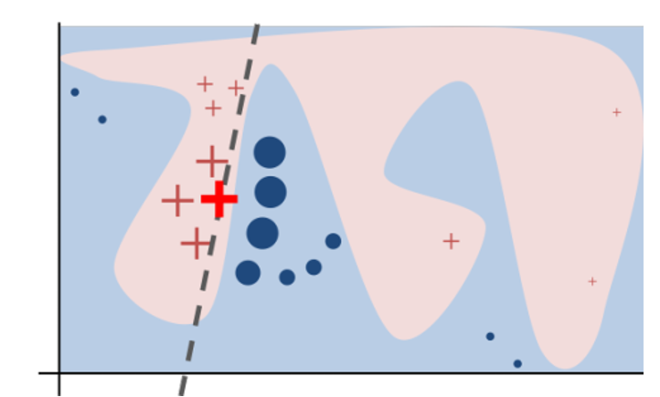
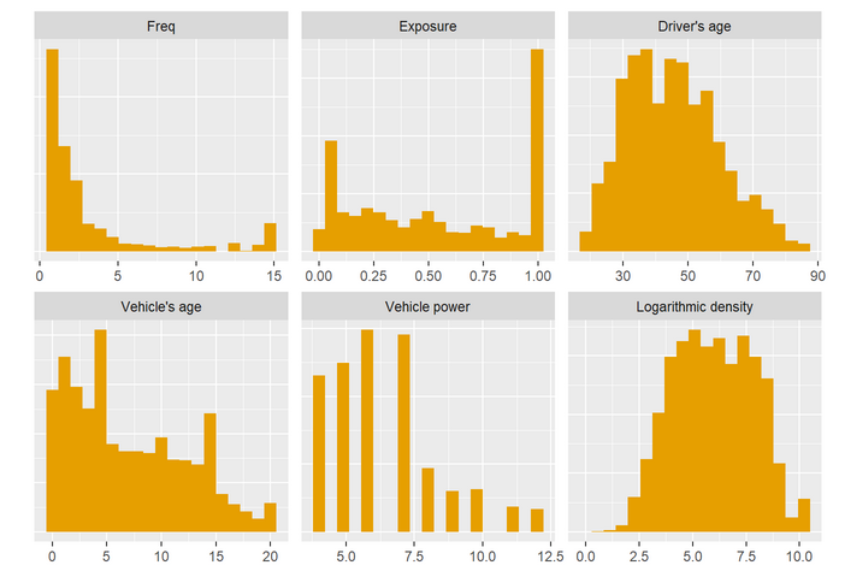
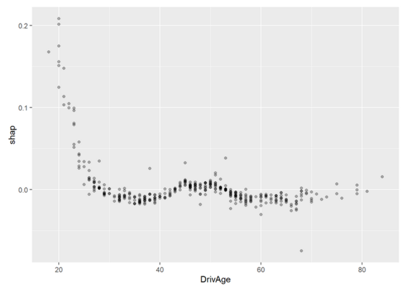

# 通用模型解释方法 {#flashlight}

*龚齐翔、张谦、段诗悦、高光远*


> the blackness of a model box seems no longer to be caused by the obscurity of the model itself but rather depends on the modeler switching on the light of the box. （手电筒的世界没有黑盒子）

**目的**：从精算的角度基于有监督的机器学习讲述了解释性机器学习和解释性人工智能一些方法的应用。

1. 使我们更相信所使用的模型

2. 发现模型的局限性

3. 改进现有的模型

4. 使模型不仅可以用来预测，还可以提供信息和验证模型假设

**主要内容**

1. 变量重要性

2. 边缘效应（主效应）、交互效应

3. 每个特征对单一预测值的贡献

## 数据

数据集划分：80%训练集，20%测试集。有着相同`group_id`的数据会被同时划分到训练集或者测试集中以减少偏差和选择合适的参数。

## 模型

以下考虑三种模型：GLM，XGBoost，Neural Network。这三种模型最具有代表性，GLM是保险损失预测中最经典的模型，XGBoost是在数据分析竞赛中常用的机器学习方法，它不容易过拟合，神经网络包含了很多种layer，在图像识别、自然语言处理中发挥了巨大的作用。

### GLM

GLM的优点:

- 解释性强，统计检验识别参数显著性。

- 比较灵活，可以加入交互项、变形后的解释变量、可以用非线性结构（样条曲线平滑）。

考虑不带交叉项的泊松GLM模型：`VehAge`和`DrivAge`都用了自然三次样条进行平滑。

$$N_i \sim \text{Poi} (e_i\lambda(\boldsymbol{x_i}))$$
有两种等价建模方式：

1. 把$\ln e_i$的系数固定为1。`glm (N ~ x + offset (log (e)), family = poisson (link=log) )`

2. 把$N_i/e_i$当作因变量，每个样本的权重为$e_i$。`glm ( I(N/e) ~ x, weights = e, family = poisson (link=log) )`

### XGBoost

用训练集上五折交叉验证来选择超参数。

### 神经网络

选取的神经网络有以下结构：

- 前馈全连接神经网络，含有三个隐藏层，神经元数量$20-15-10$，双曲正切激活函数。

- 输出神经元（索赔频率）的激活函数使用幂函数，即使用泊松模型中的规范连接函数（canonical link function）。

- 训练模型的参数使用Nesterov Adam optimizer，选择`batch sizes=10000, epochs=300，learning rate=0.002`。

- 为了消除在训练集上的总体索赔频率偏差（portfolio unbiased），在最后第三个隐藏层的10个神经元上建立Poisson-GLM模型。由于Poisson-GLM的参数估计为极大似然，其总体预测索赔频率等于样本的总经验索赔频率。

## 模型整体表现 （model performance）

**性能指标，损失函数**

泊松偏差损失
$$D(\boldsymbol{y},\hat{\boldsymbol{y}})=\frac{\sum_{i=1}^n e_iL(y_i,\hat{y}_i)}{\sum_{i=1}^n e_i}$$

其中$y_i=N_i/e_i$, $\hat{y}_i$ 为$y_i$的预测值，单位泊松偏差$L(y_i,\hat{y_i})$为：
\begin{equation}
L(y_i,\hat{y}_i)=2(y_i\ln y_i-y_i\ln\hat{y}_i-y_i+\hat{y}_i). (\#eq:loss)
\end{equation}

Note that the Poisson deviance \@ref(eq:loss) is a strictly consistent scoring function for the expectation $\mathbb{E}(Y)$.

**Pseudo $R^2$**

$$\text{Pseudo}~~ R^2=1-\frac{D(\boldsymbol{y},\hat{\boldsymbol{y}})}{D(\boldsymbol{y},\bar{\boldsymbol{y}})}$$

Pseudo $R^2$为偏差损失减少的相对值，衡量了可以被模型解释的偏差比例。

## 变量重要性（variable importance）

它提供了额外的信息，从而使我们能更深入的了解模型。可以通过删掉对模型不重要的变量从而简化模型。可以发现数据结构中的问题：如果一个协变量显示出非常相关而其他变量非常不相关，这可能是因为响应变量发生了信息泄露。

GLM模型可以用似然比检验统计量、$t$-检验。基于树的模型可以用变量的拆分数量、split gains。

### Permutation importance

对于一个协变量，它的值被随机置换，然后在新的协变量条件下预测$\tilde{\boldsymbol{y}}$，进而计算D(\boldsymbol{y},\tilde{\boldsymbol{y}})。该变量的重要性可以通过$D(\boldsymbol{y},\tilde{\boldsymbol{y}})-D(\boldsymbol{y},\hat{\boldsymbol{y}})$度量。

对于数据量大的样本，一次置换即可得到平稳的结果；对于数据量小的样本，需要置换多次并计算平均。

## 边缘效应（主效应）

如何衡量具有复杂非线性项和高阶交互作用的GLM模型，或黑箱模型中协变量对响应变量的效应？

**基本思路**：当协变量在其取值范围内变动时，预测值是如何变化的。

**使用训练集还是测试集？** 如果只使用模型的预测值，则训练集或测试集都可以。如果使用因变量的值，则需要使用测试集。

以下考虑三种model agnostic methods: individual conditional expectations (ICE), partial dependence profiles (PD), accumulated local effects profiles (ALE)。其中，第一种是后两种的基础。

### Individual conditional expectations（ICE）

对于每个样本$(N_i,e_i,\boldsymbol{x}_i), i=1,\ldots,n$, 使其协变量$x_{i,p}$在取值范围内变化，i.e., $\{a_1,a_2,\ldots,a_m\}$，根据模型预测在不同协变量值下的索赔频率，$$y_i^{(ice)}=\{\hat{y}_i(\boldsymbol{x}_{i,-p},x_{i,p}=a):a=a_1,\dots,a_m\}$$

以$x_p$为横轴，$y^{(ice)}$为纵轴，对于每个样本都可以画出一条ICE曲线。ICE profiles图像有以下特征：

- 如果协变量是以相加的模式在模型中（线性模型），则不同样本ICE曲线应该是平行的。

- $x_p$与其他变量的交互作用越强，不同样本的ICE曲线会相交。

- 为了更好解读ICE图像，可以垂直移动ICE曲线使得它们在一个点重合。

**Remark**：一些主要的boosting算法，如XGBoost、LightGBM或者CatBoost，在建模时可以约束协变量的单调性，这样可以增加模型的可解释性。在精算中，常常使用的约束如高免赔额的索赔频率低于低免赔额的索赔频率。XGBoost的相应代码为`monotone_constraints = c(0,-1,0,0,0,0,0)`。

### Partial dependence profiles

Partial dependence profile定义为ICE的平均值$$\bar{f}_l(a)=\frac{1}{n}\sum_{i=1}^n\hat{y}_i(\boldsymbol{x}_{i,-p},x_{i,p}=a)$$
它反映了协变量在这个样本上的平均效应，和样本中其他协变量的分布有关。

ICE和partial dependence profiles都可以推广到多个协变量。

### Accumulated local effects profiles (ALE)

ICE和partial dependence profile 假定某个协变量变化而样本的其他变量保持不变（Ceteris Paribus assumption）。这个假设在实际中常常是不成立的。比如，我们不可能固定地区而让人口密度变化。

ALE一定程度上克服了以上缺点，它考虑了局部效应，在较强相关性的协变量的情况下能获得更自然、少偏的结果。ALE profile为

$$\tilde{f}_l(a)=\frac{1}{|\mathcal{I}_{x_p}(a)|}\sum_{i\in\mathcal{I}_{x_p}(a)}\hat{y}_i(\boldsymbol{x}_{i,-p},x_{i,p}=a)$$
其中$\mathcal{I}_{x_p}(a)=\{i:x_{i,p}\in[a-\epsilon,a+\epsilon]\}$。即ALE为局部ICE的平均（partial dependence profile为所有ICE的平均）。
如果协变量的交互作用不强或者与其他协变量相关性强，则ALE图会接近于partial dependence profile图。

**Further profile plots**

以下方法来自线性模型的传统诊断方法。

1. 响应变量-协变量图：Averages (or boxplots) of responses are plotted against a covariable。该方法没有使用模型，只是数据的一种可视化工具。

2. 预测值-协变量图（边际效应图）：Averages of predicted values are plotted against a covariable（marginal plot or M-plot）。

3. 残差-协变量图： Averages (or boxplots) of residuals are plotted against a covariable。平均残差应该充分地接近零，如果平均残差系统的不为零，说明模型拟合的不好。如果训练集上平均残差接近零但测试集上平均残差不为零，则说明有过拟合问题。

## 交互效应

协变量$x_l,x_k$的交互作用可以用两个变量的Friedman’s H-statistic度量：
$$H^2_{kl}=\frac{\sum_1^n\left[\bar{f}_{kl}(x_{i,k},x_{i,l})-\bar{f}_{k}(x_{i,k})-\bar{f}_{l}(x_{i,l})\right]^2}{\sum_i^n\left[\bar{f}_{kl}(x_{i,k},x_{i,l})\right]^2}$$

上式分子为交互效应，分母为联合效应，可以近似认为联合效应 = 边缘（主）效应 + 交互效应。
如果$x_k,x_l$无交互作用，则Friedman’s H-statistic为$0$；如果它们有强烈的交互作用，则Friedman’s H-statistic接近$1$。

交互效应的绝对度量定义为$H^2_{kl}$分子的正平方根：
$$H_{kl}=\sqrt{\sum_1^n\left[\bar{f}_{kl}(x_{i,k},x_{i,l})-\bar{f}_{k}(x_{i,k})-\bar{f}_{l}(x_{i,l})\right]^2}$$
它可以用来对交互效应排序。

交互效应的可视化有两种基本方法：

1. 都为连续型协变量：$\bar{f}_{kl}(x_k,x_l)$的等高线图。

2. 分类变量$x_k$和连续型变量$x_l$：在$x_k$的某一水平$a$下，画$\bar{f}_{kl}(x_k=a,x_l)$随$x_l$的变化趋势图。

**交互项约束**

有时基于技术或监管的现实情况，交互项在模型中会被禁用。在神经网络中，可以将不考虑交互效应的变量直接连接到输出神经元。在XGBoost中，可以通过改变`interaction_constraints`实现交互项约束。

## 全局代理模型（Global surrogate models） 

对预测值重新使用易于解释的模型进行建模，如使用单棵决策树。然后再用这个global surrogate model (tree) 来进行解释。
为了评判替代模型的近似效果，有学者建议使用$R^2$。

## 局部解释（样本解释？）

以下主要考虑四种model agnostic methods：LIME，LIVE，SHAP，Breakdown。

### LIME和LIVE

LIME全称Local Interpretable Model-agnostic Explanations，即模型的局部解释器。虽然无法使用线性模型完全“模仿”出SVM、神经网络等模型的“行为”，但可以在某个局部样本点上接近.

LIME和LIVE主要分为以下几步：

1. 构造可解释的数据特征：??是原始用于模型预测的特征，而我们使用??来表示某个可解释特征是否存在的二元变量。

2. 构造目标函数：$$\xi(x)=\underset{g\in G}{\arg\min}~\mathcal{L(f,g,\pi_x)+\Omega(g)}$$

3. 采样：

LIME的优点是原理简单，适用范围广，可解释所有黑箱模型。但也存在一定的问题，例如局部范围大小不同，最终的解释也会不同甚至相悖。

<div class="figure" style="text-align: center">

<p class="caption">(\#fig:lime)LIME</p>
</div>

### SHAP(Shapley Additive Explanations)

SHAP的目的：与LIME相似，找到某个样本点上各个特征的重要性

Shapley值来自合作博弈论，从不同的合作组合中计算出单个个体的贡献，它度量了单个个体对总体的边际贡献。SHAP的主要思想来源于Shapley值

Shapley值的计算

**从Shapley值到SHAP**

- SHAP对预测的分解：

- SHAP中特征贡献的计算

SHAP把黑箱中复杂的映射关系表达成一个简单线性映射，便于把保费的构成解释给被保险人。但是，对于不同被保险人，同一个协变量值的效应（SHAP）可能不同，这是SHAP的缺点。（？我不太确定最后一句话）

### Breakdown and approximate SHAP

对于一组给定进入顺序的变量$x_{(1)},x_{(2)},\ldots,x_{(p)}$，解构方法如下：

1. 初始预测$\hat{y}^{(0)}_i$为训练集的索赔频率均值

对于$l=1,\ldots,p$，进行以下两步：

2. 把所有样本的$x_{(l)}$变为$x_{i,(l)}$，计算所有样本上预测索赔频率均值$\hat{y}^{(l)}_i$.

3. 计算$x_{(l)}$的效应：$\hat{y}^{(l)}_i-\hat{y}^{(l-1)}_i$

可见Breakdown方法得出的结果是和顺序$x_{(1)},x_{(2)},\ldots,x_{(p)}$相关的。对于$p$个变量，有$p!$种排列方式。一种处理方法是采取少量的排列方式，如20种，取平均。另一种是按照变量重要性降序进入，这里将前者称为**approximate SHAP**，将后者称为**breakdown**。

### From local to global properties

将多个样本使用SHAP或breakdown进行分解，然后也可以得到一些模型的全局性质：

1. 变量重要性

2. 主效应

3. 交互效应

## Improving the GLM by interpretable machine learning

通过之前的结果改进GLM模型：

1.建立简单的GLM模型和调优的ML模型

2.比较性能，如果GLM模型没有改进空间就停止

3.研究变量重要性决定保留哪些变量

4.通过对预测的影响效果，找出最强的预测因素，以调整变量（平方项、样条、删去部分类等）

5.根据相互作用强度改进交互项

6.利用以上因素改进GLM，然后回到第二步

- 根据Variable importance，不删除变量

- 根据Partial dependence profiles，logDensity用三次样条函数表示

- 根据Interaction strength，增加VehAge:VehBrand，VehBrand:VehGas的交互作用

基于以上改进建立新的glm

## 案例分析


### 导入包


```r
library(CASdatasets)      # 1.0.6
library(dplyr)            # 0.8.5
library(forcats)          # 0.5.0
library(reshape2)         # 1.4.3
library(corrplot)         # 0.84
library(ggplot2)          # 3.3.0
library(splines)          # 3.6.3
library(splitTools)       # 0.2.0
library(xgboost)          # 1.0.0.2
library(keras)            # 2.2.5.0
library(MetricsWeighted)  # 0.5.0
library(flashlight)       # 0.7.2
```

### 预处理


```r
data(freMTPL2freq)

distinct <- freMTPL2freq %>% 
  distinct_at(vars(-c(IDpol, Exposure, ClaimNb))) %>% 
  mutate(group_id = row_number())

dat <- freMTPL2freq %>% 
  left_join(distinct) %>% 
  mutate(Exposure = pmin(1, Exposure),
         Freq = pmin(15, ClaimNb / Exposure),
         VehPower = pmin(12, VehPower),
         VehAge = pmin(20, VehAge),
         VehGas = factor(VehGas),
         DrivAge = pmin(85, DrivAge),
         logDensity = log(Density),
         VehBrand = factor(VehBrand, levels = 
                             paste0("B", c(12, 1:6, 10, 11, 13, 14))),
         PolicyRegion = relevel(Region, "Ile-de-France"),
         AreaCode = Area)

# Covariables, Response, Weight
x <- c("VehPower", "VehAge",  "VehBrand", "VehGas", "DrivAge",
       "logDensity", "PolicyRegion")
y <- "Freq"
w <- "Exposure"
```


### 描述性统计


```r
# Univariate description

melted <- dat[c("Freq", "Exposure", "DrivAge", "VehAge", "VehPower", "logDensity")] %>% 
  stack() %>% 
  filter(ind != "Freq" | values > 0) %>% 
  mutate(ind = fct_recode(ind, 
                          `Driver's age` = "DrivAge", 
                          `Vehicle's age` = "VehAge", 
                          `Vehicle power` = "VehPower", 
                          `Logarithmic density` = "logDensity"))

ggplot(melted, aes(x=values)) +
  geom_histogram(bins = 19, fill = "#E69F00") +
  facet_wrap(~ind, scales = "free") +
  labs(x = element_blank(), y = element_blank()) +
  theme(axis.title.y = element_blank(),
        axis.text.y = element_blank(),
        axis.ticks.y = element_blank())

# Bivariate description

cor_mat <- dat %>% 
  select_at(c(x, "BonusMalus")) %>% 
  select_if(is.numeric) %>% 
  cor() %>% 
  round(2)
corrplot(cor_mat, method = "square", type = "lower", diag = FALSE, title = "",
         addCoef.col = "black", tl.col = "black")


# Boxplots
th <- theme(axis.text.x = element_text(angle = 45, hjust = 1, vjust = 1))

# BonusMalus nach DrivAge
dat %>% 
  mutate(DrivAge = cut(DrivAge, c(17:24, seq(25, 85, 10)), 
                       labels = c(18:25, "26-35", "36-45", "46-55", "56-65", "66-75", "76+"),
                       include.lowest = TRUE),
         DrivAge = fct_recode(DrivAge)) %>% 
ggplot(aes(x = DrivAge, y = BonusMalus)) +
  geom_boxplot(outlier.shape = NA, fill = "#E69F00") +
  coord_cartesian(ylim = c(50, 125))

# Brand/vehicle age
dat %>% 
  ggplot(aes(x = VehBrand, y = VehAge)) +
  geom_boxplot(outlier.shape = NA, fill = "#E69F00") +
  th

# Density/Area
dat %>% 
  ggplot(aes(x = AreaCode, y = logDensity)) +
  geom_boxplot(fill = "#E69F00") +
  th

# Density/Region
dat %>% 
  ggplot(aes(x = Region, y = logDensity)) +
  geom_boxplot(outlier.shape = NA, fill = "#E69F00") +
  th
```

<div class="figure" style="text-align: center">

<p class="caption">(\#fig:hist)LIME</p>
</div>

### 建模


```r
ind <- partition(dat[["group_id"]], p = c(train = 0.8, test = 0.2), 
                 seed = 22, type = "grouped")
train <- dat[ind$train, ]
test <- dat[ind$test, ]
```

#### glm


```r
fit_glm <- glm(Freq ~ VehPower + ns(VehAge, 5) + VehBrand +
                 VehGas + ns(DrivAge, 5) + logDensity + PolicyRegion,
               data = train,
               family = quasipoisson(),
               weights = train[[w]])
```

#### XGBoost
 

```r
# Input maker
prep_xgb <- function(dat, x) {
  data.matrix(dat[, x, drop = FALSE])
}

# Data interface to XGBoost
dtrain <- xgb.DMatrix(prep_xgb(train, x), 
                      label = train[[y]], 
                      weight = train[[w]])

# Parameters chosen by 5-fold grouped CV
params_freq <- list(learning_rate = 0.2,
                    max_depth = 5,
                    alpha = 3, #权重的l1正则项
                    lambda = 0.5, #权重的l2正则项
                    max_delta_step = 2, #权重改变最大步长，default为0
                    min_split_loss = 0, #节点分裂所需的最小损失函数下降值，default为0
                    colsample_bytree = 1, #控制每棵随机采样的列数的占比(每一列是一个特征)，default为1
                    subsample = 0.9 #控制树的每级的每次分裂，对列数的采样的占比,default为1,和colsample_bytree功能重叠
                    )

# Fit
set.seed(1)
fit_xgb <- xgb.train(params_freq, 
                     data = dtrain,
                     nrounds = 580,
                     objective = "count:poisson",
                     watchlist = list(train = dtrain),
                     print_every_n = 10)
```

#### 为后文训练可变单调性约束和交互项约束的xgboost，使用较小的nrounds


```r
params_freq_constraints <- list(learning_rate = 0.2,
                    max_depth = 5,
                    alpha = 3,
                    lambda = 0.5,
                    max_delta_step = 2,
                    min_split_loss = 0,
                    monotone_constraints = c(0,-1,0,0,0,0,0), #可变单调性的约束
                    colsample_bytree = 1,
                    subsample = 0.9)

fit_xgb_constraints <- xgb.train(params_freq_constraints, 
                     data = dtrain,
                     nrounds = 80,
                     objective = "count:poisson",
                     watchlist = list(train = dtrain),
                     print_every_n = 10)

params_freq_interaction_constraints <- list(learning_rate = 0.2,
                    max_depth = 5,
                    alpha = 3,
                    lambda = 0.5,
                    max_delta_step = 2,
                    min_split_loss = 0,
                    interaction_constraints = list(4, c(0, 1, 2, 3, 5, 6)), #交互项约束，约束以嵌套列表的形式指定
                    colsample_bytree = 1,
                    subsample = 0.9)

fit_xgb_interaction_constraints <- xgb.train(params_freq_interaction_constraints, 
                     data = dtrain,
                     nrounds = 80,
                     objective = "count:poisson",
                     watchlist = list(train = dtrain),
                     print_every_n = 10)
```

#### 神经网络


```r
prep_nn <- function(dat, x, cat_cols = c("PolicyRegion", "VehBrand")) {
  dense_cols <- setdiff(x, cat_cols)
  c(list(dense1 = data.matrix(dat[, dense_cols])), 
    lapply(dat[, cat_cols], function(z) as.integer(z) - 1))
}

# Initialize neural net
new_neural_net <- function() {
  k_clear_session()
  set.seed(1)
  if ("set_seed" %in% names(tensorflow::tf$random)) {
    tensorflow::tf$random$set_seed(0)
  } else if ("set_random_seed" %in% names(tensorflow::tf$random)) {
    tensorflow::tf$random$set_random_seed(0)
  } else {
    print("Check tf version")
  }
  
  # Model architecture
  dense_input <- layer_input(5, name = "dense1", dtype = "float32")
  PolicyRegion_input <- layer_input(1, name = "PolicyRegion", dtype = "int8")
  VehBrand_input <- layer_input(1, name = "VehBrand", dtype = "int8")

  PolicyRegion_emb <- PolicyRegion_input %>% 
    layer_embedding(22, 1) %>% 
    layer_flatten()
  
  VehBrand_emb <- VehBrand_input %>% 
    layer_embedding(11, 1) %>% 
    layer_flatten()

  outputs <- list(dense_input, PolicyRegion_emb, VehBrand_emb) %>% 
    layer_concatenate() %>% 
    layer_dense(20, activation = "tanh") %>%
    layer_dense(15, activation = "tanh") %>%
    layer_dense(10, activation = "tanh") %>% 
    layer_dense(1, activation = "exponential")
  
  inputs <- list(dense1 = dense_input, 
                 PolicyRegion = PolicyRegion_input, 
                 VehBrand = VehBrand_input)
  
  model <- keras_model(inputs, outputs)
  
  model %>% 
    compile(loss = loss_poisson,
            optimizer = optimizer_nadam(),
            weighted_metrics = "poisson")
  
  return(model)
}

neural_net <- new_neural_net()

neural_net %>% 
  summary()

history <- neural_net %>% 
  fit(x = prep_nn(train, x), 
      y = train[, y], 
      sample_weight = train[, w],
      batch_size = 1e4, 
      epochs = 300,
      verbose = 2)  
    
plot(history)
```

在最后一个隐藏层的十维输出上训练泊松GLM


```r
# Calibrate by using last hidden layer activations as GLM input encoder
encoder <- keras_model(inputs = neural_net$input, 
                       outputs = get_layer(neural_net, "dense_2")$output)

# Creates input for calibration GLM (extends prep_nn)
prep_nn_calib <- function(dat, x, cat_cols = c("PolicyRegion", "VehBrand"), 
                          enc = encoder) {
  prep_nn(dat, x, cat_cols) %>% 
    predict(enc, ., batch_size = 1e4) %>% 
    data.frame()
}

# Calibration GLM
fit_nn <- glm(Freq ~ .,
              data = cbind(train["Freq"], prep_nn_calib(train, x)), 
              family = quasipoisson(), 
              weights = train[[w]])
```

### 解释

#### 为模型建立解释器(flashlight)，并将它们组合为multiflashlight


```r
set.seed(1)

fillc <- "#E69F00"

fl_glm <- flashlight(
  model = fit_glm, label = "GLM", 
  predict_function = function(fit, X) predict(fit, X, type = "response")
)

fl_nn <- flashlight(
  model = fit_nn, label = "NNet", 
  predict_function = function(fit, X) 
    predict(fit, prep_nn_calib(X, x), type = "response")
)

fl_xgb <- flashlight(
  model = fit_xgb, label = "XGBoost", 
  predict_function = function(fit, X) predict(fit, prep_xgb(X, x))
)

fl_xgb_constraints <- flashlight(
  model = fit_xgb_constraints, label = "XGBoost_constraints", 
  predict_function = function(fit, X) predict(fit, prep_xgb(X, x))
)

fl_xgb_interaction_constraints <- flashlight(
  model = fit_xgb_interaction_constraints, label = "XGBoost_interaction_constraints", 
  predict_function = function(fit, X) predict(fit, prep_xgb(X, x))
)

# Combine them and add common elements like reference data
metrics <- list(`Average deviance` = deviance_poisson, 
                `Relative deviance reduction` = r_squared_poisson)
fls <- multiflashlight(list(fl_glm, fl_nn, fl_xgb), data = test, 
                       y = y, w = w, metrics = metrics)

fls_xgb_constraints <- multiflashlight(list(fl_xgb,fl_xgb_constraints), data = test, 
                       y = y, w = w, metrics = metrics)

fls_xgb_interaction_constraints <- multiflashlight(list(fl_xgb_interaction_constraints), data = test, 
                       y = y, w = w, metrics = metrics)

fls_interaction_constraints <- multiflashlight(list(fl_glm, fl_nn, fl_xgb,fl_xgb_interaction_constraints), data = test, 
                       y = y, w = w, metrics = metrics)

# Version on canonical scale
fls_log <- multiflashlight(fls, linkinv = log)
fls_xgb_interaction_constraints_log <- multiflashlight(fls_xgb_constraints, linkinv = log)
fls_interaction_constraints_log <- multiflashlight(fls_interaction_constraints, linkinv = log)
```

#### 对flashlight应用可解释性函数


```r
#模型表现

perf <- light_performance(fls)
perf
plot(perf, geom = "point") +
  labs(x = element_blank(), y = element_blank())

#变量重要性

imp <- light_importance(fls, v = x)
plot(imp, fill = fillc, color = "black")
```

#### ICE曲线


```r
#driveage基于中心化与非中心化和是否使用对数被解释变量作为预测结果

plot(light_ice(fls, v = "DrivAge", n_max = 200, seed = 3)
     , alpha = 0.1)
plot(light_ice(fls, v = "DrivAge", n_max = 200, seed = 3, center = "middle")
     , alpha = 0.03)
plot(light_ice(fls_log, v = "DrivAge", n_max = 200, seed = 3)
     , alpha = 0.1)
plot(light_ice(fls_log, v = "DrivAge", n_max = 200, seed = 3, center = "middle")
     , alpha = 0.03)

#考虑单调性约束的xgboost

plot(light_ice(fls_xgb_constraints, v = "VehAge", n_max = 200, seed = 3)
     , alpha = 0.1)
plot(light_ice(fls_xgb_constraints, v = "VehAge", n_max = 200, seed = 3, center = "middle")
     , alpha = 0.03)

plot(light_ice(fls_xgb_constraints, v = "DrivAge", n_max = 200, seed = 3)
     , alpha = 0.1)
```


```r
# Partial dependence curves
plot(light_profile(fls, v = "VehAge", pd_evaluate_at = 0:20))
plot(light_profile(fls, v = "DrivAge", n_bins = 25))
plot(light_profile(fls, v = "logDensity"))
plot(light_profile(fls, v = "VehGas"))

# ALE versus partial dependence
ale_DrivAge <- light_effects(fls, v = "DrivAge", counts_weighted = TRUE,
                             v_labels = FALSE, n_bins = 20, cut_type = "quantile")
plot(ale_DrivAge, use = c("pd", "ale"), show_points = FALSE)

# Classic diagnostic plots
plot(light_profile(fls, v = "VehAge", type = "predicted"))
plot(light_profile(fls, v = "VehAge", type = "residual")) +
  geom_hline(yintercept = 0)
plot(light_profile(fls, v = "VehAge", type = "response"))


# Multiple aspects combined
eff_DrivAge <- light_effects(fls, v = "DrivAge", counts_weighted = TRUE)
p <- plot(eff_DrivAge, show_points = FALSE)
plot_counts(p, eff_DrivAge, alpha = 0.3)
```


```r
# Interaction (relative)
interact_rel <- light_interaction(
  fls_interaction_constraints_log, 
  v = most_important(imp, 4), 
  take_sqrt = FALSE,
  pairwise = TRUE, 
  use_linkinv = TRUE,
  seed = 61
)
plot(interact_rel, color = "black", fill = fillc, rotate_x = TRUE)

# Interaction (absolute)
interact_abs <- light_interaction(
  fls_interaction_constraints_log, 
  v = most_important(imp, 4), 
  normalize = FALSE,
  pairwise = TRUE, 
  use_linkinv = TRUE,
  seed = 61
)
plot(interact_abs, color = "black", fill = fillc, rotate_x = TRUE)

# Filter on largest three brands
sub_data <- test %>% 
  filter(VehBrand %in% c("B1", "B2", "B12"))

# Strong interaction
pdp_vehAge_Brand <- light_profile(fls_interaction_constraints_log, v = "VehAge", by = "VehBrand", 
                                  pd_seed = 50, data = sub_data)
plot(pdp_vehAge_Brand)

# Weak interaction
pdp_DrivAge_Gas <- light_profile(fls_interaction_constraints_log, v = "DrivAge", 
                                 by = "VehGas", pd_seed = 50)
plot(pdp_DrivAge_Gas)


plot(light_ice(fls_xgb_interaction_constraints, v = "DrivAge", n_max = 200, seed = 3)
     , alpha = 0.1)
```

#### 全局代理模型


```r
surr_nn <- light_global_surrogate(fls_log$NNet, v = x)
plot(surr_nn)

surr_xgb <- light_global_surrogate(fls_log$XGBoost, v = x)
plot(surr_xgb)
```

### 局部性质


```r
#局部性质

new_obs <- test[1, ]
new_obs[, x]
unlist(predict(fls, data = new_obs))

# Breakdown
bd <- light_breakdown(fls$XGBoost, new_obs = new_obs, 
                      v = x, n_max = 1000, seed = 20)
plot(bd)

# Extract same order of variables for visualization only
v <- setdiff(bd$data$variable, c("baseline", "prediction"))

# Approximate SHAP
shap <- light_breakdown(fls$XGBoost, new_obs, 
                        visit_strategy = "permutation",
                        v = v, n_max = 1000, seed = 20)
plot(shap)

fl_with_shap <- add_shap(fls$XGBoost, v = x, n_shap = 500, 
                         n_perm = 12, n_max = 1000, seed = 100)

#以局部性质估计模型的全局性质

plot(light_importance(fl_with_shap, v = x, type = "shap"), 
     fill = fillc, color = "black")
plot(light_scatter(fl_with_shap, v = "DrivAge", type = "shap"), alpha = 0.3)
```

<div class="figure" style="text-align: center">

<p class="caption">(\#fig:age)LIME</p>
</div>

### 改进glm


```r
fit_glm2 <- glm(Freq ~ VehPower + VehBrand * VehGas + PolicyRegion + 
                  ns(DrivAge, 5) + VehBrand * ns(VehAge, 5) + 
                  ns(logDensity, 5), 
                data = train, 
                family = quasipoisson(), 
                weights = train[[w]])

# Setting up expainers
fl_glm2 <- flashlight(
  model = fit_glm2, label = "Improved GLM", 
  predict_function = function(fit, X) predict(fit, X, type = "response")
)

# Combine them and add common elements like reference data
fls2 <- multiflashlight(list(fl_glm, fl_glm2, fl_nn, fl_xgb), 
                        metrics = metrics, data = test, y = y, w = w)
fls2_log <- multiflashlight(fls2, linkinv = log)

# Some results
plot(light_performance(fls2), geom = "point", rotate_x = TRUE)
plot(light_importance(fls2, v = x), fill = fillc, color = "black", top_m = 4)
plot(light_profile(fls2, v = "logDensity"))
interact_rel_improved <- light_interaction(
  fls2_log, v = most_important(imp, 4), take_sqrt = FALSE,
  pairwise = TRUE,  use_linkinv = TRUE, seed = 61)
plot(interact_rel_improved, color = "black", fill = fillc, top_m = 4)
```


