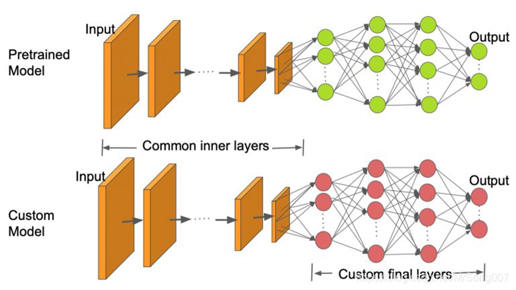
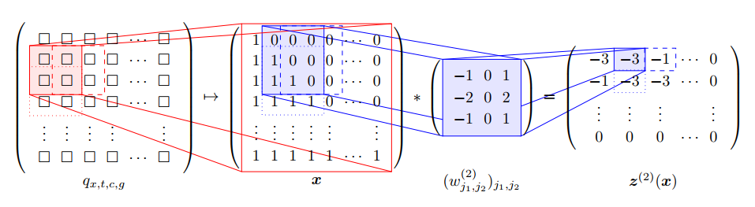

# 卷积神经网络 {#cnn}

*万淇、蔡清扬、高光远*

深度学习之所以这么热，大部分归功于卷积神经网络在[计算机视觉](https://github.com/search?q=computer+vision&type=)上取得的巨大成功。卷积神经网络还可以用在自然语言处理、时间序列分析、异常检测、可穿戴设备与健康检测、GO。

大型预先训练的CNNs库可用于图像识别：AlexNet，GoogLeNet，ResNet, Inception, MobileNet,，VGG， DenseNet,，NASNet 等。它们可以直接使用，将某一图像分类至已知的类别之中
也可以应用于迁移学习。

(\#fig:unnamed-chunk-1)Transfer learning

## 基本组件

### 卷积层 (Convolution)

### 池化层 (Pooling)

### 全连接层 (Dense)

### 批标准化层 (Batch Normalization)

### 扁平化 (Flatten)

### 输出神经元

### 激活函数 (Activation)

## 特性

### 平移不变性 (Shift Invariant)

### 旋转

### 尺度

## 案例分析

### [Human Mortality Database (HMD)](https://www.mortality.org)

**目标**: 根据死亡率表的局部特征($10\times10$)，检测该局部异常死亡率强度。

死亡率$q_{x,t,c,g}$、人口数量$E_{x,t,c,g}$

- 年龄$x$, 日历年$t$, 国家$c$, 性别$g$.

- 由于领土的变化，某些年的数据会出现变更前与变更后的的两个数据，处理方式是取平均值作为最后的研究数据。

- 某些死亡率数据存在缺失：如果相邻(以年龄$x$和日历年$t$)值可用，我们线性插补，否则使用最近邻的值进行插补。

- 假定没有人口的迁移以及其他的误差：$$E_{x,t,c,g}=E_{x-1,t-1,c,g}(1-q_{{x-1},{t-1},c,g})$$

- 定义标准化残差: $$r_{x,t,c,g}=\frac{E_{x,t,c,g}-E_{x-1,t-1,c,g}(1-q_{x-1,t-1,c,g})}{E_{x,t,c,g}}$$

- $r_{x,t,c,g}<0$表明可能有人口迁出或者数据错误， $r_{x,t,c,g}>0$表明可能有人口迁入或者数据错误。

经过预处理HMD，对每个国家每个性别我们得到一个关于死亡率$q_{x,t,c,g}$的二维数组，其中行代表不同日历年，列代表不同年龄。为了检测死亡率的异常值，我们考虑死亡率的局部变化特征，使用大小为$10\times10$的窗口在死亡率二维数组上进行移动，并设置步长为$5$。可以得到死亡率的局部矩阵$(q_{x,t,c,g})_{x_i<x\le x_i+10, t_i<t\le t_i+10}$, 其中$x_i:=20+5i,t_i=1950+5i$。我们定义如下(原始)输入特征$W_{i,c}\in\mathbb{R}^{10\times 10\times 3}$:
$$
\begin{aligned}
W_{i,c,\cdot,\cdot,1}:=&(\text{logit}(q_{x,t,c,males}))_{x_i<x\le x_i+10, t_i<t\le t_i+10}\\
W_{i,c,\cdot,\cdot,2}:=&(\text{logit}(q_{x,t,c,females}))_{x_i<x\le x_i+10, t_i<t\le t_i+10}\\
W_{i,c,\cdot,\cdot,3}:=&W_{i,c,\cdot,\cdot,1}-W_{i,c,\cdot,\cdot,2}
\end{aligned}
$$

(\#fig:unnamed-chunk-2)Mortality Window

然后分别对三个通道进行正则化, 得到$\boldsymbol{X}_{i,c}\in[0,1]^{10\times10\times3}$. 通过对所有国家进行如上处理, 可以得到大约$4000$张图像.

接下来, 我们定义每张图的"标签". 首先, 对$r_{x,t,c,g}$进行MinMax正则化处理, 得到$\bar{r}_{x,t,c,g}\in[0,1].$ 然后, 定义标签为**异常强度**
$$Y_{i,c}:=\underset{x_i<x\le x_i+10, t_i<t\le t_i+10}{\max} \left|\frac{\bar{r}_{x,t,c,males}+\bar{r}_{x,t,c,females}}{2} \right|\in[0,1].$$

我们的目标是基于死亡率在大小为$10\times10$上的局部特征, 预测该范围内死亡率的异常强度.
在训练神经网络时, 选取均方误差损失函数$$\mathcal{L}(Y,\hat{\mu}(\boldsymbol{X});\mathcal{I}):=\frac{1}{|\mathcal{I}|}\sum_{(i,c)\in\mathcal{I}}(Y_{i,c}-\hat{\mu}(\boldsymbol{X}_{i,c}))^2.$$

在评估模型时, 我们通过如下步骤定义二分类AOC指标:

1. 定义伯努利随机变量
$$
b_{i,c}:=
\begin{cases}
1, Y_{i,c}\geq q_{0.95}(Y), \\
0, \text{otherwise},
\end{cases}
$$
其中, $q_{0.95}(Y)$为所有因变量$Y_{i,c}$的0.95分位数, 即$b_{i,c}$为"非常异常"指示标量.

2. 把神经网络的输出结果$\hat{\mu}(\boldsymbol{X}_{i,c})$当作概率$\Pr (b_{i,c}=1)$的预测.

3. 画出该二分类问题的receiver operating characteristic curve (ROC), 并计算 area under the curve (AUC).

利用以上模型评估方法, 我们可以对国家按照"异常强度"的相似性进行分类, 具体步骤如下:

1. 对每个国家$c$分别建立CNN模型, 并使用该模型对其他国家$c^*$的数据进行预测, 计算AUC $A_{c,c^*}$. 并建立矩阵$A=(A_{c,c^*})_{c,c*\in\mathcal{C}}$, 其中$\mathcal{C}$为所有国家的集合.

2. 对$A$进行列标准化, 并进行奇异值分解, 得到前两个主成分$P_{j,c}, j=1,2$.

3. 对主成分$P_{j,c}, j=1,2$进行聚类, 得到4个簇.

### MNIST dataset

**目标**: 对手写$0-9$进行分类。

MNIST 全称为 Modified National Institute of Standards and Technology. 修改过后的MNIST数据集，它是一个由不同的人的手写体数字组成的图片数据集，包含了$7$万张关于手写数字$0,1,\ldots,9$的图像，格式为$28×28$的灰度像素。

神经网络的输入为由灰度像素构成的$28\times28$数组$\boldsymbol{X}\in[0,1]^{28\times28}$, 输出为在$\{0,1,\ldots,9\}$上的离散分布$(p_0,\ldots,p_9)^T$, 其中$\sum_{j=0}^9p_j=1$. 图像的标签为实际数字的one-hot编码$Y\in\{0,1\}^{10}$.
损失函数为交叉熵(cross-entropy)
$$\mathcal{L}(Y,\hat{p}(\boldsymbol{X});\mathcal{I}):=-\sum_{i\in\mathcal{I}}\sum_{j=0}^9Y_{i,j}\log\hat{p}_j(\boldsymbol{X}_i).$$

