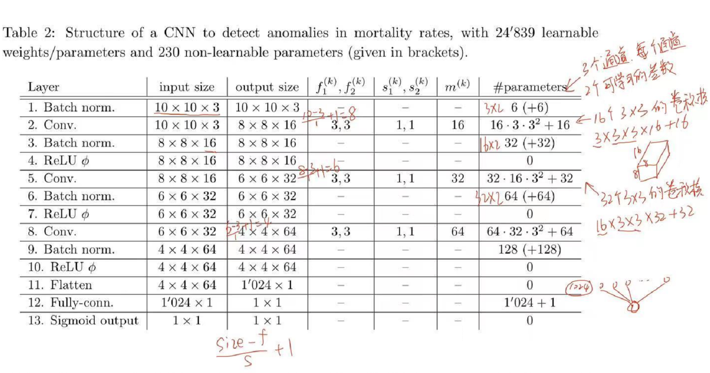
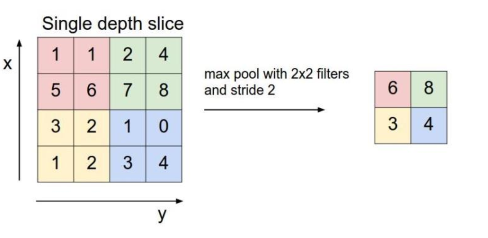
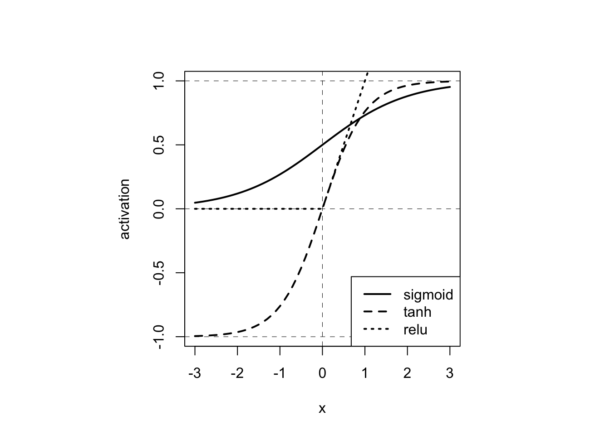

# 卷积神经网络 {#cnn}

*万淇、蔡清扬、高光远*

深度学习之所以这么热，大部分归功于卷积神经网络在[计算机视觉](https://github.com/search?q=computer+vision&type=)上取得的巨大成功。卷积神经网络还可以用在自然语言处理、时间序列分析、异常检测、可穿戴设备与健康检测、GO。

校门口的人脸识别可以快速识别出学生老师校外人员，通常是否戴口罩、靠左靠右、离的远近等不会影响结果，但歪头经常难以被识别，这些和下面卷积神经网络的特性密切相关。

(\#fig:unnamed-chunk-1)Entrace to Renmin

大型预先训练的CNNs库可用于图像识别：AlexNet，GoogLeNet，ResNet, Inception, MobileNet,，VGG， DenseNet,，NASNet 等。它们可以直接使用，将某一图像分类至已知的类别之中
也可以应用于迁移学习。

(\#fig:unnamed-chunk-2)Transfer learning

## 卷积层 (Convolution)

作用：特征提取，一般想要多少特征，就设置多少个卷积核(filter)。不同的卷积核相当于不同的特征提取器.

计算过程如下图所示：

(\#fig:unnamed-chunk-3)Convolution

### 超参数

一个卷积层主要有以下超参数

- Channels: 黑白图像一般只有一个通道，彩色图像一般有三个通道，即RGB.

- Filters: 一般想要多少特征，就设置多少个卷积核。不同的卷积核相当于不同的特征提取器.

- Padding: 补零。作用：保持图像大小，使之减小不会太快；还能照顾到边缘特征。

(\#fig:unnamed-chunk-4)Padding

- Dilation: 膨胀卷积（Dilated Convolution）也称为空洞卷积（Atrous Convolution）是一种不增加参数数量同时增加输出单元感受野的一种方法。空洞卷积通过给卷积核插入“空洞”来变相地增加其大小

(\#fig:unnamed-chunk-5-1)Dilation kernal

(\#fig:unnamed-chunk-5-2)Dilation kernal

- Strides: 步长。卷积核每次滑动的步幅。

假设第$k-1$层输出图像的维度为$n_1^{(k-1)}\times n_2^{(k-1)}\times m^{(k-1)}$, 经过第$k$层的卷积运算，得到的图片维度为$n_1^{(k)}\times n_2^{(k)}\times m^{(k)}$。相关超参数总结如下：

| 特征      | 超参数    |
| :---:   | :----:    |
| 输入大小| $n_1^{(k-1)}\times n_2^{(k-1)}$ |
| 输入特征| $m^{(k-1)}$ |
| 输出特征(卷积核)| $m^{(k)}$ |
| **补零** | $p_1^{(k)},p_2^{(k)}$ |
| **膨胀**| $d_1^{(k)},d_2^{(k)}$ |
| **步长**| $s_1^{(k)},s_2^{(k)}$ |
| 输出大小| $n_1^{(k)}\times n_2^{(k)}$ |

其中，输出大小$n_1^{(k)}\times n_2^{(k)}$由输入大小$n_1^{(k-1)}\times n_2^{(k-1)}$和补零、膨胀、步长决定。

### 参数个数计算

下图为案例1中神经网络参数个数的计算。

(\#fig:unnamed-chunk-6)Number of Parameters

如：？？

## 池化层 (Pooling)

也称下采样层，其作用是进行特征选择，降低特征数量，从而减少参数数量。在图像中，最主要作用就是压缩图像。池化层一般分为平均池化和最大池化。

(\#fig:unnamed-chunk-7)Pooling

## 批标准化层 (Batch Normalization)

在batch上进行标准化后再送入下一层，它可以防止梯度消失和梯度爆炸问题，加快收敛速度。主要分为两步：

1. 通过训练期间各批次的参数平均值和方差对输入进行移位和缩放。

2. 通过训练期间学习的后两个（可学习）参数进行移位和缩放。

？？Detailed Algorithm

## 其他组件

### 全连接层 (Dense)

全连接层中的每个神经元与其前一层的所有神经元进行全连接。
CNN中因为图像是二维的，所以在进入全连接层的时候需要经过一个Flatten（扁平化）的操作。
Flatten层作用就是通过重新排列维度并保留所有值的简单变换.

(\#fig:unnamed-chunk-8)Dense layer

### 输出神经元

即我们最后输出的结果，一般接在全连接层后。
案例一是生存率问题，结果取值在$[0,1]$中，所以使用sigmoid的函数对最后的值进行缩放。案例二是多分类的输出结果，所以使用softmax函数进行输出。

### 激活函数 (Activation)

在上面讨论的网络层（卷积层、池化层和全连接层）中，所有的操作其实都是线性的，但只有使用非线性激活，网络建模的全部威力才会发挥出来。常用的非线性激活函数有：ReLU、sigmoid、tanh等

(\#fig:unnamed-chunk-9)Activation Functions

## 特性

在校门口

### 平移不变性

由于卷积核对于特定的特征才会有较大激活值，且应用到不同的位置，所以不论上一层特征图谱（feature map）中的某一特征平移到何处，卷积核都会找到该特征并在此处呈现较大的激活值。这就是“等变性”

(\#fig:unnamed-chunk-10)Shift invariance

### 旋转不变性

旋转不变性常见于卫星图像识别中，如桥梁定位、洪水面积估计等。但在手写识别中，旋转不变性不满足。

### 尺度不变性

在手写识别中，尺度不变性满足。

## 隐藏层可视化

## 逆卷积

## [Human Mortality Database (HMD)](https://www.mortality.org)

**目标**: 根据死亡率表的局部特征($10\times10$)，检测该局部异常死亡率强度。

### 输入和标签

死亡率$q_{x,t,c,g}$、人口数量$E_{x,t,c,g}$

- 年龄$x$, 日历年$t$, 国家$c$, 性别$g$.

- 由于领土的变化，某些年的数据会出现变更前与变更后的的两个数据，处理方式是取平均值作为最后的研究数据。

- 某些死亡率数据存在缺失：如果相邻(以年龄$x$和日历年$t$)值可用，我们线性插补，否则使用最近邻的值进行插补。

- 假定没有人口的迁移以及其他的误差：$$E_{x,t,c,g}=E_{x-1,t-1,c,g}(1-q_{{x-1},{t-1},c,g})$$

- 定义标准化残差: $$r_{x,t,c,g}=\frac{E_{x,t,c,g}-E_{x-1,t-1,c,g}(1-q_{x-1,t-1,c,g})}{E_{x,t,c,g}}$$

- $r_{x,t,c,g}<0$表明可能有人口迁出或者数据错误， $r_{x,t,c,g}>0$表明可能有人口迁入或者数据错误。

经过预处理HMD，对每个国家每个性别我们得到一个关于死亡率$q_{x,t,c,g}$的二维数组，其中行代表不同日历年，列代表不同年龄。为了检测死亡率的异常值，我们考虑死亡率的局部变化特征，使用大小为$10\times10$的窗口在死亡率二维数组上进行移动，并设置步长为$5$。可以得到死亡率的局部矩阵$(q_{x,t,c,g})_{x_i<x\le x_i+10, t_i<t\le t_i+10}$, 其中$x_i:=20+5i,t_i=1950+5i$。我们定义如下(原始)输入特征$W_{i,c}\in\mathbb{R}^{10\times 10\times 3}$:
$$
\begin{aligned}
W_{i,c,\cdot,\cdot,1}:=&(\text{logit}(q_{x,t,c,males}))_{x_i<x\le x_i+10, t_i<t\le t_i+10}\\
W_{i,c,\cdot,\cdot,2}:=&(\text{logit}(q_{x,t,c,females}))_{x_i<x\le x_i+10, t_i<t\le t_i+10}\\
W_{i,c,\cdot,\cdot,3}:=&W_{i,c,\cdot,\cdot,1}-W_{i,c,\cdot,\cdot,2}
\end{aligned}
$$ 
其中, $\text{logit }q =\log \frac{q}{1-q} $

(\#fig:unnamed-chunk-11)Mortality Window

然后分别对三个通道进行正则化, 得到$\boldsymbol{X}_{i,c}\in[0,1]^{10\times10\times3}$. 通过对所有国家进行如上处理, 可以得到大约$4000$张图像.

接下来, 我们定义每张图的"标签". 首先, 对$r_{x,t,c,g}$进行MinMax正则化处理, 得到$\bar{r}_{x,t,c,g}\in[0,1].$ 然后, 定义标签为**异常强度**
$$Y_{i,c}:=\underset{x_i<x\le x_i+10, t_i<t\le t_i+10}{\max} \left|\frac{\bar{r}_{x,t,c,males}+\bar{r}_{x,t,c,females}}{2} \right|\in[0,1].$$

我们的目标是基于死亡率在大小为$10\times10$上的局部特征, 预测该范围内死亡率的异常强度.
在训练神经网络时, 选取均方误差损失函数$$\mathcal{L}(Y,\hat{\mu}(\boldsymbol{X});\mathcal{I}):=\frac{1}{|\mathcal{I}|}\sum_{(i,c)\in\mathcal{I}}(Y_{i,c}-\hat{\mu}(\boldsymbol{X}_{i,c}))^2.$$

### 评估指标

在评估模型时, 我们通过如下步骤定义二分类AOC指标:

1. 定义伯努利随机变量
$$
b_{i,c}:=
\begin{cases}
1, Y_{i,c}\geq q_{0.95}(Y), \\
0, \text{otherwise},
\end{cases}
$$
其中, $q_{0.95}(Y)$为所有因变量$Y_{i,c}$的0.95分位数, 即$b_{i,c}$为"非常异常"指示标量.

2. 把神经网络的输出结果$\hat{\mu}(\boldsymbol{X}_{i,c})$当作概率$\Pr (b_{i,c}=1)$的预测.

3. 画出该二分类问题的receiver operating characteristic curve (ROC), 并计算 area under the curve (AUC).

利用以上模型评估方法, 我们可以对国家按照"异常强度"的相似性进行分类, 具体步骤如下:

1. 对每个国家$c$分别建立CNN模型, 并使用该模型对其他国家$c^*$的数据进行预测, 计算AUC $A_{c,c^*}$. 并建立矩阵$A=(A_{c,c^*})_{c,c*\in\mathcal{C}}$, 其中$\mathcal{C}$为所有国家的集合.

2. 对$A$进行列标准化, 并进行奇异值分解, 得到前两个主成分$P_{j,c}, j=1,2$.

3. 对主成分$P_{j,c}, j=1,2$进行聚类, 得到4个簇.

## MNIST dataset

**目标**: 对手写$0-9$进行分类。

MNIST 全称为 Modified National Institute of Standards and Technology. 修改过后的MNIST数据集，它是一个由不同的人的手写体数字组成的图片数据集，包含了$7$万张关于手写数字$0,1,\ldots,9$的图像，格式为$28×28$的灰度像素。

神经网络的输入为由灰度像素构成的$28\times28$数组$\boldsymbol{X}\in[0,1]^{28\times28}$, 输出为在$\{0,1,\ldots,9\}$上的离散分布$(p_0,\ldots,p_9)^T$, 其中$\sum_{j=0}^9p_j=1$. 图像的标签为实际数字的one-hot编码$Y\in\{0,1\}^{10}$.
损失函数为交叉熵(cross-entropy)
$$\mathcal{L}(Y,\hat{p}(\boldsymbol{X});\mathcal{I}):=-\sum_{i\in\mathcal{I}}\sum_{j=0}^9Y_{i,j}\log\hat{p}_j(\boldsymbol{X}_i).$$

