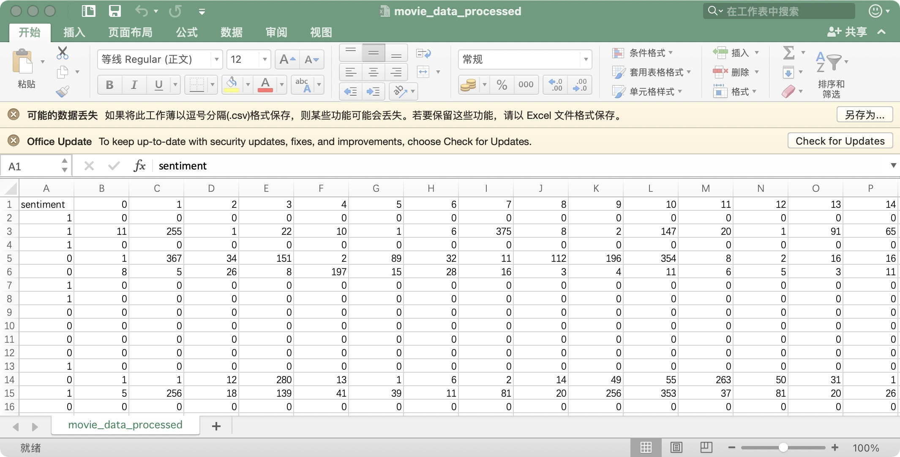
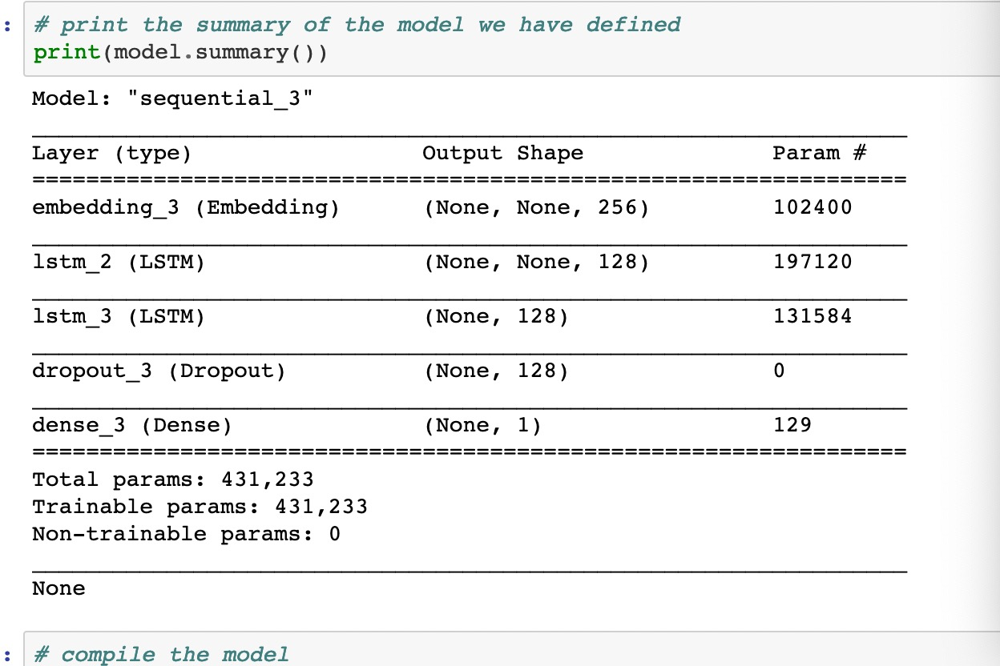
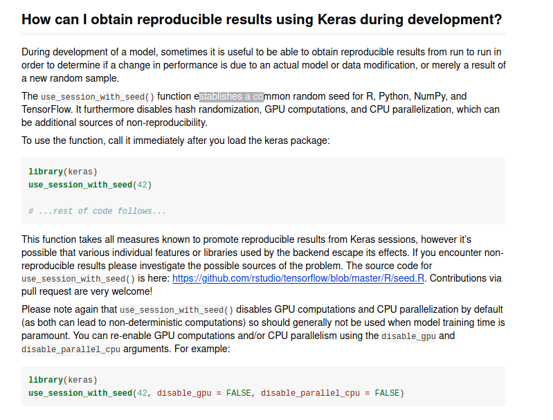
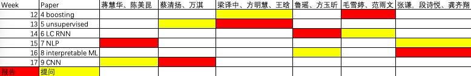

--- 
title: "现代精算统计模型"
author: "Modern Actuarial Models"
date: "2021-06-02 15:04:56"
site: bookdown::bookdown_site
output: bookdown::gitbook
documentclass: book
bibliography: [_reference.bib]
biblio-style: apalike
link-citations: yes
github-repo: sxpyggy/Modern-Actuarial-Models
description: "The output format is bookdown::gitbook."
editor_options: 
  chunk_output_type: console
---

# 👨‍🏫 欢迎  {-}

<!-- 《现代精算统计模型》主要讲述如何使用统计学习和机器学习算法，提升传统的精算统计模型或者解决新的精算问题。这门课主要参考瑞士精算师协会发布的[“精算数据科学”](https://actuarialdatascience.org)，该教程的主要目的是“为精算师提供一个对数据科学全面且易懂的介绍”，该教程提供了多篇方法性文章并开源代码，这样“读者可以相对容易地把这些数据科学方法用在自己的数据上”。 -->

<!-- 我们建议大家仔细阅读以下文献，尝试并理解[所有代码](https://github.com/JSchelldorfer/ActuarialDataScience)。此网站将作为该课程的辅助，为大家答疑，总结文献，并对文献中的方法做扩展。该网站由授课老师高光远和助教张玮钰管理，欢迎大家反馈意见到助教、微信群、或邮箱 <guangyuan.gao@ruc.edu.cn>。 -->

《现代精算统计模型》主要讲述如何使用统计学习和机器学习算法，提升传统的精算统计模型或者解决新的精算问题。该教程的主要目的是为大家提供一个对数据科学全面且易懂的介绍，该教程提供了多篇方法性文章并开源代码，这样读者可以相对容易地把这些数据科学方法用在自己的数据上。

我们建议大家仔细阅读以下文献，尝试并理解所有代码。此网站将作为该课程的辅助，为大家答疑，总结文献，并对文献中的方法做扩展。该网站由授课老师高光远和助教张玮钰管理，欢迎大家反馈意见到助教、微信群、或邮箱 <guangyuan.gao@ruc.edu.cn>。

## 🤔 答疑{-}

我定期把同学们的普遍疑问在这里解答，欢迎提问！

**👉 Tensorflow for Apple M1**  (2020/12/23)

购买Apple M1的同学需要用这个[pre-release tensorflow](https://github.com/apple/tensorflow_macos)，从pypi下载的tensorflow暂不支持Apple M1

**👉 NLP**  (2020/12/18)

数据



这个数据第$i$行$j$列表示，在第$i$个评论中第$j$个词的排名(依照总出现频率)，所以每一行还保持了句子中词语的先后顺序。每一行都是一个时间序列数据（样本）。

LSTM



- `input`维度是`batch size * length * 1`，即以上所示的.csv矩阵文档。

- `embedding_3` 作用就是把`input`的最后一个维度爆炸到256，参数个数为`vocab_size* embedding dimension`，可以看作把400个高频词映射到256维空间。

- `embedding_3`和`lstm_2`输出维度中，有两个`none`,其中第一个表示`batch size`, 第二个表示`sequence length`。因为LSTM在时间维度上循环使用参数，所以`sequence length`不影响参数的个数。

- `sequence length`不影响参数个数，对于不同的句子长度如100或者150，该模型都不需要调整，(应该)可以直接载入数据训练。

- `lstm_3` 只有一个`none`, 表示`batch size`, 我们要求`lstm_3`不返回整个sequence只看最近的状态。

**👉 Reproducible results using Keras** (2020/12/11)

使用Keras复现结果的方法。

<https://cran.r-project.org/web/packages/keras/vignettes/faq.html>



**👉 为什么不直接用relu解决vanishing gradient 而设计复杂的lstm gru** (2020/12/11)

- relu值域在0到无穷，不如tanh和sigmoid稳健，后两种可以认为把极大极小值都截断了。

- relu是线性变换，可能描述不了非线性效应。我最常用tanh。

- 当然，使用relu会明显提升计算速度，因为relu的导数容易计算。

另参见[stackexchange](https://datascience.stackexchange.com/questions/61358/relu-for-combating-the-problem-of-vanishing-gradient-in-rnn#:~:text=For%20solving%20the%20problem%20of%20vanishing%20gradients%20in,In%20both%20of%20these%2C%20activation%20function%20is%20tanh.)

**👉 xaringan** (2020/12/06)

html格式的slides：
<https://slides.yihui.org/xaringan/zh-CN.html#1>

**👉 samme.r** (2020/11/27)

关于samme.r算法, 请参考下面文章中的exponential loss function.
<https://web.stanford.edu/~hastie/Papers/samme.pdf>

算法samme.r仅在以上draft中出现，正式发表时samme.r被删掉了，推测审稿人有异议。正式文章参考
<http://ww.web.stanford.edu/~hastie/Papers/SII-2-3-A8-Zhu.pdf>

**👉 随机种子数** (2020/11/20)

输入`RNGversion("3.5.0"); set.seed(100)`，使得你的随机种子数和paper的相同，模型结果相近。

**👉 MAC OS, Linux, WIN** (2020/11/16)

据观察，在MAC OS和Linux系统下安装`keras`成功的比例较高。WIN系统下，Python各个包的依赖以及和R包的匹配有一定的问题，今天是通过更换镜像源解决了R中无法加载`tensorflow.keras`模块的问题，推测是TUNA源中WIN包依赖关系没有及时更新。

为了解决镜像源更新延迟、或者tensorflow版本过低的问题，这里共享WIN下经测试的[conda环境](https://www.jianguoyun.com/p/DcwPgUgQ3cTHBhi1-s0D)配置。下载该文档，从该文档所在文件夹启动命令行，使用命令`conda env create --name <env> --file filename.yaml`，安装该conda环境。在R中使用`reticulate::use_condaenv("<env>",required=T)`关联该环境。

另外，可下载MAC OS系统下经测试的[conda环境](https://www.jianguoyun.com/p/DYethK4Q3cTHBhjr4s0D)配置。可通过`conda env create --name <env> --file filename.yaml`安装。

**👉  CASdatasets** (2020/11/13)

源文件在<http://cas.uqam.ca/>，但下载速度很慢，我把它放在[坚果云共享](https://www.jianguoyun.com/p/DdFyh74Q3cTHBhio2M0D)。下载后选择install from local archive file。

<!-- **👉  微信群** (2020/11/08) -->

<!-- ```{r,echo=FALSE,out.width="30%",fig.align = 'center'} -->
<!-- knitr::opts_chunk$set(fig.pos = "!H", out.extra = "") -->
<!--  -->
<!-- ``` -->

<!-- ## 🗓️ 课程安排 {-} -->

<!-- ```{r,echo=FALSE,out.width="90%",fig.align = 'center'} -->
<!-- knitr::opts_chunk$set(fig.pos = "!H", out.extra = "") -->
<!--  -->
<!-- ``` -->

<!-- 以下安排为初步计划，根据大家的需求和背景，我们可能要花更多的时间在某些重要的方法及其在精算上的应用。 -->

<!-- - 第10周： -->

<!--   准备工作。 -->

<!-- - 第11周:  -->

<!--   1 - French Motor Third-Party Liability Claims  -->

<!--   <https://papers.ssrn.com/sol3/papers.cfm?abstract_id=3164764> -->

<!-- - 机动 -->

<!--   2 - Inisghts from Inside Neural Networks -->

<!--   <https://papers.ssrn.com/sol3/papers.cfm?abstract_id=3226852> -->

<!--   3 - Nesting Classical Actuarial Models into Neural Networks -->

<!--   <https://papers.ssrn.com/sol3/papers.cfm?abstract_id=3320525> -->

<!-- - 第12周： -->

<!--   4 - On Boosting: Theory and Applications -->

<!--     <https://papers.ssrn.com/sol3/papers.cfm?abstract_id=3402687> -->

<!-- - 第13周： -->

<!--   5 - Unsupervised Learning: What is a Sports Car -->

<!--   <https://papers.ssrn.com/sol3/papers.cfm?abstract_id=3439358> -->

<!-- - 第14周： -->

<!--   6 - Lee and Carter go Machine Learning: Recurrent Neural Networks -->

<!--   <https://papers.ssrn.com/sol3/papers.cfm?abstract_id=3441030> -->

<!-- - 第15周： -->

<!--   7 - The Art of Natural Language Processing: Classical, Modern and Contemporary Approaches to Text Document Classification -->

<!--   <https://papers.ssrn.com/sol3/papers.cfm?abstract_id=3547887> -->

<!-- - 第16周： -->

<!--   8 - Peeking into the Black Box: An Actuarial Case Study for Interpretable Machine Learning  -->

<!--   <https://papers.ssrn.com/sol3/papers.cfm?abstract_id=3595944> -->

<!-- - 第17周： -->

<!--   9 - Convolutional neural network case studies: (1) Anomalies in Mortality Rates (2) Image Recognition  -->

<!--   <https://papers.ssrn.com/sol3/papers.cfm?abstract_id=3656210> -->


